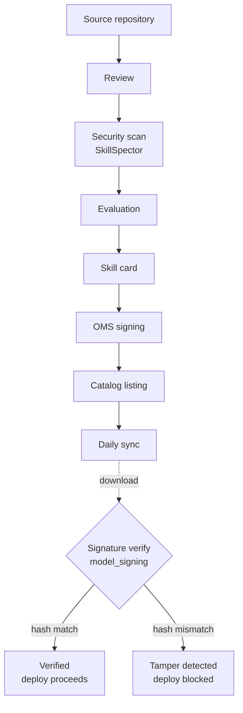

## Overview

Agent skills are fast becoming standard components. Write a SKILL.md that describes how to use a tool and what procedure to follow, and a coding agent reads those instructions to carry out the task. The hard part comes next. There was no good way to verify where a skill downloaded from the internet came from, whether it contained dangerous code, or whether someone had tampered with it after the download. Because a skill is essentially a directive that grants an agent authority and shapes its behavior, dropping an unvetted skill straight into a production environment is riskier than it looks.

NVIDIA released NVIDIA Verified Agent Skills to close this gap. The approach has two pillars. First, every skill ships with a cryptographic signature so that integrity and provenance can be verified even after download. Second, skills must pass a security scan and have their documentation captured in a skill card before publication. On top of that, these skills follow the agentskills.io open specification, meaning the same SKILL.md is designed to work across different harnesses such as Claude Code, Codex, and Cursor.

ThakiCloud runs a Kubernetes-based AI/ML SaaS platform with hundreds of internal skills and autonomous agent jobs. "How do we trust a skill?" is not an academic question for us -- it is a daily operational concern. In this post we clone NVIDIA's public repository, verify the signatures, mutate a single line to confirm tamper detection, and summarize what this architecture changes for an operator running a multi-tenant agent platform.

## What This Technology Is

NVIDIA agent skills are a bundle of portable instructions that teach an agent how to use CUDA-X libraries, AI Blueprints, and platform tools correctly. The word "verified" carries a specific meaning here: a skill has been catalogued, passed a security scan, received a cryptographic signature, and been documented with a skill card. Unlike the circumstantial evidence of "a well-known publisher uploaded it," the key distinction from a typical registry is that the downloaded artifact itself can be verified.

The verification pipeline has eight stages. It begins at the source repository and flows through review, scanning, evaluation, skill-card generation, signing, catalogue registration, and synchronization. The pipeline runs on a daily sync cycle, and each stage must complete before the next begins.


*NVIDIA's 8-stage verification pipeline and the post-download signature-verification flow. Click the diagram to enlarge.*

Three axes hold this structure together.

The first is signing. NVIDIA adopts the OpenSSF Model Signing (OMS) format and distributes a detached signature file `skill.oms.sig` alongside each skill. This signature covers every file and subdirectory inside the skill directory -- integrity is guaranteed for the entire directory tree, not just a single file. OMS extends Sigstore-style bundles to support directory-level verification.

The second is security scanning. Before publication, every skill passes through SkillSpector. SkillSpector checks traditional software risks -- vulnerable dependencies, suspicious scripts, dangerous code patterns, credential access, data-exfiltration paths -- and also examines agent-specific risks: hidden instructions, prompt injection, trigger abuse, excessive permissions, tool poisoning, and mismatches between a skill's declared purpose and the access it actually requests or the behaviors bundled within it. A skill can look harmless at the file level yet still steer an agent toward dangerous actions, which is why this intent-layer inspection matters. SkillSpector's scope is grounded in OWASP's LLM Application Risk Guide and the Agentic AI Risk Guide.

The third is skill cards. Each verified skill ships with a machine-readable trust record. It covers what the skill does, who created it, its license, its dependencies, and its known technical limitations, risks, and mitigations. Developers can read the card to quickly decide whether the skill is compatible with their target agent and which dependencies need to be resolved before deployment.

## Installation and Verification

Words alone are abstract, so we ran the process ourselves. We installed the verification tool in the shared virtual environment rather than creating a separate one, consistent with ThakiCloud's Python runtime policy.

```bash
# Install the OMS verifier (model-signing package)
VIRTUAL_ENV="$PWD/.venv" uv pip install model-signing
# Installed version: model-signing 1.1.1
# Pulled dependencies: sigstore-models 0.0.6, sigstore-rekor-types 0.0.18, tuf 7.0.0
```

Next we fetched the public catalogue. Rather than the cuOpt skill used as an example in the NVIDIA blog post, we selected the Dynamo skill as our verification target because it is directly relevant to our environment.

```bash
# Shallow-clone the public catalogue (approximately 5.5 seconds)
git clone --depth 1 https://github.com/nvidia/skills
cd skills

# The root certificate is included in the repository
ls nv-agent-root-cert.pem

# Navigate to a signed skill
cd plugins/nvidia-skills/skills/dynamo-interconnect-check
ls
# BENCHMARK.md  evals  references  scripts  skill-card.md  SKILL.md  skill.oms.sig
```

The verification command takes the form `model_signing verify certificate`. It takes the signature file, the certificate chain, and the paths to exclude from verification (the signature file itself).

```bash
python -m model_signing verify certificate . \
  --signature skill.oms.sig \
  --certificate_chain /path/to/nv-agent-root-cert.pem \
  --ignore-paths skill.oms.sig
```

Surveying the full repository, we found 226 skills under the `skills/` directory and 237 `skill.oms.sig` signature files. The root certificate is included in the repository, so there is no need to retrieve the trust anchor through a separate channel before starting verification.

## Experimental Results

First, normal signature verification. Running verification against the untouched `dynamo-interconnect-check` skill returned a pass immediately.

```text
Verification succeeded
verify_seconds=0.58
```

The integrity and provenance of the entire directory tree was confirmed in 0.58 seconds. Fast and straightforward.

The essential test is tamper detection. For a signature to mean anything, verification must break the moment a file is changed, however slightly. We appended a single comment line to `BENCHMARK.md` inside the skill directory and re-ran verification.

```text
Verification failed with error: Signature mismatch:
['Hash mismatch for 'BENCHMARK.md':
  Expected Digest(algorithm='sha256', digest_value=b's\xa5\xf6i!...'),
  Actual   Digest(algorithm='sha256', digest_value=b'Uy\xb9\xf6#b...')']
```

Verification failed exactly as expected -- and not vaguely. It pinpoints which file has a SHA-256 hash that does not match the expected value. Adding a single line changed the file's hash entirely, and the verifier caught the discrepancy. Anyone who modifies a skill after download leaves a trace that is immediately visible. This is the difference between "a well-known publisher uploaded it" as circumstantial evidence and "the artifact itself proves it has not been tampered with" as a cryptographic guarantee.

We also opened the skill card. `skill-card.md` for `dynamo-interconnect-check` contained the following real trust metadata.

- Description: verifies that the NIXL/UCX/NCCL interconnects of a Dynamo deployment are ready for RDMA/NVLink-based disaggregated serving
- Owner: NVIDIA
- License: Apache-2.0
- Use case: developers deploying Dynamo distributed or multi-node recipes who want to confirm that the NIXL/UCX/NCCL transport fabric is functioning before trusting benchmark figures
- Known risks and mitigations: proposed content could inject misleading or incorrect instructions into the skill, so review and scan before deployment
- Output format: structured JSON with ok/warn/fail/skipped verdicts per check

Everything needed to decide whether to deploy the skill -- what it does, what permissions it requires, and what risks it carries -- is assembled in one document. There was also one reproduction failure worth noting. The example command in the NVIDIA blog post uses an older flag (`--ignore-unsigned-files`), but in model-signing 1.1.1 the flag name had changed to the hyphenated form (`--ignore-paths`, `--ignore_unsigned_files`), which caused an error on the first attempt. That is a signal that the tooling is still moving quickly.

## Application and Implications for ThakiCloud's K8s AI/ML SaaS Platform

This topic lands directly for us. ThakiCloud runs its platform with an in-house skill set that includes skills bearing the same names as the Dynamo skills NVIDIA has signed and distributed. Skills such as `dynamo-interconnect-check` and `dynamo-router-starter` are tools we use when working with our distributed inference stack. The fact that those skills now ship with cryptographic signatures means we can verify the provenance and integrity of externally sourced skills in code, as part of the operational pipeline.

The multi-tenant angle matters even more. Our platform runs agents across multiple customer environments. Before deploying a skill created by a customer or a third party into a Kubernetes agent runtime, we need to be able to verify that it has not been tampered with since publication and that someone is accountable for it. OMS signature verification makes it possible to turn that gate from a prose rule into a deterministic code gate: if the signature breaks, block the deployment; if it passes, proceed. As the experiment above showed, verification runs in roughly 0.58 seconds, so inserting it into a CI or admission step adds negligible overhead.

We already operate skill-governance mechanisms: a skill intake gate, a skill security scanner, and an internal Trusted Skill Governance (TSG) framework. NVIDIA's 8-stage pipeline maps naturally onto that flow. The difference is that NVIDIA has baked in one additional layer -- "verifiable integrity after download" -- as a standardized format. For our part, we can now consider applying the same OMS signatures to our own internal skills to close the chain of trust in our private catalogue.

For on-premises and regulated environments this value is amplified further. In air-gapped or high-security customer environments, proving that "this skill is exactly what NVIDIA published and has not changed since it left their hands" is itself a compliance requirement. For a platform that positions self-hosting and on-premises deployment as core strengths, the verifiability of the skill supply chain is not a marketing claim -- it is a technical requirement for passing real procurement gates.

## Limitations and Counterarguments

It is more honest not to overstate what signatures provide. A cryptographic signature guarantees integrity and provenance; it does not guarantee that a skill is safe or correct. A bad skill can still be signed. A signature says only "this is what the publisher shipped and it has not been altered" -- it does not say "it is safe to follow these instructions." The skill card for `dynamo-interconnect-check` itself says "review and scan before deployment."

Security scanning also has limits. SkillSpector runs on the publisher side, which means we trust that NVIDIA ran the scan correctly rather than reproducing the result ourselves. The evaluation layer -- trigger accuracy, task completion rate, token efficiency -- is still roadmap-stage, so until it runs and reports across shared harnesses there are no standard quality metrics.

Tool maturity deserves mention too. NVIDIA itself describes the signing as "publicly experimental." As noted, flag names had changed since the blog post was written, so the example did not run as printed, and the verifier ecosystem is still early. The trust anchor being tied to a single root certificate cuts both ways: verification is simple, but trust is concentrated in a single entity -- NVIDIA. Cross-harness portability is a design goal, not a guarantee for every harness, so an adoption workflow should include a real test run on the target harness.

The direction is clear despite these caveats. Once skills become the components that determine an agent's behavior, the requirement to verify their provenance and integrity does not go away. NVIDIA's effort is the first concrete, reproducible answer to that requirement.

## Sources

- NVIDIA Technical Blog, [NVIDIA-Verified Agent Skills Provide Capability Governance for AI Agents](https://developer.nvidia.com/blog/nvidia-verified-agent-skills-provide-capability-governance-for-ai-agents/)
- GitHub, [NVIDIA/skills](https://github.com/nvidia/skills)
- GitHub, [NVIDIA/skillspector](https://github.com/nvidia/skillspector)
- NVIDIA Skill Documentation, [Verify Signed Agent Skills](https://docs.nvidia.com/skills/signing-agent-skills)
- OpenSSF, [Model Signing (OMS)](https://github.com/sigstore/model-transparency)
- The verification figures in this post (226 skills, 237 signatures, 0.58s verification time, tamper detection) were measured by cloning the repository directly on 2026-06-25.
