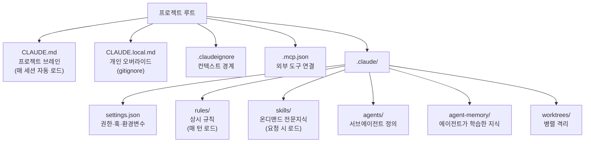
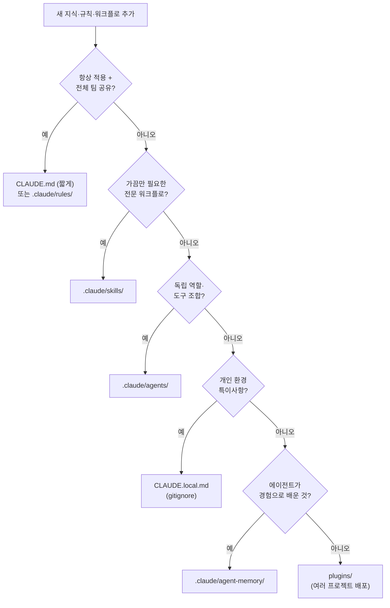

*An abstract representation of Claude Code project structure, showing how rules, skills, agents, and memory branch outward from a single project brain.*

## Overview

Anyone who has worked with Claude Code for a while knows the feeling: the `.claude` folder quietly turns into a junk drawer. Content that belongs in rules ends up in `CLAUDE.md`. Specialized knowledge that is only needed occasionally gets hard-coded into always-loaded rules. Personal environment paths bleed into team-shared files. Once the boundaries blur around what each component is supposed to hold, you end up paying token costs every session for context that has nothing to do with the current task.

In June 2026, a post titled "Claude Code Project Structure: The Complete Map" by Prakash Bhandari started circulating among developers. It maps five subsystems that the `.claude` folder controls -- instructions (CLAUDE.md and rules), workflows (skills and commands), specialists (agents), permissions (settings.json), and memory -- into a single coherent diagram. Since ThakiCloud already runs hundreds of skills and dozens of agents on top of this structure, we did not stop at reading the article. We held our actual repo up against the map to see how well they matched.

This post is a record of that comparison. We cover the role boundary of each component, the measured component counts from our `ai-platform-strategy` repo, and why this structure matters beyond mere tidiness when you are operating a Kubernetes-based AI/ML SaaS platform.

## What Claude Code Project Structure Actually Is

The core idea is straightforward. Claude Code reads configuration from two locations: the project directory's `.claude` folder, and the home directory's `~/.claude`. Project files are committed to git and shared across the team; home directory files apply globally to every project as personal configuration. Every component finds its place relative to these two roots.

The real value of the map is the answer to one question: when does each component get loaded into context? Some things arrive automatically at the start of every session. Others only arrive when a specific request triggers them. That timing difference is a token cost difference, which means deciding where to put something is not a matter of preference -- it is an operational cost decision.

*Claude Code project components organized by load timing. Click to enlarge.*

## Role Boundaries for Each Component

Where the map earns its keep is in defining what belongs where. Here is how each component's responsibility maps to how we actually run things.

**CLAUDE.md is the project brain.** It loads automatically every session and serves as the standing brief shared across the entire team. Think of it as the onboarding document you hand a new contractor on day one. What are we building, what stack does it run on, what conventions do we follow, what are the workflow rules. The principle is to answer exactly those four questions and nothing else. Every line pays rent. A bloated `CLAUDE.md` is wasted context.

**CLAUDE.local.md is personal override.** Same format, but it never goes into git. Local environment paths, debugging shortcuts, personal preferences, anything specific to your machine lives here. Team members can have completely different versions, and that is the point -- it keeps the shared `CLAUDE.md` clean.

**.claudeignore is the context boundary.** It uses the same syntax as `.gitignore` and limits what Claude can read. Without it, `node_modules`, generated migrations, vendor dependencies, and large fixtures consume your context budget. On a large monorepo it is practically mandatory.

**rules are always-on constraints.** They load automatically on every turn, so only genuinely invariant rules belong here -- the things that apply to every task in every session. If you put a 200-line architecture document into a rules file, that content consumes context even in sessions where it is completely irrelevant. Documents should stay dormant until a skill explicitly reads them.

**skills are on-demand expertise.** They load only when a request triggers them. Specialized workflows that are not always needed, domain-specific pipelines, repeatable task recipes -- these belong in skills. The dividing line between `CLAUDE.md` and skills is the phrase "only sometimes needed."

**agents are subagent definitions.** Each agent is a specialist with its own role, tool set, and model tier, summoned when needed. The routing logic assigns cheaper models to exploration, balanced models to implementation, and the most capable models to architecture decisions.

**agent-memory is what agents have learned.** This is where agent-memory and `CLAUDE.md` fundamentally differ. `CLAUDE.md` holds what a person explicitly told the system. Agent-memory holds what an agent accumulated through experience -- repeated patterns, bugs, undocumented conventions that a long-running agent has encountered.

## Deciding Where New Knowledge Goes

You can have the map memorized and still hesitate when it is time to add a new rule or workflow. The placement decision tree from the article simplifies that judgment.

*Placement decision tree for new knowledge. The questions run in order: is this always needed, is it occasional expertise, does it define an independent role, is it personal, or is it something an agent learned?*

The most common mistakes are equally clear. Dumping "only sometimes needed" knowledge into `CLAUDE.md` wastes tokens every session. A monorepo without `.claudeignore` bleeds context. Committing `CLAUDE.local.md` to git exposes personal information and local paths. Keeping more than ten MCP servers active at once burns roughly 10,000 tokens per session whether you use those servers or not.

## Measuring the ThakiCloud Repo Against the Map

With the map in hand, we measured the `.claude` directory of our `ai-platform-strategy` repo directly.

| Component | Measured | Load timing |
|---|---|---|
| CLAUDE.md | 94 lines | every session, auto |
| .claude/rules | 40 files | every turn, auto |
| .claude/skills | 1,655 directories | on-demand |
| .claude/agents | 54 definitions | on summon |
| .claude/hooks | 15 files | on event |
| .claudeignore | present (442 bytes) | always-on boundary |
| .mcp.json | present (166 bytes) | on server connect |
| .claude/settings.json | present (5 KB) | every session |

*The 40 rules and 94-line CLAUDE.md are fixed overhead that arrives every turn. The 1,655 skills and 54 agents are on-demand assets that only appear when needed.*

These numbers prove the map's central point. If all 1,655 skills had been packed into `CLAUDE.md` or rules files, the context limit would blow on the very first session. In practice, those 1,655 skills load on-demand only, and a separate router narrows the candidate set on every turn before any skill is loaded. The always-on side of the ledger -- rules -- is intentionally kept at 40 files. That number is the result of a hygiene rule: keep each rules file under 2 KB, and demote anything larger to a skill.

One detail worth noting: after reading the source article, we immediately distilled it into a rules file named `claude-code-project-anatomy.md` and committed it to the repo. In other words, "the project structure map" itself passed through the placement decision tree once and ended up as an always-on rule that is referenced every turn. The map placed itself on the map.

## Implications for the ThakiCloud K8s AI/ML SaaS Platform

This structure matters beyond tidiness because context cost is operational cost. ThakiCloud runs multi-tenant agents on Kubernetes, schedules GPU resources through Kueue, and serves models through vLLM. Every agent session consumes tokens, and those tokens translate directly to inference cost. Reducing always-loaded context affects unit economics, not just accuracy.

The map's emphasis on placement by load timing aligns precisely with two principles we had already formalized separately. The first is that capability belongs in skills, not in the harness -- keeping the harness thin so the same skill works across multiple execution environments. The second is token hygiene: minimize what loads every turn, defer what is occasionally needed to on-demand. The placement decision tree converts those two principles into a practical judgment call at the moment of adding any new component.

There are also product-level implications. In a multi-tenant environment where different tenants require different rules and skills, having a clear boundary between what lives in always-on context and what stays on-demand makes tenant-to-tenant context isolation and cost attribution much cleaner. Keeping the channel where agents accumulate learned knowledge -- agent-memory -- separate from the channel where humans explicitly specify things -- `CLAUDE.md` -- also lines up with our approach to running self-learning agents safely.

## Caveats and Counterarguments

This map is not a complete solution. A few honest limitations.

First, component boundaries are recommendations, not enforcement. Claude Code itself will not stop you from putting skill-level content into a rules file. Maintaining the boundaries requires team discipline, and in our case it requires token hygiene rules and router gates in code. Reading the map and expecting things to stay organized by themselves does not work.

Second, 1,655 skills is not a number to brag about -- it cuts both ways. More candidates mean more noise risk: the router has more opportunities to surface the wrong skill. On-demand loading avoids always-on token cost, but retrieval accuracy becomes a different kind of cost. "On-demand means free" is too simple a conclusion.

Third, this structure is specific to Claude Code. Moving to a different agent execution environment changes the directory conventions and the load mechanism. That is why knowledge should be written as environment-agnostic as possible, with only the environment-specific wiring kept thin.

Finally, some figures in the source article -- such as roughly 1,000 tokens per MCP server -- are approximations that vary with environment and version. Rather than treating them as absolutes, the right takeaway is the direction: anything that loads every turn has a cost, and that cost compounds.

## Sources

- [Claude Code Project Structure Explained: The Complete 2026 Guide](https://www.prakashbhandari.com.np/posts/claude-code-project-structure-2026/) (Prakash Bhandari)
- [Explore the .claude directory (Claude Code official documentation)](https://code.claude.com/docs/en/claude-directory)
- Measured against: ThakiCloud `ai-platform-strategy` repo `.claude` directory (measured 2026-06-27)
