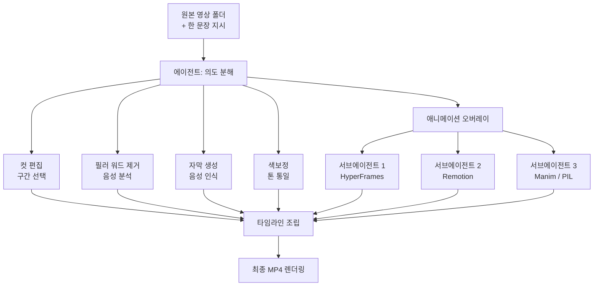

## Overview

Video editing has long been the domain of manual work, where a person cuts and joins clips on a timeline. Finishing a single video meant dedicated tools and a trained hand for cutting, removing filler speech, adding subtitles, color grading, and motion graphics. Then in June 2026, a one-line tweet from the Spanish developer-influencer midudev spread quickly among developers: "Claude Code can now edit video too. This skill is 100% free and open source."

The subject of the buzz is `video-use`, released by the browser-use team. The same team known for browser-use, which drives a browser with a coding agent, now offers a skill that hands video editing entirely to a coding agent. The usage is simple. You put your raw video files in a folder, write one sentence describing the video you want, and the agent does the rest.

ThakiCloud is productizing the structure where an agent picks and runs skills inside an isolated environment as an Agent-Native Cloud. So we read video-use not as a mere editing tool, but as a case study in how a coding agent decomposes and parallelizes non-development work. This article records what video-use actually does, what its internals look like, and what its design suggests from our platform's point of view.

## What This Technology Is

The core idea of video-use is to reduce video editing to a single natural-language command. The user never touches the timeline directly. Instead, they describe the desired result in a sentence, and the agent decomposes that sentence into several concrete editing actions.

According to its public description, video-use automatically handles the following.

- Cutting away unnecessary segments from the raw footage
- Automatically removing filler words such as "um" and "uh"
- Recognizing speech to generate subtitles and burn them into the video
- Applying color grading to unify the tone
- Layering animation overlays at points that need emphasis
- Rendering all of the above into a single final MP4

The interesting part is how animation is handled. When creating animation overlays, video-use is not tied to a single engine; it chooses among HyperFrames, Remotion, Manim, and PIL according to the nature of the task. More importantly, it spawns a separate sub-agent in parallel for each animation it creates. One agent per animation.

This design is fundamentally different from the common approach of "generate a video with one giant prompt." It splits the large task of video editing into independent sub-tasks such as cuts, subtitles, color grading, and animation; runs the non-dependent ones in parallel; and finally assembles them into a single timeline. The full flow looks like this.

*How video-use decomposes editing into cuts, subtitles, color grading, and animation, spawns a sub-agent per animation in parallel, then merges them into a single timeline. (Diagram labels in Korean, shared across languages.)*

As the diagram shows, the animation block is not a single node but fans out into multiple sub-agents. Each sub-agent is responsible only for its assigned animation and does not see the others' intermediate results. With this separation, whether there are three animations or five, they can proceed simultaneously, and total wall-clock time converges to the duration of the single longest animation.

## Installation and Integration

video-use ships as a skill that runs on top of a coding agent. You can get it from the browser-use team's public repository (`browser-use/video-use`), and true to its one-line description, "Edit videos with coding agents," a coding agent is the host. The typical flow is to fetch the repository, place the skill where the agent can recognize it, drop raw footage into a working folder, and instruct the agent in one sentence.

The animation engines each have a different character. Remotion is a framework for programming video with React, strong at component-based motion graphics; Manim is a Python library specialized in equation and shape animation; PIL handles lightweight image compositing; and HyperFrames is used for frame-by-frame sequence generation. Because video-use does not fix on one engine but picks the right one per task, the environment needs the runtimes these engines require (Node, Python, ffmpeg, and so on).

> An honest note on the scope of reproduction: the environment in which this article was written is an isolated one with restricted external network and dependency installation, so we were unable to run the full pipeline with raw video assets and heavy rendering dependencies (Remotion, Manim, ffmpeg) to measure rendering time or quality numbers directly. The analysis here is therefore based on the published skill description and architecture, and we do not include any benchmark numbers we did not measure.

## What the Behavior Actually Means

Although we did not run the full render ourselves, the published behavior spec alone makes clear what this skill aims for. The biggest shift is that the unit of editing becomes intent rather than clips.

In a traditional editing tool, the user thinks in terms of actions: "cut from 3 seconds to 7 seconds, add a fade there, attach a subtitle." In video-use, the user thinks in terms of results: "take this presentation video, clean it up, and make a one-minute clip with subtitles and emphasis animations." The conversion between the two, that is, unpacking the intent into dozens of actions, is what the agent takes on.

The second shift is parallelization. Video editing looks inherently serial, but in reality it contains many independent sub-tasks. Subtitle generation is unrelated to color grading, and the second scene's animation is unrelated to the first's. The fact that video-use spawns a sub-agent per animation is a design that actively exploits this independence to reduce wall-clock time. It is exactly the same idea ThakiCloud always emphasizes in multi-agent orchestration: run non-dependent tasks in parallel.

## Implications for ThakiCloud's Products

video-use addresses the non-development domain of video, but its design principles touch the core of **Paxis**, which ThakiCloud is productizing as an Agent-Native Cloud. Paxis is an agent control plane running on top of ai-platform, treating Skills, Tools, Policies, and Audit Logs as first-class resources. Mapping the video-use structure onto Paxis's layers reveals three things.

First, the **Skill Harness perspective**. video-use is itself a single skill, and internally it selects among several sub-tools (HyperFrames, Remotion, Manim, PIL) as the situation demands. Paxis's Skill Harness selects from more than 960 skills via BM25 and loads only the relevant ones into context; the way video-use picks an engine per animation task is a small instance of the same "load only what you need" principle. It also aligns with our experience that filling a verified skeleton with free design raises average quality.

Second, the **sandboxed isolated execution perspective**. Video rendering pulls in heavy dependencies such as ffmpeg, Node, and Python, and done carelessly, it can pollute the host environment. Paxis processes every skill execution in an isolated sandbox to protect the main working tree. The more a skill calls multiple external runtimes, as video-use does, the more this isolation becomes a necessity rather than an option. When parallel sub-agents each run a different engine, you need a boundary that keeps their temporary files and processes from colliding for things to run reliably.

Third, the **DAG multi-agent orchestration perspective**. The video-use flow is in effect a directed acyclic graph (DAG). The cut, subtitle, color-grading, and animation nodes fan out in parallel and then converge again at the timeline-assembly node. Paxis expresses this fan-out and fan-in as first-class, and passes each node's execution through policy gates and audit logs. Because who called which tool and when is all recorded, you can trace how the result was produced.

In short, video-use is one demo of a coding agent decomposing and parallelizing non-development work, and Paxis is the control plane that operates such patterns safely and traceably. Whether it is video editing or a data pipeline, the skeleton is the same: encapsulate the work as a skill, run it in parallel inside an isolated sandbox, and leave every action in an audit log.

## Limitations and Counterarguments

This approach is not a cure-all. First, because the agent's judgment enters at the stage of decomposing intent into actions, the output may diverge from what the user pictured. "Clean it up" means different things to different people, and the segment the agent cut may in fact have been the key one. In the end, rather than finishing in one sentence, you will likely exchange several rounds of revision instructions.

Second, cost and time. Spawning a sub-agent per animation reduces wall-clock time through parallelization, but at the cost of using more compute for as many agents and rendering processes as run at once. For polishing a single short clip, it may be an over-engineered design. Running a job through agent orchestration when a traditional editor would finish it in five minutes is not always a win.

Third, the absence of determinism. Even with the same source and the same instruction, there is no guarantee the same result comes out every time. Reproducibility matters in professional video production, and agent-based editing still needs validation here. This is also why ThakiCloud emphasizes the principle that in batch outputs, "format and aggregation are owned by deterministic code while the model generates only content." Even if you leave creative editing to the model, a hybrid where deterministic parts such as subtitle timing and output specs are guaranteed by code is the realistic compromise.

Even so, the direction video-use demonstrates is clear. The pattern of encapsulating complex tasks in non-development domains as skills, decomposing independent sub-tasks into parallel agents, and using natural-language intent as the entry point will spread to more areas. What ThakiCloud is building with Paxis is precisely the foundation for operating that pattern safely.

## Sources

- [browser-use/video-use (GitHub)](https://github.com/browser-use/video-use): "Edit videos with coding agents"
- [@midudev tweet](https://x.com/midudev): video-use skill introduction (2026-06-27)
- [video-use: Edit Videos with Claude Code (AIBit)](https://aibit.im/en/article/video-use-edit-videos-with-claude-code)
