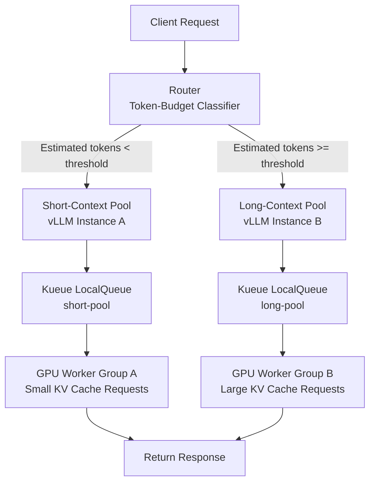

## The Problem: HoL Blocking Quietly Wastes GPU Time

Anyone who has run an LLM inference service in production has seen this: a request that generates a few dozen tokens — say, a one-liner chatbot reply — sits waiting behind a long document summarization or code generation job, wasting hundreds of milliseconds. This is Head-of-Line (HoL) blocking.

vLLM's continuous batching dramatically improves batch efficiency, but in a single-pool setup, long requests hold onto the KV cache for extended periods, forcing shorter requests to be preempted. Preempted requests pay the cost of recomputation, and overall GPU time efficiency drops.

The **Dual-Pool Token-Budget Routing** approach from arXiv 2604.08075 addresses this at the root. At request intake, it estimates the expected response length and routes each request to either a short-context pool or a long-context pool, so the two types never interfere with each other.

The paper reports the following results:

| Metric | Effect |
|---|---|
| GPU time savings | **31–42%** |
| Preemption rate | **5.4x reduction** |
| P99 TTFT improvement | **6%** |

## Core Idea: Token-Budget-Based Routing

The concept behind Dual-Pool is straightforward. For each request, the system estimates the **maximum expected token count** and assigns it to one of two pools based on a threshold.

```
Expected tokens = input tokens + estimated output tokens
```

When output token count is unknown — which is most of the time in production — two approximations work well:

1. **Request parameters**: Use the `max_tokens` value as an upper bound.
2. **History-based classification**: Track the length distribution of previous requests by API path or system prompt hash, then classify using the P75 or P90 value.

The threshold depends on workload characteristics. In the paper's experiments, 512 output tokens was the boundary between short and long.

## Architecture: The Two-Pool Structure



The short-context pool cycles through KV cache quickly, maintaining high throughput. The long-context pool reserves enough KV cache memory to complete long generations without interruption. Neither pool preempts the other.

## Kueue LocalQueue Integration

ThakiCloud's ai-platform schedules GPU workloads on Kubernetes using Kueue. Integrating Dual-Pool Routing with Kueue LocalQueue lets you manage resource allocation for each pool declaratively at the cluster level.

### Step 1: Define ClusterQueue and ResourceFlavor

```yaml
apiVersion: kueue.x-k8s.io/v1beta1
kind: ClusterQueue
metadata:
  name: llm-inference-cq
spec:
  namespaceSelector: {}
  resourceGroups:
    - coveredResources: ["nvidia.com/gpu"]
      flavors:
        - name: gpu-a100
          resources:
            - name: nvidia.com/gpu
              nominalQuota: 8
---
apiVersion: kueue.x-k8s.io/v1beta1
kind: ResourceFlavor
metadata:
  name: gpu-a100
spec:
  nodeLabels:
    gpu.nvidia.com/model: A100
```

### Step 2: Separate LocalQueues per Pool

```yaml
apiVersion: kueue.x-k8s.io/v1beta1
kind: LocalQueue
metadata:
  name: short-pool-queue
  namespace: llm-serving
spec:
  clusterQueue: llm-inference-cq
---
apiVersion: kueue.x-k8s.io/v1beta1
kind: LocalQueue
metadata:
  name: long-pool-queue
  namespace: llm-serving
spec:
  clusterQueue: llm-inference-cq
```

### Step 3: Annotate vLLM Deployments with Queue Names

```yaml
apiVersion: apps/v1
kind: Deployment
metadata:
  name: vllm-short-pool
  namespace: llm-serving
  annotations:
    kueue.x-k8s.io/queue-name: short-pool-queue
spec:
  replicas: 2
  template:
    spec:
      containers:
        - name: vllm
          image: vllm/vllm-openai:latest
          args:
            - "--model"
            - "meta-llama/Llama-3.1-8B-Instruct"
            - "--max-model-len"
            - "4096"       # short pool: small context limit
            - "--gpu-memory-utilization"
            - "0.7"        # fast KV cache turnover
          resources:
            limits:
              nvidia.com/gpu: "1"
---
apiVersion: apps/v1
kind: Deployment
metadata:
  name: vllm-long-pool
  namespace: llm-serving
  annotations:
    kueue.x-k8s.io/queue-name: long-pool-queue
spec:
  replicas: 2
  template:
    spec:
      containers:
        - name: vllm
          image: vllm/vllm-openai:latest
          args:
            - "--model"
            - "meta-llama/Llama-3.1-8B-Instruct"
            - "--max-model-len"
            - "32768"      # long pool: generous context window
            - "--gpu-memory-utilization"
            - "0.90"       # large KV cache reservation
          resources:
            limits:
              nvidia.com/gpu: "1"
```

### Step 4: Router Implementation (Python Example)

```python
from fastapi import FastAPI, Request
import httpx

app = FastAPI()

SHORT_POOL_URL = "http://vllm-short-pool-svc:8000/v1/chat/completions"
LONG_POOL_URL  = "http://vllm-long-pool-svc:8000/v1/chat/completions"
TOKEN_THRESHOLD = 512  # tune this against workload history

def estimate_output_tokens(payload: dict) -> int:
    """Use max_tokens as upper bound. Default to 256 if absent."""
    return payload.get("max_tokens") or 256

def route_request(payload: dict) -> str:
    """Return the target URL based on estimated token count."""
    estimated = estimate_output_tokens(payload)
    if estimated < TOKEN_THRESHOLD:
        return SHORT_POOL_URL
    return LONG_POOL_URL

@app.post("/v1/chat/completions")
async def proxy(request: Request):
    payload = await request.json()
    target_url = route_request(payload)
    async with httpx.AsyncClient(timeout=120.0) as client:
        resp = await client.post(target_url, json=payload)
        return resp.json()
```

Deploy this router as a Kubernetes Service and place it in front of your existing inference endpoint.

## Operational Considerations

### Tuning the Threshold

The 512-token boundary is a starting point, not a universal constant. In practice, collect the following metrics over at least seven days before adjusting:

- Actual output token distribution per request (P50, P90, P99)
- Per-pool preemption rate (`vllm:num_preemptions_total` Prometheus metric)
- Per-pool `vllm:num_requests_waiting` queue depth

If the short-pool queue grows persistently deep, lower the threshold or add more short-pool replicas. If long-pool GPU utilization stays low, raise the threshold to send fewer requests there.

### KEDA Autoscaling Integration

Adding a KEDA ScaledObject backed by vLLM Prometheus metrics gives each pool its own independent autoscaling behavior:

```yaml
apiVersion: keda.sh/v1alpha1
kind: ScaledObject
metadata:
  name: vllm-short-pool-scaler
  namespace: llm-serving
spec:
  scaleTargetRef:
    name: vllm-short-pool
  minReplicaCount: 1
  maxReplicaCount: 8
  triggers:
    - type: prometheus
      metadata:
        serverAddress: http://prometheus:9090
        metricName: vllm_requests_waiting_short
        query: vllm:num_requests_waiting{deployment="vllm-short-pool"}
        threshold: "5"
```

Metric-based scaling responds more directly to inference load than simple HTTP RPS scaling. A threshold of `5` means scale-up begins when more than five requests are queued.

### Model Sharing vs. Instance Separation

The two pools do not strictly require separate vLLM instances. Running the same model with different `--max-model-len` settings is the baseline configuration, but if memory budget allows, a single vLLM instance can expose two external ports with different internal priority classes.

That said, **instance separation is the cleaner choice** for fully eliminating preemption interference, because KV cache memory is shared within a single vLLM process.

## Relevance to ThakiCloud's ai-platform

ThakiCloud's ai-platform serves multiple tenants' inference workloads on a shared GPU cluster. Dual-Pool Routing adds two concrete benefits in this context.

First, it reduces cross-tenant interference. When Tenant A's chatbot requests — short by nature — get queued behind Tenant B's long document analysis batch jobs, the result is SLO violations. Pool separation cuts off this interference at the structural level.

Second, it improves GPU budget efficiency. A 31–42% GPU time reduction means either handling more requests with the same GPU budget, or achieving the same throughput with fewer GPUs. In an on-premises environment with a fixed resource ceiling, that savings translates directly into lower serving cost.

For ThakiCloud clusters already using Kueue LocalQueue, adding this architecture requires only two queue declarations and a lightweight router deployment. Compatibility with existing vLLM Deployment specs is high, so the adoption surface is broad.

## Summary

The problem Dual-Pool Token-Budget Routing solves is simple: when short and long requests share a queue, short requests lose. Separating them at the queue level lets each type be processed at its natural pace.

The results from arXiv 2604.08075 — 31–42% GPU time savings, a 5.4x reduction in preemption rate, and 6% improvement in P99 TTFT — represent a strong return for the implementation complexity involved. On Kubernetes, two Kueue LocalQueues, two vLLM Deployments, and one lightweight router are all it takes to build this structure.
