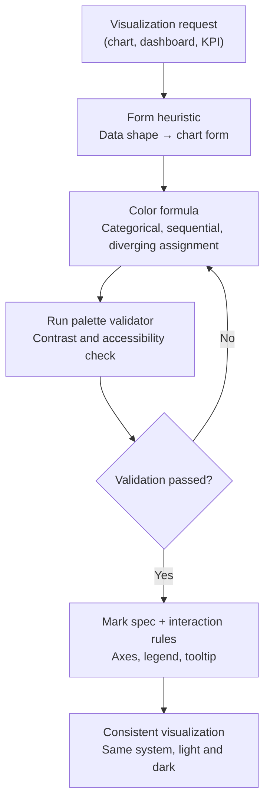

## Overview

Anyone can write code that draws a chart. Pulling a bar chart out of `matplotlib` or wiring a dashboard together with Recharts takes only a few lines. The problem is that most of what comes out of that process cannot actually be read. Axes that do not start at zero exaggerate differences, every series gets a different color so you have to check the legend three times, and switching to dark mode collapses the contrast until the labels disappear. The code runs, but the picture does not help anyone make a decision.

Claude Code 2.1.198 added a built-in skill, `/dataviz`, aimed squarely at this gap. The official changelog describes it in one short line as providing "chart and dashboard design guidance," but what it actually does is turn charts back from a coding problem into a design problem. Before a single line of code is written, it loads guidance into context on which form to choose, how to assign color, and how to protect accessibility. It is worth a close look because it inverts the "draw first, polish later" order that keeps repeating whenever we build a GPU usage dashboard or a model evaluation report at ThakiCloud.

## What the /dataviz Skill Is

`/dataviz` is a reference skill meant to be read right before you build any chart, graph, or dashboard, in any output medium. It does not care whether the target is an HTML or React artifact, inline SVG, library code in `matplotlib`, `plotly`, d3, or Recharts, a PNG you will render and upload, or a chart you are about to share in Slack. It is designed to be loaded before you write the first line of chart code, before you pick chart colors, and before you lay out a KPI tile, a meter, or a row of metrics.

The key point is that it is not tied to any specific design system. The skill ships a brand-neutral placeholder palette as its default and instructs you to swap those values for your own brand colors. In other words, it is closer to "use this method for picking colors" than "use this color." Because it teaches a method, the same discipline applies even when the palette differs from project to project.

The scope of the skill becomes clear once you look at what triggers it. Words like chart, graph, plot, data visualization, and dashboard trigger it, and so does every individual component of a visualization: categorical color, sequential and diverging palettes, stat tiles, sparklines, heatmaps, legends, axes, and tooltips. Whether you are drawing one full chart or placing a single KPI row, you pass through the same guidance either way.

## What This Skill Loads Into Context

The guidance `/dataviz` loads breaks down into four blocks: a form heuristic, a color formula, a runnable validator, and mark specs paired with interaction rules.

The **form heuristic** is the rule set that decides the chart's form based on the data's shape. Whether the data is a time series, a distribution, a part-to-whole relationship, or geographic changes which mark is appropriate. Having this step is what lets you break the habit of reaching for a pie chart by default. Principles long established in the data visualization field, such as why a pie chart is a bad choice in most cases and why a bar chart's axis should start at zero, are codified here as working rules. It is essentially the norms laid out by people like Edward Tufte and Cole Nussbaumer Knaflic, translated into a skill's practical rule set.

The **color formula** treats color as part of the data rather than decoration. It assigns clearly distinguishable colors to categorical data, colors that step gradually in brightness to sequential data, and colors that diverge from a center point in both directions to diverging data. Instead of picking an arbitrary color per series, it matches color to the meaning structure of the data.

The **runnable palette validator** is the skill's real differentiator. It does not stop at guidance for picking colors, it checks in code whether the chosen palette actually reads. The validator checks color contrast and accessibility to determine whether text and marks are distinguishable enough in both light mode and dark mode. Because a deterministic check owns the pass/fail decision instead of a human eyeballing it, subjective judgments like "looks fine" are ruled out. The default palette is documented in `references/palette.md` with values that have already passed validation, and all you need to do is replace those values with your own brand colors.

The **mark spec and interaction rules** standardize the details of a chart. Decisions like how to draw the axes, where to place the legend, and what to put in the tooltip are fixed as rules instead of being remade every time. As a result, charts made by different people using different libraries end up reading as one system.

## How to Actually Use It

Using it is simple in itself. Load the skill before you start building a chart or dashboard, and the guidance from the four blocks above enters your context. From that point on, no matter which library you use, code is generated on top of the same discipline.

The point to watch is order. What the skill's description repeatedly emphasizes is to read it "before you write the first line of chart code." Fixing color after the code is already written is too late. Correcting a bar chart whose axis did not start at zero after the fact usually means reworking the scale and layout, and dark mode contrast problems often mean rebuilding the entire palette from scratch. Putting the design decision up front makes this rework disappear.

The fact that the same guidance applies to charts shared in Slack is especially useful in practice. An ad hoc chart pasted into a team channel usually suffers a double bind of being the most carelessly made and the most widely read. Once it passes through this skill, even that kind of chart follows the same rules as a formal dashboard.

## Implications for ThakiCloud's Products

The message `/dataviz` is sending overlaps exactly with the principle ThakiCloud already practices across two products: do not leave format and quality to the model's improvisation, make it fill in a validated skeleton instead.

Through the **ai-platform lens**, we are constantly visualizing metrics like GPU usage, Kueue queue state, model serving latency, and per-tenant cost on top of our K8s-based AI/ML infrastructure. These observability dashboards are screens where an operator needs to spot an anomaly within seconds, so visual hierarchy directly translates into response speed. A flow that picks a chart matching the nature of each metric with the form heuristic, distinguishes normal, warning, and failure states through the meaning of color with the color formula, and guarantees dark mode contrast through the validator lifts the reliability of an operations dashboard directly. The discipline of using color as a status signal rather than decoration reduces misjudgment during on-call response.

Through the **Paxis lens**, `/dataviz` itself is a miniature of the Agent-Native Cloud we are building. Paxis is the agent control plane running on top of ai-platform, treating skills as first-class resources and selecting from roughly 960 skills with BM25 to run them in an isolated sandbox. The way `/dataviz` packages "the ability to draw a chart" into a single skill and loads it into context when needed is the same structure as Paxis's Skill Harness, which bundles knowledge and discipline into reusable skill units. The runnable palette validator in particular is the data visualization version of a principle we have kept across several batch skills: numbers and verdicts are not asserted by the model, deterministic code owns them. The model proposes a color, and code checks whether that color actually reads. Without this separation, output produced by many different people and many different agents cannot converge into one system.

The two lenses complement each other. ai-platform pulls out the metrics, and Paxis safely runs the skill that renders those metrics into a consistent visual language. Low-cost infrastructure makes observability cheap, and the skill harness turns that observability into a picture that can actually be read.

## Limits and Counterarguments

`/dataviz` is not a silver bullet. What the skill loads is guidance, not autocompletion, so a human or an agent still has to write the chart. If you ignore the guidance and write the code first anyway, loading the skill was pointless. Order discipline is not something the tool can enforce on its own.

There is also a cost in context consumption. Loading the skill spends tokens. Loading the full guidance every time for a chart you only need to sketch quickly can be overkill. It earns its keep for dashboards and reports where quality is the whole point of the output, but there is no reason to force it onto a one-off scratch plot.

The fact that the default palette is brand-neutral is also a double-edged sword. Use it as is without swapping it out, and you get a bland, characterless chart that could belong to any company. Skip the one step of replacing the values in `references/palette.md` with your own brand, and you gain consistency but lose identity. The skill gives you a method, and the final decision of putting a brand on top is still ours to make.

## Sources

- Claude Code CLI 2.1.198 changelog (ClaudeCodeLog, X)
- Claude Code's built-in `dataviz` skill description and `references/palette.md`
