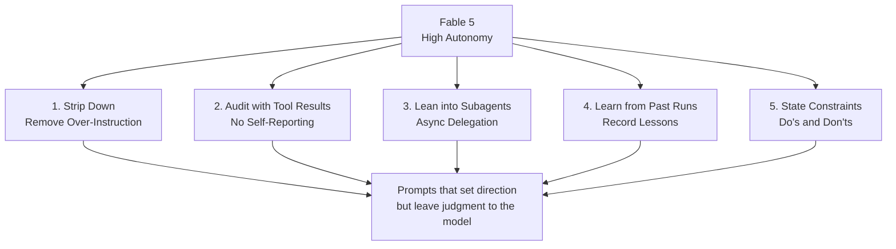

## Overview

Every time a new model ships, we tend to carry forward the same prompts we built for the old one. Anthropic's official prompting guide for Claude Fable 5 recommends exactly the opposite. Instructions that made older models behave well can actually hurt Fable 5's output quality. In the guide's own words, skills built for previous models can be "often too prescriptive for Claude Fable 5, which can degrade output quality."

That single sentence sums up the tone of the whole guide. A smarter model needs fewer rules, not more. For an organization like ThakiCloud that actually runs agents in production, this shift is not someone else's problem. It is a warning that the hundreds of skills and rules we use to keep agents in line could become a burden in front of a newer model. Let's walk through the guide's five principles one at a time, and note how many of them already overlap with the discipline we practice.

## What Changed

Fable 5 is more autonomous than the previous generation. It spins up subagents more readily on its own, pushes long-running tasks forward by itself, and occasionally takes actions nobody asked for. As capability goes up, the way we control it has to change too. Hand-holding instructions that spell out every step work the same way they would on a capable new hire: they get in the way of judgment instead of helping it. The five principles in the guide are less about suppressing this autonomy and more about channeling it in the right direction.



## Principle 1: Strip It Down

The first thing the guide emphasizes is deletion. Instructions written tightly for older models eat into Fable 5's performance. The intuition that more rules are better gets inverted with this model. When you move to a new model, the first move is not to pile more onto the prompt. It is to figure out which instructions are no longer necessary and cut them.

This principle lines up exactly with the "thin harness, fat skills" idea our repository has held onto for a long time: keep capability in skills and data rather than the harness, and keep the instructions you pay for every turn to a minimum. When we meet a new model, the first job is not to add more rules and skills. It is to weed out any instruction that fails the question, "would the agent get this wrong without this sentence?"

## Principle 2: Audit Progress Against Tool Results

During long autonomous runs, Fable 5 should be instructed to audit its own progress against actual tool results. The example instruction the guide gives is this.

```text
Before reporting progress, audit each claim against a tool result
from this session. Only report work you can point to evidence for.
```

According to Anthropic's testing, this one sentence nearly eliminated fabricated progress reports. Instead of the model saying "I believe this is done," it forces the model to report only the work it can point to evidence for among this session's tool results.

This matches a principle we have repeated across many of our own rules: a model's self-report can never be the exit condition for a loop. The most trustworthy feedback is deterministic verification that returns pass or fail objectively, the way tests, type checkers, and compilers do. That is exactly why our repository's verification gates decide by exit code, and why fan-out results get closed by a vote rather than a narrative. The fact that Anthropic has now codified this principle in an official guide shows that distrusting self-reports is becoming the default in agent operations, not a quirk of one team's taste.

## Principle 3: Lean into Subagents

Fable 5 spins up parallel subagents more readily than earlier models. The guide recommends not suppressing this tendency but using it, while explicitly guiding when delegation is appropriate and preferring asynchronous communication between the orchestrator and its subagents. The point of delegation is not delegation for its own sake. It is to push independent work through in parallel and raise overall throughput.

This is exactly what our repository's model-routing discipline addresses. We assign exploration and file reading to low-cost models, implementation to a mid tier, and reserve high-cost models for complex reasoning and verification only, and we always specify a model parameter whenever we spin up a subagent. The fact that Fable 5 handles subagents better means this kind of routing will pay off even more going forward. Keeping the conductor light and isolating only the heavy work to specialized subagents is a pattern that fits naturally with how the model behaves.

## Principle 4: Learn from Past Runs

Fable 5 works especially well when it can record and reference lessons learned from previous runs. The guide recommends setting up storage as simple as a single markdown file, and gives this example.

```text
Store one lesson per file with a one-line summary at the top.
Record corrections and confirmed approaches alike, including why
they mattered.
```

Store one lesson per file, put a one-line summary at the top, and record both corrections and confirmed approaches along with why they mattered. This guidance looks strikingly like the memory structure of the very system writing this article. ThakiCloud's agent memory runs on exactly this pattern: one fact per file, a one-line summary in the front matter, and corrections and confirmed patterns recorded along with their reasoning. The hot-memory loop that reads in everything learned up to the last session as a standing brief at the start of each new session rests on the same idea. The overlap between Anthropic's recommendation and our own memory discipline is a signal that not letting an agent start from a blank slate every time is turning into something close to a universal answer, not a local habit.

## Principle 5: State Constraints Explicitly

The price of high autonomy is that Fable 5 occasionally does things nobody asked for. To prevent this, the guide recommends defining explicit constraints on what the model should and should not do. Leave the direction open, but draw a clear line it should not cross.

In our own operations, this line gets implemented as approval gates and safety nets around irreversible changes. Anything irreversible, like a schema migration or a deployment, requires a plan up front and explicit approval, and high-risk actions like trade execution get a hard guard. The more capable a model becomes, the more it matters to make clear what it must not do, more than what it can do. Fable 5's autonomy becomes an asset when the constraints are drawn well, and a liability when they are not.

## Implications for ThakiCloud's Products

These five principles map directly onto the design philosophy behind Paxis, the product ThakiCloud is building. Paxis is an Agent-Native Cloud control plane running on top of ai-platform, treating skills, tools, policies, and audit logs as first-class resources. What the guide calls "stripping down" is how we keep the skill harness thin and pile capability into skills instead. "Auditing with tool results" is how we close fan-out with deterministic verification gates. "Leaning into subagents" is implemented through DAG multi-agent orchestration and model routing. "Learning from past runs" is our memory engine and hot-memory loop. "Stating constraints" is our policy gates and audit logs.

Put differently, Anthropic's prompting guide gives official grounding to discipline we already operate under. The stronger new models get, the more valuable this discipline becomes. Instead of letting a capable model start from a blank slate, trusting its self-reports at face value, or blocking its judgment with over-instruction, it is better to wrap it in a thin harness, verification gates, and persistent memory. That wrapping is exactly what Paxis sells.

## Limits and Counterarguments

This guide should not be taken as dogma. "Strip it down" is an appealing principle, but deciding what to strip is still a matter of judgment. One badly removed instruction can cause a regression, and catching that regression still requires the earlier principles: deterministic verification and a record of past runs. The principles support each other, so applying only one of them cuts their effectiveness in half.

The guide also targets one specific model, Fable 5. The advice here does not transfer wholesale to every model, especially smaller models with lower autonomy. For smaller models, tighter instructions and a fixed skeleton are what protect quality. Applying "cut back on instructions" uniformly across every tier will destabilize the output of low-cost workers. Prompting discipline needs to be calibrated by model tier.

Finally, there is a paradox: the more autonomous a model becomes, the harder it gets to enforce constraints on it. To force a model that spins up its own subagents and takes unrequested actions to stop doing something, prompts alone are not enough. Deterministic hooks and approval gates need to back them up. The guide addresses the language of the prompt, but the real safety net has to be owned by code.

## Sources

- Prompting Claude Fable 5, Anthropic official documentation (platform.claude.com)
- Redeploying Claude Fable 5, Anthropic News
