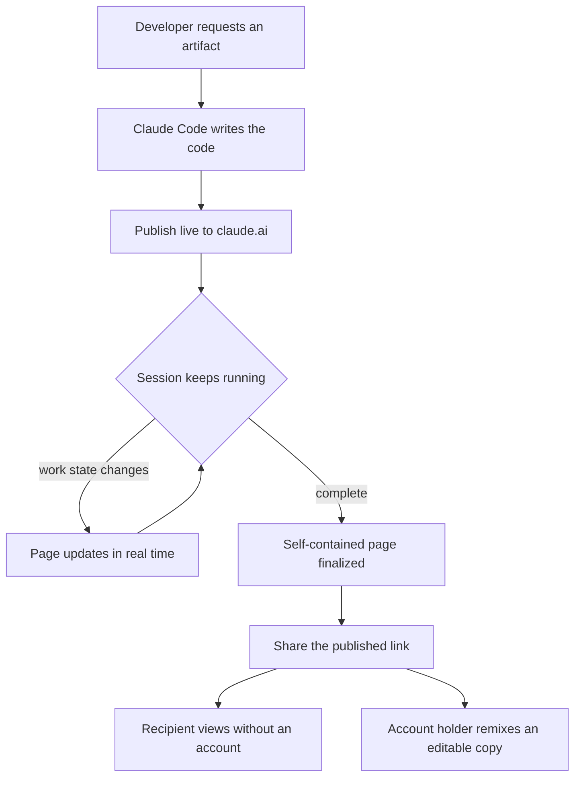

*The progress of a coding session condenses into one shareable page that updates in real time.*

## Overview

When a coding agent finishes hours of work, showing the result to someone else is still surprisingly clumsy. You capture terminal logs and paste them, summarize the changes by hand, or build a separate dashboard. Explaining the work often takes more effort than the work itself.

In July 2026, Anthropic expanded the Artifacts feature in Claude Code to the Pro and Max plans. A capability that had been limited to Team and Enterprise is now open to individual developers. The idea is simple. When you ask for an artifact, Claude writes the code, publishes it live to claude.ai, and keeps updating that page in real time while the session runs. The page is private to your account and fully self-contained.

This post explains exactly what Claude Code artifacts are, why the Pro and Max expansion matters, and how the pattern can be absorbed from the perspective of ThakiCloud's agent platform Paxis and its AI infrastructure ai-platform.

## What Claude Code Artifacts Are

Artifacts originally rendered code or documents in a separate panel inside a claude.ai conversation. The artifacts that just arrived in Claude Code are a little different. Instead of the output of a single exchange, they turn the progress of an entire coding session into one living visual page.

Anthropic lists four example uses: PR walkthroughs, system explainer pages, dashboards, and release checklists. What they share is that each is a human-readable summary of what is happening right now. And while the session continues its work, that page updates itself.

The flow from work to publication looks like this.

Two design decisions stand out here. First, the page is self-contained. Without an external build pipeline or hosting setup, everything it needs lives in the single published page. Second, the default is private. The page belongs to your account, and nobody else can see it until you press publish and share the link.

## Why the Pro and Max Expansion Matters

The feature itself had been available on Team and Enterprise for a few months. The key change now is that the plan boundary has moved down.

To be precise: regular artifacts created in a claude.ai conversation could already be published on every plan, including Free, Pro, and Max. The artifacts that turn a Claude Code session into a live page, on the other hand, were Team and Enterprise only. That boundary has now extended to Pro and Max. Without an organization seat, an individual developer can turn their own session into a shareable page.

Why this matters becomes clear when you look at how individual developers actually work. When an open-source contributor finishes a long refactor, they need a way to convey the context of the change to a reviewer. The same holds for a solo developer running a side project who wants to track their own progress or demo it to a peer. Until now, these users could not touch the feature unless they were tied to an organization plan. The Pro and Max expansion closes that gap.

One more note: over the same period, Anthropic also temporarily raised the weekly Claude Code usage limits for Pro, Max, and Team. Access and headroom opened together, which gives individual developers real room to try the feature.

## How It Works in Practice

Using it feels conversational. During a session, when you say "turn this work into an artifact," Claude Code generates a page capturing the current progress and publishes it to claude.ai. Open the returned link and you see a visual page summarizing the work so far, and as the session keeps running, the page updates without a refresh.

Sharing happens through the publish button at the bottom of the artifact panel. Whoever receives the link can view the page without a Claude account. Someone who does have an account can use remix to make their own editable copy. In other words, a single artifact is both a read-only shared object and a starting point that someone else can pick up and develop.

The privacy model is also clear. A page created in Claude Code is private to your account by default. It is exposed externally only the moment you publish and hand over a link, and until then only you can see it. For developers handling sensitive internal work, this default matters, because there is no path to accidental exposure.

The most practical combination in this flow is the PR walkthrough. After finishing a long change, requesting an artifact yields a page covering what changed and why, which files are affected, and how it was verified. The reviewer can grasp the context from this page before reading the diff. Incident response pages and release checklists work the same way, letting the agent maintain a human-readable summary on its own.

## What It Means for ThakiCloud

The real implication of this feature goes beyond the convenience of a single tool. The pattern itself, "keep an agent's work output as a human-readable, shareable artifact, and keep it live," is a core challenge for any agent platform.

**The Paxis lens (agent output as a first-class resource).** ThakiCloud's Paxis is an Agent-Native Cloud control plane that runs on top of ai-platform and treats Skills, Tools, Policies, and Audit Logs as first-class resources. What Claude Code artifacts demonstrate is a way to expose an agent's intermediate and final output as a separate observation channel. When a DAG of multiple agents in Paxis performs a long task, condensing each node's progress into a human-readable live page lets an operator grasp the flow without scrolling logs. Combine that with Paxis's policy gates and audit logs, and the artifact becomes a controlled output that is traceable down to "who made and shared what, and when." In the same spirit as Anthropic's default-private artifacts, Paxis can layer policy-based access control onto output sharing and scale it to the organization level.

**The ai-platform lens (internal operations pages).** On the infrastructure side, self-contained pages fit internal dashboards and incident pages well. ThakiCloud's ai-platform runs K8s, Kueue GPU scheduling, and multi-tenant vLLM serving, and the batch and serving workloads that run on it need a channel to convey state to people. If you let an agent maintain a release checklist or a deployment progress page on its own, you gain operational visibility in on-prem and sovereign environments without adding a separate observability stack. Because self-containment reduces the dependence on external hosting, it is a light burden even in customer environments with strong air-gap requirements.

The two lenses complement each other. If ai-platform runs agent workloads at low cost and Paxis treats their output as shareable artifacts under policy and audit, you can reproduce the experience of "an agent works and its result immediately becomes something a human can read" on your own platform.

## Limitations and Counterpoints

There are clear points where expectations should be tempered.

First, the feature is tied to publishing on claude.ai. Because the page is hosted on Anthropic infrastructure, it is hard to use as-is in a fully air-gapped environment or where data exfiltration is prohibited. Customers with strong sovereignty requirements need a self-hosted alternative, and that is precisely the gap an on-prem-oriented platform like ThakiCloud can fill.

Second, self-contained pages are excellent for simple summaries and dashboards, but they are limited for complex interactions or large-scale data integration. A published artifact is essentially a lightweight frontend and does not replace heavy backend logic.

Third, real-time updates hold only while the session is alive. Once the session ends, the page freezes as a snapshot from that moment. If you need a continuously updating operations dashboard, you still need a separate pipeline.

In short, the Pro and Max expansion of Claude Code artifacts significantly lowers the barrier for individual developers to turn agent work into shareable output. The constraints of hosting and persistence remain, and that is exactly where an agent platform with policy, audit, and on-prem capabilities offers complementary value. Absorb the convenience of the tool, and fill the areas that require control and sovereignty with your own platform. That is the realistic approach.

## Sources

- [ClaudeDevs (@ClaudeDevs) announcement post](https://x.com/ClaudeDevs/status/2072770790114914317)
- [Publish and share artifacts (Claude Help Center)](https://support.claude.com/en/articles/9547008-publish-and-share-artifacts)
- [What are artifacts and how do I use them? (Claude Help Center)](https://support.claude.com/en/articles/9487310-what-are-artifacts-and-how-do-i-use-them)
