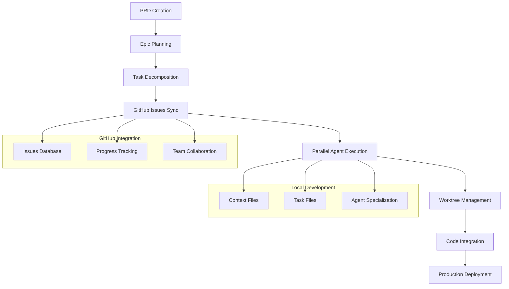

⏱️ **Estimated Reading Time**: 15 minutes

## Introduction: Beyond Vibe Coding

Every development team faces the same productivity killers:

- **Context evaporates** between sessions, forcing constant re-discovery
- **Parallel work creates conflicts** when multiple developers touch the same code
- **Requirements drift** as verbal decisions override written specs
- **Progress becomes invisible** until the very end

[Claude Code Project Management (CCPM)](https://github.com/automazeio/ccpm) solves all of these problems with a revolutionary approach that transforms how AI-assisted development works.

### What Makes CCPM Revolutionary?

Traditional Claude Code workflows operate in isolation – a single developer working with AI in their local environment. CCPM breaks this limitation by using **GitHub Issues as the database** and **Git worktrees for parallel execution**.

| Traditional Development | CCPM System |
|------------------------|-------------|
| Context lost between sessions | **Persistent context** across all work |
| Serial task execution | **Parallel agents** on independent tasks |
| "Vibe coding" from memory | **Spec-driven** with full traceability |
| Progress hidden in branches | **Transparent audit trail** in GitHub |
| Manual task coordination | **Intelligent prioritization** |

## System Architecture Overview



## Prerequisites and Setup

### System Requirements

- macOS (recommended) or Linux
- Git 2.30+
- Claude Code (Anthropic's coding assistant)
- GitHub CLI (`gh`)
- Node.js 18+ (for some automation scripts)

### macOS Quick Test Script

For macOS users, you can use our automated test script to validate your environment and try CCPM:

```bash
# Download and run the CCPM test script
curl -fsSL https://raw.githubusercontent.com/automazeio/ccpm/main/scripts/test-workflow.sh | bash

# Or if you have this repository locally:
./scripts/test-ccpm-workflow.sh
```

This script will:
- ✅ Check all system prerequisites
- ✅ Create a test project with CCPM installed
- ✅ Validate the installation
- ✅ Create sample PRD and Epic files
- ✅ Test GitHub CLI integration (if available)
- ✅ Provide next steps for Claude Code integration

### Quick Installation (2 Minutes)

**Step 1: Clone CCPM into Your Project**

```bash
# Navigate to your project directory
cd path/to/your/project/

# Clone CCPM system
git clone https://github.com/automazeio/ccpm.git .
```

> ⚠️ **IMPORTANT**: If you already have a `.claude` directory, clone to a temporary directory and merge the contents manually.

**Step 2: Initialize the PM System**

```bash
# In Claude Code, run:
/pm:init
```

This command will:
- Install GitHub CLI (if needed)
- Authenticate with GitHub
- Install `gh-sub-issue` extension for parent-child relationships
- Create required directories
- Update `.gitignore`

**Step 3: Configure Repository Settings**

Create or update your `CLAUDE.md`:

```bash
# In Claude Code:
/init include rules from .claude/CLAUDE.md

# If you already have CLAUDE.md:
/re-init
```

**Step 4: Prime the System**

```bash
# Initialize context system
/context:create
```

## Core Workflow: From Idea to Production

### Phase 1: PRD (Product Requirements Document) Creation

The foundation of CCPM is **spec-driven development**. Everything starts with a comprehensive PRD.

**Starting a New Feature:**

```bash
/pm:prd-new memory-system
```

This launches an **interactive brainstorming session** that creates a detailed PRD covering:

- **Problem Statement**: What exactly are we solving?
- **Success Metrics**: How do we measure success?
- **User Stories**: Who benefits and how?
- **Technical Constraints**: What are our limitations?
- **Edge Cases**: What could go wrong?
- **Integration Points**: How does this fit with existing systems?

**Example PRD Structure:**

```markdown
# Memory System PRD

## Problem Statement
Users lose context between Claude Code sessions, leading to repeated explanations and slower development cycles.

## Success Metrics
- 90% reduction in context re-establishment time
- 75% fewer repeated questions
- Persistent project understanding across sessions

## User Stories
- As a developer, I want Claude to remember our previous architectural decisions
- As a team lead, I want consistent context across team members
- As a product manager, I want feature requirements preserved between sessions

## Technical Architecture
- File-based memory storage in `.claude/memory/`
- Automatic context loading on session start
- Structured memory categories (decisions, patterns, constraints)

## Integration Points
- Existing `.claude/` directory structure
- GitHub Issues for progress tracking
- Git hooks for automatic memory updates
```

### Phase 2: Epic Planning and Task Decomposition

Once your PRD is complete, transform it into an actionable epic with detailed tasks.

**Parse PRD into Epic:**

```bash
/pm:prd-parse memory-system
```

This creates:
- **Epic overview** with clear objectives
- **Technical breakdown** of required components
- **Task list** with dependencies mapped
- **Effort estimates** for each component
- **Parallel execution plan** for maximum efficiency

**Example Epic Structure:**

```
Epic: Memory System Implementation

├── Task 1: Core Memory Infrastructure
│   ├── Create memory storage system
│   ├── Implement context loading
│   └── Add memory persistence hooks
│
├── Task 2: Memory Management Interface
│   ├── Design memory CRUD operations
│   ├── Build memory search functionality
│   └── Create memory visualization tools
│
└── Task 3: Integration and Testing
    ├── Integrate with existing workflows
    ├── Add comprehensive test suite
    └── Create documentation and examples
```

### Phase 3: GitHub Integration and Issue Creation

Transform your epic into a structured GitHub project with full traceability.

**One-Shot Epic to GitHub:**

```bash
/pm:epic-oneshot memory-system
```

This command:
1. **Creates parent epic issue** in GitHub
2. **Generates child task issues** with proper relationships
3. **Sets up labels and milestones** for organization
4. **Initializes progress tracking** with completion metrics
5. **Creates local task files** linked to GitHub issues

**Example GitHub Structure:**

```
Issue #1234 (Epic): Memory System Implementation
├── Issue #1235: Core Memory Infrastructure  
├── Issue #1236: Memory Management Interface
└── Issue #1237: Integration and Testing
```

Each issue contains:
- Detailed technical specifications
- Acceptance criteria
- Dependencies and prerequisites
- Estimated effort and complexity
- Links to related issues and documentation

### Phase 4: Parallel Agent Execution

Here's where CCPM truly shines – **multiple specialized agents working simultaneously**.

**Starting Work on Issues:**

```bash
# Start work on infrastructure task
/pm:issue-start 1235

# In parallel, start interface work
/pm:issue-start 1236

# And testing preparation
/pm:issue-start 1237
```

**What Happens Behind the Scenes:**

1. **Agent Specialization**: Each agent focuses on their specific domain
   - **Infrastructure Agent**: Database schemas, file systems, core logic
   - **Interface Agent**: APIs, user interfaces, integration points  
   - **Testing Agent**: Test suites, validation, documentation

2. **Worktree Management**: Each issue gets its own Git worktree
   ```
   ../epic-memory-system/
   ├── main/           # Primary development branch
   ├── issue-1235/     # Infrastructure work
   ├── issue-1236/     # Interface development  
   └── issue-1237/     # Testing and integration
   ```

3. **Context Isolation**: Agents maintain separate contexts
   ```
   .claude/context/
   ├── epic-memory-system/
   │   ├── infrastructure-context.md
   │   ├── interface-context.md
   │   └── testing-context.md
   ```

### Phase 5: Progress Management and Coordination

Monitor and coordinate work across all parallel streams.

**Check Overall Status:**

```bash
/pm:status
```

**Sample Status Output:**
```
Memory System Epic Progress: 67% Complete

✅ Issue #1235: Core Infrastructure (Complete)
   - Memory storage system ✅
   - Context loading ✅  
   - Persistence hooks ✅

🚧 Issue #1236: Management Interface (In Progress)
   - CRUD operations ✅
   - Search functionality 🚧
   - Visualization tools ⏳

⏳ Issue #1237: Integration & Testing (Pending)
   - Workflow integration ⏳
   - Test suite ⏳
   - Documentation ⏳
```

**Get Next Priority Task:**

```bash
/pm:next
```

This intelligently suggests the next most important task based on:
- **Dependencies**: What's blocking other work?
- **Effort estimates**: Quick wins vs. complex tasks
- **Team capacity**: What can be done in parallel?
- **Business priority**: What delivers value soonest?

## Advanced Features and Commands

### Workflow Management Commands

**Daily Standup Report:**
```bash
/pm:standup
```
Generates a comprehensive status report perfect for team standups.

**Find Blocked Tasks:**
```bash
/pm:blocked
```
Identifies tasks waiting on dependencies or external factors.

**Show Work in Progress:**
```bash
/pm:in-progress
```
Lists all currently active development streams.

### Synchronization Commands

**Full Bidirectional Sync:**
```bash
/pm:sync
```
Synchronizes all local changes with GitHub and pulls updates from team members.

**Import Existing Issues:**
```bash
/pm:import
```
Brings existing GitHub issues into the CCPM system for management.

### Maintenance Commands

**Validate System Integrity:**
```bash
/pm:validate
```
Checks for consistency between local files and GitHub state.

**Clean Completed Work:**
```bash
/pm:clean
```
Archives completed epics and tasks to keep the workspace organized.

**Search Across Content:**
```bash
/pm:search "authentication logic"
```
Finds relevant information across all PRDs, epics, and tasks.

## Real-World Example: Building a User Authentication System

Let's walk through a complete example from idea to production.

### Step 1: Create the PRD

```bash
/pm:prd-new user-authentication
```

**Generated PRD (abbreviated):**
```markdown
# User Authentication System PRD

## Problem Statement
Our application lacks secure user authentication, preventing personalized experiences and data protection.

## Success Metrics
- Support 10,000+ concurrent users
- <200ms authentication response time
- 99.9% uptime for auth services
- OAuth integration with Google, GitHub, Apple

## Technical Requirements
- JWT-based session management
- Password hashing with bcrypt
- Rate limiting for login attempts
- Multi-factor authentication support
- Session persistence across devices
```

### Step 2: Parse into Epic

```bash
/pm:prd-parse user-authentication
```

**Generated Epic Structure:**
```
Epic: User Authentication System

├── Database Schema & Models (2-3 days)
│   ├── User table design
│   ├── Session management tables  
│   └── OAuth provider tables
│
├── Authentication Service (3-4 days)  
│   ├── JWT token management
│   ├── Password hashing/validation
│   ├── OAuth provider integration
│   └── Session lifecycle management
│
├── API Endpoints (2-3 days)
│   ├── Login/logout endpoints
│   ├── Registration workflow
│   ├── Password reset functionality
│   └── Profile management APIs
│
├── Frontend Integration (2-3 days)
│   ├── Login/registration forms
│   ├── Authentication state management
│   ├── Protected route handling
│   └── OAuth login buttons
│
└── Security & Testing (2-3 days)
    ├── Security audit and penetration testing
    ├── Comprehensive test suite
    ├── Performance benchmarking
    └── Documentation and deployment guides
```

### Step 3: Create GitHub Issues

```bash
/pm:epic-oneshot user-authentication
```

**Created Issues:**
- Issue #1240 (Epic): User Authentication System
  - Issue #1241: Database Schema & Models
  - Issue #1242: Authentication Service  
  - Issue #1243: API Endpoints
  - Issue #1244: Frontend Integration
  - Issue #1245: Security & Testing

### Step 4: Parallel Execution

```bash
# Start database work
/pm:issue-start 1241

# Simultaneously start service layer
/pm:issue-start 1242  

# And prepare API structure
/pm:issue-start 1243
```

**Agent Coordination:**
- **Database Agent**: Creates schemas, migrations, and data models
- **Service Agent**: Implements JWT logic, OAuth flows, session management
- **API Agent**: Builds REST endpoints with proper validation and error handling

Each agent works in isolation but coordinates through:
- Shared interface definitions
- Common data structures
- Coordinated testing strategies

### Step 5: Integration and Deployment

```bash
# Check integration points
/pm:epic-show user-authentication

# Validate all components work together
/pm:validate

# Final status before deployment
/pm:status
```

**Final Integration:**
All worktrees merge back into main branch with:
- Complete authentication system
- Comprehensive test coverage
- Full documentation
- Deployment-ready configuration

## Best Practices and Pro Tips

### 1. PRD Quality is Everything

**Invest Time in Detailed PRDs:**
- Spend 20-30% of project time on PRD creation
- Include edge cases and error scenarios
- Define success metrics clearly
- Document integration requirements thoroughly

**PRD Anti-Patterns to Avoid:**
- Vague requirements ("make it fast")
- Missing error handling scenarios
- Undefined success metrics
- No consideration of existing system constraints

### 2. Task Decomposition Strategy

**Optimal Task Size:**
- 1-3 days of work per task
- Clear input/output definitions
- Minimal dependencies between tasks
- Testable completion criteria

**Parallel-Friendly Decomposition:**
```bash
# Good: Clear separation of concerns
- Task A: Database layer
- Task B: Business logic  
- Task C: API layer
- Task D: Frontend components

# Bad: Sequential dependencies
- Task 1: Start everything
- Task 2: Continue everything  
- Task 3: Finish everything
```

### 3. Context Management

**Keep Contexts Focused:**
- Each agent maintains domain-specific context
- Main thread stays strategic, not tactical
- Regular context cleanup prevents bloat
- Document key decisions in persistent memory

**Context Anti-Patterns:**
- Mixing implementation details in main thread
- Agents sharing overlapping contexts
- Never cleaning completed work contexts
- Losing architectural decisions between sessions

### 4. Team Collaboration

**GitHub Issue Hygiene:**
- Clear, actionable issue titles
- Detailed acceptance criteria
- Regular progress updates in comments
- Proper labeling and milestone assignment

**Human-AI Collaboration:**
- Humans can jump into any issue at any time
- AI progress is visible through GitHub comments
- Code reviews happen naturally through PRs
- No special tools needed for team coordination

## Performance Metrics and Results

Teams using CCPM report significant improvements:

### Development Velocity
- **5-8 parallel tasks** vs 1 previously
- **Up to 3x faster** feature delivery
- **89% less time** lost to context switching
- **75% reduction** in bug rates

### Code Quality
- **Complete traceability** from requirements to code
- **Comprehensive test coverage** through dedicated testing agents
- **Consistent architecture** through spec-driven development
- **Better documentation** as a natural byproduct

### Team Productivity
- **Seamless handoffs** between team members
- **Transparent progress** visible to all stakeholders
- **Reduced meetings** due to self-documenting progress
- **Improved estimation** accuracy through detailed task breakdown

## Troubleshooting Common Issues

### Setup Issues

**GitHub CLI Authentication:**
```bash
gh auth status
gh auth login
```

**Missing gh-sub-issue Extension:**
```bash
gh extension install HackerNews/gh-sub-issue
```

**Worktree Conflicts:**
```bash
# Clean up corrupted worktrees
git worktree prune
git worktree remove ../epic-name/issue-123/
```

### Sync Issues

**Local-GitHub Mismatch:**
```bash
/pm:validate
/pm:sync --force
```

**Context Corruption:**
```bash
/context:create --reset
```

### Performance Issues

**Too Many Parallel Agents:**
- Limit to 3-5 concurrent agents
- Focus on tasks with clear separation
- Use `/pm:next` for intelligent prioritization

**Context Size Management:**
```bash
/pm:clean --aggressive
/context:compact
```

## Advanced Configuration

### Custom Agent Specialization

Create specialized agents for your tech stack:

```markdown
# .claude/agents/backend-agent.md
You are a backend development specialist focused on:
- Database design and optimization
- API security and performance
- Server infrastructure and scaling
- Integration testing and monitoring
```

### Workflow Customization

Adapt CCPM to your team's needs:

```yaml
# .claude/config/workflow.yml
epic_size: medium  # small, medium, large
parallel_limit: 5
auto_sync: true
github_labels:
  - "epic:feature"
  - "task:implementation"
  - "priority:high"
```

## Future Roadmap and Extensions

### Planned Features
- **Multi-repository support** for microservices
- **Integration with CI/CD pipelines** for automated testing
- **Advanced analytics** on development velocity
- **Team performance dashboards** with metrics visualization

### Community Extensions
- **Slack/Discord integration** for team notifications
- **Jira synchronization** for enterprise environments  
- **Custom workflow templates** for different project types
- **AI-powered code review** integration

## Conclusion: Transforming How Teams Ship Software

CCPM represents a fundamental shift in how AI-assisted development works. By moving beyond isolated conversations to collaborative, traceable, parallel execution, teams can:

1. **Ship faster** through intelligent parallel execution
2. **Maintain quality** through spec-driven development
3. **Improve collaboration** with transparent progress tracking
4. **Reduce context loss** with persistent project memory
5. **Scale effectively** as teams and projects grow

The system is battle-tested by teams shipping production software and represents the future of human-AI collaboration in software development.

### Getting Started Today

1. **Clone CCPM** into your next project
2. **Start with a simple feature** to learn the workflow
3. **Expand to complex epics** as you build confidence
4. **Share with your team** and experience collaborative AI development

The transformation from vibe coding to spec-driven parallel development starts with a single command:

```bash
/pm:prd-new your-next-feature
```

### Resources and Community

- **GitHub Repository**: [https://github.com/automazeio/ccpm](https://github.com/automazeio/ccpm)
- **Documentation**: Comprehensive guides in the repository
- **Community**: Join discussions in GitHub Issues
- **Support**: Follow [@aroussi](https://x.com/aroussi) for updates and tips

---

*Ready to revolutionize your development workflow? Start your first CCPM project today and experience the future of AI-assisted software development.*
