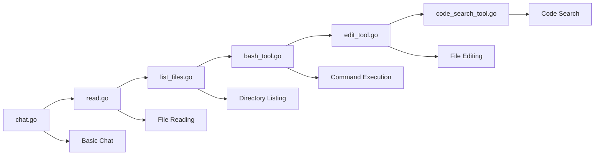

⏱️ **Expected Reading Time**: 15 minutes

## Introduction: The Rise of AI Coding Agents

The AI development landscape has been revolutionized by coding agents like Cursor, Cline, Amp, and Windsurf. These tools transform how developers write, debug, and maintain code by providing intelligent assistance that understands context, executes commands, and manages entire codebases.

[Geoffrey Huntley's workshop repository](https://github.com/ghuntley/how-to-build-a-coding-agent) provides a comprehensive guide to building your own coding agent from scratch. This tutorial will take you through the entire process, from basic chat functionality to advanced code search capabilities.

## Why Build Your Own Coding Agent?

### Understanding the Foundation

Building your own coding agent offers several advantages:

- **Complete Control**: Customize every aspect of the agent's behavior
- **Learning Opportunity**: Deep understanding of AI agent architecture
- **Cost Optimization**: Tailor resource usage to your specific needs
- **Privacy**: Keep sensitive code on your own infrastructure
- **Extensibility**: Add custom tools and integrations

### Modern Coding Agent Capabilities

Today's coding agents typically include:

1. **Natural Language Interface**: Chat-based interaction with developers
2. **File System Operations**: Reading, writing, and managing project files
3. **Code Search**: Advanced pattern matching and code discovery
4. **Command Execution**: Running system commands and build processes
5. **Context Awareness**: Understanding project structure and dependencies

## Workshop Architecture Overview

The workshop follows a progressive enhancement approach with six distinct applications, each building upon the previous one:



## Phase 1: Basic Chat Agent (chat.go)

### Core Architecture

The foundation starts with a simple chat interface that establishes the conversation loop pattern:

```go
type Agent struct {
    client      *anthropic.Client
    getUserMessage func() (string, bool)
    tools       []ToolDefinition
    verbose     bool
}
```

### Key Learning Points

- **API Integration**: Direct connection to Anthropic Claude API
- **Conversation Management**: Maintaining chat history and context
- **Error Handling**: Robust error management for API calls
- **User Interface**: Terminal-based interaction patterns

### Implementation Highlights

The chat agent demonstrates:
- Streaming responses for real-time interaction
- Conversation state management
- Basic error recovery mechanisms
- Logging and debugging capabilities

## Phase 2: File Reading Agent (read.go)

### Tool Integration Foundation

This phase introduces the tool system that becomes central to all subsequent agents:

```go
type ToolDefinition struct {
    Name        string
    Description string
    InputSchema ToolInputSchemaParam
    Function    func(input json.RawMessage) (string, error)
}
```

### Read File Tool Implementation

```go
type ReadFileInput struct {
    Path string `json:"path" jsonschema:"description=File path to read"`
}

func ReadFile(input json.RawMessage) (string, error) {
    var params ReadFileInput
    if err := json.Unmarshal(input, &params); err != nil {
        return "", err
    }
    
    content, err := os.ReadFile(params.Path)
    if err != nil {
        return "", fmt.Errorf("failed to read file: %w", err)
    }
    
    return string(content), nil
}
```

### Tool Registration Pattern

The workshop establishes a consistent pattern for tool registration:

```go
var readFileTool = ToolDefinition{
    Name:        "read_file",
    Description: "Read the contents of a file",
    InputSchema: GenerateSchema[ReadFileInput](),
    Function:    ReadFile,
}
```

## Phase 3: File System Navigation (list_files.go)

### Directory Operations

Building on file reading, this phase adds directory traversal capabilities:

```go
type ListFilesInput struct {
    Path string `json:"path" jsonschema:"description=Directory path to list"`
}
```

### Enhanced File Management

The list files tool provides:
- Recursive directory scanning
- File type filtering
- Path normalization
- Error handling for permissions and access issues

### Multi-Tool Coordination

This phase demonstrates how multiple tools work together:
- `read_file` for content access
- `list_files` for discovery
- Coordinated operations for complex tasks

## Phase 4: System Integration (bash_tool.go)

### Command Execution Capabilities

The bash tool introduces system-level operations:

```go
type BashInput struct {
    Command string `json:"command" jsonschema:"description=Bash command to execute"`
}

func BashCommand(input json.RawMessage) (string, error) {
    var params BashInput
    if err := json.Unmarshal(input, &params); err != nil {
        return "", err
    }
    
    cmd := exec.Command("bash", "-c", params.Command)
    output, err := cmd.CombinedOutput()
    
    return string(output), err
}
```

### Safety and Security Considerations

The workshop addresses critical security aspects:
- Command validation and sanitization
- Output capture and error handling
- Process management and timeouts
- Permission and access controls

### Real-World Applications

With command execution, the agent can:
- Run build processes and tests
- Install dependencies and packages
- Execute git operations
- Perform system diagnostics

## Phase 5: Code Editing (edit_tool.go)

### File Modification Engine

The edit tool represents a significant capability leap:

```go
type EditFileInput struct {
    Path   string `json:"path" jsonschema:"description=File path to edit"`
    OldStr string `json:"old_str" jsonschema:"description=String to replace"`
    NewStr string `json:"new_str" jsonschema:"description=Replacement string"`
}
```

### Validation and Safety

The edit tool implements several safety mechanisms:
- Content validation before modification
- Backup creation for rollback capability
- Atomic operations to prevent partial edits
- Diff generation for change tracking

### Advanced Editing Features

Key capabilities include:
- Precise string replacement
- Multi-line content handling
- Indentation preservation
- Encoding and character set management

## Phase 6: Code Discovery (code_search_tool.go)

### Ripgrep Integration

The final phase adds powerful code search using ripgrep:

```go
type CodeSearchInput struct {
    Pattern       string `json:"pattern" jsonschema:"description=Search pattern"`
    Path          string `json:"path,omitempty" jsonschema:"description=Search path"`
    FileType      string `json:"file_type,omitempty" jsonschema:"description=File type filter"`
    CaseSensitive bool   `json:"case_sensitive,omitempty" jsonschema:"description=Case sensitive search"`
}
```

### Advanced Search Capabilities

The code search tool provides:
- Regular expression pattern matching
- File type filtering for targeted searches
- Case sensitivity options
- Context line inclusion
- Performance optimization for large codebases

### Search Strategy Patterns

Common search patterns include:
- Function and method definitions
- Variable and constant declarations
- Import and dependency analysis
- TODO and FIXME comment discovery
- Error handling pattern identification

## Development Environment Setup

### Prerequisites and Dependencies

The workshop uses modern development practices:

```yaml
# devenv.yaml
name: coding-agent-workshop
starship: true

imports:
  - devenv-nixpkgs

env:
  ANTHROPIC_API_KEY: "your-api-key-here"

languages:
  go:
    enable: true
    package: "go_1_24"
```

### Environment Benefits

Using devenv provides:
- Reproducible development environments
- Automatic dependency management
- Cross-platform compatibility
- Version consistency across team members

## Tool System Architecture Deep Dive

### Schema Generation

The workshop demonstrates automatic JSON schema generation:

```go
func GenerateSchema[T any]() ToolInputSchemaParam {
    schema := jsonschema.Reflect(&struct{ T }{})
    return ToolInputSchemaParam{
        Type:       "object",
        Properties: schema.Properties,
        Required:   schema.Required,
    }
}
```

### Event Loop Pattern

All agents follow a consistent event loop:

1. **User Input**: Accept and validate user commands
2. **Context Building**: Assemble conversation history
3. **API Request**: Send request to Claude with available tools
4. **Tool Execution**: Process tool use requests
5. **Result Integration**: Combine tool outputs with AI responses
6. **Response Delivery**: Present final results to user

### Error Handling Strategy

The workshop implements comprehensive error handling:
- Input validation and sanitization
- API error recovery and retry logic
- Tool execution timeout management
- User-friendly error messaging
- Debugging and logging capabilities

## Advanced Features and Extensions

### Verbose Logging

All applications support verbose mode for debugging:

```bash
go run edit_tool.go --verbose
```

This provides detailed insights into:
- API call timing and performance
- Tool execution traces
- File operation details
- Error diagnostic information

### Custom Tool Development

The framework supports easy tool extension:

```go
func CustomTool(input json.RawMessage) (string, error) {
    // Custom tool implementation
    return result, nil
}

var customToolDef = ToolDefinition{
    Name:        "custom_tool",
    Description: "Custom functionality",
    InputSchema: GenerateSchema[CustomInput](),
    Function:    CustomTool,
}
```

## Testing and Validation

### Sample Files

The repository includes test files for experimentation:
- `fizzbuzz.js`: JavaScript code for editing practice
- `riddle.txt`: Text content for reading tests
- `AGENT.md`: Documentation for analysis

### Test Scenarios

Recommended testing approach:

1. **Basic Functionality**: File reading and listing
2. **System Integration**: Command execution and output capture
3. **Code Modification**: Safe editing and validation
4. **Search Operations**: Pattern matching and discovery
5. **Error Conditions**: Handling failures and edge cases

## Production Considerations

### Security Best Practices

When deploying coding agents:
- Implement proper authentication and authorization
- Sanitize all user inputs and commands
- Use sandboxed execution environments
- Monitor and log all agent activities
- Implement rate limiting and usage controls

### Performance Optimization

Key optimization strategies:
- Cache frequently accessed files and search results
- Implement lazy loading for large codebases
- Use streaming responses for long operations
- Optimize tool execution order and parallelization
- Monitor memory usage and cleanup resources

### Scalability Planning

For larger deployments:
- Implement horizontal scaling with load balancing
- Use distributed caching for shared state
- Consider microservice architecture for tool isolation
- Plan for concurrent user sessions
- Implement proper monitoring and observability

## Common Issues and Troubleshooting

### API Integration Problems

Typical issues and solutions:
- **Rate Limiting**: Implement exponential backoff
- **Authentication**: Verify API key configuration
- **Network Issues**: Add retry logic with circuit breakers
- **Response Parsing**: Validate JSON schema compatibility

### Tool Execution Challenges

Common problems:
- **Permission Errors**: Check file system permissions
- **Path Issues**: Normalize and validate file paths
- **Command Failures**: Implement proper error capture
- **Resource Limits**: Monitor memory and CPU usage

## Next Steps and Advanced Topics

### Feature Enhancements

Consider adding:
- Web scraping capabilities for external content
- Database integration for persistent storage
- API integration for external services
- Multi-language support beyond Go
- GUI interfaces for non-technical users

### Architecture Evolution

Advanced patterns to explore:
- Event-driven architecture with message queues
- Plugin systems for extensible functionality
- Distributed agent coordination
- Machine learning integration for behavior adaptation
- Real-time collaboration features

## Conclusion

Building a coding agent from scratch provides invaluable insights into AI-assisted development. The [how-to-build-a-coding-agent workshop](https://github.com/ghuntley/how-to-build-a-coding-agent) offers a structured, progressive approach that takes you from basic chat functionality to a fully-featured coding assistant.

The six-phase progression—from simple conversation to advanced code search—demonstrates how complex AI systems can be built incrementally. Each phase introduces essential concepts while building upon previous foundations, creating a comprehensive understanding of agent architecture.

### Key Takeaways

1. **Progressive Development**: Start simple and add complexity gradually
2. **Tool-Centric Design**: Build reusable, composable tool systems
3. **Safety First**: Implement validation and error handling throughout
4. **Real-World Testing**: Use practical examples and edge cases
5. **Production Readiness**: Consider security, performance, and scalability

The modern development landscape increasingly relies on AI-powered tools. Understanding how to build and customize these agents puts you at the forefront of this technological evolution. Whether you're building internal tools, contributing to open-source projects, or creating commercial products, the principles and practices demonstrated in this workshop provide a solid foundation for success.

Start with the basic chat agent, progress through each phase methodically, and soon you'll have your own sophisticated coding agent tailored to your specific needs and workflows.
