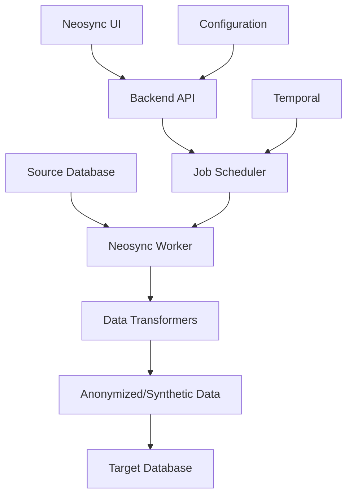

⏱️ **Estimated Reading Time**: 15 minutes

## Introduction to Neosync

[**Neosync**](https://github.com/nucleuscloud/neosync) is an open-source, developer-first platform that revolutionizes how organizations handle sensitive data. It provides comprehensive solutions for **data anonymization**, **synthetic data generation**, and **environment synchronization** to help companies safely test against production-like data while maintaining compliance with privacy regulations like GDPR, HIPAA, and FERPA.

### Why Neosync Matters

In today's data-driven development landscape, developers need access to realistic data for testing, debugging, and development. However, using actual production data poses significant security and compliance risks. Neosync bridges this gap by providing:

1. **Safe Production Data Testing** - Anonymize sensitive production data for local development
2. **Production Bug Reproduction** - Create safe, representative datasets for debugging
3. **High-Quality Test Data** - Generate production-like data for staging and QA environments
4. **Compliance Solution** - Reduce compliance scope for GDPR, HIPAA, FERPA regulations
5. **Development Database Seeding** - Create synthetic data for unit testing and demos

### Key Features Overview

- **Synthetic Data Generation** based on your existing schema
- **Production Data Anonymization** with referential integrity preservation
- **Database Subsetting** using SQL queries for focused testing
- **Async Pipeline Architecture** with automatic retries and failure handling
- **GitOps Integration** for declarative configuration management
- **Built-in Transformers** for major data types (emails, names, addresses, etc.)
- **Custom Transformers** using JavaScript or LLMs
- **Multiple Database Support** - PostgreSQL, MySQL, and S3 integration

## Prerequisites and Environment Setup

### System Requirements

Before starting this tutorial, ensure you have:

- **Docker & Docker Compose** (latest version)
- **Git** for repository cloning
- **PostgreSQL client** (optional, for testing connections)
- **Web browser** for accessing the Neosync UI
- **macOS, Linux, or Windows** with WSL2

### Installation Steps

Let's begin by setting up Neosync on your local machine:

#### Step 1: Clone the Repository

```bash
# Clone Neosync repository
git clone https://github.com/nucleuscloud/neosync.git
cd neosync

# Check repository structure
ls -la
```

#### Step 2: Start Neosync Services

Neosync provides a production-ready Docker Compose setup:

```bash
# Start all Neosync services
make compose/up

# Alternatively, you can use Docker Compose directly
docker compose up -d
```

This command will:
- Download and start all required containers
- Set up PostgreSQL database for Neosync metadata
- Launch the Neosync backend API
- Start the web frontend interface
- Initialize sample connections and jobs

#### Step 3: Verify Installation

```bash
# Check running containers
docker compose ps

# View logs if needed
docker compose logs -f neosync-app
```

Access Neosync at `http://localhost:3000` in your web browser.

## Understanding Neosync Architecture

### Core Components

Neosync consists of several interconnected components:

1. **Frontend (Next.js)** - Web interface for configuration and monitoring
2. **Backend API (Go)** - Core business logic and job orchestration
3. **Worker Service** - Handles data processing and transformation jobs
4. **PostgreSQL Database** - Stores metadata, configurations, and job state
5. **Temporal** - Workflow orchestration for reliable job execution

### Data Flow Architecture



## Initial Configuration and Setup

### Accessing the Dashboard

1. Open your browser and navigate to `http://localhost:3000`
2. You'll see the Neosync welcome dashboard
3. The system comes pre-configured with sample connections for demonstration

### Understanding Connections

**Connections** in Neosync represent database or storage endpoints. The default setup includes:

- **Source Connection** - PostgreSQL database with sample data
- **Destination Connection** - Target database for anonymized data

### Sample Data Overview

Neosync includes pre-populated sample data to demonstrate its capabilities:

```sql
-- Sample schema structure
CREATE TABLE users (
    id SERIAL PRIMARY KEY,
    first_name VARCHAR(50),
    last_name VARCHAR(50),
    email VARCHAR(100) UNIQUE,
    phone VARCHAR(20),
    birth_date DATE,
    salary DECIMAL(10,2)
);

CREATE TABLE orders (
    id SERIAL PRIMARY KEY,
    user_id INTEGER REFERENCES users(id),
    order_date TIMESTAMP,
    total_amount DECIMAL(10,2),
    status VARCHAR(20)
);
```

## Creating Your First Anonymization Job

### Job Configuration Wizard

Let's create a data anonymization job that transforms sensitive information while preserving data relationships:

#### Step 1: Create New Job

1. Click **"Jobs"** in the navigation menu
2. Select **"Create Job"**
3. Choose **"Data Anonymization"** job type
4. Set job name: `user-data-anonymization`

#### Step 2: Configure Source Connection

```yaml
# Source connection settings
Connection Type: PostgreSQL
Host: localhost
Port: 5432
Database: sample_db
Username: postgres
Password: [provided in compose]
```

#### Step 3: Define Transformation Rules

For the `users` table, configure these transformations:

| Column | Transformer | Configuration |
|--------|-------------|---------------|
| `first_name` | Generate First Name | Random generation |
| `last_name` | Generate Last Name | Random generation |
| `email` | Transform Email | Preserve domain structure |
| `phone` | Generate Phone | Format: +1-XXX-XXX-XXXX |
| `birth_date` | Transform Date | Randomize ±5 years |
| `salary` | Transform Numeric | Randomize ±20% |

#### Step 4: Preserve Referential Integrity

Configure foreign key relationships:

```yaml
# Maintain user_id relationships in orders table
Foreign Keys:
  - Source Table: orders
    Source Column: user_id
    Reference Table: users
    Reference Column: id
    Action: preserve_relationship
```

#### Step 5: Execute the Job

```bash
# Monitor job execution via CLI (optional)
docker compose exec neosync-worker neosync jobs run --job-id=user-data-anonymization

# Or use the web interface
# Click "Run Job" in the dashboard
```

## Synthetic Data Generation

### Creating Synthetic Datasets

Neosync can generate completely synthetic data that matches your schema constraints:

#### Step 1: Schema Analysis

```sql
-- Analyze existing schema
SELECT 
    column_name,
    data_type,
    is_nullable,
    column_default
FROM information_schema.columns 
WHERE table_name = 'users';
```

#### Step 2: Configure Synthetic Generation

Create a new job with these settings:

```yaml
Job Type: Generate Synthetic Data
Target Rows: 10000
Data Distribution:
  users:
    - first_name: weighted_random([common_names])
    - last_name: weighted_random([surnames])
    - email: generate_email(first_name, last_name)
    - age_distribution: normal(mean=35, std=12)
    - salary_distribution: lognormal(mean=75000, std=25000)
```

#### Step 3: Advanced Synthetic Patterns

```javascript
// Custom transformer for realistic email generation
function generateEmail(firstName, lastName) {
    const domains = ['gmail.com', 'yahoo.com', 'company.com'];
    const domain = domains[Math.floor(Math.random() * domains.length)];
    const username = `${firstName.toLowerCase()}.${lastName.toLowerCase()}`;
    return `${username}@${domain}`;
}

// Generate correlated data
function generateSalary(experience, education) {
    const baseSalary = 50000;
    const experienceMultiplier = experience * 2000;
    const educationBonus = education === 'masters' ? 15000 : 
                          education === 'phd' ? 25000 : 0;
    
    return baseSalary + experienceMultiplier + educationBonus;
}
```

## Advanced Data Transformations

### Custom JavaScript Transformers

Neosync supports custom transformations using JavaScript:

```javascript
// Credit card number anonymization
function anonymizeCreditCard(value) {
    if (!value || value.length < 4) return value;
    
    const lastFour = value.slice(-4);
    const masked = '*'.repeat(value.length - 4);
    return masked + lastFour;
}

// Address anonymization while preserving geographic region
function anonymizeAddress(address, city, state) {
    return {
        street: generateRandomStreet(),
        city: city, // Preserve city for geographic analysis
        state: state,
        zipCode: generateRandomZipInState(state)
    };
}

// Timestamp anonymization with time pattern preservation
function anonymizeTimestamp(timestamp) {
    const date = new Date(timestamp);
    const randomDays = Math.floor(Math.random() * 365) - 182; // ±6 months
    date.setDate(date.getDate() + randomDays);
    return date.toISOString();
}
```

### LLM-Powered Transformations

For more sophisticated transformations, Neosync can integrate with Large Language Models:

```yaml
# LLM transformer configuration
Transformer: LLM_Transform
Model: gpt-3.5-turbo
Prompt: |
  Transform this customer review to remove personal information 
  while preserving sentiment and key product feedback:
  
  Original: "{review_text}"
  
  Requirements:
  - Remove specific names, locations, dates
  - Preserve product features mentioned
  - Maintain emotional tone
  - Keep review length similar

Temperature: 0.3
Max_Tokens: 300
```

## Database Integration and Subsetting

### PostgreSQL Integration

Configure PostgreSQL connection for production data:

```yaml
# Production PostgreSQL setup
Connection:
  type: postgresql
  host: prod-db.company.com
  port: 5432
  database: production_db
  username: neosync_reader
  password: ${NEOSYNC_DB_PASSWORD}
  ssl_mode: require
  
# Read-only permissions for safety
Permissions:
  - SELECT on public.*
  - No write permissions
```

### Data Subsetting Strategies

Create focused datasets for testing:

```sql
-- User-based subsetting
SELECT * FROM users 
WHERE created_at >= '2024-01-01' 
  AND account_type = 'premium'
LIMIT 1000;

-- Relationship-aware subsetting
WITH sample_users AS (
    SELECT id FROM users 
    WHERE region = 'US-WEST' 
    LIMIT 500
)
SELECT o.* FROM orders o
JOIN sample_users su ON o.user_id = su.id
WHERE o.order_date >= '2024-01-01';

-- Time-based subsetting with referential integrity
SELECT * FROM events 
WHERE event_date BETWEEN '2024-07-01' AND '2024-07-31'
  AND user_id IN (
    SELECT id FROM users 
    WHERE last_active >= '2024-06-01'
  );
```

### MySQL Integration

```yaml
# MySQL connection configuration
Connection:
  type: mysql
  host: mysql-server.internal
  port: 3306
  database: app_database
  username: neosync_user
  password: ${MYSQL_PASSWORD}
  charset: utf8mb4
  
# MySQL-specific settings
Options:
  sql_mode: STRICT_TRANS_TABLES
  time_zone: UTC
  max_connections: 10
```

## Workflow Automation and GitOps

### Declarative Configuration

Create reusable job configurations:

```yaml
# .neosync/jobs/user-anonymization.yaml
apiVersion: neosync.dev/v1
kind: Job
metadata:
  name: user-data-anonymization
  namespace: development
spec:
  source:
    connection: prod-postgres
    tables:
      - users
      - user_profiles
      - user_preferences
  
  destination:
    connection: dev-postgres
    
  transformations:
    users:
      first_name:
        type: generate_first_name
      last_name:
        type: generate_last_name
      email:
        type: transform_email
        preserve_domain: true
      ssn:
        type: hash_value
        algorithm: sha256
    
    user_profiles:
      bio:
        type: llm_transform
        model: gpt-3.5-turbo
        prompt: "Anonymize personal details while preserving professional information"
  
  schedule:
    cron: "0 2 * * *"  # Daily at 2 AM
    timezone: UTC
```

### CI/CD Integration

```yaml
# .github/workflows/data-sync.yml
name: Neosync Data Synchronization

on:
  schedule:
    - cron: '0 6 * * 1'  # Every Monday at 6 AM
  workflow_dispatch:

jobs:
  sync-development-data:
    runs-on: ubuntu-latest
    steps:
      - uses: actions/checkout@v3
      
      - name: Setup Neosync CLI
        run: |
          curl -sSL https://install.neosync.dev | sh
          echo "$HOME/.neosync/bin" >> $GITHUB_PATH
      
      - name: Run Anonymization Job
        env:
          NEOSYNC_API_TOKEN: ${{ secrets.NEOSYNC_API_TOKEN }}
          NEOSYNC_API_URL: ${{ secrets.NEOSYNC_API_URL }}
        run: |
          neosync jobs run \
            --job-config .neosync/jobs/user-anonymization.yaml \
            --wait-for-completion \
            --timeout 30m
      
      - name: Verify Data Quality
        run: |
          neosync validate \
            --connection dev-postgres \
            --check referential-integrity \
            --check data-quality
```

## Monitoring and Observability

### Job Monitoring Dashboard

Neosync provides comprehensive monitoring capabilities:

1. **Job Execution Status** - Real-time progress tracking
2. **Data Transformation Metrics** - Row counts, transformation rates
3. **Error Tracking** - Failed transformations and retry logic
4. **Performance Metrics** - Execution time, throughput analysis
5. **Data Quality Checks** - Validation results and anomaly detection

### Metrics and Alerting

```yaml
# Monitoring configuration
Monitoring:
  metrics:
    - job_duration_seconds
    - rows_processed_total
    - transformation_errors_total
    - data_quality_score
  
  alerts:
    - name: job_failure
      condition: job_status == "failed"
      notification: slack_webhook
      
    - name: data_quality_degradation
      condition: data_quality_score < 0.95
      notification: email
      
    - name: long_running_job
      condition: job_duration_seconds > 3600
      notification: pagerduty
```

### Log Analysis

```bash
# View job execution logs
docker compose logs neosync-worker | grep "job_id=user-anonymization"

# Monitor transformation performance
docker compose logs neosync-worker | grep "transformation_stats"

# Check for errors
docker compose logs neosync-worker | grep "ERROR"
```

## Security and Compliance

### Data Privacy Best Practices

1. **Principle of Least Privilege** - Grant minimal necessary permissions
2. **Data Retention Policies** - Automatically purge old anonymized data
3. **Audit Logging** - Track all data access and transformations
4. **Encryption** - Encrypt data in transit and at rest
5. **Access Controls** - Role-based access to different data sensitivity levels

### GDPR Compliance Features

```yaml
# GDPR compliance configuration
GDPR:
  data_subject_rights:
    right_to_be_forgotten:
      enabled: true
      retention_days: 90
      
    right_of_access:
      enabled: true
      response_time_days: 30
      
    data_portability:
      enabled: true
      export_formats: [json, csv, xml]
  
  consent_management:
    track_consent_changes: true
    consent_expiry_days: 365
    
  breach_notification:
    enabled: true
    notification_time_hours: 72
```

### HIPAA Compliance

```yaml
# HIPAA compliance for healthcare data
HIPAA:
  phi_identification:
    automatic_detection: true
    custom_patterns:
      - medical_record_number: '\d{8,12}'
      - patient_id: 'P\d{6,10}'
      
  safe_harbor_method:
    remove_direct_identifiers: true
    statistical_disclosure_control: true
    
  audit_controls:
    log_all_access: true
    log_retention_years: 6
```

## Performance Optimization

### Parallel Processing Configuration

```yaml
# Performance optimization settings
Performance:
  worker_concurrency: 8
  batch_size: 1000
  memory_limit: "4Gi"
  
  database_connections:
    max_open: 25
    max_idle: 5
    connection_lifetime: "5m"
  
  transformation_cache:
    enabled: true
    size: "1Gi"
    ttl: "1h"
```

### Large Dataset Handling

```sql
-- Chunked processing for large tables
SELECT * FROM large_table 
WHERE id BETWEEN ? AND ?
ORDER BY id 
LIMIT 10000;

-- Memory-efficient streaming
SET work_mem = '256MB';
SET maintenance_work_mem = '1GB';
```

## Troubleshooting Guide

### Common Issues and Solutions

#### Issue 1: Job Timeout

```yaml
# Solution: Increase timeout and optimize batch size
Job:
  timeout: 3600s  # 1 hour
  batch_size: 500  # Smaller batches
  retry_attempts: 3
```

#### Issue 2: Memory Issues

```bash
# Monitor memory usage
docker stats neosync-worker

# Increase container memory
docker compose up -d --scale neosync-worker=2
```

#### Issue 3: Connection Failures

```yaml
# Robust connection configuration
Connection:
  retry_attempts: 5
  retry_delay: 30s
  connection_timeout: 60s
  read_timeout: 300s
```

### Debug Mode

```bash
# Enable debug logging
export NEOSYNC_LOG_LEVEL=debug
docker compose up -d

# View detailed logs
docker compose logs -f neosync-worker | grep DEBUG
```

## Testing and Validation

Let's create a comprehensive test script to validate our Neosync setup:

```bash
#!/bin/bash
# File: test-neosync-setup.sh

echo "🚀 Testing Neosync Setup..."

# Test 1: Check if services are running
echo "📡 Checking Neosync services..."
if curl -f http://localhost:3000/health > /dev/null 2>&1; then
    echo "✅ Neosync UI is accessible"
else
    echo "❌ Neosync UI is not accessible"
    exit 1
fi

# Test 2: Verify database connectivity
echo "🗄️ Testing database connectivity..."
docker compose exec neosync-app neosync connections test --connection-id=sample-postgres
if [ $? -eq 0 ]; then
    echo "✅ Database connection successful"
else
    echo "❌ Database connection failed"
fi

# Test 3: Run sample anonymization job
echo "🔄 Running sample anonymization job..."
JOB_ID=$(docker compose exec neosync-app neosync jobs create \
    --name "test-anonymization" \
    --source-connection sample-postgres \
    --destination-connection sample-postgres-dest)

docker compose exec neosync-app neosync jobs run --job-id=$JOB_ID --wait

# Test 4: Validate anonymized data
echo "🔍 Validating anonymized data..."
docker compose exec postgres psql -U postgres -d neosync -c \
    "SELECT COUNT(*) as anonymized_records FROM users_anonymized;"

echo "✅ Neosync setup test completed successfully!"
```

## Next Steps and Advanced Usage

### Production Deployment

For production deployment, consider:

1. **Kubernetes Deployment** - Use the provided Helm charts
2. **High Availability** - Deploy multiple worker instances
3. **External Database** - Use managed PostgreSQL for metadata
4. **Secrets Management** - Integrate with HashiCorp Vault or AWS Secrets Manager
5. **Load Balancing** - Distribute API requests across multiple instances

### Integration Patterns

```yaml
# Microservices integration
Services:
  user-service:
    anonymization_job: user-data-anonymization
    schedule: "0 3 * * *"
    
  order-service:
    anonymization_job: order-data-anonymization
    depends_on: [user-service]
    
  analytics-service:
    synthetic_data_job: analytics-synthetic-data
    schema_source: production_analytics
```

### Custom Extensions

```go
// Custom transformer in Go
package transformers

type CustomTransformer struct {
    config TransformerConfig
}

func (t *CustomTransformer) Transform(value interface{}) (interface{}, error) {
    // Implement custom transformation logic
    return transformedValue, nil
}
```

## Conclusion

Neosync provides a comprehensive solution for modern data privacy and testing challenges. By implementing proper data anonymization and synthetic data generation, organizations can:

- **Accelerate Development** - Safe access to production-like data
- **Improve Data Quality** - Realistic test scenarios and edge cases
- **Ensure Compliance** - Automated privacy protection for regulated industries
- **Reduce Risk** - Eliminate exposure of sensitive production data
- **Scale Testing** - Generate unlimited synthetic datasets for various scenarios

The platform's declarative configuration, GitOps integration, and extensive customization options make it suitable for organizations of all sizes, from startups to enterprise deployments.

### Key Takeaways

1. **Start Simple** - Begin with basic anonymization jobs and gradually add complexity
2. **Preserve Relationships** - Always maintain referential integrity in your transformations
3. **Monitor Quality** - Implement data quality checks to ensure transformation effectiveness
4. **Automate Everything** - Use GitOps and CI/CD integration for consistent data provisioning
5. **Plan for Scale** - Design your transformation pipelines with production volume in mind

### Resources for Further Learning

- [**Neosync Documentation**](https://docs.neosync.dev) - Comprehensive guides and API reference
- [**Community Discord**](https://discord.gg/neosync) - Connect with other users and get support
- [**GitHub Repository**](https://github.com/nucleuscloud/neosync) - Source code and issue tracking
- [**Blog and Tutorials**](https://www.neosync.dev/blog) - Latest features and use cases

---

**Need Help?** Join the Neosync community on Discord or open an issue on GitHub for technical support and feature requests.
