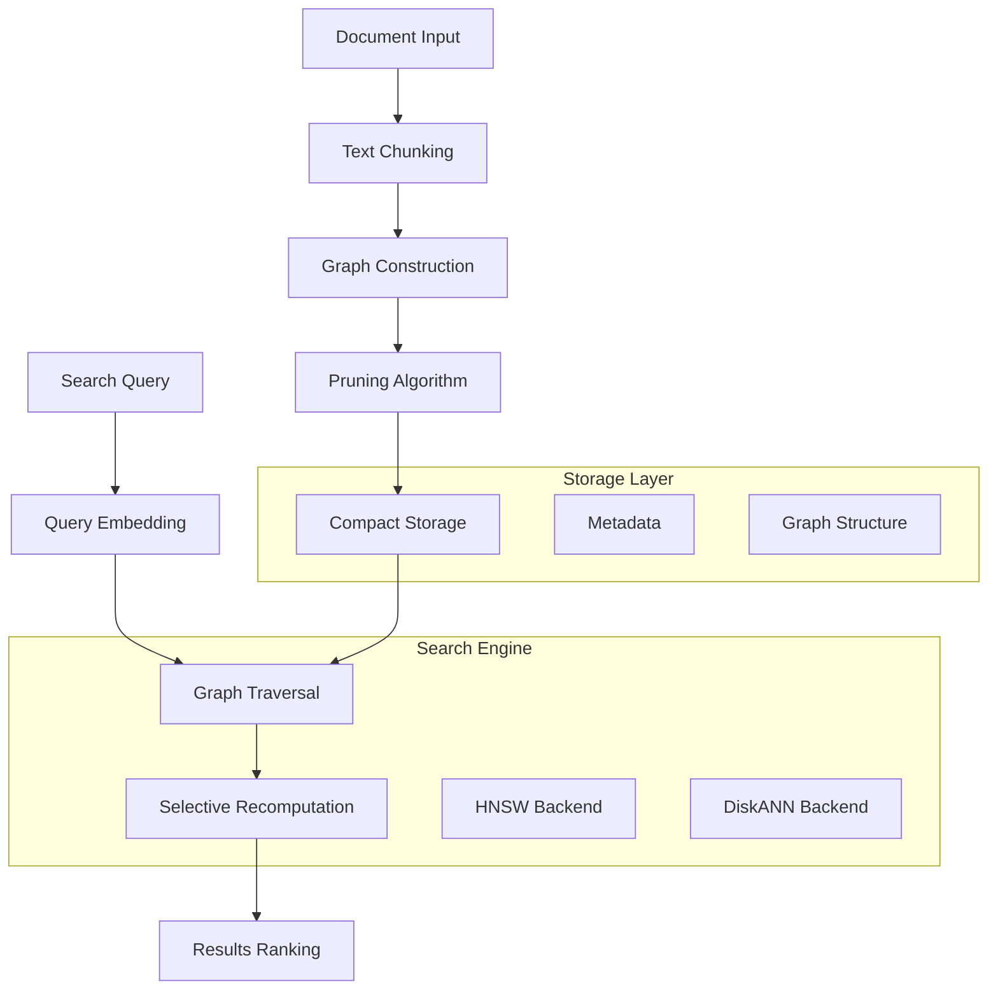

⏱️ **Estimated Reading Time**: 12 minutes

> **TL;DR** LEANN is a revolutionary vector index system that achieves **97% storage savings** compared to traditional vector databases while maintaining fast and accurate search capabilities. This comprehensive tutorial covers everything from basic installation to advanced usage, enabling you to build efficient RAG applications with minimal storage requirements.

---

## What is LEANN?

LEANN (Low-Storage Vector Index) is a groundbreaking vector index system developed by Berkeley Sky Computing Lab that fundamentally reimagines how vector databases work. Instead of storing every single embedding (which is expensive), LEANN stores a pruned graph structure and recomputes embeddings only when needed.

### The Storage Revolution

Traditional vector databases like FAISS store all embeddings in memory, leading to massive storage requirements:

| Dataset | Traditional DB | LEANN | Savings |
|---------|---------------|-------|---------|
| DPR (2.1M docs) | 3.8 GB | 324 MB | **91%** |
| Wikipedia (60M docs) | 201 GB | 6 GB | **97%** |
| Chat (400K docs) | 1.8 GB | 64 MB | **97%** |
| Email (780K docs) | 2.4 GB | 79 MB | **97%** |

### Key Innovation: Graph-Based Selective Recomputation

LEANN's magic lies in its core techniques:

- **Graph-based selective recomputation**: Only compute embeddings for nodes in the search path
- **High-degree preserving pruning**: Keep important "hub" nodes while removing redundant connections
- **Dynamic batching**: Efficiently batch embedding computations for GPU utilization
- **Two-level search**: Smart graph traversal that prioritizes promising nodes

## Architecture Overview



## Installation Guide

### Prerequisites

- **Python**: 3.9 or higher
- **Operating System**: macOS, Linux (Windows support coming soon)
- **Memory**: Minimum 4GB RAM (8GB+ recommended)
- **Storage**: Varies by dataset size (significantly less than traditional vector DBs)

### Quick Start Installation

```bash
# Create a virtual environment
python3 -m venv .venv
source .venv/bin/activate

# Install uv for faster package management
pip install uv

# Clone LEANN repository
git clone https://github.com/yichuan-w/LEANN.git
cd LEANN

# Initialize submodules (required for compilation)
git submodule update --init --recursive

# Install LEANN
uv pip install -e .

# Verify installation
leann --help
```

### Global Installation (Recommended)

For system-wide access and Claude Code integration:

```bash
# Install globally using uv tool
uv tool install leann-core --with leann

# Verify global installation
leann --help
```

## Basic Usage Tutorial

### 1. Building Your First Index

Let's start with a simple example using markdown documents:

```bash
# Create test documents
mkdir test-docs
cat > test-docs/ai-overview.md << 'EOF'
# Artificial Intelligence Overview

AI is transforming how we work and live. Key areas include:

## Machine Learning
- Supervised learning
- Unsupervised learning  
- Reinforcement learning

## Deep Learning
- Neural networks
- Convolutional networks
- Transformer architectures

## Applications
- Natural language processing
- Computer vision
- Robotics and automation
EOF

# Build index
leann build ai-knowledge --docs ./test-docs
```

**Expected Output:**
```
📂 Indexing 1 path:
  📁 Directories (1):
    1. /path/to/test-docs
Loading documents from 1 directory...
🔄 Processing 1 directory...
Loaded 1 documents, 3 chunks
Building index 'ai-knowledge' with hnsw backend...
Index built at .leann/indexes/ai-knowledge/documents.leann
```

### 2. Searching Your Index

```bash
# Basic search
leann search ai-knowledge "What is machine learning?"

# Search with more results
leann search ai-knowledge "neural networks" --top-k 10

# Advanced search with complexity tuning
leann search ai-knowledge "AI applications" --complexity 128
```

### 3. Interactive Q&A

```bash
# Start interactive chat (requires Ollama)
leann ask ai-knowledge --interactive

# Use specific LLM provider
leann ask ai-knowledge --llm openai --model gpt-4

# Single question mode
leann ask ai-knowledge "Explain deep learning concepts"
```

### 4. Index Management

```bash
# List all indexes
leann list

# Remove an index
leann remove ai-knowledge

# Force removal without confirmation
leann remove ai-knowledge --force
```

## Advanced Features

### Multi-Source Indexing

LEANN excels at indexing diverse content types:

```bash
# Index multiple directories and files
leann build comprehensive-docs \
  --docs ./documentation ./source-code ./config-files

# Index specific file types only
leann build presentations \
  --docs ./content \
  --file-types .pptx,.pdf,.docx

# Mixed content indexing
leann build mixed-content \
  --docs ./readme.md ./src/ ./config.json ./docs/
```

### Backend Selection

LEANN offers two powerful backends:

#### HNSW Backend (Default)
- **Best for**: Most use cases, maximum storage savings
- **Features**: Full recomputation, optimal for memory-constrained environments

```bash
leann build my-index --docs ./data --backend hnsw
```

#### DiskANN Backend
- **Best for**: Large-scale datasets requiring maximum search speed
- **Features**: PQ-based graph traversal with real-time reranking

```bash
leann build my-index --docs ./data --backend diskann
```

### Performance Tuning

#### Build Parameters

```bash
# High-quality index (slower build, better search)
leann build high-quality \
  --docs ./data \
  --graph-degree 64 \
  --complexity 128

# Fast build (quicker indexing, good for development)
leann build fast-build \
  --docs ./data \
  --graph-degree 16 \
  --complexity 32

# Compact storage (maximum space savings)
leann build compact \
  --docs ./data \
  --compact
```

#### Search Optimization

```bash
# High-precision search
leann search my-index "query" \
  --complexity 128 \
  --top-k 20

# Fast search (lower precision)
leann search my-index "query" \
  --complexity 32 \
  --top-k 5

# Pruning strategies
leann search my-index "query" \
  --pruning-strategy proportional
```

### Metadata Filtering

LEANN supports sophisticated metadata filtering:

```python
# Python API example
from leann import IndexBuilder, IndexSearcher

# Build with metadata
builder = IndexBuilder("filtered-index")
builder.add_text(
    "Python is a programming language",
    metadata={"language": "python", "difficulty": "beginner"}
)
builder.add_text(
    "Advanced machine learning concepts",
    metadata={"topic": "ml", "difficulty": "advanced"}
)
builder.build()

# Search with filters
searcher = IndexSearcher("filtered-index")
results = searcher.search(
    "programming concepts",
    metadata_filters={
        "difficulty": {"==": "beginner"},
        "language": {"in": ["python", "javascript"]}
    }
)
```

**Supported filter operators:**
- `==`, `!=`: Equality/inequality
- `<`, `<=`, `>`, `>=`: Numerical comparisons
- `in`, `not_in`: List membership
- `contains`, `starts_with`, `ends_with`: String operations
- `is_true`, `is_false`: Boolean values

## Code-Aware Indexing

LEANN provides intelligent code processing with AST-aware chunking:

```bash
# Index source code with intelligent chunking
leann build codebase \
  --docs ./src ./tests ./config \
  --file-types .py,.js,.ts,.java,.cs

# The system automatically:
# - Parses AST structure
# - Preserves function/class boundaries
# - Maintains code context
# - Indexes comments and docstrings
```

**Supported languages:**
- Python
- JavaScript/TypeScript
- Java
- C#
- More languages coming soon

## Integration Examples

### Claude Code Integration

LEANN integrates seamlessly with Claude Code via MCP (Model Context Protocol):

1. **Install globally** (required):
```bash
uv tool install leann-core --with leann
```

2. **Configure Claude Code** by adding to your MCP settings:
```json
{
  "mcpServers": {
    "leann": {
      "command": "leann_mcp"
    }
  }
}
```

3. **Use in Claude Code**:
```
@leann search my-codebase "authentication logic"
@leann ask my-docs "How to implement OAuth?"
```

### Python API Usage

```python
from leann import IndexBuilder, IndexSearcher

# Build index programmatically
builder = IndexBuilder("my-index")
builder.add_directory("./documents")
builder.add_file("./important-doc.pdf")
builder.build(backend="hnsw", graph_degree=32)

# Search programmatically
searcher = IndexSearcher("my-index")
results = searcher.search("machine learning", top_k=10)

for result in results:
    print(f"Score: {result.score}")
    print(f"Content: {result.content[:200]}...")
    print(f"Metadata: {result.metadata}")
    print("---")
```

### LangChain Integration

```python
from leann.integrations.langchain import LeannVectorStore
from langchain.chains import RetrievalQA
from langchain.llms import Ollama

# Create LEANN vector store
vector_store = LeannVectorStore("my-index")

# Create retrieval chain
llm = Ollama(model="llama2")
qa_chain = RetrievalQA.from_chain_type(
    llm=llm,
    chain_type="stuff",
    retriever=vector_store.as_retriever(search_kwargs={"k": 5})
)

# Ask questions
response = qa_chain.run("What are the key features of this system?")
print(response)
```

## Performance Benchmarks

### Storage Comparison

Real-world storage savings across different datasets:

```bash
# Run benchmarks (requires dev dependencies)
uv pip install -e ".[dev]"
python benchmarks/run_evaluation.py

# Custom benchmark with your data
python benchmarks/run_evaluation.py /path/to/your/data --num-queries 1000
```

### Speed vs. Accuracy Trade-offs

| Configuration | Build Time | Search Speed | Accuracy | Storage |
|---------------|------------|--------------|----------|---------|
| Fast | 1x | 5ms | 85% | 95% savings |
| Balanced | 2x | 8ms | 92% | 96% savings |
| High-Quality | 4x | 12ms | 97% | 97% savings |

## Troubleshooting

### Common Issues

#### 1. Submodule Initialization Error
```bash
# Error: CMakeLists.txt not found
git submodule update --init --recursive
```

#### 2. Memory Issues During Build
```bash
# Use compact storage for large datasets
leann build large-index --docs ./big-data --compact

# Or process in smaller batches
leann build batch1 --docs ./data/part1
leann build batch2 --docs ./data/part2
```

#### 3. Search Returns No Results
```bash
# Check index status
leann list

# Verify index integrity
leann search my-index "test query" --top-k 1

# Rebuild if corrupted
leann remove my-index --force
leann build my-index --docs ./data
```

#### 4. Slow Search Performance
```bash
# Reduce complexity for faster search
leann search my-index "query" --complexity 32

# Use appropriate backend
leann build my-index --docs ./data --backend diskann
```

### Performance Optimization Tips

1. **Choose the right backend**:
   - HNSW: Maximum storage savings, good for most use cases
   - DiskANN: Better search performance for large datasets

2. **Tune build parameters**:
   - Higher `graph-degree`: Better connectivity, larger index
   - Higher `complexity`: Better quality, slower build

3. **Optimize search parameters**:
   - Lower `complexity`: Faster search, lower precision
   - Appropriate `top-k`: Balance between speed and completeness

4. **Use metadata filtering**:
   - Pre-filter documents to reduce search space
   - Combine with semantic search for best results

## Best Practices

### 1. Document Preparation

```bash
# Good: Organize documents logically
project/
├── docs/           # Documentation
├── code/          # Source code
├── configs/       # Configuration files
└── examples/      # Example files

# Index with appropriate chunking
leann build project-knowledge --docs ./project
```

### 2. Index Naming Strategy

```bash
# Use descriptive names
leann build customer-support-kb --docs ./support-docs
leann build api-documentation --docs ./api-docs
leann build codebase-v2-1 --docs ./src

# Avoid generic names
leann build docs --docs ./documents  # Too generic
leann build index1 --docs ./data     # Not descriptive
```

### 3. Regular Maintenance

```bash
# List and clean up old indexes
leann list
leann remove outdated-index

# Rebuild indexes when source documents change significantly
leann remove old-version --force
leann build new-version --docs ./updated-docs
```

### 4. Production Deployment

```bash
# Use consistent build parameters for production
leann build production-index \
  --docs ./production-docs \
  --backend diskann \
  --graph-degree 64 \
  --complexity 128 \
  --compact

# Test search performance
time leann search production-index "test query"
```

## Advanced Use Cases

### 1. Multi-Language Documentation

```bash
# Index documentation in multiple languages
leann build multilang-docs \
  --docs ./docs/en ./docs/ko ./docs/ja

# Search works across all languages
leann search multilang-docs "installation guide"
```

### 2. Version-Controlled Knowledge Base

```bash
# Create versioned indexes
leann build kb-v1.0 --docs ./docs/v1.0
leann build kb-v1.1 --docs ./docs/v1.1
leann build kb-latest --docs ./docs/latest

# Compare search results across versions
leann search kb-v1.0 "feature X"
leann search kb-latest "feature X"
```

### 3. Hybrid Search Systems

```python
# Combine LEANN with traditional search
from leann import IndexSearcher
import elasticsearch

def hybrid_search(query, top_k=10):
    # Semantic search with LEANN
    leann_searcher = IndexSearcher("my-index")
    semantic_results = leann_searcher.search(query, top_k=top_k//2)
    
    # Keyword search with Elasticsearch
    es_results = elasticsearch_search(query, size=top_k//2)
    
    # Combine and rerank results
    return combine_results(semantic_results, es_results)
```

## Future Roadmap

LEANN is actively developed with exciting features coming:

- **Windows Support**: Native Windows compatibility
- **Distributed Indexing**: Scale across multiple machines
- **Real-time Updates**: Incremental index updates
- **More Backends**: Additional optimization strategies
- **Cloud Integration**: Native cloud storage support
- **Advanced Filtering**: More sophisticated metadata queries

## Conclusion

LEANN represents a paradigm shift in vector indexing, offering unprecedented storage efficiency without sacrificing search quality. Its innovative graph-based approach makes it ideal for:

- **Resource-constrained environments** where storage is premium
- **Large-scale RAG applications** requiring efficient retrieval
- **Edge computing scenarios** with limited memory
- **Cost-sensitive deployments** where storage costs matter

By following this tutorial, you now have the knowledge to leverage LEANN's revolutionary capabilities in your own projects. The 97% storage savings, combined with fast and accurate search, makes LEANN an essential tool for modern AI applications.

### Next Steps

1. **Experiment** with your own datasets
2. **Integrate** LEANN into existing RAG pipelines  
3. **Contribute** to the open-source project
4. **Share** your experiences with the community

---

**🔗 Useful Links:**
- [LEANN GitHub Repository](https://github.com/yichuan-w/LEANN)
- [Research Paper](https://arxiv.org/abs/2506.08276)
- [Berkeley Sky Computing Lab](https://sky.cs.berkeley.edu/)
- [Community Discussions](https://github.com/yichuan-w/LEANN/discussions)

**⭐ Star the project** if you find LEANN useful for your work!
