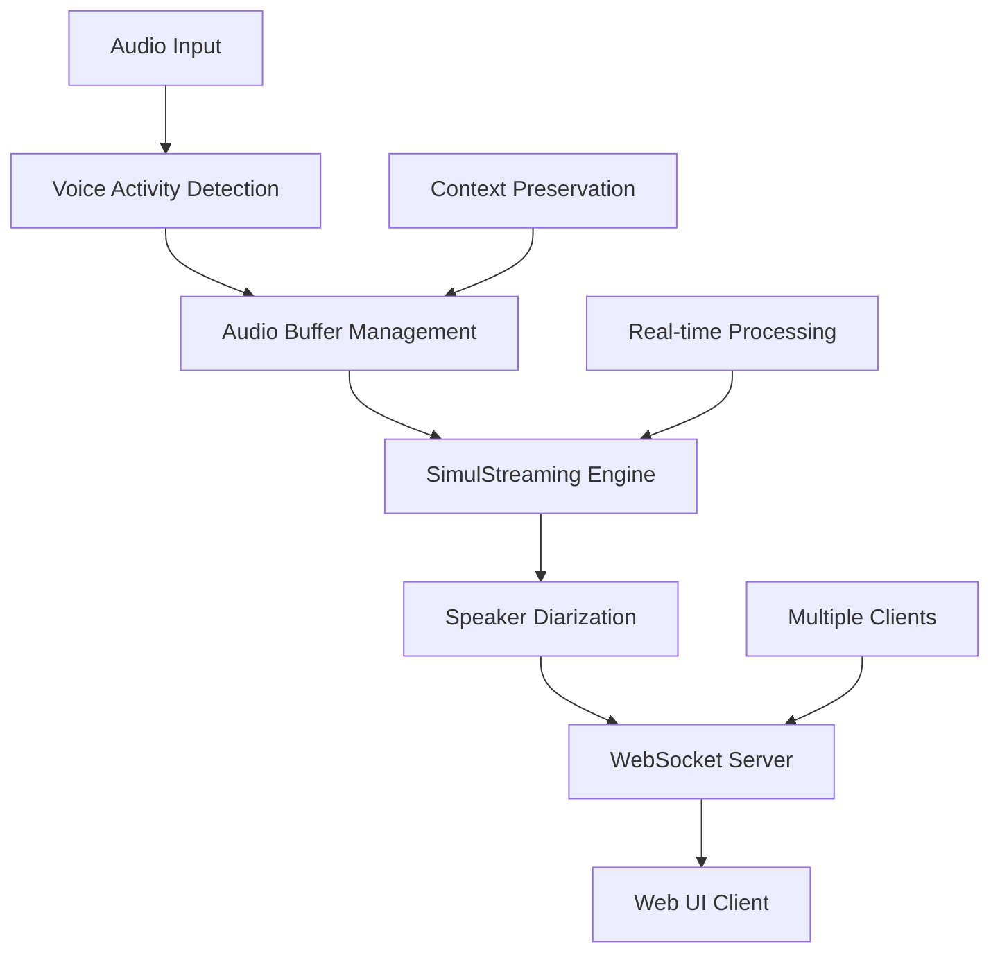

⏱️ **Estimated Reading Time**: 15 minutes

## Introduction

Real-time speech recognition has evolved dramatically with the emergence of streaming-optimized models and advanced research breakthroughs. **WhisperLiveKit** represents the state-of-the-art in real-time speech transcription, combining cutting-edge research from SimulStreaming (SOTA 2025), WhisperStreaming (SOTA 2023), and advanced speaker diarization systems.

Unlike traditional batch-processing approaches that struggle with real-time constraints, WhisperLiveKit leverages intelligent buffering, incremental processing, and voice activity detection to deliver ultra-low latency transcription directly to your browser.

This comprehensive guide will walk you through implementing WhisperLiveKit for production-ready real-time speech applications, from basic setup to advanced features like speaker identification and multi-user support.

## Why WhisperLiveKit Over Standard Whisper?

### The Real-Time Challenge

Standard Whisper models are designed for complete utterances, not real-time audio chunks. Processing small segments leads to:

- **Context Loss**: Missing conversational flow and sentence boundaries
- **Word Fragmentation**: Cutting off words mid-syllable
- **Poor Accuracy**: Degraded transcription quality on incomplete audio
- **High Latency**: Batch processing delays

### WhisperLiveKit's Innovation

WhisperLiveKit solves these challenges through:

```python
# Traditional Approach (Problematic)
def process_audio_chunk(chunk):
    return whisper.transcribe(chunk)  # Loses context, poor quality

# WhisperLiveKit Approach (Optimized)
def process_streaming_audio(stream):
    # Intelligent buffering with context preservation
    # Voice Activity Detection for efficiency
    # SimulStreaming for ultra-low latency
    # Incremental processing with LocalAgreement
    return optimized_transcription
```

## Core Technologies and Architecture

### State-of-the-Art Research Integration

**SimulStreaming (SOTA 2025)**:
- Ultra-low latency transcription with AlignAtt policy
- Frame-level attention guidance for optimal processing timing
- Advanced beam search optimization

**WhisperStreaming (SOTA 2023)**:
- LocalAgreement policy for consistent streaming output
- Intelligent buffer management and trimming strategies

**Advanced Speaker Diarization**:
- Streaming Sortformer (SOTA 2025) for real-time speaker identification
- Diart (SOTA 2021) integration for production environments

**Enterprise-Grade VAD**:
- Silero VAD (2024) for accurate voice activity detection
- Reduces computational overhead during silence periods

### System Architecture



The architecture supports multiple concurrent users with intelligent resource management and voice activity detection to optimize performance.

## Installation and Setup

### Prerequisites

**System Requirements**:
- Python 3.8+
- FFmpeg (required for audio processing)
- 4GB+ RAM (8GB+ recommended for larger models)
- Optional: NVIDIA GPU for accelerated processing

### FFmpeg Installation

```bash
# macOS
brew install ffmpeg

# Ubuntu/Debian
sudo apt install ffmpeg

# Windows
# Download from https://ffmpeg.org/download.html and add to PATH
```

### WhisperLiveKit Installation

```bash
# Create isolated environment
python3 -m venv whisperlivekit-env
source whisperlivekit-env/bin/activate  # On Windows: whisperlivekit-env\Scripts\activate

# Install WhisperLiveKit
pip install whisperlivekit

# Verify installation
whisperlivekit-server --help
```

## Quick Start Guide

### Basic Server Launch

```bash
# Start with default settings (small model, auto language detection)
whisperlivekit-server --model base --language en

# Server starts on http://localhost:8000
# Web UI automatically available at the same address
```

### Testing the Installation

1. **Start the server**:
```bash
whisperlivekit-server --model tiny --language en --host localhost --port 8000
```

2. **Open your browser** and navigate to `http://localhost:8000`

3. **Grant microphone permissions** when prompted

4. **Start speaking** and watch real-time transcription appear

### Verification Script

```python
# test_whisperlivekit.py
import asyncio
import websockets
import json
import pyaudio
import wave

async def test_websocket_connection():
    """Test WebSocket connection to WhisperLiveKit server"""
    uri = "ws://localhost:8000/ws"
    
    try:
        async with websockets.connect(uri) as websocket:
            print("✅ WebSocket connection successful")
            
            # Send test message
            test_message = {
                "type": "audio_chunk",
                "data": "test_audio_data"
            }
            
            await websocket.send(json.dumps(test_message))
            response = await websocket.recv()
            print(f"📨 Server response: {response}")
            
    except Exception as e:
        print(f"❌ Connection failed: {e}")

# Run test
asyncio.run(test_websocket_connection())
```

## Advanced Configuration

### Model Selection and Performance

```bash
# Ultra-fast processing (lower accuracy)
whisperlivekit-server --model tiny --language en

# Balanced performance (recommended for most use cases)
whisperlivekit-server --model base --language en

# High accuracy (requires more resources)
whisperlivekit-server --model large-v3 --language en

# Multilingual support with auto-detection
whisperlivekit-server --model base --language auto
```

### Backend Selection

```bash
# SimulStreaming (SOTA 2025) - Ultra-low latency
whisperlivekit-server --backend simulstreaming --model base

# Faster-Whisper - Optimized performance
whisperlivekit-server --backend faster-whisper --model base

# WhisperStreaming - LocalAgreement policy
whisperlivekit-server --backend whisper_timestamped --model base
```

### SimulStreaming Advanced Configuration

```bash
# Fine-tune latency vs accuracy
whisperlivekit-server \
  --backend simulstreaming \
  --model base \
  --frame-threshold 25 \
  --beams 1 \
  --audio-max-len 30.0 \
  --never-fire
```

**Key Parameters**:
- `--frame-threshold`: Lower = faster, higher = more accurate (default: 25)
- `--beams`: Beam search beams (1 = greedy, >1 = beam search)
- `--audio-max-len`: Maximum audio buffer length in seconds
- `--never-fire`: Never truncate incomplete words

## Speaker Diarization Setup

### Basic Speaker Identification

```bash
# Enable speaker diarization with Sortformer (SOTA 2025)
whisperlivekit-server \
  --model base \
  --language en \
  --diarization \
  --diarization-backend sortformer
```

### Advanced Diarization with Diart

```bash
# Diart backend with custom models
whisperlivekit-server \
  --model base \
  --language en \
  --diarization \
  --diarization-backend diart \
  --segmentation-model pyannote/segmentation-3.0 \
  --embedding-model speechbrain/spkrec-ecapa-voxceleb
```

### Hugging Face Authentication for Pyannote

```bash
# Required for pyannote.audio models
pip install huggingface_hub
huggingface-cli login

# Accept user conditions for required models:
# 1. pyannote/segmentation
# 2. pyannote/segmentation-3.0  
# 3. pyannote/embedding
```

## Production Deployment

### Docker Deployment

**GPU-Accelerated Container**:
```dockerfile
# Dockerfile
FROM nvidia/cuda:11.8-runtime-ubuntu20.04

RUN apt-get update && apt-get install -y \
    python3 python3-pip ffmpeg \
    && rm -rf /var/lib/apt/lists/*

RUN pip install whisperlivekit

EXPOSE 8000

CMD ["whisperlivekit-server", "--model", "base", "--language", "en", "--host", "0.0.0.0"]
```

```bash
# Build and run
docker build -t whisperlivekit .
docker run --gpus all -p 8000:8000 whisperlivekit
```

**CPU-Only Container**:
```bash
# Use pre-built CPU image
docker run -p 8000:8000 whisperlivekit/cpu:latest
```

### Production Server Configuration

```bash
# Production-ready configuration
whisperlivekit-server \
  --model base \
  --language en \
  --host 0.0.0.0 \
  --port 8000 \
  --ssl-certfile /path/to/cert.pem \
  --ssl-keyfile /path/to/key.pem \
  --diarization \
  --preloaded_model_count 4 \
  --min-chunk-size 1.0 \
  --buffer_trimming sentence
```

### Load Balancing with Nginx

```nginx
# /etc/nginx/sites-available/whisperlivekit
upstream whisperlivekit_backend {
    server 127.0.0.1:8000;
    server 127.0.0.1:8001;
    server 127.0.0.1:8002;
    server 127.0.0.1:8003;
}

server {
    listen 80;
    server_name your-domain.com;

    location / {
        proxy_pass http://whisperlivekit_backend;
        proxy_set_header Upgrade $http_upgrade;
        proxy_set_header Connection "upgrade";
        proxy_set_header Host $host;
        proxy_set_header X-Real-IP $remote_addr;
        proxy_set_header X-Forwarded-For $proxy_add_x_forwarded_for;
    }
}
```

## Custom Web Integration

### Basic WebSocket Client

```javascript
// whisperlivekit-client.js
class WhisperLiveKitClient {
    constructor(serverUrl = 'ws://localhost:8000/ws') {
        this.serverUrl = serverUrl;
        this.websocket = null;
        this.mediaRecorder = null;
        this.audioContext = null;
    }

    async connect() {
        try {
            this.websocket = new WebSocket(this.serverUrl);
            
            this.websocket.onopen = () => {
                console.log('✅ Connected to WhisperLiveKit');
                this.startAudioCapture();
            };

            this.websocket.onmessage = (event) => {
                const data = JSON.parse(event.data);
                this.handleTranscription(data);
            };

            this.websocket.onerror = (error) => {
                console.error('❌ WebSocket error:', error);
            };

        } catch (error) {
            console.error('Connection failed:', error);
        }
    }

    async startAudioCapture() {
        try {
            const stream = await navigator.mediaDevices.getUserMedia({ 
                audio: {
                    sampleRate: 16000,
                    channelCount: 1,
                    echoCancellation: true,
                    noiseSuppression: true
                } 
            });

            this.audioContext = new AudioContext({ sampleRate: 16000 });
            const source = this.audioContext.createMediaStreamSource(stream);
            
            // Process audio in real-time
            this.processAudioStream(source);

        } catch (error) {
            console.error('Microphone access denied:', error);
        }
    }

    processAudioStream(source) {
        const processor = this.audioContext.createScriptProcessor(4096, 1, 1);
        
        processor.onaudioprocess = (event) => {
            const audioData = event.inputBuffer.getChannelData(0);
            
            // Convert to 16-bit PCM
            const pcmData = new Int16Array(audioData.length);
            for (let i = 0; i < audioData.length; i++) {
                pcmData[i] = Math.max(-32768, Math.min(32767, audioData[i] * 32768));
            }

            // Send to server
            if (this.websocket && this.websocket.readyState === WebSocket.OPEN) {
                this.websocket.send(pcmData.buffer);
            }
        };

        source.connect(processor);
        processor.connect(this.audioContext.destination);
    }

    handleTranscription(data) {
        if (data.type === 'transcription') {
            this.displayTranscription(data.text, data.speaker);
        }
    }

    displayTranscription(text, speaker = null) {
        const transcriptionDiv = document.getElementById('transcription');
        const timestamp = new Date().toLocaleTimeString();
        
        const entry = document.createElement('div');
        entry.className = 'transcription-entry';
        entry.innerHTML = `
            <span class="timestamp">${timestamp}</span>
            ${speaker ? `<span class="speaker">Speaker ${speaker}:</span>` : ''}
            <span class="text">${text}</span>
        `;
        
        transcriptionDiv.appendChild(entry);
        transcriptionDiv.scrollTop = transcriptionDiv.scrollHeight;
    }
}

// Usage
const client = new WhisperLiveKitClient();
client.connect();
```

### React Integration

```jsx
// WhisperLiveKitComponent.jsx
import React, { useState, useEffect, useRef } from 'react';

const WhisperLiveKitComponent = () => {
    const [transcriptions, setTranscriptions] = useState([]);
    const [isConnected, setIsConnected] = useState(false);
    const [isRecording, setIsRecording] = useState(false);
    const websocketRef = useRef(null);
    const mediaRecorderRef = useRef(null);

    useEffect(() => {
        connectToServer();
        return () => {
            if (websocketRef.current) {
                websocketRef.current.close();
            }
        };
    }, []);

    const connectToServer = () => {
        const ws = new WebSocket('ws://localhost:8000/ws');
        
        ws.onopen = () => {
            setIsConnected(true);
            console.log('Connected to WhisperLiveKit');
        };

        ws.onmessage = (event) => {
            const data = JSON.parse(event.data);
            if (data.type === 'transcription') {
                setTranscriptions(prev => [...prev, {
                    id: Date.now(),
                    text: data.text,
                    speaker: data.speaker,
                    timestamp: new Date().toLocaleTimeString()
                }]);
            }
        };

        ws.onclose = () => {
            setIsConnected(false);
            console.log('Disconnected from WhisperLiveKit');
        };

        websocketRef.current = ws;
    };

    const startRecording = async () => {
        try {
            const stream = await navigator.mediaDevices.getUserMedia({ 
                audio: {
                    sampleRate: 16000,
                    channelCount: 1,
                    echoCancellation: true,
                    noiseSuppression: true
                }
            });

            const mediaRecorder = new MediaRecorder(stream, {
                mimeType: 'audio/webm;codecs=opus'
            });

            mediaRecorder.ondataavailable = (event) => {
                if (event.data.size > 0 && websocketRef.current?.readyState === WebSocket.OPEN) {
                    websocketRef.current.send(event.data);
                }
            };

            mediaRecorder.start(100); // Send data every 100ms
            mediaRecorderRef.current = mediaRecorder;
            setIsRecording(true);

        } catch (error) {
            console.error('Failed to start recording:', error);
        }
    };

    const stopRecording = () => {
        if (mediaRecorderRef.current) {
            mediaRecorderRef.current.stop();
            mediaRecorderRef.current = null;
            setIsRecording(false);
        }
    };

    return (
        <div className="whisperlivekit-container">
            <div className="controls">
                <div className={`status ${isConnected ? 'connected' : 'disconnected'}`}>
                    {isConnected ? '🟢 Connected' : '🔴 Disconnected'}
                </div>
                
                <button 
                    onClick={isRecording ? stopRecording : startRecording}
                    disabled={!isConnected}
                    className={`record-button ${isRecording ? 'recording' : ''}`}
                >
                    {isRecording ? '⏹️ Stop Recording' : '🎤 Start Recording'}
                </button>
            </div>

            <div className="transcriptions">
                <h3>Real-time Transcription</h3>
                <div className="transcription-list">
                    {transcriptions.map(item => (
                        <div key={item.id} className="transcription-item">
                            <span className="timestamp">{item.timestamp}</span>
                            {item.speaker && <span className="speaker">Speaker {item.speaker}:</span>}
                            <span className="text">{item.text}</span>
                        </div>
                    ))}
                </div>
            </div>
        </div>
    );
};

export default WhisperLiveKitComponent;
```

## Performance Optimization

### Model Selection Strategy

```python
# performance_config.py
PERFORMANCE_CONFIGS = {
    'ultra_fast': {
        'model': 'tiny',
        'backend': 'simulstreaming',
        'frame_threshold': 15,
        'beams': 1,
        'min_chunk_size': 0.5
    },
    'balanced': {
        'model': 'base',
        'backend': 'simulstreaming', 
        'frame_threshold': 25,
        'beams': 1,
        'min_chunk_size': 1.0
    },
    'high_accuracy': {
        'model': 'large-v3',
        'backend': 'faster-whisper',
        'beams': 5,
        'min_chunk_size': 2.0
    }
}

def get_optimal_config(use_case):
    """Select optimal configuration based on use case"""
    if use_case == 'live_streaming':
        return PERFORMANCE_CONFIGS['ultra_fast']
    elif use_case == 'meeting_transcription':
        return PERFORMANCE_CONFIGS['balanced']
    elif use_case == 'legal_documentation':
        return PERFORMANCE_CONFIGS['high_accuracy']
```

### Resource Management

```bash
# Multi-instance deployment for high concurrency
# Instance 1: Ultra-fast processing
whisperlivekit-server --model tiny --port 8001 --preloaded_model_count 2

# Instance 2: Balanced processing  
whisperlivekit-server --model base --port 8002 --preloaded_model_count 2

# Instance 3: High-accuracy processing
whisperlivekit-server --model large-v3 --port 8003 --preloaded_model_count 1
```

## Troubleshooting Guide

### Common Issues and Solutions

**1. Server Won't Start**
```bash
# Check FFmpeg installation
ffmpeg -version

# Verify Python environment
python -c "import whisperlivekit; print('✅ Installation OK')"

# Check port availability
lsof -i :8000
```

**2. Poor Transcription Quality**
```bash
# Increase model size
whisperlivekit-server --model base  # Instead of tiny

# Adjust chunk size
whisperlivekit-server --min-chunk-size 2.0

# Enable confidence validation
whisperlivekit-server --confidence-validation
```

**3. High Latency Issues**
```bash
# Use SimulStreaming backend
whisperlivekit-server --backend simulstreaming --frame-threshold 15

# Reduce audio buffer
whisperlivekit-server --audio-max-len 15.0

# Enable VAD optimization
whisperlivekit-server --vac-chunk-size 0.5
```

**4. WebSocket Connection Issues**
```javascript
// Add connection retry logic
class RobustWhisperClient {
    constructor(serverUrl) {
        this.serverUrl = serverUrl;
        this.reconnectAttempts = 0;
        this.maxReconnectAttempts = 5;
    }

    connect() {
        this.websocket = new WebSocket(this.serverUrl);
        
        this.websocket.onclose = () => {
            if (this.reconnectAttempts < this.maxReconnectAttempts) {
                setTimeout(() => {
                    this.reconnectAttempts++;
                    this.connect();
                }, 1000 * this.reconnectAttempts);
            }
        };
    }
}
```

### Performance Monitoring

```python
# monitoring.py
import psutil
import time
import requests

def monitor_whisperlivekit_performance():
    """Monitor WhisperLiveKit server performance"""
    while True:
        try:
            # Check server health
            response = requests.get('http://localhost:8000/health', timeout=5)
            
            # Monitor system resources
            cpu_percent = psutil.cpu_percent(interval=1)
            memory_percent = psutil.virtual_memory().percent
            
            print(f"🖥️  CPU: {cpu_percent}% | 💾 Memory: {memory_percent}%")
            
            if cpu_percent > 80:
                print("⚠️  High CPU usage detected")
            
            if memory_percent > 80:
                print("⚠️  High memory usage detected")
                
        except Exception as e:
            print(f"❌ Health check failed: {e}")
        
        time.sleep(10)

if __name__ == "__main__":
    monitor_whisperlivekit_performance()
```

## Real-World Use Cases

### 1. Live Meeting Transcription

```python
# meeting_transcriber.py
import asyncio
import websockets
import json
from datetime import datetime

class MeetingTranscriber:
    def __init__(self):
        self.transcriptions = []
        self.meeting_id = datetime.now().strftime("%Y%m%d_%H%M%S")
    
    async def start_meeting_transcription(self):
        uri = "ws://localhost:8000/ws"
        
        async with websockets.connect(uri) as websocket:
            print(f"📝 Meeting transcription started: {self.meeting_id}")
            
            async for message in websocket:
                data = json.loads(message)
                
                if data['type'] == 'transcription':
                    entry = {
                        'timestamp': datetime.now().isoformat(),
                        'speaker': data.get('speaker', 'Unknown'),
                        'text': data['text']
                    }
                    
                    self.transcriptions.append(entry)
                    print(f"[{entry['timestamp']}] Speaker {entry['speaker']}: {entry['text']}")
    
    def export_meeting_notes(self):
        """Export meeting transcription to file"""
        filename = f"meeting_{self.meeting_id}.json"
        with open(filename, 'w') as f:
            json.dump(self.transcriptions, f, indent=2)
        print(f"📄 Meeting notes exported to {filename}")

# Usage
transcriber = MeetingTranscriber()
asyncio.run(transcriber.start_meeting_transcription())
```

### 2. Customer Service Call Analysis

```python
# call_analyzer.py
import re
from collections import Counter

class CallAnalyzer:
    def __init__(self):
        self.sentiment_keywords = {
            'positive': ['great', 'excellent', 'satisfied', 'happy', 'good'],
            'negative': ['terrible', 'awful', 'disappointed', 'angry', 'bad'],
            'neutral': ['okay', 'fine', 'average', 'normal']
        }
    
    def analyze_call_transcription(self, transcriptions):
        """Analyze customer service call for insights"""
        analysis = {
            'total_duration': len(transcriptions),
            'speaker_distribution': Counter(),
            'sentiment_analysis': {'positive': 0, 'negative': 0, 'neutral': 0},
            'key_topics': [],
            'action_items': []
        }
        
        for entry in transcriptions:
            speaker = entry['speaker']
            text = entry['text'].lower()
            
            # Speaker distribution
            analysis['speaker_distribution'][speaker] += 1
            
            # Sentiment analysis
            for sentiment, keywords in self.sentiment_keywords.items():
                if any(keyword in text for keyword in keywords):
                    analysis['sentiment_analysis'][sentiment] += 1
            
            # Extract action items
            if any(phrase in text for phrase in ['will follow up', 'will send', 'will call back']):
                analysis['action_items'].append(entry)
        
        return analysis
    
    def generate_call_summary(self, analysis):
        """Generate executive summary of the call"""
        summary = f"""
        📞 Call Analysis Summary
        ========================
        Total Interactions: {analysis['total_duration']}
        
        Speaker Distribution:
        {dict(analysis['speaker_distribution'])}
        
        Sentiment Analysis:
        - Positive: {analysis['sentiment_analysis']['positive']}
        - Negative: {analysis['sentiment_analysis']['negative']}  
        - Neutral: {analysis['sentiment_analysis']['neutral']}
        
        Action Items: {len(analysis['action_items'])}
        """
        
        return summary
```

### 3. Accessibility Integration

```javascript
// accessibility_integration.js
class AccessibilityTranscriber {
    constructor() {
        this.isHighContrast = false;
        this.fontSize = 'medium';
        this.speechRate = 1.0;
    }

    setupAccessibilityFeatures() {
        // High contrast mode
        this.addHighContrastToggle();
        
        // Font size controls
        this.addFontSizeControls();
        
        // Text-to-speech for transcriptions
        this.addTextToSpeech();
        
        // Keyboard navigation
        this.addKeyboardShortcuts();
    }

    addHighContrastToggle() {
        const toggle = document.createElement('button');
        toggle.textContent = '🎨 High Contrast';
        toggle.onclick = () => {
            this.isHighContrast = !this.isHighContrast;
            document.body.classList.toggle('high-contrast', this.isHighContrast);
        };
        document.getElementById('accessibility-controls').appendChild(toggle);
    }

    addTextToSpeech() {
        const speakButton = document.createElement('button');
        speakButton.textContent = '🔊 Read Aloud';
        speakButton.onclick = () => {
            const transcriptionText = document.getElementById('transcription').textContent;
            const utterance = new SpeechSynthesisUtterance(transcriptionText);
            utterance.rate = this.speechRate;
            speechSynthesis.speak(utterance);
        };
        document.getElementById('accessibility-controls').appendChild(speakButton);
    }

    addKeyboardShortcuts() {
        document.addEventListener('keydown', (event) => {
            // Ctrl+R: Start/Stop recording
            if (event.ctrlKey && event.key === 'r') {
                event.preventDefault();
                this.toggleRecording();
            }
            
            // Ctrl+S: Save transcription
            if (event.ctrlKey && event.key === 's') {
                event.preventDefault();
                this.saveTranscription();
            }
            
            // Ctrl+Plus: Increase font size
            if (event.ctrlKey && event.key === '=') {
                event.preventDefault();
                this.increaseFontSize();
            }
        });
    }
}
```

## Advanced Features and Customization

### Custom Language Models

```python
# custom_model_integration.py
from whisperlivekit import WhisperLiveKitServer

class CustomWhisperServer(WhisperLiveKitServer):
    def __init__(self, custom_model_path):
        super().__init__()
        self.custom_model_path = custom_model_path
    
    def load_custom_model(self):
        """Load domain-specific fine-tuned model"""
        # Implementation for custom model loading
        pass
    
    def apply_domain_specific_processing(self, transcription):
        """Apply domain-specific post-processing"""
        # Medical terminology correction
        medical_corrections = {
            'heart attack': 'myocardial infarction',
            'high blood pressure': 'hypertension'
        }
        
        for term, correction in medical_corrections.items():
            transcription = transcription.replace(term, correction)
        
        return transcription
```

### Integration with External Services

```python
# external_integrations.py
import requests
import json

class ExternalServiceIntegrator:
    def __init__(self):
        self.slack_webhook = "YOUR_SLACK_WEBHOOK_URL"
        self.teams_webhook = "YOUR_TEAMS_WEBHOOK_URL"
    
    async def send_to_slack(self, transcription_data):
        """Send transcription to Slack channel"""
        message = {
            "text": f"🎤 New Transcription",
            "attachments": [{
                "color": "good",
                "fields": [{
                    "title": "Speaker",
                    "value": transcription_data.get('speaker', 'Unknown'),
                    "short": True
                }, {
                    "title": "Text",
                    "value": transcription_data['text'],
                    "short": False
                }]
            }]
        }
        
        response = requests.post(self.slack_webhook, json=message)
        return response.status_code == 200
    
    async def save_to_database(self, transcription_data):
        """Save transcription to database"""
        # Database integration logic
        pass
    
    async def trigger_workflow(self, transcription_data):
        """Trigger automated workflow based on transcription content"""
        # Workflow automation logic
        pass
```

## Conclusion

WhisperLiveKit represents a significant advancement in real-time speech recognition technology, combining state-of-the-art research with practical production-ready features. Through this comprehensive guide, you've learned to:

### Key Achievements

1. **Master Real-Time Speech Processing**: Understand the fundamental differences between batch and streaming speech recognition
2. **Implement Production Systems**: Deploy scalable, multi-user speech transcription services
3. **Advanced Feature Integration**: Leverage speaker diarization, voice activity detection, and custom backends
4. **Performance Optimization**: Configure systems for optimal latency and accuracy trade-offs
5. **Real-World Applications**: Build meeting transcribers, accessibility tools, and customer service analyzers

### Technical Highlights

- **Ultra-Low Latency**: SimulStreaming backend with frame-level attention guidance
- **Enterprise-Grade Features**: Multi-user support, speaker identification, SSL/TLS security
- **Flexible Architecture**: WebSocket-based real-time communication with web UI integration
- **Production Ready**: Docker deployment, load balancing, monitoring, and error handling

### Next Steps

Consider exploring these advanced topics:

- **Custom Model Fine-Tuning**: Adapt models for domain-specific terminology
- **Multi-Modal Integration**: Combine with video processing for comprehensive meeting analysis
- **Edge Deployment**: Optimize for mobile and IoT devices
- **Advanced Analytics**: Implement sentiment analysis and conversation intelligence

WhisperLiveKit's combination of cutting-edge research and practical implementation makes it an ideal choice for building the next generation of voice-enabled applications. Whether you're developing accessibility tools, meeting transcription systems, or customer service analytics, WhisperLiveKit provides the foundation for reliable, scalable real-time speech recognition.

---

**Related Resources**:
- [WhisperLiveKit GitHub Repository](https://github.com/QuentinFuxa/WhisperLiveKit)
- [SimulStreaming Research Paper](https://arxiv.org/abs/2406.03049)
- [Pyannote.audio Documentation](https://github.com/pyannote/pyannote-audio)
- [FastAPI WebSocket Guide](https://fastapi.tiangolo.com/advanced/websockets/)
