⏱️ **Estimated Reading Time**: 18 minutes

## Introduction

Imagine having a tireless AI researcher working 24/7, generating papers, conducting experiments, and pushing the boundaries of scientific discovery while you sleep. With **SakanaAI's AI Scientist** and local LLM infrastructure, this is no longer science fiction—it's a practical reality you can implement today.

This comprehensive guide will walk you through setting up an automated research pipeline using:
- **SakanaAI's AI Scientist**: The world's first system for fully automated scientific discovery
- **OrbStack Docker**: Lightweight containerization for seamless deployment
- **Ollama & LM Studio**: Local LLM inference for cost-effective and private research
- **Queue Management**: Continuous operation with intelligent task scheduling

By the end of this tutorial, you'll have a robust, self-sustaining research environment capable of generating scientific papers across multiple domains without constant human intervention.

## Understanding AI Scientist

### What Makes AI Scientist Revolutionary?

[SakanaAI's AI Scientist](https://github.com/SakanaAI/AI-Scientist) represents a paradigm shift in automated research. Unlike traditional AI tools that assist researchers, this system **conducts entire research projects autonomously**:

- **End-to-End Automation**: From idea generation to paper writing and peer review
- **Multi-Template Support**: NanoGPT, 2D Diffusion, and Grokking research domains
- **Automated Experimentation**: Designs, executes, and analyzes experiments
- **LaTeX Paper Generation**: Produces publication-ready academic papers
- **Peer Review System**: Built-in review mechanisms for quality assessment

### System Architecture Overview

```mermaid
graph TD
    A["🎯 Research Idea<br/>Generation"] --> B["🔬 Experiment<br/>Design"]
    B --> C["⚙️ Code<br/>Implementation"]
    C --> D["🧪 Experiment<br/>Execution"]
    D --> E["📊 Results<br/>Analysis"]
    E --> F["📝 Paper<br/>Writing"]
    F --> G["📋 Peer<br/>Review"]
    G --> H["📄 Final<br/>Paper"]
    
    style A fill:#e3f2fd
    style B fill:#f3e5f5
    style C fill:#e8f5e8
    style D fill:#fff3e0
    style E fill:#ffebee
    style F fill:#f1f8e9
    style G fill:#fce4ec
    style H fill:#e0f2f1
```



## Prerequisites and Environment Setup

### System Requirements

```bash
# Minimum Hardware Requirements
- RAM: 16GB (32GB recommended for larger models)
- Storage: 50GB free space
- CPU: 8+ cores (Apple Silicon or x86_64)
- GPU: Optional but recommended (NVIDIA RTX 3080+ or Apple M-series)

# Software Dependencies
- macOS 13+ or Linux Ubuntu 20.04+
- OrbStack or Docker Desktop
- Python 3.8+
- Git
```

### Installing OrbStack

OrbStack provides superior performance compared to Docker Desktop, especially on macOS:

```bash
# Install OrbStack via Homebrew
brew install orbstack

# Start OrbStack service
orbstack start

# Verify installation
orbstack --version
```

### Setting Up Ollama

Ollama provides an excellent local LLM inference solution:

```bash
# Install Ollama
curl -fsSL https://ollama.ai/install.sh | sh

# Start Ollama service
ollama serve

# Download recommended models for research
ollama pull llama2:70b          # Large context model
ollama pull codellama:34b       # Code generation
ollama pull mistral:7b          # Fast inference
ollama pull deepseek-coder:33b  # Advanced coding

# Verify installation
ollama list
```

### LM Studio Alternative Setup

For GUI-based model management:

```bash
# Download LM Studio from https://lmstudio.ai/
# Install and configure API server
# Default API endpoint: http://localhost:1234/v1
```

## AI Scientist Installation & Configuration

### Clone and Setup Repository

```bash
# Clone AI Scientist repository
git clone https://github.com/SakanaAI/AI-Scientist.git
cd AI-Scientist

# Create dedicated directory for our setup
mkdir -p ~/ai-research-lab
cd ~/ai-research-lab

# Copy AI Scientist files
cp -r /path/to/AI-Scientist/* .
```

### Docker Environment Configuration

Create a comprehensive Docker setup:

```dockerfile
# Dockerfile for AI Scientist with local LLM support
FROM python:3.9-slim

# Install system dependencies
RUN apt-get update && apt-get install -y \
    git \
    wget \
    curl \
    build-essential \
    texlive-full \
    pandoc \
    && rm -rf /var/lib/apt/lists/*

# Set working directory
WORKDIR /app

# Copy requirements and install Python dependencies
COPY requirements.txt .
RUN pip install --no-cache-dir -r requirements.txt

# Install additional packages for enhanced functionality
RUN pip install \
    ollama \
    openai \
    anthropic \
    tiktoken \
    matplotlib \
    seaborn \
    jupyter \
    notebook

# Copy AI Scientist code
COPY . .

# Create necessary directories
RUN mkdir -p /app/results /app/logs /app/queue

# Set environment variables
ENV PYTHONPATH=/app
ENV OLLAMA_HOST=host.docker.internal:11434
ENV LM_STUDIO_BASE_URL=http://host.docker.internal:1234/v1

# Expose ports for Jupyter and monitoring
EXPOSE 8888 8080

# Create startup script
COPY scripts/startup.sh /startup.sh
RUN chmod +x /startup.sh

CMD ["/startup.sh"]
```

### Docker Compose for Complete Stack

```yaml
# docker-compose.yml
version: '3.8'

services:
  ai-scientist:
    build: .
    container_name: ai-scientist-main
    volumes:
      - ./results:/app/results
      - ./logs:/app/logs
      - ./queue:/app/queue
      - ./templates:/app/templates
    ports:
      - "8888:8888"  # Jupyter
      - "8080:8080"  # Monitoring dashboard
    environment:
      - OLLAMA_HOST=host.docker.internal:11434
      - LM_STUDIO_BASE_URL=http://host.docker.internal:1234/v1
      - OPENAI_API_KEY=${OPENAI_API_KEY}
      - ANTHROPIC_API_KEY=${ANTHROPIC_API_KEY}
    depends_on:
      - redis
    networks:
      - ai-research-net

  redis:
    image: redis:7-alpine
    container_name: ai-scientist-redis
    ports:
      - "6379:6379"
    volumes:
      - redis_data:/data
    networks:
      - ai-research-net

  queue-manager:
    build: .
    container_name: ai-scientist-queue
    command: python scripts/queue_manager.py
    volumes:
      - ./queue:/app/queue
      - ./logs:/app/logs
    depends_on:
      - redis
      - ai-scientist
    networks:
      - ai-research-net

  monitoring:
    build: .
    container_name: ai-scientist-monitor
    command: python scripts/monitoring_dashboard.py
    ports:
      - "8081:8081"
    volumes:
      - ./logs:/app/logs
      - ./results:/app/results
    networks:
      - ai-research-net

volumes:
  redis_data:

networks:
  ai-research-net:
    driver: bridge
```

## Local LLM Integration

### Ollama API Integration

Create a custom LLM client for Ollama:

```python
# scripts/ollama_client.py
import requests
import json
from typing import Dict, List, Optional
import logging

class OllamaClient:
    def __init__(self, base_url: str = "http://localhost:11434"):
        self.base_url = base_url
        self.logger = logging.getLogger(__name__)
    
    def generate(self, 
                model: str,
                prompt: str,
                temperature: float = 0.7,
                max_tokens: int = 4000,
                **kwargs) -> str:
        """Generate text using Ollama API"""
        try:
            payload = {
                "model": model,
                "prompt": prompt,
                "stream": False,
                "options": {
                    "temperature": temperature,
                    "num_predict": max_tokens,
                    **kwargs
                }
            }
            
            response = requests.post(
                f"{self.base_url}/api/generate",
                json=payload,
                timeout=300
            )
            response.raise_for_status()
            
            result = response.json()
            return result.get("response", "")
            
        except Exception as e:
            self.logger.error(f"Ollama generation error: {e}")
            raise
    
    def list_models(self) -> List[str]:
        """List available models"""
        try:
            response = requests.get(f"{self.base_url}/api/tags")
            response.raise_for_status()
            
            models = response.json().get("models", [])
            return [model["name"] for model in models]
            
        except Exception as e:
            self.logger.error(f"Error listing models: {e}")
            return []
    
    def chat_completion(self,
                       model: str,
                       messages: List[Dict],
                       temperature: float = 0.7,
                       max_tokens: int = 4000) -> str:
        """OpenAI-compatible chat completion"""
        try:
            # Convert messages to single prompt
            prompt = self._messages_to_prompt(messages)
            return self.generate(model, prompt, temperature, max_tokens)
            
        except Exception as e:
            self.logger.error(f"Chat completion error: {e}")
            raise
    
    def _messages_to_prompt(self, messages: List[Dict]) -> str:
        """Convert OpenAI message format to prompt"""
        prompt_parts = []
        
        for message in messages:
            role = message.get("role", "user")
            content = message.get("content", "")
            
            if role == "system":
                prompt_parts.append(f"System: {content}")
            elif role == "user":
                prompt_parts.append(f"Human: {content}")
            elif role == "assistant":
                prompt_parts.append(f"Assistant: {content}")
        
        prompt_parts.append("Assistant:")
        return "\n\n".join(prompt_parts)

# Test the client
if __name__ == "__main__":
    client = OllamaClient()
    print("Available models:", client.list_models())
    
    test_response = client.generate(
        model="llama2:7b",
        prompt="Explain quantum computing in simple terms."
    )
    print("Test response:", test_response[:200] + "...")
```

### LM Studio Integration

```python
# scripts/lm_studio_client.py
import openai
from typing import Dict, List
import logging

class LMStudioClient:
    def __init__(self, base_url: str = "http://localhost:1234/v1"):
        self.client = openai.OpenAI(
            base_url=base_url,
            api_key="lm-studio"  # Required but ignored
        )
        self.logger = logging.getLogger(__name__)
    
    def generate(self, 
                model: str,
                prompt: str,
                temperature: float = 0.7,
                max_tokens: int = 4000,
                **kwargs) -> str:
        """Generate text using LM Studio API"""
        try:
            messages = [{"role": "user", "content": prompt}]
            
            response = self.client.chat.completions.create(
                model=model,
                messages=messages,
                temperature=temperature,
                max_tokens=max_tokens,
                **kwargs
            )
            
            return response.choices[0].message.content
            
        except Exception as e:
            self.logger.error(f"LM Studio generation error: {e}")
            raise
    
    def chat_completion(self,
                       model: str,
                       messages: List[Dict],
                       temperature: float = 0.7,
                       max_tokens: int = 4000) -> str:
        """Direct chat completion"""
        try:
            response = self.client.chat.completions.create(
                model=model,
                messages=messages,
                temperature=temperature,
                max_tokens=max_tokens
            )
            
            return response.choices[0].message.content
            
        except Exception as e:
            self.logger.error(f"Chat completion error: {e}")
            raise
    
    def list_models(self) -> List[str]:
        """List available models"""
        try:
            models = self.client.models.list()
            return [model.id for model in models.data]
            
        except Exception as e:
            self.logger.error(f"Error listing models: {e}")
            return []

# Test the client
if __name__ == "__main__":
    client = LMStudioClient()
    print("Available models:", client.list_models())
    
    test_response = client.generate(
        model="local-model",
        prompt="Explain machine learning in simple terms."
    )
    print("Test response:", test_response[:200] + "...")
```

## Queue Management System

### Redis-Based Queue Implementation

```python
# scripts/queue_manager.py
import redis
import json
import time
import logging
from datetime import datetime, timedelta
from typing import Dict, List, Optional, Any
from dataclasses import dataclass, asdict
from enum import Enum

class TaskStatus(Enum):
    PENDING = "pending"
    RUNNING = "running"
    COMPLETED = "completed"
    FAILED = "failed"
    CANCELLED = "cancelled"

@dataclass
class ResearchTask:
    id: str
    template: str
    model: str
    num_ideas: int
    priority: int = 1
    created_at: datetime = None
    started_at: datetime = None
    completed_at: datetime = None
    status: TaskStatus = TaskStatus.PENDING
    progress: int = 0
    error_message: str = ""
    results_path: str = ""
    
    def __post_init__(self):
        if self.created_at is None:
            self.created_at = datetime.now()

class QueueManager:
    def __init__(self, redis_host: str = "localhost", redis_port: int = 6379):
        self.redis_client = redis.Redis(
            host=redis_host, 
            port=redis_port, 
            decode_responses=True
        )
        self.logger = logging.getLogger(__name__)
        
        # Queue keys
        self.pending_queue = "ai_scientist:pending"
        self.running_queue = "ai_scientist:running"
        self.completed_queue = "ai_scientist:completed"
        self.failed_queue = "ai_scientist:failed"
        self.task_data = "ai_scientist:tasks"
    
    def add_task(self, task: ResearchTask) -> str:
        """Add a new research task to the queue"""
        try:
            # Store task data
            task_json = json.dumps(asdict(task), default=str)
            self.redis_client.hset(self.task_data, task.id, task_json)
            
            # Add to pending queue with priority
            self.redis_client.zadd(
                self.pending_queue, 
                {task.id: task.priority}
            )
            
            self.logger.info(f"Task {task.id} added to queue")
            return task.id
            
        except Exception as e:
            self.logger.error(f"Error adding task: {e}")
            raise
    
    def get_next_task(self) -> Optional[ResearchTask]:
        """Get the next highest priority task"""
        try:
            # Get highest priority task
            task_ids = self.redis_client.zrevrange(
                self.pending_queue, 0, 0
            )
            
            if not task_ids:
                return None
            
            task_id = task_ids[0]
            
            # Move to running queue
            self.redis_client.zrem(self.pending_queue, task_id)
            self.redis_client.sadd(self.running_queue, task_id)
            
            # Get task data
            task_data = self.redis_client.hget(self.task_data, task_id)
            if not task_data:
                return None
            
            task_dict = json.loads(task_data)
            task = ResearchTask(**task_dict)
            task.status = TaskStatus.RUNNING
            task.started_at = datetime.now()
            
            # Update task
            self.update_task(task)
            
            return task
            
        except Exception as e:
            self.logger.error(f"Error getting next task: {e}")
            return None
    
    def update_task(self, task: ResearchTask):
        """Update task status and data"""
        try:
            task_json = json.dumps(asdict(task), default=str)
            self.redis_client.hset(self.task_data, task.id, task_json)
            
        except Exception as e:
            self.logger.error(f"Error updating task: {e}")
    
    def complete_task(self, task_id: str, results_path: str = ""):
        """Mark task as completed"""
        try:
            task = self.get_task(task_id)
            if not task:
                return
            
            # Move to completed queue
            self.redis_client.srem(self.running_queue, task_id)
            self.redis_client.sadd(self.completed_queue, task_id)
            
            # Update task
            task.status = TaskStatus.COMPLETED
            task.completed_at = datetime.now()
            task.progress = 100
            task.results_path = results_path
            
            self.update_task(task)
            self.logger.info(f"Task {task_id} completed")
            
        except Exception as e:
            self.logger.error(f"Error completing task: {e}")
    
    def fail_task(self, task_id: str, error_message: str = ""):
        """Mark task as failed"""
        try:
            task = self.get_task(task_id)
            if not task:
                return
            
            # Move to failed queue
            self.redis_client.srem(self.running_queue, task_id)
            self.redis_client.sadd(self.failed_queue, task_id)
            
            # Update task
            task.status = TaskStatus.FAILED
            task.completed_at = datetime.now()
            task.error_message = error_message
            
            self.update_task(task)
            self.logger.error(f"Task {task_id} failed: {error_message}")
            
        except Exception as e:
            self.logger.error(f"Error failing task: {e}")
    
    def get_task(self, task_id: str) -> Optional[ResearchTask]:
        """Get task by ID"""
        try:
            task_data = self.redis_client.hget(self.task_data, task_id)
            if not task_data:
                return None
            
            task_dict = json.loads(task_data)
            return ResearchTask(**task_dict)
            
        except Exception as e:
            self.logger.error(f"Error getting task: {e}")
            return None
    
    def get_queue_stats(self) -> Dict[str, int]:
        """Get queue statistics"""
        try:
            return {
                "pending": self.redis_client.zcard(self.pending_queue),
                "running": self.redis_client.scard(self.running_queue),
                "completed": self.redis_client.scard(self.completed_queue),
                "failed": self.redis_client.scard(self.failed_queue)
            }
            
        except Exception as e:
            self.logger.error(f"Error getting queue stats: {e}")
            return {}
    
    def list_tasks(self, status: TaskStatus = None) -> List[ResearchTask]:
        """List tasks by status"""
        try:
            if status == TaskStatus.PENDING:
                task_ids = self.redis_client.zrevrange(self.pending_queue, 0, -1)
            elif status == TaskStatus.RUNNING:
                task_ids = list(self.redis_client.smembers(self.running_queue))
            elif status == TaskStatus.COMPLETED:
                task_ids = list(self.redis_client.smembers(self.completed_queue))
            elif status == TaskStatus.FAILED:
                task_ids = list(self.redis_client.smembers(self.failed_queue))
            else:
                # Get all tasks
                task_ids = list(self.redis_client.hkeys(self.task_data))
            
            tasks = []
            for task_id in task_ids:
                task = self.get_task(task_id)
                if task:
                    tasks.append(task)
            
            return tasks
            
        except Exception as e:
            self.logger.error(f"Error listing tasks: {e}")
            return []

# Worker process
class ResearchWorker:
    def __init__(self, queue_manager: QueueManager):
        self.queue_manager = queue_manager
        self.logger = logging.getLogger(__name__)
        self.running = False
    
    def start(self):
        """Start the worker process"""
        self.running = True
        self.logger.info("Research worker started")
        
        while self.running:
            try:
                task = self.queue_manager.get_next_task()
                
                if task:
                    self.logger.info(f"Processing task: {task.id}")
                    self.process_task(task)
                else:
                    # No tasks available, wait
                    time.sleep(10)
                    
            except KeyboardInterrupt:
                self.logger.info("Worker interrupted")
                break
            except Exception as e:
                self.logger.error(f"Worker error: {e}")
                time.sleep(30)
    
    def process_task(self, task: ResearchTask):
        """Process a research task"""
        try:
            # Import AI Scientist modules
            import subprocess
            import os
            
            # Prepare command
            cmd = [
                "python", "launch_scientist.py",
                "--model", task.model,
                "--experiment", task.template,
                "--num-ideas", str(task.num_ideas),
                "--out-dir", f"results/{task.id}"
            ]
            
            # Update progress
            task.progress = 10
            self.queue_manager.update_task(task)
            
            # Execute AI Scientist
            result = subprocess.run(
                cmd,
                capture_output=True,
                text=True,
                timeout=3600  # 1 hour timeout
            )
            
            if result.returncode == 0:
                # Success
                results_path = f"results/{task.id}"
                self.queue_manager.complete_task(task.id, results_path)
                self.logger.info(f"Task {task.id} completed successfully")
            else:
                # Failure
                error_msg = result.stderr or "Unknown error"
                self.queue_manager.fail_task(task.id, error_msg)
                self.logger.error(f"Task {task.id} failed: {error_msg}")
                
        except subprocess.TimeoutExpired:
            self.queue_manager.fail_task(task.id, "Task timeout")
        except Exception as e:
            self.queue_manager.fail_task(task.id, str(e))
    
    def stop(self):
        """Stop the worker process"""
        self.running = False
        self.logger.info("Research worker stopped")

# Main execution
if __name__ == "__main__":
    logging.basicConfig(level=logging.INFO)
    
    # Initialize queue manager
    queue_manager = QueueManager()
    
    # Create and start worker
    worker = ResearchWorker(queue_manager)
    
    try:
        worker.start()
    except KeyboardInterrupt:
        worker.stop()
```

### Task Submission Interface

```python
# scripts/task_submitter.py
import uuid
from datetime import datetime
from queue_manager import QueueManager, ResearchTask, TaskStatus

class TaskSubmitter:
    def __init__(self):
        self.queue_manager = QueueManager()
    
    def submit_research_batch(self, 
                            templates: list,
                            models: list,
                            ideas_per_task: int = 2,
                            priority: int = 1) -> list:
        """Submit a batch of research tasks"""
        task_ids = []
        
        for template in templates:
            for model in models:
                task_id = str(uuid.uuid4())
                
                task = ResearchTask(
                    id=task_id,
                    template=template,
                    model=model,
                    num_ideas=ideas_per_task,
                    priority=priority
                )
                
                self.queue_manager.add_task(task)
                task_ids.append(task_id)
        
        return task_ids
    
    def submit_overnight_research(self) -> list:
        """Submit a comprehensive overnight research batch"""
        templates = ["nanoGPT_lite", "2d_diffusion", "grokking"]
        models = [
            "llama2:70b",
            "codellama:34b", 
            "mistral:7b",
            "deepseek-coder:33b"
        ]
        
        return self.submit_research_batch(
            templates=templates,
            models=models,
            ideas_per_task=3,
            priority=2
        )
    
    def submit_continuous_research(self, 
                                 hours: int = 24) -> list:
        """Submit continuous research for specified hours"""
        # Calculate number of tasks based on duration
        estimated_time_per_task = 2  # hours
        num_batches = max(1, hours // estimated_time_per_task)
        
        all_task_ids = []
        
        for batch in range(num_batches):
            task_ids = self.submit_overnight_research()
            all_task_ids.extend(task_ids)
            
            print(f"Batch {batch + 1} submitted: {len(task_ids)} tasks")
        
        return all_task_ids

# CLI interface
if __name__ == "__main__":
    import argparse
    
    parser = argparse.ArgumentParser(description="Submit AI Scientist research tasks")
    parser.add_argument("--template", type=str, help="Research template")
    parser.add_argument("--model", type=str, help="LLM model")
    parser.add_argument("--ideas", type=int, default=2, help="Number of ideas")
    parser.add_argument("--priority", type=int, default=1, help="Task priority")
    parser.add_argument("--batch", action="store_true", help="Submit overnight batch")
    parser.add_argument("--continuous", type=int, help="Continuous research hours")
    
    args = parser.parse_args()
    
    submitter = TaskSubmitter()
    
    if args.batch:
        task_ids = submitter.submit_overnight_research()
        print(f"Submitted overnight batch: {len(task_ids)} tasks")
    elif args.continuous:
        task_ids = submitter.submit_continuous_research(args.continuous)
        print(f"Submitted {args.continuous}h continuous research: {len(task_ids)} tasks")
    elif args.template and args.model:
        task_id = str(uuid.uuid4())
        task = ResearchTask(
            id=task_id,
            template=args.template,
            model=args.model,
            num_ideas=args.ideas,
            priority=args.priority
        )
        submitter.queue_manager.add_task(task)
        print(f"Submitted single task: {task_id}")
    else:
        print("Please specify --batch, --continuous, or both --template and --model")
```

## Monitoring and Management

### Real-time Dashboard

```python
# scripts/monitoring_dashboard.py
import streamlit as st
import plotly.express as px
import plotly.graph_objects as go
import pandas as pd
import time
from datetime import datetime, timedelta
from queue_manager import QueueManager, TaskStatus

st.set_page_config(
    page_title="AI Scientist Dashboard",
    page_icon="🧑‍🔬",
    layout="wide"
)

class MonitoringDashboard:
    def __init__(self):
        self.queue_manager = QueueManager()
    
    def render_header(self):
        """Render dashboard header"""
        st.title("🧑‍🔬 AI Scientist Research Dashboard")
        st.markdown("Real-time monitoring of automated research pipeline")
        
        # Refresh button
        if st.button("🔄 Refresh", key="refresh"):
            st.rerun()
    
    def render_queue_stats(self):
        """Render queue statistics"""
        stats = self.queue_manager.get_queue_stats()
        
        col1, col2, col3, col4 = st.columns(4)
        
        with col1:
            st.metric("⏳ Pending", stats.get("pending", 0))
        
        with col2:
            st.metric("🔄 Running", stats.get("running", 0))
        
        with col3:
            st.metric("✅ Completed", stats.get("completed", 0))
        
        with col4:
            st.metric("❌ Failed", stats.get("failed", 0))
    
    def render_task_timeline(self):
        """Render task timeline chart"""
        st.subheader("📊 Task Timeline")
        
        # Get all tasks
        all_tasks = self.queue_manager.list_tasks()
        
        if not all_tasks:
            st.info("No tasks found")
            return
        
        # Prepare data for timeline
        timeline_data = []
        for task in all_tasks:
            timeline_data.append({
                "Task ID": task.id[:8],
                "Template": task.template,
                "Model": task.model,
                "Status": task.status.value,
                "Created": task.created_at,
                "Started": task.started_at,
                "Completed": task.completed_at,
                "Duration": self._calculate_duration(task)
            })
        
        df = pd.DataFrame(timeline_data)
        
        # Status distribution pie chart
        col1, col2 = st.columns(2)
        
        with col1:
            status_counts = df["Status"].value_counts()
            fig_pie = px.pie(
                values=status_counts.values,
                names=status_counts.index,
                title="Task Status Distribution"
            )
            st.plotly_chart(fig_pie, use_container_width=True)
        
        with col2:
            # Duration histogram
            completed_tasks = df[df["Status"] == "completed"]
            if not completed_tasks.empty:
                fig_hist = px.histogram(
                    completed_tasks,
                    x="Duration",
                    title="Task Duration Distribution (minutes)",
                    nbins=20
                )
                st.plotly_chart(fig_hist, use_container_width=True)
            else:
                st.info("No completed tasks yet")
    
    def render_task_list(self):
        """Render detailed task list"""
        st.subheader("📋 Task Details")
        
        # Status filter
        status_filter = st.selectbox(
            "Filter by Status",
            ["All", "pending", "running", "completed", "failed"]
        )
        
        # Get filtered tasks
        if status_filter == "All":
            tasks = self.queue_manager.list_tasks()
        else:
            tasks = self.queue_manager.list_tasks(TaskStatus(status_filter))
        
        if not tasks:
            st.info(f"No {status_filter} tasks found")
            return
        
        # Create task table
        task_data = []
        for task in tasks:
            task_data.append({
                "ID": task.id[:8] + "...",
                "Template": task.template,
                "Model": task.model,
                "Ideas": task.num_ideas,
                "Status": task.status.value.title(),
                "Progress": f"{task.progress}%",
                "Created": task.created_at.strftime("%Y-%m-%d %H:%M") if task.created_at else "N/A",
                "Duration": self._calculate_duration(task),
                "Error": task.error_message[:50] + "..." if len(task.error_message) > 50 else task.error_message
            })
        
        df = pd.DataFrame(task_data)
        st.dataframe(df, use_container_width=True)
    
    def render_resource_usage(self):
        """Render resource usage metrics"""
        st.subheader("💻 Resource Usage")
        
        # This would ideally connect to actual system metrics
        # For demo purposes, we'll show placeholder data
        col1, col2, col3 = st.columns(3)
        
        with col1:
            # CPU usage simulation
            cpu_usage = 65  # This would come from actual monitoring
            fig_cpu = go.Figure(go.Indicator(
                mode="gauge+number",
                value=cpu_usage,
                domain={'x': [0, 1], 'y': [0, 1]},
                title={'text': "CPU Usage %"},
                gauge={'axis': {'range': [None, 100]},
                       'bar': {'color': "darkblue"},
                       'steps': [
                           {'range': [0, 50], 'color': "lightgray"},
                           {'range': [50, 80], 'color': "yellow"},
                           {'range': [80, 100], 'color': "red"}
                       ]}
            ))
            fig_cpu.update_layout(height=250)
            st.plotly_chart(fig_cpu, use_container_width=True)
        
        with col2:
            # Memory usage simulation
            mem_usage = 78
            fig_mem = go.Figure(go.Indicator(
                mode="gauge+number",
                value=mem_usage,
                domain={'x': [0, 1], 'y': [0, 1]},
                title={'text': "Memory Usage %"},
                gauge={'axis': {'range': [None, 100]},
                       'bar': {'color': "darkgreen"},
                       'steps': [
                           {'range': [0, 50], 'color': "lightgray"},
                           {'range': [50, 80], 'color': "yellow"},
                           {'range': [80, 100], 'color': "red"}
                       ]}
            ))
            fig_mem.update_layout(height=250)
            st.plotly_chart(fig_mem, use_container_width=True)
        
        with col3:
            # GPU usage simulation (if available)
            gpu_usage = 45
            fig_gpu = go.Figure(go.Indicator(
                mode="gauge+number",
                value=gpu_usage,
                domain={'x': [0, 1], 'y': [0, 1]},
                title={'text': "GPU Usage %"},
                gauge={'axis': {'range': [None, 100]},
                       'bar': {'color': "darkred"},
                       'steps': [
                           {'range': [0, 50], 'color': "lightgray"},
                           {'range': [50, 80], 'color': "yellow"},
                           {'range': [80, 100], 'color': "red"}
                       ]}
            ))
            fig_gpu.update_layout(height=250)
            st.plotly_chart(fig_gpu, use_container_width=True)
    
    def render_logs(self):
        """Render recent logs"""
        st.subheader("📜 Recent Logs")
        
        # This would read from actual log files
        # For demo purposes, showing placeholder
        log_entries = [
            "2025-09-02 14:30:15 - INFO - Task 12345678 started processing",
            "2025-09-02 14:28:42 - INFO - Ollama model llama2:70b loaded successfully",
            "2025-09-02 14:25:10 - INFO - New task added to queue: nanoGPT_lite",
            "2025-09-02 14:22:33 - INFO - Task 87654321 completed successfully",
            "2025-09-02 14:20:15 - ERROR - Task 11111111 failed: Connection timeout"
        ]
        
        for entry in log_entries:
            level = "INFO" if "INFO" in entry else "ERROR" if "ERROR" in entry else "WARNING"
            if level == "INFO":
                st.info(entry)
            elif level == "ERROR":
                st.error(entry)
            else:
                st.warning(entry)
    
    def _calculate_duration(self, task) -> str:
        """Calculate task duration"""
        if task.completed_at and task.started_at:
            duration = task.completed_at - task.started_at
            return f"{duration.total_seconds() / 60:.1f} min"
        elif task.started_at:
            duration = datetime.now() - task.started_at
            return f"{duration.total_seconds() / 60:.1f} min (ongoing)"
        else:
            return "Not started"
    
    def run(self):
        """Run the dashboard"""
        self.render_header()
        
        # Auto-refresh every 30 seconds
        if "last_refresh" not in st.session_state:
            st.session_state.last_refresh = time.time()
        
        if time.time() - st.session_state.last_refresh > 30:
            st.session_state.last_refresh = time.time()
            st.rerun()
        
        # Main content
        self.render_queue_stats()
        st.divider()
        
        self.render_task_timeline()
        st.divider()
        
        self.render_task_list()
        st.divider()
        
        self.render_resource_usage()
        st.divider()
        
        self.render_logs()

# Run dashboard
if __name__ == "__main__":
    dashboard = MonitoringDashboard()
    dashboard.run()
```

## Advanced Automation Scripts

### Intelligent Task Scheduler

```python
# scripts/intelligent_scheduler.py
import schedule
import time
import logging
from datetime import datetime, timedelta
from task_submitter import TaskSubmitter
from queue_manager import QueueManager, TaskStatus
import random

class IntelligentScheduler:
    def __init__(self):
        self.submitter = TaskSubmitter()
        self.queue_manager = QueueManager()
        self.logger = logging.getLogger(__name__)
        
        # Configuration
        self.max_concurrent_tasks = 4
        self.min_queue_size = 2
        self.templates = ["nanoGPT_lite", "2d_diffusion", "grokking"]
        self.models = {
            "fast": ["mistral:7b", "llama2:13b"],
            "balanced": ["codellama:34b", "llama2:70b"],
            "powerful": ["deepseek-coder:33b"]
        }
    
    def should_add_tasks(self) -> bool:
        """Determine if new tasks should be added"""
        stats = self.queue_manager.get_queue_stats()
        
        total_active = stats.get("pending", 0) + stats.get("running", 0)
        
        # Add tasks if queue is getting low
        return total_active < self.min_queue_size
    
    def get_optimal_model_mix(self) -> list:
        """Get optimal mix of models based on time and resources"""
        current_hour = datetime.now().hour
        
        # Nighttime: Use powerful models
        if 22 <= current_hour or current_hour <= 6:
            return self.models["powerful"] + self.models["balanced"]
        
        # Business hours: Use faster models
        elif 9 <= current_hour <= 17:
            return self.models["fast"]
        
        # Evening: Balanced approach
        else:
            return self.models["balanced"]
    
    def add_adaptive_tasks(self):
        """Add tasks based on current conditions"""
        if not self.should_add_tasks():
            self.logger.info("Queue has sufficient tasks, skipping addition")
            return
        
        # Get optimal models for current time
        optimal_models = self.get_optimal_model_mix()
        
        # Randomly select templates to ensure variety
        selected_templates = random.sample(
            self.templates, 
            min(2, len(self.templates))
        )
        
        # Submit tasks
        task_ids = self.submitter.submit_research_batch(
            templates=selected_templates,
            models=optimal_models[:2],  # Limit to 2 models
            ideas_per_task=random.randint(2, 4),
            priority=self._calculate_priority()
        )
        
        self.logger.info(f"Added {len(task_ids)} adaptive tasks")
    
    def _calculate_priority(self) -> int:
        """Calculate task priority based on current conditions"""
        current_hour = datetime.now().hour
        
        # Higher priority during night hours
        if 22 <= current_hour or current_hour <= 6:
            return 3
        elif 18 <= current_hour <= 21:
            return 2
        else:
            return 1
    
    def cleanup_old_tasks(self):
        """Clean up old completed/failed tasks"""
        try:
            cutoff_date = datetime.now() - timedelta(days=7)
            
            # Get old completed tasks
            completed_tasks = self.queue_manager.list_tasks(TaskStatus.COMPLETED)
            old_completed = [
                task for task in completed_tasks 
                if task.completed_at and task.completed_at < cutoff_date
            ]
            
            # Get old failed tasks
            failed_tasks = self.queue_manager.list_tasks(TaskStatus.FAILED)
            old_failed = [
                task for task in failed_tasks 
                if task.completed_at and task.completed_at < cutoff_date
            ]
            
            # Remove old tasks (implementation depends on Redis setup)
            total_cleaned = len(old_completed) + len(old_failed)
            if total_cleaned > 0:
                self.logger.info(f"Cleaned up {total_cleaned} old tasks")
                
        except Exception as e:
            self.logger.error(f"Error during cleanup: {e}")
    
    def health_check(self):
        """Perform system health check"""
        try:
            stats = self.queue_manager.get_queue_stats()
            
            # Check for stuck running tasks
            running_tasks = self.queue_manager.list_tasks(TaskStatus.RUNNING)
            stuck_tasks = []
            
            for task in running_tasks:
                if task.started_at:
                    runtime = datetime.now() - task.started_at
                    if runtime > timedelta(hours=3):  # 3 hour timeout
                        stuck_tasks.append(task)
            
            if stuck_tasks:
                self.logger.warning(f"Found {len(stuck_tasks)} potentially stuck tasks")
                # Here you could implement automatic task recovery
            
            # Log overall status
            self.logger.info(f"Health check: {stats}")
            
        except Exception as e:
            self.logger.error(f"Health check failed: {e}")
    
    def setup_schedule(self):
        """Setup the scheduling rules"""
        # Add tasks every 30 minutes
        schedule.every(30).minutes.do(self.add_adaptive_tasks)
        
        # Health check every hour
        schedule.every().hour.do(self.health_check)
        
        # Daily cleanup at 3 AM
        schedule.every().day.at("03:00").do(self.cleanup_old_tasks)
        
        # Heavy batch submission for weekends
        schedule.every().friday.at("22:00").do(self._weekend_batch)
        
        self.logger.info("Scheduler setup complete")
    
    def _weekend_batch(self):
        """Submit large batch for weekend processing"""
        task_ids = self.submitter.submit_continuous_research(48)  # 48 hours
        self.logger.info(f"Weekend batch submitted: {len(task_ids)} tasks")
    
    def run(self):
        """Run the scheduler"""
        self.setup_schedule()
        
        self.logger.info("Intelligent scheduler started")
        
        while True:
            try:
                schedule.run_pending()
                time.sleep(60)  # Check every minute
                
            except KeyboardInterrupt:
                self.logger.info("Scheduler stopped by user")
                break
            except Exception as e:
                self.logger.error(f"Scheduler error: {e}")
                time.sleep(300)  # Wait 5 minutes before retrying

# Configuration and startup
if __name__ == "__main__":
    logging.basicConfig(
        level=logging.INFO,
        format='%(asctime)s - %(name)s - %(levelname)s - %(message)s',
        handlers=[
            logging.FileHandler('logs/scheduler.log'),
            logging.StreamHandler()
        ]
    )
    
    scheduler = IntelligentScheduler()
    
    try:
        scheduler.run()
    except KeyboardInterrupt:
        print("Scheduler stopped")
```

### Resource Monitoring Script

```python
# scripts/resource_monitor.py
import psutil
import GPUtil
import time
import logging
import json
from datetime import datetime
from typing import Dict, List
import redis

class ResourceMonitor:
    def __init__(self, redis_host: str = "localhost", redis_port: int = 6379):
        self.redis_client = redis.Redis(
            host=redis_host, 
            port=redis_port, 
            decode_responses=True
        )
        self.logger = logging.getLogger(__name__)
        
        # Monitoring settings
        self.monitoring_interval = 30  # seconds
        self.history_retention = 24 * 60 * 60  # 24 hours in seconds
        
        # Alert thresholds
        self.cpu_threshold = 85
        self.memory_threshold = 90
        self.disk_threshold = 95
        self.gpu_threshold = 95
    
    def get_system_metrics(self) -> Dict:
        """Collect comprehensive system metrics"""
        timestamp = datetime.now().isoformat()
        
        # CPU metrics
        cpu_percent = psutil.cpu_percent(interval=1)
        cpu_count = psutil.cpu_count()
        cpu_freq = psutil.cpu_freq()
        
        # Memory metrics
        memory = psutil.virtual_memory()
        swap = psutil.swap_memory()
        
        # Disk metrics
        disk = psutil.disk_usage('/')
        
        # Network metrics
        network = psutil.net_io_counters()
        
        # Process metrics
        processes = len(psutil.pids())
        
        # GPU metrics (if available)
        gpu_metrics = self.get_gpu_metrics()
        
        return {
            "timestamp": timestamp,
            "cpu": {
                "percent": cpu_percent,
                "count": cpu_count,
                "frequency": cpu_freq.current if cpu_freq else None
            },
            "memory": {
                "total": memory.total,
                "available": memory.available,
                "percent": memory.percent,
                "used": memory.used,
                "free": memory.free
            },
            "swap": {
                "total": swap.total,
                "used": swap.used,
                "percent": swap.percent
            },
            "disk": {
                "total": disk.total,
                "used": disk.used,
                "free": disk.free,
                "percent": disk.used / disk.total * 100
            },
            "network": {
                "bytes_sent": network.bytes_sent,
                "bytes_recv": network.bytes_recv,
                "packets_sent": network.packets_sent,
                "packets_recv": network.packets_recv
            },
            "processes": processes,
            "gpu": gpu_metrics
        }
    
    def get_gpu_metrics(self) -> List[Dict]:
        """Get GPU metrics if available"""
        try:
            gpus = GPUtil.getGPUs()
            gpu_metrics = []
            
            for gpu in gpus:
                gpu_metrics.append({
                    "id": gpu.id,
                    "name": gpu.name,
                    "load": gpu.load * 100,
                    "memory_total": gpu.memoryTotal,
                    "memory_used": gpu.memoryUsed,
                    "memory_percent": (gpu.memoryUsed / gpu.memoryTotal) * 100,
                    "temperature": gpu.temperature
                })
            
            return gpu_metrics
            
        except Exception as e:
            self.logger.debug(f"GPU metrics unavailable: {e}")
            return []
    
    def store_metrics(self, metrics: Dict):
        """Store metrics in Redis with time-based expiration"""
        try:
            key = f"ai_scientist:metrics:{metrics['timestamp']}"
            
            # Store metrics
            self.redis_client.setex(
                key, 
                self.history_retention, 
                json.dumps(metrics)
            )
            
            # Update latest metrics
            self.redis_client.setex(
                "ai_scientist:metrics:latest",
                self.history_retention,
                json.dumps(metrics)
            )
            
        except Exception as e:
            self.logger.error(f"Error storing metrics: {e}")
    
    def check_alerts(self, metrics: Dict):
        """Check for alert conditions"""
        alerts = []
        
        # CPU alert
        if metrics["cpu"]["percent"] > self.cpu_threshold:
            alerts.append({
                "type": "cpu",
                "severity": "warning",
                "message": f"High CPU usage: {metrics['cpu']['percent']:.1f}%",
                "threshold": self.cpu_threshold,
                "current": metrics["cpu"]["percent"]
            })
        
        # Memory alert
        if metrics["memory"]["percent"] > self.memory_threshold:
            alerts.append({
                "type": "memory",
                "severity": "critical" if metrics["memory"]["percent"] > 95 else "warning",
                "message": f"High memory usage: {metrics['memory']['percent']:.1f}%",
                "threshold": self.memory_threshold,
                "current": metrics["memory"]["percent"]
            })
        
        # Disk alert
        if metrics["disk"]["percent"] > self.disk_threshold:
            alerts.append({
                "type": "disk",
                "severity": "critical",
                "message": f"High disk usage: {metrics['disk']['percent']:.1f}%",
                "threshold": self.disk_threshold,
                "current": metrics["disk"]["percent"]
            })
        
        # GPU alerts
        for gpu in metrics["gpu"]:
            if gpu["load"] > self.gpu_threshold:
                alerts.append({
                    "type": "gpu",
                    "severity": "warning",
                    "message": f"High GPU usage on {gpu['name']}: {gpu['load']:.1f}%",
                    "threshold": self.gpu_threshold,
                    "current": gpu["load"]
                })
            
            if gpu["memory_percent"] > self.memory_threshold:
                alerts.append({
                    "type": "gpu_memory",
                    "severity": "warning",
                    "message": f"High GPU memory on {gpu['name']}: {gpu['memory_percent']:.1f}%",
                    "threshold": self.memory_threshold,
                    "current": gpu["memory_percent"]
                })
        
        # Store alerts if any
        if alerts:
            self.store_alerts(alerts)
            self.logger.warning(f"Generated {len(alerts)} alerts")
        
        return alerts
    
    def store_alerts(self, alerts: List[Dict]):
        """Store alerts in Redis"""
        try:
            timestamp = datetime.now().isoformat()
            
            for i, alert in enumerate(alerts):
                key = f"ai_scientist:alerts:{timestamp}:{i}"
                alert_data = {
                    "timestamp": timestamp,
                    **alert
                }
                
                # Store with 7 day retention
                self.redis_client.setex(
                    key,
                    7 * 24 * 60 * 60,  # 7 days
                    json.dumps(alert_data)
                )
        
        except Exception as e:
            self.logger.error(f"Error storing alerts: {e}")
    
    def get_recent_metrics(self, hours: int = 1) -> List[Dict]:
        """Get recent metrics for analysis"""
        try:
            # Get all metric keys from the last X hours
            cutoff_time = datetime.now() - timedelta(hours=hours)
            
            keys = self.redis_client.keys("ai_scientist:metrics:*")
            recent_metrics = []
            
            for key in keys:
                if key == "ai_scientist:metrics:latest":
                    continue
                
                # Extract timestamp from key
                timestamp_str = key.split(":")[-1]
                try:
                    key_time = datetime.fromisoformat(timestamp_str)
                    if key_time >= cutoff_time:
                        data = self.redis_client.get(key)
                        if data:
                            recent_metrics.append(json.loads(data))
                except ValueError:
                    continue
            
            # Sort by timestamp
            recent_metrics.sort(key=lambda x: x["timestamp"])
            return recent_metrics
            
        except Exception as e:
            self.logger.error(f"Error getting recent metrics: {e}")
            return []
    
    def run_monitoring(self):
        """Main monitoring loop"""
        self.logger.info("Resource monitoring started")
        
        while True:
            try:
                # Collect metrics
                metrics = self.get_system_metrics()
                
                # Store metrics
                self.store_metrics(metrics)
                
                # Check for alerts
                alerts = self.check_alerts(metrics)
                
                # Log summary
                self.logger.info(
                    f"Metrics collected - CPU: {metrics['cpu']['percent']:.1f}%, "
                    f"Memory: {metrics['memory']['percent']:.1f}%, "
                    f"Disk: {metrics['disk']['percent']:.1f}%, "
                    f"Alerts: {len(alerts)}"
                )
                
                # Wait for next collection
                time.sleep(self.monitoring_interval)
                
            except KeyboardInterrupt:
                self.logger.info("Monitoring stopped by user")
                break
            except Exception as e:
                self.logger.error(f"Monitoring error: {e}")
                time.sleep(60)  # Wait before retrying

# Utility functions for getting metrics from Redis
def get_latest_metrics(redis_host: str = "localhost", redis_port: int = 6379) -> Dict:
    """Get the latest system metrics"""
    redis_client = redis.Redis(host=redis_host, port=redis_port, decode_responses=True)
    data = redis_client.get("ai_scientist:metrics:latest")
    return json.loads(data) if data else {}

def get_recent_alerts(redis_host: str = "localhost", redis_port: int = 6379, hours: int = 24) -> List[Dict]:
    """Get recent alerts"""
    redis_client = redis.Redis(host=redis_host, port=redis_port, decode_responses=True)
    
    keys = redis_client.keys("ai_scientist:alerts:*")
    alerts = []
    
    cutoff_time = datetime.now() - timedelta(hours=hours)
    
    for key in keys:
        data = redis_client.get(key)
        if data:
            alert = json.loads(data)
            alert_time = datetime.fromisoformat(alert["timestamp"])
            if alert_time >= cutoff_time:
                alerts.append(alert)
    
    alerts.sort(key=lambda x: x["timestamp"], reverse=True)
    return alerts

# Main execution
if __name__ == "__main__":
    logging.basicConfig(
        level=logging.INFO,
        format='%(asctime)s - %(name)s - %(levelname)s - %(message)s',
        handlers=[
            logging.FileHandler('logs/resource_monitor.log'),
            logging.StreamHandler()
        ]
    )
    
    monitor = ResourceMonitor()
    
    try:
        monitor.run_monitoring()
    except KeyboardInterrupt:
        print("Resource monitoring stopped")
```

## Practical Implementation Examples

### Example 1: 24/7 Multi-Template Research

```bash
#!/bin/bash
# scripts/deploy_ai_scientist_24_7.sh

echo "🚀 Deploying AI Scientist 24/7 Research Pipeline"

# Set environment variables
export OLLAMA_HOST="localhost:11434"
export LM_STUDIO_BASE_URL="http://localhost:1234/v1"

# Start OrbStack
echo "Starting OrbStack..."
orbstack start

# Start Ollama
echo "Starting Ollama..."
ollama serve &
OLLAMA_PID=$!

# Wait for Ollama to be ready
echo "Waiting for Ollama to be ready..."
sleep 10

# Pull required models if not present
echo "Ensuring models are available..."
ollama pull llama2:70b &
ollama pull codellama:34b &
ollama pull mistral:7b &
ollama pull deepseek-coder:33b &
wait

# Start Docker Compose stack
echo "Starting AI Scientist stack..."
cd ~/ai-research-lab
docker-compose up -d

# Wait for services to be ready
echo "Waiting for services to initialize..."
sleep 30

# Submit initial research batch
echo "Submitting initial research tasks..."
python scripts/task_submitter.py --batch

# Start intelligent scheduler
echo "Starting intelligent scheduler..."
python scripts/intelligent_scheduler.py &
SCHEDULER_PID=$!

# Start resource monitoring
echo "Starting resource monitoring..."
python scripts/resource_monitor.py &
MONITOR_PID=$!

echo "✅ AI Scientist 24/7 pipeline deployed successfully!"
echo ""
echo "🌐 Access points:"
echo "  - Monitoring Dashboard: http://localhost:8081"
echo "  - Jupyter Notebook: http://localhost:8888"
echo "  - Queue Stats: View logs or dashboard"
echo ""
echo "📊 To monitor:"
echo "  docker-compose logs -f"
echo "  tail -f logs/scheduler.log"
echo "  tail -f logs/resource_monitor.log"
echo ""
echo "🛑 To stop:"
echo "  docker-compose down"
echo "  kill $OLLAMA_PID $SCHEDULER_PID $MONITOR_PID"

# Store PIDs for cleanup
echo "$OLLAMA_PID $SCHEDULER_PID $MONITOR_PID" > .ai_scientist_pids

echo "Pipeline is now running 24/7. Press Ctrl+C to stop."

# Wait for interrupt
trap 'echo "Stopping AI Scientist pipeline..."; docker-compose down; kill $OLLAMA_PID $SCHEDULER_PID $MONITOR_PID; exit' INT
while true; do sleep 1; done
```

### Example 2: Weekend Research Marathon

```python
# scripts/weekend_research_marathon.py
"""
Weekend Research Marathon
Automatically runs comprehensive research experiments over the weekend
"""

import schedule
import time
import logging
from datetime import datetime, timedelta
from task_submitter import TaskSubmitter
from queue_manager import QueueManager

class WeekendMarathon:
    def __init__(self):
        self.submitter = TaskSubmitter()
        self.queue_manager = QueueManager()
        self.logger = logging.getLogger(__name__)
        
        # Marathon configuration
        self.marathon_templates = [
            "nanoGPT_lite",
            "2d_diffusion", 
            "grokking"
        ]
        
        self.marathon_models = [
            "llama2:70b",      # Large context
            "codellama:34b",   # Code specialist
            "mistral:7b",      # Fast inference
            "deepseek-coder:33b"  # Advanced coding
        ]
        
        # Research intensity levels
        self.research_intensity = {
            "light": {"ideas_per_task": 2, "parallel_tasks": 2},
            "medium": {"ideas_per_task": 3, "parallel_tasks": 3},
            "heavy": {"ideas_per_task": 5, "parallel_tasks": 4},
            "extreme": {"ideas_per_task": 8, "parallel_tasks": 6}
        }
    
    def friday_evening_prep(self):
        """Friday evening preparation"""
        self.logger.info("🎯 Friday Evening: Preparing weekend marathon")
        
        # Submit initial heavy batch
        task_ids = self.submitter.submit_research_batch(
            templates=self.marathon_templates,
            models=self.marathon_models[:2],  # Start with 2 models
            ideas_per_task=5,
            priority=3
        )
        
        self.logger.info(f"📝 Submitted {len(task_ids)} Friday prep tasks")
    
    def saturday_morning_boost(self):
        """Saturday morning research boost"""
        self.logger.info("🌅 Saturday Morning: Boosting research pipeline")
        
        # Heavy intensity research
        intensity = self.research_intensity["heavy"]
        
        task_ids = self.submitter.submit_research_batch(
            templates=self.marathon_templates,
            models=self.marathon_models,  # All models
            ideas_per_task=intensity["ideas_per_task"],
            priority=3
        )
        
        self.logger.info(f"🚀 Saturday boost: {len(task_ids)} tasks submitted")
    
    def saturday_evening_deep_dive(self):
        """Saturday evening deep research"""
        self.logger.info("🌙 Saturday Evening: Deep research dive")
        
        # Focus on most complex template with powerful models
        task_ids = self.submitter.submit_research_batch(
            templates=["grokking"],  # Most complex
            models=["llama2:70b", "deepseek-coder:33b"],
            ideas_per_task=8,  # Many ideas
            priority=4  # Highest priority
        )
        
        self.logger.info(f"🧠 Deep dive: {len(task_ids)} complex tasks")
    
    def sunday_comprehensive_sweep(self):
        """Sunday comprehensive research sweep"""
        self.logger.info("🔄 Sunday: Comprehensive research sweep")
        
        # Extreme intensity across all templates
        intensity = self.research_intensity["extreme"]
        
        task_ids = self.submitter.submit_research_batch(
            templates=self.marathon_templates,
            models=self.marathon_models,
            ideas_per_task=intensity["ideas_per_task"],
            priority=3
        )
        
        self.logger.info(f"🌊 Sunday sweep: {len(task_ids)} tasks")
    
    def sunday_evening_wind_down(self):
        """Sunday evening wind down"""
        self.logger.info("🌅 Sunday Evening: Winding down marathon")
        
        # Light intensity for Monday preparation
        intensity = self.research_intensity["light"]
        
        task_ids = self.submitter.submit_research_batch(
            templates=self.marathon_templates[:1],  # Just one template
            models=self.marathon_models[:2],        # Faster models
            ideas_per_task=intensity["ideas_per_task"],
            priority=2
        )
        
        self.logger.info(f"🌙 Wind down: {len(task_ids)} final tasks")
        
        # Generate weekend report
        self.generate_weekend_report()
    
    def generate_weekend_report(self):
        """Generate comprehensive weekend research report"""
        try:
            # Get weekend tasks (Friday 6PM to Sunday 11PM)
            friday_start = datetime.now().replace(
                hour=18, minute=0, second=0, microsecond=0
            ) - timedelta(days=2)  # Last Friday
            
            sunday_end = datetime.now().replace(
                hour=23, minute=0, second=0, microsecond=0
            )
            
            # Get task statistics
            all_tasks = self.queue_manager.list_tasks()
            weekend_tasks = [
                task for task in all_tasks
                if task.created_at and friday_start <= task.created_at <= sunday_end
            ]
            
            # Generate report
            report = {
                "weekend_period": f"{friday_start.strftime('%Y-%m-%d %H:%M')} to {sunday_end.strftime('%Y-%m-%d %H:%M')}",
                "total_tasks": len(weekend_tasks),
                "completed_tasks": len([t for t in weekend_tasks if t.status.value == "completed"]),
                "failed_tasks": len([t for t in weekend_tasks if t.status.value == "failed"]),
                "total_ideas_generated": sum(t.num_ideas for t in weekend_tasks),
                "templates_used": list(set(t.template for t in weekend_tasks)),
                "models_used": list(set(t.model for t in weekend_tasks))
            }
            
            # Log report
            self.logger.info("📊 Weekend Research Marathon Report:")
            for key, value in report.items():
                self.logger.info(f"  {key}: {value}")
            
            # Save report to file
            with open(f"reports/weekend_marathon_{datetime.now().strftime('%Y%m%d')}.json", "w") as f:
                import json
                json.dump(report, f, indent=2, default=str)
                
        except Exception as e:
            self.logger.error(f"Error generating weekend report: {e}")
    
    def setup_marathon_schedule(self):
        """Setup the weekend marathon schedule"""
        # Friday evening preparation
        schedule.every().friday.at("18:00").do(self.friday_evening_prep)
        
        # Saturday schedule
        schedule.every().saturday.at("08:00").do(self.saturday_morning_boost)
        schedule.every().saturday.at("20:00").do(self.saturday_evening_deep_dive)
        
        # Sunday schedule
        schedule.every().sunday.at("10:00").do(self.sunday_comprehensive_sweep)
        schedule.every().sunday.at("22:00").do(self.sunday_evening_wind_down)
        
        self.logger.info("🗓️ Weekend marathon schedule configured")
    
    def run_marathon(self):
        """Run the weekend marathon scheduler"""
        self.setup_marathon_schedule()
        
        self.logger.info("🏃‍♂️ Weekend Research Marathon started")
        self.logger.info("Schedule:")
        self.logger.info("  Friday 18:00 - Preparation")
        self.logger.info("  Saturday 08:00 - Morning boost")
        self.logger.info("  Saturday 20:00 - Deep dive")
        self.logger.info("  Sunday 10:00 - Comprehensive sweep")
        self.logger.info("  Sunday 22:00 - Wind down")
        
        while True:
            try:
                schedule.run_pending()
                time.sleep(60)
                
            except KeyboardInterrupt:
                self.logger.info("Weekend marathon stopped by user")
                break
            except Exception as e:
                self.logger.error(f"Marathon error: {e}")
                time.sleep(300)

# Standalone weekend kickoff
def manual_weekend_kickoff():
    """Manually start weekend research marathon"""
    marathon = WeekendMarathon()
    
    print("🏁 Starting Weekend Research Marathon NOW!")
    
    # Run all marathon phases immediately
    marathon.friday_evening_prep()
    time.sleep(60)
    
    marathon.saturday_morning_boost()
    time.sleep(60)
    
    marathon.saturday_evening_deep_dive()
    time.sleep(60)
    
    marathon.sunday_comprehensive_sweep()
    
    print("✅ Weekend marathon tasks submitted!")
    print("Monitor progress via dashboard: http://localhost:8081")

if __name__ == "__main__":
    import sys
    
    logging.basicConfig(
        level=logging.INFO,
        format='%(asctime)s - %(name)s - %(levelname)s - %(message)s',
        handlers=[
            logging.FileHandler('logs/weekend_marathon.log'),
            logging.StreamHandler()
        ]
    )
    
    if len(sys.argv) > 1 and sys.argv[1] == "--kickoff":
        manual_weekend_kickoff()
    else:
        marathon = WeekendMarathon()
        try:
            marathon.run_marathon()
        except KeyboardInterrupt:
            print("Weekend marathon scheduler stopped")
```

### Example 3: Adaptive Research Queue

```python
# scripts/adaptive_research_queue.py
"""
Adaptive Research Queue
Intelligently manages research tasks based on system performance,
time of day, and research domain preferences
"""

import time
import json
import logging
from datetime import datetime, timedelta
from typing import Dict, List, Tuple
from queue_manager import QueueManager, ResearchTask, TaskStatus
from task_submitter import TaskSubmitter
from resource_monitor import get_latest_metrics

class AdaptiveResearchQueue:
    def __init__(self):
        self.queue_manager = QueueManager()
        self.submitter = TaskSubmitter()
        self.logger = logging.getLogger(__name__)
        
        # Research domain configurations
        self.domain_configs = {
            "nanoGPT_lite": {
                "complexity": "medium",
                "resource_intensity": "high",
                "average_duration": 120,  # minutes
                "success_rate": 0.85,
                "preferred_models": ["codellama:34b", "deepseek-coder:33b"]
            },
            "2d_diffusion": {
                "complexity": "high", 
                "resource_intensity": "very_high",
                "average_duration": 180,
                "success_rate": 0.75,
                "preferred_models": ["llama2:70b", "mistral:7b"]
            },
            "grokking": {
                "complexity": "very_high",
                "resource_intensity": "medium",
                "average_duration": 200,
                "success_rate": 0.70,
                "preferred_models": ["llama2:70b", "deepseek-coder:33b"]
            }
        }
        
        # Performance thresholds
        self.performance_thresholds = {
            "cpu_high": 80,
            "memory_high": 85,
            "cpu_critical": 95,
            "memory_critical": 95
        }
        
        # Adaptive parameters
        self.adaptation_history = []
        self.performance_history = []
        
    def analyze_system_performance(self) -> Dict:
        """Analyze current system performance and capacity"""
        try:
            metrics = get_latest_metrics()
            
            if not metrics:
                # Default conservative estimate
                return {
                    "cpu_usage": 50,
                    "memory_usage": 50,
                    "capacity_level": "medium",
                    "recommended_concurrency": 2
                }
            
            cpu_usage = metrics["cpu"]["percent"]
            memory_usage = metrics["memory"]["percent"]
            
            # Determine capacity level
            if (cpu_usage > self.performance_thresholds["cpu_critical"] or 
                memory_usage > self.performance_thresholds["memory_critical"]):
                capacity_level = "critical"
                recommended_concurrency = 1
            elif (cpu_usage > self.performance_thresholds["cpu_high"] or 
                  memory_usage > self.performance_thresholds["memory_high"]):
                capacity_level = "high"
                recommended_concurrency = 2
            elif cpu_usage > 50 or memory_usage > 50:
                capacity_level = "medium"
                recommended_concurrency = 3
            else:
                capacity_level = "low"
                recommended_concurrency = 4
            
            analysis = {
                "cpu_usage": cpu_usage,
                "memory_usage": memory_usage,
                "capacity_level": capacity_level,
                "recommended_concurrency": recommended_concurrency,
                "timestamp": datetime.now().isoformat()
            }
            
            # Store in history
            self.performance_history.append(analysis)
            
            # Keep only last 24 hours
            cutoff = datetime.now() - timedelta(hours=24)
            self.performance_history = [
                p for p in self.performance_history
                if datetime.fromisoformat(p["timestamp"]) > cutoff
            ]
            
            return analysis
            
        except Exception as e:
            self.logger.error(f"Error analyzing system performance: {e}")
            return {
                "cpu_usage": 50,
                "memory_usage": 50,
                "capacity_level": "medium",
                "recommended_concurrency": 2
            }
    
    def get_optimal_research_mix(self, performance: Dict) -> List[Dict]:
        """Determine optimal research task mix based on performance"""
        capacity_level = performance["capacity_level"]
        current_hour = datetime.now().hour
        
        # Time-based preferences
        if 22 <= current_hour or current_hour <= 6:
            # Night time: prefer complex, long-running tasks
            time_preference = "complex"
        elif 9 <= current_hour <= 17:
            # Business hours: prefer quick, light tasks
            time_preference = "light"
        else:
            # Evening: balanced approach
            time_preference = "balanced"
        
        # Capacity-based adjustments
        if capacity_level == "critical":
            # Only light tasks
            return self._get_light_task_mix()
        elif capacity_level == "high":
            # Medium complexity tasks
            return self._get_medium_task_mix(time_preference)
        elif capacity_level == "medium":
            # Balanced mix
            return self._get_balanced_task_mix(time_preference)
        else:
            # Low usage: can run heavy tasks
            return self._get_heavy_task_mix(time_preference)
    
    def _get_light_task_mix(self) -> List[Dict]:
        """Light computational load task mix"""
        return [
            {
                "template": "nanoGPT_lite",
                "model": "mistral:7b",
                "num_ideas": 2,
                "priority": 1
            }
        ]
    
    def _get_medium_task_mix(self, time_preference: str) -> List[Dict]:
        """Medium computational load task mix"""
        if time_preference == "light":
            return [
                {
                    "template": "nanoGPT_lite",
                    "model": "mistral:7b",
                    "num_ideas": 3,
                    "priority": 2
                },
                {
                    "template": "2d_diffusion",
                    "model": "mistral:7b",
                    "num_ideas": 2,
                    "priority": 1
                }
            ]
        else:
            return [
                {
                    "template": "nanoGPT_lite",
                    "model": "codellama:34b",
                    "num_ideas": 3,
                    "priority": 2
                },
                {
                    "template": "grokking",
                    "model": "llama2:70b",
                    "num_ideas": 2,
                    "priority": 2
                }
            ]
    
    def _get_balanced_task_mix(self, time_preference: str) -> List[Dict]:
        """Balanced computational load task mix"""
        if time_preference == "complex":
            return [
                {
                    "template": "grokking",
                    "model": "llama2:70b",
                    "num_ideas": 4,
                    "priority": 3
                },
                {
                    "template": "2d_diffusion",
                    "model": "deepseek-coder:33b",
                    "num_ideas": 3,
                    "priority": 2
                },
                {
                    "template": "nanoGPT_lite",
                    "model": "codellama:34b",
                    "num_ideas": 3,
                    "priority": 2
                }
            ]
        else:
            return [
                {
                    "template": "nanoGPT_lite",
                    "model": "codellama:34b",
                    "num_ideas": 3,
                    "priority": 2
                },
                {
                    "template": "2d_diffusion",
                    "model": "mistral:7b",
                    "num_ideas": 3,
                    "priority": 2
                }
            ]
    
    def _get_heavy_task_mix(self, time_preference: str) -> List[Dict]:
        """Heavy computational load task mix"""
        return [
            {
                "template": "grokking",
                "model": "llama2:70b",
                "num_ideas": 6,
                "priority": 3
            },
            {
                "template": "2d_diffusion",
                "model": "deepseek-coder:33b",
                "num_ideas": 5,
                "priority": 3
            },
            {
                "template": "nanoGPT_lite",
                "model": "codellama:34b",
                "num_ideas": 4,
                "priority": 2
            },
            {
                "template": "grokking",
                "model": "deepseek-coder:33b",
                "num_ideas": 4,
                "priority": 2
            }
        ]
    
    def should_add_tasks(self, performance: Dict) -> bool:
        """Determine if new tasks should be added"""
        stats = self.queue_manager.get_queue_stats()
        
        running_tasks = stats.get("running", 0)
        pending_tasks = stats.get("pending", 0)
        
        # Don't add tasks if system is under stress
        if performance["capacity_level"] == "critical":
            return False
        
        # Add tasks based on recommended concurrency
        recommended_concurrency = performance["recommended_concurrency"]
        total_active = running_tasks + pending_tasks
        
        return total_active < recommended_concurrency
    
    def adaptive_task_submission(self):
        """Submit tasks adaptively based on current conditions"""
        try:
            # Analyze system performance
            performance = self.analyze_system_performance()
            
            self.logger.info(
                f"System analysis: CPU {performance['cpu_usage']:.1f}%, "
                f"Memory {performance['memory_usage']:.1f}%, "
                f"Capacity: {performance['capacity_level']}"
            )
            
            # Check if we should add tasks
            if not self.should_add_tasks(performance):
                self.logger.info("System busy or queue full, skipping task addition")
                return
            
            # Get optimal task mix
            task_mix = self.get_optimal_research_mix(performance)
            
            # Submit tasks
            submitted_tasks = []
            for task_config in task_mix:
                task_id = self._submit_single_task(task_config)
                if task_id:
                    submitted_tasks.append(task_id)
            
            # Log adaptation
            adaptation_record = {
                "timestamp": datetime.now().isoformat(),
                "performance": performance,
                "task_mix": task_mix,
                "submitted_tasks": len(submitted_tasks)
            }
            
            self.adaptation_history.append(adaptation_record)
            
            self.logger.info(
                f"Adaptive submission: {len(submitted_tasks)} tasks for "
                f"{performance['capacity_level']} capacity system"
            )
            
        except Exception as e:
            self.logger.error(f"Error in adaptive task submission: {e}")
    
    def _submit_single_task(self, task_config: Dict) -> str:
        """Submit a single task based on configuration"""
        try:
            import uuid
            
            task_id = str(uuid.uuid4())
            task = ResearchTask(
                id=task_id,
                template=task_config["template"],
                model=task_config["model"],
                num_ideas=task_config["num_ideas"],
                priority=task_config["priority"]
            )
            
            self.queue_manager.add_task(task)
            return task_id
            
        except Exception as e:
            self.logger.error(f"Error submitting task: {e}")
            return None
    
    def generate_adaptation_report(self) -> Dict:
        """Generate report on adaptation performance"""
        try:
            if not self.adaptation_history:
                return {"error": "No adaptation history available"}
            
            # Calculate adaptation statistics
            recent_adaptations = self.adaptation_history[-24:]  # Last 24 adaptations
            
            capacity_distribution = {}
            task_distribution = {}
            
            for adaptation in recent_adaptations:
                capacity = adaptation["performance"]["capacity_level"]
                capacity_distribution[capacity] = capacity_distribution.get(capacity, 0) + 1
                
                for task in adaptation["task_mix"]:
                    template = task["template"]
                    task_distribution[template] = task_distribution.get(template, 0) + 1
            
            # Performance trends
            avg_cpu = sum(a["performance"]["cpu_usage"] for a in recent_adaptations) / len(recent_adaptations)
            avg_memory = sum(a["performance"]["memory_usage"] for a in recent_adaptations) / len(recent_adaptations)
            
            report = {
                "analysis_period": f"Last {len(recent_adaptations)} adaptations",
                "average_performance": {
                    "cpu_usage": round(avg_cpu, 1),
                    "memory_usage": round(avg_memory, 1)
                },
                "capacity_distribution": capacity_distribution,
                "task_template_distribution": task_distribution,
                "total_tasks_submitted": sum(a["submitted_tasks"] for a in recent_adaptations),
                "adaptation_frequency": len(recent_adaptations)
            }
            
            return report
            
        except Exception as e:
            self.logger.error(f"Error generating adaptation report: {e}")
            return {"error": str(e)}
    
    def run_adaptive_queue(self, check_interval: int = 300):
        """Run the adaptive queue management system"""
        self.logger.info(f"🧠 Starting Adaptive Research Queue (check every {check_interval}s)")
        
        while True:
            try:
                # Perform adaptive task submission
                self.adaptive_task_submission()
                
                # Generate periodic report
                if len(self.adaptation_history) % 12 == 0:  # Every 12 adaptations
                    report = self.generate_adaptation_report()
                    self.logger.info(f"📊 Adaptation Report: {report}")
                
                # Wait for next check
                time.sleep(check_interval)
                
            except KeyboardInterrupt:
                self.logger.info("Adaptive queue stopped by user")
                break
            except Exception as e:
                self.logger.error(f"Adaptive queue error: {e}")
                time.sleep(60)

if __name__ == "__main__":
    logging.basicConfig(
        level=logging.INFO,
        format='%(asctime)s - %(name)s - %(levelname)s - %(message)s',
        handlers=[
            logging.FileHandler('logs/adaptive_queue.log'),
            logging.StreamHandler()
        ]
    )
    
    adaptive_queue = AdaptiveResearchQueue()
    
    try:
        adaptive_queue.run_adaptive_queue(check_interval=300)  # Check every 5 minutes
    except KeyboardInterrupt:
        print("Adaptive research queue stopped")
```

## Troubleshooting and Optimization

### Common Issues and Solutions

#### Issue 1: Ollama Connection Failures

```bash
# Debug Ollama connectivity
curl http://localhost:11434/api/tags

# Check Ollama logs
journalctl -u ollama --follow

# Restart Ollama service
sudo systemctl restart ollama

# Alternative: manual restart
pkill ollama
ollama serve
```

#### Issue 2: Docker Memory Issues

```yaml
# docker-compose.override.yml
version: '3.8'

services:
  ai-scientist:
    deploy:
      resources:
        limits:
          memory: 16G
          cpus: '8'
        reservations:
          memory: 8G
          cpus: '4'
    environment:
      - MALLOC_ARENA_MAX=2
      - PYTHONHASHSEED=0
```

#### Issue 3: Queue Stuck Tasks

```python
# scripts/queue_recovery.py
from queue_manager import QueueManager, TaskStatus
from datetime import datetime, timedelta

def recover_stuck_tasks():
    """Recover tasks that have been running too long"""
    queue_manager = QueueManager()
    
    # Find tasks running longer than 4 hours
    cutoff_time = datetime.now() - timedelta(hours=4)
    running_tasks = queue_manager.list_tasks(TaskStatus.RUNNING)
    
    stuck_tasks = [
        task for task in running_tasks
        if task.started_at and task.started_at < cutoff_time
    ]
    
    for task in stuck_tasks:
        print(f"Recovering stuck task: {task.id}")
        queue_manager.fail_task(
            task.id, 
            "Task timeout - automatically recovered"
        )
    
    print(f"Recovered {len(stuck_tasks)} stuck tasks")

if __name__ == "__main__":
    recover_stuck_tasks()
```

### Performance Optimization Tips

1. **Model Selection Strategy**:
   ```python
   # Use smaller models for initial experiments
   quick_models = ["mistral:7b", "llama2:13b"]
   
   # Use larger models for final validation
   powerful_models = ["llama2:70b", "deepseek-coder:33b"]
   ```

2. **Resource Management**:
   ```bash
   # Limit concurrent tasks based on system capacity
   export MAX_CONCURRENT_TASKS=2
   
   # Use fast storage for temporary files
   export TMPDIR=/tmp/ai-scientist-fast
   mkdir -p $TMPDIR
   ```

3. **Network Optimization**:
   ```bash
   # Use local DNS for faster resolution
   echo "127.0.0.1 host.docker.internal" >> /etc/hosts
   
   # Optimize Docker networking
   docker network create --driver bridge ai-research-net
   ```

## Conclusion

This comprehensive guide provides you with everything needed to set up a sophisticated, automated research pipeline using SakanaAI's AI Scientist. The combination of local LLMs, intelligent queue management, and adaptive resource allocation creates a powerful system capable of conducting research around the clock.

### Key Benefits Achieved

1. **24/7 Research Operation**: Continuous scientific discovery without human intervention
2. **Cost-Effective**: Local LLM inference eliminates API costs for large-scale research
3. **Adaptive Intelligence**: System automatically adjusts to performance conditions
4. **Comprehensive Monitoring**: Real-time visibility into research progress and system health
5. **Scalable Architecture**: Easily expandable to accommodate new research domains

### Next Steps

1. **Template Expansion**: Create custom research templates for your specific domains
2. **Model Fine-tuning**: Fine-tune local models on your research data for better results
3. **Integration Enhancement**: Connect with external databases and research APIs
4. **Collaborative Features**: Add multi-user support and research team collaboration
5. **Publication Pipeline**: Automate paper submission and review processes

The future of automated scientific research is here, and with this setup, you're positioned at the forefront of this technological revolution. Start your research marathon today and let AI push the boundaries of human knowledge while you sleep! 🧑‍🔬🚀

