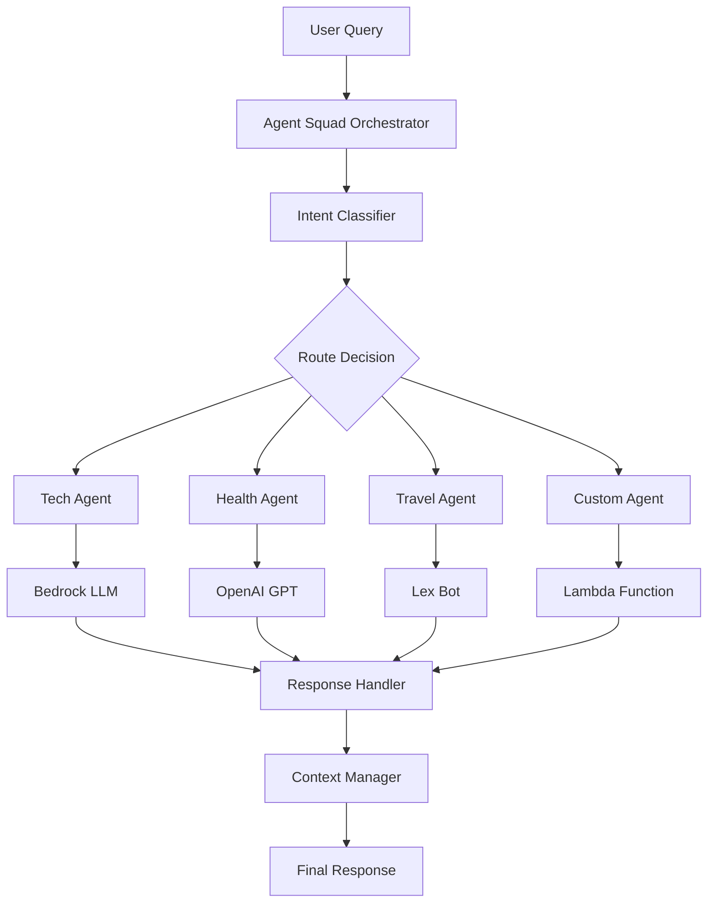

⏱️ **Estimated Reading Time**: 15 minutes

## Introduction to Agent Squad

AWS Labs' **Agent Squad** (formerly Multi-Agent Orchestrator) is a flexible, lightweight open-source framework designed for orchestrating multiple AI agents to handle complex conversations. With over 6.6k GitHub stars and growing community support, it represents a significant advancement in multi-agent AI systems.

### What Makes Agent Squad Special?

Agent Squad addresses the growing need for intelligent conversation routing in AI applications. Instead of having a single AI agent handle all queries, it intelligently distributes conversations to specialized agents based on context and intent.

## Key Features and Capabilities

### 🧠 Intelligent Intent Classification
The framework dynamically routes queries to the most suitable agent based on:
- **Context analysis**: Understanding conversation flow and history
- **Content evaluation**: Analyzing query semantics and intent
- **Agent specialization**: Matching queries to agent expertise

### 🔤 Dual Language Support
Full implementation in both **Python** and **TypeScript**:
- Identical functionality across languages
- Language-specific optimizations
- Seamless integration with existing codebases

### 🌊 Flexible Response Handling
Support for both streaming and non-streaming responses:
- **Real-time streaming**: For interactive conversations
- **Batch processing**: For analytical tasks
- **Mixed mode support**: Different agents can use different response types

### 📚 Context Management
Sophisticated conversation context handling:
- **Cross-agent memory**: Maintain context when switching between agents
- **Session persistence**: Remember conversation history
- **Context inheritance**: Pass relevant information between agents

## Architecture Overview



The architecture consists of:
1. **Orchestrator**: Central routing and management
2. **Classifiers**: Intent detection and agent selection
3. **Agents**: Specialized AI components
4. **Context Manager**: Memory and state management
5. **Response Handler**: Output processing and formatting

## Installation and Setup

### Python Installation

Agent Squad offers modular installation options based on your integration needs:

```bash
# Basic AWS integration (most common)
pip install "agent-squad[aws]"

# OpenAI integration
pip install "agent-squad[openai]"

# Anthropic integration
pip install "agent-squad[anthropic]"

# Full installation with all integrations
pip install "agent-squad[all]"
```

### Environment Setup

Create a virtual environment for isolation:

```bash
# Create virtual environment
python -m venv agent-squad-env
source agent-squad-env/bin/activate  # On Windows: agent-squad-env\Scripts\activate

# Install with AWS support
pip install "agent-squad[aws]"
```

### TypeScript/Node.js Installation

```bash
# Initialize new project
npm init -y

# Install Agent Squad
npm install @awslabs/agent-squad

# Install AWS SDK (if using AWS integrations)
npm install @aws-sdk/client-bedrock-runtime
```

## Basic Implementation Tutorial

### Python Implementation

Let's create a basic multi-agent system with specialized agents:

```python
import sys
import asyncio
from agent_squad.orchestrator import AgentSquad
from agent_squad.agents import BedrockLLMAgent, BedrockLLMAgentOptions, AgentStreamResponse

class AgentSquadTutorial:
    def __init__(self):
        # Initialize the orchestrator
        self.orchestrator = AgentSquad()
        
        # Configure agents
        self._setup_agents()
    
    def _setup_agents(self):
        """Configure specialized agents for different domains"""
        
        # Technology specialist agent
        tech_agent = BedrockLLMAgent(BedrockLLMAgentOptions(
            name="Technology Expert",
            streaming=True,
            description="""Expert in software development, cloud computing, AI/ML, 
                         cybersecurity, blockchain, and emerging technologies. 
                         Provides technical guidance, architecture advice, and 
                         cost analysis for technology solutions.""",
            model_id="anthropic.claude-3-sonnet-20240229-v1:0",
        ))
        
        # Health and wellness agent
        health_agent = BedrockLLMAgent(BedrockLLMAgentOptions(
            name="Health & Wellness Expert",
            streaming=True,
            description="""Specializes in health, wellness, nutrition, fitness, 
                         mental health, and medical information. Provides 
                         evidence-based health guidance and wellness tips.""",
            model_id="anthropic.claude-3-sonnet-20240229-v1:0",
        ))
        
        # Business and finance agent
        business_agent = BedrockLLMAgent(BedrockLLMAgentOptions(
            name="Business & Finance Expert",
            streaming=True,
            description="""Expert in business strategy, financial planning, 
                         market analysis, entrepreneurship, and business 
                         operations. Provides strategic business insights.""",
            model_id="anthropic.claude-3-sonnet-20240229-v1:0",
        ))
        
        # Add agents to orchestrator
        self.orchestrator.add_agent(tech_agent)
        self.orchestrator.add_agent(health_agent)
        self.orchestrator.add_agent(business_agent)
    
    async def process_query(self, user_input, user_id="user123", session_id="session456"):
        """Process a user query through the agent squad"""
        
        try:
            # Route the request to appropriate agent
            response = await self.orchestrator.route_request(
                user_input=user_input,
                user_id=user_id,
                session_id=session_id,
                additional_params={},
                streaming=True
            )
            
            # Handle the response
            await self._handle_response(response)
            
        except Exception as e:
            print(f"Error processing query: {e}")
    
    async def _handle_response(self, response):
        """Handle both streaming and non-streaming responses"""
        
        if response.streaming:
            print("\n🤖 **STREAMING RESPONSE**\n")
            
            # Display metadata
            self._print_metadata(response.metadata)
            
            print("\n📝 **Response:**")
            
            # Stream the content
            async for chunk in response.output:
                if isinstance(chunk, AgentStreamResponse):
                    print(chunk.text, end='', flush=True)
                else:
                    print(f"Unexpected chunk type: {type(chunk)}", file=sys.stderr)
            
            print("\n")  # New line after streaming
            
        else:
            # Handle non-streaming response
            print("\n🤖 **RESPONSE**\n")
            self._print_metadata(response.metadata)
            print(f"\n📝 **Response:** {response.output.content}")
    
    def _print_metadata(self, metadata):
        """Print response metadata in a formatted way"""
        print(f"🎯 **Agent:** {metadata.agent_name} (ID: {metadata.agent_id})")
        print(f"👤 **User:** {metadata.user_id}")
        print(f"🔗 **Session:** {metadata.session_id}")
        print(f"❓ **Query:** {metadata.user_input}")
        if metadata.additional_params:
            print(f"⚙️ **Parameters:** {metadata.additional_params}")

# Example usage and testing
async def main():
    """Main function to demonstrate Agent Squad capabilities"""
    
    # Initialize the tutorial system
    agent_system = AgentSquadTutorial()
    
    # Test queries for different domains
    test_queries = [
        "What are the best practices for implementing microservices architecture?",
        "How can I improve my cardiovascular health through diet and exercise?",
        "What should I consider when creating a business plan for a tech startup?",
        "Explain the differences between Docker containers and virtual machines",
        "What are some effective stress management techniques for busy professionals?"
    ]
    
    print("🚀 **Agent Squad Tutorial Demo**\n")
    print("=" * 50)
    
    for i, query in enumerate(test_queries, 1):
        print(f"\n**Test Query {i}:**")
        print("-" * 30)
        await agent_system.process_query(query)
        print("=" * 50)

if __name__ == "__main__":
    asyncio.run(main())
```

### TypeScript Implementation

Here's the equivalent TypeScript implementation:

```typescript
import { AgentSquad } from '@awslabs/agent-squad';
import { BedrockLLMAgent, BedrockLLMAgentOptions } from '@awslabs/agent-squad';

class AgentSquadTutorial {
    private orchestrator: AgentSquad;
    
    constructor() {
        this.orchestrator = new AgentSquad();
        this.setupAgents();
    }
    
    private setupAgents(): void {
        // Technology expert agent
        const techAgent = new BedrockLLMAgent({
            name: 'Technology Expert',
            streaming: true,
            description: `Expert in software development, cloud computing, AI/ML, 
                         cybersecurity, blockchain, and emerging technologies.`,
            modelId: 'anthropic.claude-3-sonnet-20240229-v1:0',
        } as BedrockLLMAgentOptions);
        
        // Health and wellness agent
        const healthAgent = new BedrockLLMAgent({
            name: 'Health & Wellness Expert',
            streaming: true,
            description: `Specializes in health, wellness, nutrition, fitness, 
                         mental health, and medical information.`,
            modelId: 'anthropic.claude-3-sonnet-20240229-v1:0',
        } as BedrockLLMAgentOptions);
        
        // Add agents to orchestrator
        this.orchestrator.addAgent(techAgent);
        this.orchestrator.addAgent(healthAgent);
    }
    
    async processQuery(
        userInput: string, 
        userId: string = 'user123', 
        sessionId: string = 'session456'
    ): Promise<void> {
        try {
            const response = await this.orchestrator.routeRequest(
                userInput,
                userId,
                sessionId,
                {},
                true
            );
            
            await this.handleResponse(response);
            
        } catch (error) {
            console.error('Error processing query:', error);
        }
    }
    
    private async handleResponse(response: any): Promise<void> {
        if (response.streaming) {
            console.log('\n🤖 **STREAMING RESPONSE**\n');
            
            // Display metadata
            this.printMetadata(response.metadata);
            
            console.log('\n📝 **Response:**');
            
            // Handle streaming response
            for await (const chunk of response.output) {
                if (chunk.text) {
                    process.stdout.write(chunk.text);
                }
            }
            
            console.log('\n');
            
        } else {
            console.log('\n🤖 **RESPONSE**\n');
            this.printMetadata(response.metadata);
            console.log(`\n📝 **Response:** ${response.output.content}`);
        }
    }
    
    private printMetadata(metadata: any): void {
        console.log(`🎯 **Agent:** ${metadata.agentName} (ID: ${metadata.agentId})`);
        console.log(`👤 **User:** ${metadata.userId}`);
        console.log(`🔗 **Session:** ${metadata.sessionId}`);
        console.log(`❓ **Query:** ${metadata.userInput}`);
    }
}

// Example usage
async function main() {
    const agentSystem = new AgentSquadTutorial();
    
    const testQueries = [
        "What are the latest trends in cloud computing?",
        "How can I maintain good mental health while working remotely?"
    ];
    
    console.log('🚀 **Agent Squad Tutorial Demo (TypeScript)**\n');
    
    for (const query of testQueries) {
        await agentSystem.processQuery(query);
        console.log('='.repeat(50));
    }
}

main().catch(console.error);
```

## Advanced Configuration

### Custom Agent Creation

You can create custom agents by extending the base agent class:

```python
from agent_squad.agents import Agent, AgentOptions
from typing import Optional, Dict, Any

class CustomDatabaseAgent(Agent):
    def __init__(self, options: AgentOptions):
        super().__init__(options)
        # Initialize database connections, tools, etc.
        
    async def process_request(
        self, 
        input_text: str, 
        user_id: str, 
        session_id: str, 
        chat_history: list,
        additional_params: Optional[Dict[str, Any]] = None
    ):
        # Custom processing logic
        # Query databases, perform calculations, etc.
        
        # Return structured response
        return {
            "content": "Database query results...",
            "metadata": {
                "query_time": "0.5s",
                "records_found": 42
            }
        }
```

### Advanced Orchestrator Configuration

```python
from agent_squad.orchestrator import AgentSquad
from agent_squad.classifiers import BedrockClassifier, BedrockClassifierOptions

# Create orchestrator with custom classifier
classifier = BedrockClassifier(BedrockClassifierOptions(
    model_id="anthropic.claude-3-haiku-20240307-v1:0",
    inference_config={
        "maxTokens": 1000,
        "temperature": 0.1
    }
))

orchestrator = AgentSquad(
    classifier=classifier,
    logger=custom_logger,
    config={
        "LOG_AGENT_CHAT": True,
        "LOG_CLASSIFIER_CHAT": True,
        "LOG_CLASSIFIER_RAW_OUTPUT": True,
        "LOG_CLASSIFIER_OUTPUT": True,
        "LOG_EXECUTION_TIMES": True,
        "MAX_RETRIES": 3,
        "USE_DEFAULT_AGENT_IF_NONE_IDENTIFIED": True,
        "MAX_TOKENS": 1000,
        "TEMPERATURE": 0.1
    }
)
```

## Real-World Use Cases and Examples

### Customer Service Automation

```python
async def setup_customer_service_agents():
    """Setup specialized customer service agents"""
    
    orchestrator = AgentSquad()
    
    # Technical support agent
    tech_support = BedrockLLMAgent(BedrockLLMAgentOptions(
        name="Technical Support",
        description="Handles technical issues, troubleshooting, and product support",
        model_id="anthropic.claude-3-sonnet-20240229-v1:0",
    ))
    
    # Billing and account agent
    billing_agent = BedrockLLMAgent(BedrockLLMAgentOptions(
        name="Billing Support",
        description="Handles billing inquiries, account management, and payment issues",
        model_id="anthropic.claude-3-sonnet-20240229-v1:0",
    ))
    
    # General information agent
    info_agent = BedrockLLMAgent(BedrockLLMAgentOptions(
        name="Information Agent",
        description="Provides general company information, policies, and basic inquiries",
        model_id="anthropic.claude-3-sonnet-20240229-v1:0",
    ))
    
    orchestrator.add_agent(tech_support)
    orchestrator.add_agent(billing_agent)
    orchestrator.add_agent(info_agent)
    
    return orchestrator
```

### Educational Platform

```python
async def setup_educational_agents():
    """Setup agents for different academic subjects"""
    
    orchestrator = AgentSquad()
    
    subjects = [
        ("Mathematics", "Expert in mathematics, calculus, statistics, and problem-solving"),
        ("Science", "Specializes in physics, chemistry, biology, and scientific concepts"),
        ("Literature", "Expert in literature analysis, writing, and language arts"),
        ("History", "Specializes in world history, historical analysis, and social studies")
    ]
    
    for name, description in subjects:
        agent = BedrockLLMAgent(BedrockLLMAgentOptions(
            name=f"{name} Tutor",
            description=description,
            model_id="anthropic.claude-3-sonnet-20240229-v1:0",
            streaming=True
        ))
        orchestrator.add_agent(agent)
    
    return orchestrator
```

## Performance Optimization

### Connection Pooling and Caching

```python
from agent_squad.orchestrator import AgentSquad
import asyncio
from functools import lru_cache

class OptimizedAgentSquad:
    def __init__(self):
        self.orchestrator = AgentSquad()
        self._connection_pool = self._setup_connection_pool()
        self._setup_caching()
    
    def _setup_connection_pool(self):
        """Setup connection pooling for better performance"""
        # Configure connection pools for different services
        return {
            'bedrock': self._create_bedrock_pool(),
            'openai': self._create_openai_pool(),
        }
    
    @lru_cache(maxsize=1000)
    def _cached_classification(self, query_hash: str):
        """Cache classification results for similar queries"""
        # Implementation for caching classification results
        pass
    
    async def batch_process_queries(self, queries: list):
        """Process multiple queries concurrently"""
        tasks = [
            self.orchestrator.route_request(query, f"user_{i}", f"session_{i}")
            for i, query in enumerate(queries)
        ]
        
        results = await asyncio.gather(*tasks, return_exceptions=True)
        return results
```

### Monitoring and Logging

```python
import logging
import time
from functools import wraps

class AgentSquadMonitor:
    def __init__(self, orchestrator):
        self.orchestrator = orchestrator
        self.logger = logging.getLogger('agent_squad_monitor')
        self._setup_monitoring()
    
    def _setup_monitoring(self):
        """Setup comprehensive monitoring"""
        self.metrics = {
            'total_requests': 0,
            'successful_requests': 0,
            'failed_requests': 0,
            'average_response_time': 0,
            'agent_usage': {}
        }
    
    def monitor_request(self, func):
        """Decorator to monitor request performance"""
        @wraps(func)
        async def wrapper(*args, **kwargs):
            start_time = time.time()
            self.metrics['total_requests'] += 1
            
            try:
                result = await func(*args, **kwargs)
                self.metrics['successful_requests'] += 1
                
                # Track agent usage
                agent_name = result.metadata.agent_name
                self.metrics['agent_usage'][agent_name] = \
                    self.metrics['agent_usage'].get(agent_name, 0) + 1
                
                return result
                
            except Exception as e:
                self.metrics['failed_requests'] += 1
                self.logger.error(f"Request failed: {e}")
                raise
                
            finally:
                # Update average response time
                response_time = time.time() - start_time
                self._update_average_response_time(response_time)
        
        return wrapper
    
    def _update_average_response_time(self, response_time):
        """Update running average of response times"""
        current_avg = self.metrics['average_response_time']
        total_requests = self.metrics['total_requests']
        
        self.metrics['average_response_time'] = \
            (current_avg * (total_requests - 1) + response_time) / total_requests
    
    def get_performance_report(self):
        """Generate performance report"""
        return {
            'summary': self.metrics,
            'success_rate': self.metrics['successful_requests'] / self.metrics['total_requests'] * 100,
            'most_used_agent': max(self.metrics['agent_usage'], 
                                 key=self.metrics['agent_usage'].get) if self.metrics['agent_usage'] else None
        }
```

## Deployment Strategies

### AWS Lambda Deployment

```python
import json
import asyncio
from agent_squad.orchestrator import AgentSquad
from agent_squad.agents import BedrockLLMAgent, BedrockLLMAgentOptions

# Global orchestrator instance for Lambda container reuse
orchestrator = None

def lambda_handler(event, context):
    """AWS Lambda handler for Agent Squad"""
    
    global orchestrator
    
    # Initialize orchestrator on cold start
    if orchestrator is None:
        orchestrator = setup_orchestrator()
    
    # Extract request data
    body = json.loads(event['body'])
    user_input = body['message']
    user_id = body.get('user_id', 'anonymous')
    session_id = body.get('session_id', 'default')
    
    # Process request
    loop = asyncio.new_event_loop()
    asyncio.set_event_loop(loop)
    
    try:
        response = loop.run_until_complete(
            orchestrator.route_request(user_input, user_id, session_id)
        )
        
        return {
            'statusCode': 200,
            'headers': {
                'Content-Type': 'application/json',
                'Access-Control-Allow-Origin': '*'
            },
            'body': json.dumps({
                'response': response.output.content,
                'agent': response.metadata.agent_name,
                'success': True
            })
        }
        
    except Exception as e:
        return {
            'statusCode': 500,
            'body': json.dumps({
                'error': str(e),
                'success': False
            })
        }
    
    finally:
        loop.close()

def setup_orchestrator():
    """Setup orchestrator with production configuration"""
    squad = AgentSquad()
    
    # Add production agents
    tech_agent = BedrockLLMAgent(BedrockLLMAgentOptions(
        name="Production Tech Agent",
        description="Production-ready technical support agent",
        model_id="anthropic.claude-3-sonnet-20240229-v1:0",
    ))
    
    squad.add_agent(tech_agent)
    return squad
```

### Docker Deployment

```dockerfile
# Dockerfile for Agent Squad application
FROM python:3.11-slim

WORKDIR /app

# Install system dependencies
RUN apt-get update && apt-get install -y \
    gcc \
    && rm -rf /var/lib/apt/lists/*

# Copy requirements and install Python dependencies
COPY requirements.txt .
RUN pip install --no-cache-dir -r requirements.txt

# Copy application code
COPY . .

# Expose port
EXPOSE 8000

# Set environment variables
ENV PYTHONPATH=/app
ENV AWS_DEFAULT_REGION=us-east-1

# Run the application
CMD ["uvicorn", "main:app", "--host", "0.0.0.0", "--port", "8000"]
```

## Best Practices and Tips

### 1. Agent Design Principles

- **Single Responsibility**: Each agent should have a clearly defined domain
- **Clear Descriptions**: Write detailed agent descriptions for better routing
- **Performance Optimization**: Use appropriate model sizes for different tasks
- **Error Handling**: Implement robust error handling and fallback mechanisms

### 2. Context Management

```python
# Effective context management
async def manage_conversation_context(orchestrator, user_id, session_id):
    """Best practices for context management"""
    
    # Store important context information
    context = {
        'user_preferences': get_user_preferences(user_id),
        'conversation_history': get_conversation_history(session_id),
        'current_task': 'information_gathering'
    }
    
    # Pass context through additional_params
    response = await orchestrator.route_request(
        user_input="Continue our previous discussion",
        user_id=user_id,
        session_id=session_id,
        additional_params=context
    )
    
    return response
```

### 3. Security Considerations

```python
# Input validation and sanitization
def validate_input(user_input: str) -> bool:
    """Validate user input for security"""
    
    # Check for malicious content
    forbidden_patterns = [
        r'<script.*?</script>',
        r'javascript:',
        r'on\w+\s*='
    ]
    
    import re
    for pattern in forbidden_patterns:
        if re.search(pattern, user_input, re.IGNORECASE):
            return False
    
    # Check input length
    if len(user_input) > 10000:
        return False
    
    return True

# Rate limiting implementation
from collections import defaultdict
import time

class RateLimiter:
    def __init__(self, max_requests=100, time_window=3600):
        self.max_requests = max_requests
        self.time_window = time_window
        self.requests = defaultdict(list)
    
    def is_allowed(self, user_id: str) -> bool:
        now = time.time()
        user_requests = self.requests[user_id]
        
        # Remove old requests
        self.requests[user_id] = [
            req_time for req_time in user_requests 
            if now - req_time < self.time_window
        ]
        
        # Check if under limit
        if len(self.requests[user_id]) < self.max_requests:
            self.requests[user_id].append(now)
            return True
        
        return False
```

## Troubleshooting Guide

### Common Issues and Solutions

1. **Agent Selection Problems**
   ```python
   # Debug agent selection
   orchestrator.config['LOG_CLASSIFIER_OUTPUT'] = True
   orchestrator.config['LOG_CLASSIFIER_RAW_OUTPUT'] = True
   ```

2. **Memory Issues with Large Contexts**
   ```python
   # Implement context truncation
   def truncate_context(context, max_length=8000):
       if len(context) > max_length:
           return context[-max_length:]
       return context
   ```

3. **Performance Bottlenecks**
   ```python
   # Implement async processing
   import asyncio
   
   async def process_multiple_requests(requests):
       tasks = [process_single_request(req) for req in requests]
       return await asyncio.gather(*tasks)
   ```

## Testing Your Implementation

Create a comprehensive test suite:

```python
import pytest
import asyncio
from agent_squad.orchestrator import AgentSquad

class TestAgentSquad:
    @pytest.fixture
    async def orchestrator(self):
        """Setup test orchestrator"""
        squad = AgentSquad()
        # Add test agents
        return squad
    
    @pytest.mark.asyncio
    async def test_tech_query_routing(self, orchestrator):
        """Test that tech queries route to tech agent"""
        response = await orchestrator.route_request(
            "How do I deploy a Docker container?",
            "test_user",
            "test_session"
        )
        
        assert "tech" in response.metadata.agent_name.lower()
    
    @pytest.mark.asyncio
    async def test_streaming_response(self, orchestrator):
        """Test streaming functionality"""
        response = await orchestrator.route_request(
            "Explain machine learning",
            "test_user",
            "test_session",
            streaming=True
        )
        
        assert response.streaming is True
        
        # Collect streamed content
        content = ""
        async for chunk in response.output:
            content += chunk.text
        
        assert len(content) > 0
```

## Conclusion

Agent Squad represents a powerful evolution in multi-agent AI systems, offering:

- **Intelligent routing** for better user experiences
- **Flexible architecture** supporting various AI providers
- **Production-ready features** for enterprise deployments
- **Strong community support** and active development

The framework's dual-language support (Python/TypeScript) and modular design make it an excellent choice for both prototyping and production deployments. Whether you're building customer service systems, educational platforms, or complex conversational AI applications, Agent Squad provides the foundation for sophisticated multi-agent orchestration.

### Next Steps

1. **Experiment** with the basic implementation
2. **Customize agents** for your specific use case
3. **Implement monitoring** and performance optimization
4. **Deploy** to your preferred cloud platform
5. **Contribute** to the open-source community

For more advanced features and enterprise support, explore the [official documentation](https://awslabs.github.io/agent-squad/) and join the growing community of Agent Squad developers.

---

*This tutorial provides a comprehensive foundation for working with AWS Agent Squad. As the framework continues to evolve, stay updated with the latest features and best practices through the official repository and documentation.*
