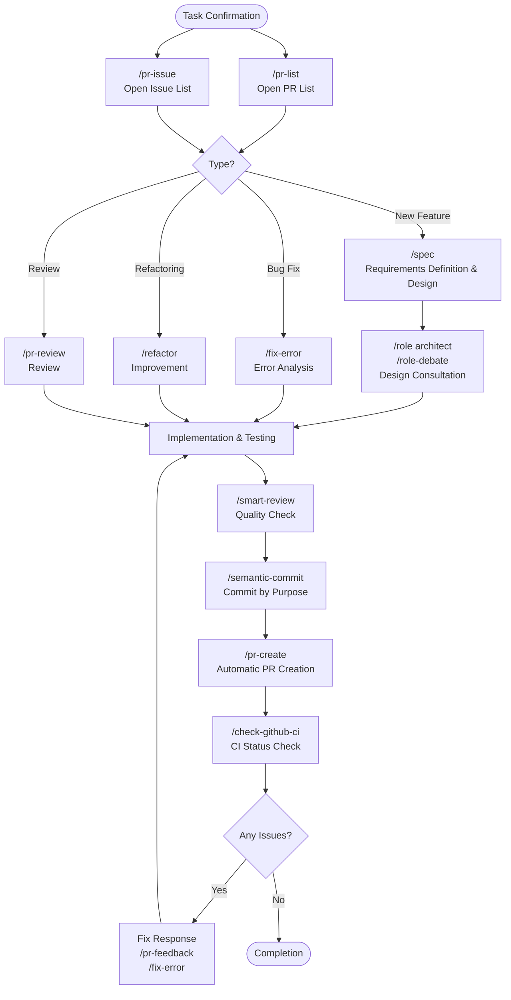

⏱️ **Estimated Reading Time**: 18 minutes

## Introduction

The [Claude Code Cookbook](https://github.com/foreveryh/claude-code-cookbook) represents a groundbreaking collection of over 60 commands, specialized roles, and automation hooks designed to supercharge your development workflow with AI-powered capabilities. This comprehensive toolkit transforms how developers interact with code, manage projects, and collaborate through intelligent automation.

In an era where AI is reshaping software development, Claude Code Cookbook stands out as a practical, battle-tested solution that bridges the gap between advanced AI capabilities and everyday development tasks. Whether you're handling complex refactoring, managing GitHub workflows, or conducting thorough code reviews, this toolkit provides structured, reliable patterns for leveraging AI in your development process.

## What is Claude Code Cookbook?

### Overview

Claude Code Cookbook is a curated collection of commands, roles, and automation scripts designed to enhance Claude Code's capabilities for software development. Originally forked from wasabeef's repository and enhanced by the community, it provides a systematic approach to integrating AI into your development workflow.

### Key Components

The toolkit consists of three main components:

1. **Commands**: Over 60 specialized commands for specific development tasks
2. **Roles**: Expert personas that provide specialized perspectives and analysis
3. **Hooks**: Automation scripts that integrate seamlessly into your development workflow

### Core Philosophy

The cookbook follows a principle of "structured AI assistance" - instead of generic prompts, it provides specific, contextual commands that produce consistent, high-quality results for common development scenarios.

## Command Categories and Usage

### 1. GitHub Workflow Commands

The cookbook excels in GitHub workflow automation with commands that streamline common Git operations:

#### Pull Request Management
```bash
# List and prioritize open PRs
/pr-list

# Create PR with automatic analysis
/pr-create

# Comprehensive PR review
/pr-review

# Automatically update PR content
/pr-auto-update

# Merge PRs with quality verification
/pr-merge
```

#### Issue Management
```bash
# Display prioritized issues
/pr-issue

# Generate detailed bug reports
/bug-report

# Create comprehensive feature specifications
/feature-request
```

#### Advanced Git Operations
```bash
# Semantic commit with meaningful units
/semantic-commit

# Check CI/CD status
/check-github-ci

# Handle merge conflicts intelligently
/merge-conflict
```

### 2. Code Quality and Analysis Commands

These commands focus on maintaining and improving code quality:

#### Code Review and Analysis
```bash
# Advanced code quality review
/smart-review

# Safe step-by-step refactoring
/refactor

# Technical debt analysis
/tech-debt

# Comprehensive error analysis
/fix-error
```

#### Architecture and Design
```bash
# Create detailed specifications
/spec

# Generate comprehensive documentation
/generate-docs

# Performance optimization analysis
/optimize
```

### 3. Development Workflow Commands

Commands that enhance daily development activities:

#### Project Management
```bash
# Create implementation plans
/plan

# Track execution progress
/show-plan

# Multi-language documentation updates
/update-doc-string
```

#### Dependency Management
```bash
# Safe Flutter dependency updates
/update-flutter-deps

# Node.js dependency management
/update-node-deps

# Rust dependency updates
/update-rust-deps
```

## Role-Based Expert Analysis

### Available Roles

The cookbook includes specialized roles that provide expert perspectives:

| Role | Expertise | Use Cases |
|------|-----------|-----------|
| `/role analyzer` | System analysis expert | Architecture review, system design |
| `/role architect` | Software architecture | Design patterns, scalability |
| `/role frontend` | UI/UX and performance | Frontend optimization, user experience |
| `/role mobile` | iOS/Android development | Mobile best practices, platform-specific advice |
| `/role performance` | Performance optimization | Speed and memory improvements |
| `/role qa` | Quality assurance | Test planning, quality metrics |
| `/role reviewer` | Code review specialist | Code quality, maintainability |
| `/role security` | Security expert | Vulnerability assessment, security best practices |

### Sub-Agent Execution

Roles can be executed as independent sub-agents for parallel analysis:

```bash
# Normal mode (execute in main context)
/role security
"Security check for this project"

# Sub-agent mode (execute in independent context)
/role security --agent
"Perform a comprehensive security audit of the project"

# Parallel analysis with multiple roles
/multi-role security,performance --agent
"Comprehensively analyze the system's security and performance"
```

### Role Debate Feature

The `/role-debate` command enables multiple expert perspectives to collaborate:

```bash
/role-debate
"Should we use microservices or monolithic architecture for this project?"
```

This command orchestrates discussions between different roles, providing balanced analysis from multiple expert viewpoints.

## Automation Hooks

### Development Automation

The cookbook includes sophisticated hooks that automate common development tasks:

#### File Management Hooks
- **preserve-file-permissions.sh**: Maintains file permissions during edits
- **ja-space-format.sh**: Automatically formats Japanese text spacing
- **auto-comment.sh**: Prompts for documentation when creating new files

#### Safety and Quality Hooks
- **deny-check.sh**: Prevents execution of dangerous commands
- **check-ai-commit.sh**: Validates commit message quality
- **check-continue.sh**: Identifies continuable tasks

#### Notification Hooks
- **notify-waiting**: macOS notifications for user confirmations
- **osascript**: Completion notifications

### Hook Configuration

Hooks are configured in `settings.json` and execute automatically at specific points:

- **PreToolUse**: Execute before tool operations
- **PostToolUse**: Execute after tool operations
- **Notification**: Handle user notifications
- **Stop**: Execute when tasks complete

## Advanced Features

### Multi-Language Support

The cookbook supports comprehensive documentation in multiple languages:

```bash
# Update documentation strings in multiple languages
/update-doc-string

# Dart-specific documentation management
/update-dart-doc
```

### Search and Analysis

Advanced search capabilities for comprehensive code analysis:

```bash
# Web search integration
/search-gemini

# Sequential thinking for complex problems
/sequential-thinking

# Ultra-structured thinking processes
/ultrathink
```

### AI Writing Enhancement

Tools for improving AI-generated content:

```bash
# Detect and correct AI-generated text patterns
/style-ai-writing

# Task delegation to specialized agents
/task
```

## Development Workflow Integration

### Typical Development Flow

The cookbook enables a streamlined development workflow:



### Best Practices

1. **Start with Planning**: Use `/spec` for feature planning and `/show-plan` for tracking
2. **Leverage Roles**: Employ specialized roles for domain-specific analysis
3. **Automate Reviews**: Integrate `/smart-review` and `/pr-review` into your workflow
4. **Maintain Quality**: Use hooks for consistent code quality and safety
5. **Parallel Analysis**: Utilize sub-agents for comprehensive multi-perspective analysis

## Installation and Setup

### Prerequisites

- Claude Code (latest version)
- Git configured with appropriate permissions
- Node.js (for certain dependency management commands)

### Installation Steps

1. **Clone the Repository**:
```bash
git clone https://github.com/foreveryh/claude-code-cookbook.git
cd claude-code-cookbook
```

2. **Configure Claude Code**:
Add the cookbook commands to your Claude Code configuration:
```json
{
  "commands_directory": "./commands",
  "roles_directory": "./agents/roles",
  "hooks_directory": "./.claude/hooks"
}
```

3. **Set Up Hooks**:
Configure automatic hooks in your `settings.json`:
```json
{
  "hooks": {
    "PreToolUse": ["deny-check.sh", "preserve-file-permissions.sh"],
    "PostToolUse": ["auto-comment.sh", "ja-space-format.sh"],
    "Notification": ["notify-waiting"],
    "Stop": ["check-continue.sh"]
  }
}
```

### Verification

Test the installation by running:
```bash
/role-help  # Should list available roles
/pr-list    # Should show current PRs (if in a git repository)
```

## Use Cases and Examples

### 1. Comprehensive Code Review

Scenario: Reviewing a complex pull request with multiple components.

```bash
# Step 1: Get PR overview
/pr-list

# Step 2: Multi-role analysis
/multi-role security,performance,reviewer --agent
"Analyze PR #123 for security vulnerabilities, performance issues, and code quality"

# Step 3: Detailed review
/pr-review

# Step 4: Provide structured feedback
/pr-feedback
```

### 2. Feature Development Workflow

Scenario: Developing a new user authentication system.

```bash
# Step 1: Create specification
/spec
"User authentication system with OAuth integration"

# Step 2: Architecture consultation
/role-debate
"OAuth vs JWT vs session-based authentication for our use case"

# Step 3: Implementation planning
/plan

# Step 4: Track progress
/show-plan

# Step 5: Quality assurance
/role qa --agent
"Create comprehensive test strategy for authentication system"
```

### 3. Technical Debt Management

Scenario: Addressing accumulated technical debt in a legacy codebase.

```bash
# Step 1: Analyze technical debt
/tech-debt

# Step 2: Prioritize improvements
/role architect --agent
"Create prioritized technical debt reduction plan"

# Step 3: Safe refactoring
/refactor

# Step 4: Validate changes
/smart-review
```

## Advanced Configuration

### Custom Commands

You can extend the cookbook with custom commands by following the template structure:

```markdown
# Custom Command Template
## Purpose
Brief description of what the command does

## Usage
/custom-command [parameters]

## Implementation
Detailed implementation logic
```

### Environment-Specific Hooks

Configure hooks for different development environments:

```bash
# Development environment
export CLAUDE_ENV="development"

# Production safety hooks
export CLAUDE_ENV="production"
```

### Multi-Project Configuration

For teams working across multiple projects:

```json
{
  "projects": {
    "project1": {
      "commands": ["./project1-commands"],
      "roles": ["./project1-roles"]
    },
    "project2": {
      "commands": ["./project2-commands"],
      "roles": ["./project2-roles"]
    }
  }
}
```

## Performance and Optimization

### Command Execution Optimization

1. **Parallel Execution**: Use sub-agents for independent analysis
2. **Context Management**: Maintain appropriate context scope for commands
3. **Caching**: Leverage Claude Code's built-in caching for repeated operations

### Memory and Resource Management

- **Token Optimization**: Commands are designed to use tokens efficiently
- **Context Preservation**: Hooks maintain context across operations
- **Resource Cleanup**: Automatic cleanup of temporary resources

## Troubleshooting

### Common Issues

1. **Command Not Found**: Ensure proper installation and configuration
2. **Permission Errors**: Check file permissions and Git configuration
3. **Hook Failures**: Verify hook scripts have execute permissions

### Debug Mode

Enable debug mode for detailed execution information:
```bash
export CLAUDE_DEBUG=true
```

### Community Support

- **GitHub Issues**: Report bugs and feature requests
- **Documentation**: Comprehensive docs available in the repository
- **Community**: Active community for support and contributions

## Security Considerations

### Safe Command Execution

The cookbook includes several security features:

- **Command Validation**: `deny-check.sh` prevents dangerous operations
- **Permission Preservation**: Maintains original file permissions
- **Audit Trail**: Comprehensive logging of all operations

### Best Practices

1. **Review Commands**: Always review generated commands before execution
2. **Use Hooks**: Implement safety hooks for your environment
3. **Access Control**: Configure appropriate access controls for team usage
4. **Regular Updates**: Keep the cookbook updated for security patches

## Future Developments

### Roadmap

The Claude Code Cookbook continues to evolve with:

- **New Commands**: Regular addition of community-requested commands
- **Enhanced Roles**: More specialized expert roles
- **Integration Improvements**: Better IDE and platform integrations
- **Performance Optimizations**: Continued optimization for speed and efficiency

### Community Contributions

The project welcomes contributions:

- **Command Development**: Create new commands for specific use cases
- **Role Enhancement**: Develop specialized expert roles
- **Documentation**: Improve and translate documentation
- **Bug Fixes**: Address issues and improve stability

## Conclusion

The Claude Code Cookbook represents a significant advancement in AI-powered development tools. By providing structured, reliable patterns for common development tasks, it enables developers to harness the full power of AI while maintaining code quality and development best practices.

Whether you're a solo developer looking to enhance productivity or a team seeking to standardize AI-assisted development practices, the cookbook provides the tools and patterns necessary for success. Its comprehensive command set, expert roles, and automation hooks create a development environment where AI augments human expertise rather than replacing it.

The future of software development lies in the intelligent collaboration between human creativity and AI capabilities. Claude Code Cookbook provides the framework for this collaboration, ensuring that AI assistance is not just powerful, but also reliable, safe, and aligned with software engineering best practices.

Start exploring the cookbook today, and transform your development workflow with the power of structured AI assistance. The investment in learning these patterns will pay dividends in increased productivity, improved code quality, and enhanced collaboration across your development team.

---

*Ready to revolutionize your development workflow? Clone the [Claude Code Cookbook](https://github.com/foreveryh/claude-code-cookbook) and start experiencing the future of AI-powered development today.*
