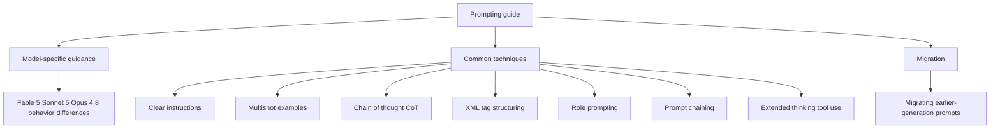

*A visualization of how clear instructions and structure converge into predictable output.*

## Overview

Writing prompts well is still eight tenths of using a model well. As models grow stronger they follow loose instructions to a degree, but pulling out stable form and quality still needs a clear contract.

Anthropic maintains an official document of prompting best practices for its latest models. This guide covers current models including Claude Fable 5, Claude Sonnet 5, and Claude Opus 4.8, and it separates where each model behaves differently, which techniques apply commonly to all models, and what to fix when moving over from an earlier generation. In this post we lay out its structure and core techniques, and connect it to how ThakiCloud treats prompts as contracts rather than improvisation inside its agent platform Paxis.

## What This Guide Is

Anthropic's prompting document is organized in three large parts.

The first is model-specific guidance. It points out where Fable 5, Sonnet 5, and Opus 4.8 respond differently, so you know the same prompt may need adjustment depending on the model. The second is techniques that apply commonly to all current models. It covers a wide range from general principles to output formatting, tool use, thinking, and agentic system design. The third is migration considerations, guiding how to revise prompts carried over from an earlier generation.

Drawn as a picture, this three-way structure looks like this.

Separate from the document, Anthropic also publishes an interactive prompt engineering tutorial in nine chapters, so you can learn by running the examples and exercises directly.

## The Core Techniques

The techniques the guide stresses are not flashy tricks but repeated fundamentals. Ordered by practical impact:

Clear instructions come first. Write specifically what to do, in what form to produce it, and what to use as the evaluation criteria. Instead of a vague request like "help me," specify one result per action. Specifying the form of the output alone raises quality the most.

Multishot examples come second. Show the tone and format you want in two or three examples and the model follows that rhythm. When the output format is tricky in particular, attaching one example is far more accurate than describing it in words.

Chain of thought comes third. Requesting step-by-step reasoning before the answer raises accuracy on complex reasoning. That said, thinking costs tokens, so use it only for work that genuinely needs reasoning.

Structuring with XML tags comes fourth. Separating instructions, context, examples, and input data with tags keeps the model from confusing the role of each part. The effect is especially large when handling long context.

Role prompting comes fifth. Giving the model a specific perspective or expert role produces vocabulary and judgment that fit that context. It is useful for review, audit, and specific domain analysis.

Prompt chaining comes sixth. Splitting one large request into several stages and passing each stage's output to the next stabilizes the quality of each stage more than demanding everything at once.

Finally there are extended thinking, tool use, and agentic system design. Extended thinking is a feature that allocates budget to internal reasoning, and tool use and agent design cover the loop where the model calls external tools and takes the result back to decide the next action. This is the area that has grown in weight in the latest guide.

## Implications for ThakiCloud Products

This guide is practical for us because ThakiCloud's agent platform Paxis treats prompts in exactly this way. Paxis is an Agent-Native Cloud control plane that runs on top of ai-platform, managing skills, tools, policies, and audit logs as first-class resources. Within it, a prompt is not an improvised thing composed anew each time but a contract packaged into a skill and version controlled.

The guide's first technique, clear instructions, overlaps directly with the design principle of the Paxis skill harness. Capabilities accumulate not in a thin harness but in thick skills, and each skill explicitly defines input, processing, output, and even failure recovery. If you make code own the form and evaluation criteria of the output, the model concentrates only on generating content and the format does not waver.

XML structuring and prompt chaining touch DAG multi-agent orchestration. Paxis selects from more than 960 skills with BM25 and runs them in isolated sandboxes, and chaining, which splits a large task into stages and passes each stage's output onward, is the basic grammar of this orchestration. Making each stage an independent skill lets you re-run only the failed stage, raising recovery precision.

Role prompting and tool use combine with policy gates and audit logs. The loop where a subagent given a specific role calls tools and takes results to decide the next action becomes safely autonomous only when every action passes through policy gates and audit logs. What the guide calls agentic system design translates for us into the problem of auditable autonomous execution.

In short, the principles of good prompting and the design principles of a solid agent platform point to essentially the same place. Reduce degrees of freedom and fill a verified skeleton with content to raise average quality. This guide practices that principle at the prompt level, and Paxis at the platform level.

## Limitations and Counterarguments

This guide has caveats too. First, model-specific guidance ages over time. When a model is released or updated, a prompt that worked yesterday may respond differently today, so read the guide as a snapshot of the current moment, not dogma.

Second, knowing many techniques does not make a good prompt. Stacking XML tags, chain of thought, and role prompting all at once can instead make instructions heavy and only grow tokens. For each technique, knowing when not to use it is as important as knowing when to use it.

Third, extended thinking is not free. Thinking tokens are a cost, and turning on maximum thinking for every task is a waste. As with the model routing perspective covered earlier, the thinking budget must also be allocated to the difficulty of the task.

In conclusion, the value of this guide is not in teaching new magic. It is in sharpening the judgment of when and how to combine fundamentals. And hardening that judgment into skills and policy so you do not redo it every time is the platform's job.

## Sources

- "Prompting best practices", Claude Platform Docs: [platform.claude.com/docs/en/build-with-claude/prompt-engineering/claude-prompting-best-practices](https://platform.claude.com/docs/en/build-with-claude/prompt-engineering/claude-prompting-best-practices)
- "Prompt engineering overview", Anthropic Docs: [docs.anthropic.com/en/docs/build-with-claude/prompt-engineering/overview](https://docs.anthropic.com/en/docs/build-with-claude/prompt-engineering/overview)
- "Anthropic's Interactive Prompt Engineering Tutorial", GitHub: [github.com/anthropics/prompt-eng-interactive-tutorial](https://github.com/anthropics/prompt-eng-interactive-tutorial)
