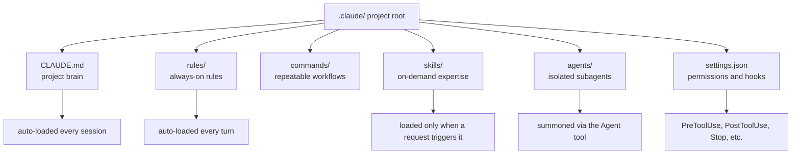

*Scattered instructions, rules, and tools become predictable agent behavior once they're organized into a folder structure.*

## Overview

The most common mistake when starting work with Claude Code is skipping the setup and jumping straight into prompting. It works fine a few times, but as the project grows, you end up repeating the same instructions over and over, and the model starts every session from a blank slate. The quality of your results starts depending on the day's luck rather than your prompting skill.

The fix for this isn't swapping in a better model, it's turning **the project itself into a contract structure**. In Claude Code, that contract lives in the `.claude/` folder at the project root. A recent thread by Akshay Pachaar on X, "Anatomy of the .claude/ folder," widely shared and well organized, laid out this structure clearly. This post follows that same skeleton, but adds **numbers measured directly from an actual production Claude Code project running 1,671 skills** to show what scale each layer operates at in the real world. We also connect this to how ThakiCloud productized the pattern as Paxis, its Agent-Native Cloud.

## What Is the .claude/ Folder

`.claude/` is a set of conventions that tells Claude Code "this is how we work on this project." The key idea isn't one giant prompt, it's several layers with different roles, each with its own loading time and cost.



Breaking down each layer's role:

**CLAUDE.md** is the project's brain. It loads automatically every session and answers only four things: architecture overview, tech stack, conventions, and workflow rules. Cramming "occasionally needed" knowledge in here wastes context on every single session, so keeping CLAUDE.md thin is the guiding principle.

**rules/** are always-on rules applied on every turn. This is where you put invariant rules that apply to all work, like coding style, security policy, git workflow, and quality gates. When CLAUDE.md gets bloated, this is where you split it out to.

**commands/** bundle repeatable workflows into slash commands. A single command like `/review` or `/ship` invokes a predefined multi-step procedure.

**skills/** are on-demand expertise loaded only when a request triggers them. This is where you put domain pipelines and analysis recipes that aren't always needed. Only a skill's name and description sit in the index until a relevant request comes in, at which point the full body loads.

**agents/** are definitions of independent specialists with their own roles, tools, and models. They're summoned via the Agent tool, and routed by task: exploration to a cheap model, implementation to a balanced model, architectural judgment to a strong model.

**settings.json** locks down permissions and hooks. Hooks inject deterministic code before or after tool calls (`PreToolUse`/`PostToolUse`) or at session end (`Stop`), so that code, not the model, owns formatting and validation.

On top of this, there are two copies of the `.claude/` folder. One lives in the repository, committed and shared by the whole team. The other is a global folder at `~/.claude/`, which holds personal preferences and cross-project automatic memory.

## Installation and Configuration

The fastest way to start is to initialize from the project root.

```bash
# From the project root
claude
# Inside the session, generate a draft of the project brain
/init
```

`/init` scans the repository and drafts a `CLAUDE.md` for you. After that, you refine it manually. You can also hand-build the folder skeleton like this:

```bash
mkdir -p .claude/rules .claude/commands .claude/skills .claude/agents .claude/hooks
```

Here's an example of wiring a hook into `settings.json`, a PostToolUse hook that auto-formats after an edit.

```json
{
  "hooks": {
    "PostToolUse": [
      {
        "matcher": "Write|Edit",
        "command": "python3 .claude/hooks/format-on-save.py",
        "description": "Auto-format edited files"
      }
    ]
  }
}
```

The minimal form of a single skill is a `SKILL.md` frontmatter. Since `description` becomes the search trigger, include both English and Korean keywords, and write out "when NOT to use this" so it doesn't get confused with a neighboring skill.

```yaml
---
name: my-pipeline
description: >-
  Does X in one sentence. Use when <english + Korean trigger phrases>.
  Do NOT use for <anti-pattern> (use other-skill).
---
```

There's one core discipline underlying all of this. **Capability belongs in skills, not in the harness.** Keep CLAUDE.md and rules thin, and put domain knowledge, judgment, templates, and failure cases thickly into skills. The goal is for the same skill to work across Claude Code and other harnesses alike.

## Real Measurements: Dissecting a Production Claude Code Project

The very repository this post is written in is a heavily configured Claude Code project. We measured how each layer is actually used at scale by counting the files directly. The numbers below are all measured values.

| Layer | Measured count | Load timing | Role |
|---|---|---|---|
| CLAUDE.md | 94 lines | Every session | Project brain (kept thin) |
| rules/ | 49 files | Every turn | Always-on rules |
| commands/ | 22 files | On invocation | Repeatable workflows |
| skills/ | 1,671 files | On trigger | On-demand expertise |
| agents/ | 60 files | On summon | Isolated subagents |
| hooks/ | 12 files | Around tool calls | Deterministic gates |

The design principle this reveals is clear. CLAUDE.md is extremely thin at 94 lines. Since it's a file loaded every session, it pays "rent," so it only holds the bare minimum. Skills, on the other hand, are overwhelmingly numerous at 1,671. Because skills only load when triggered, this scale doesn't impose a per-turn cost even though it's enormous.

The measured hook events were five kinds: `PreToolUse`, `PostToolUse`, `Stop`, `SessionStart`, and `UserPromptSubmit`, and `settings.json` was organized around three axes: `permissions`, `hooks`, and `env`. In other words, the things that are always on (rules, hooks) are kept to a small set, while the things called only when needed (skills, agents) are allowed to grow large.

But once you have 1,671 skills, a new problem emerges. Neither a human nor the model can scan the entire list to pick "which skill should I use right now." This is exactly where the next section picks up.

## Implications for ThakiCloud's Product

The moment skill count reaches into the thousands, managing files in the `.claude/` folder stops being a personal organization problem and becomes a **runtime routing problem**. ThakiCloud productized this pattern as **Paxis**, its Agent-Native Cloud.

Paxis is an agent control plane that runs on top of ThakiCloud's AI infrastructure (ai-platform), treating Skills, Tools, Policies, and Audit Logs as first-class resources. The part that connects directly to the anatomy of the `.claude/` folder is the **Skill Harness**. As we saw above, no matter how many skills you build, loading all of them every turn blows up the context. Paxis selects only the relevant skills from a massive skill pool using BM25 search when a request comes in, loads only those, and runs them in an isolated sandbox. This is exactly why routing still holds up even when the skill count, as measured in this post, comfortably exceeds 1,000.

On top of that, it elevates what hooks do (deterministic gating) into policy gates and audit logs. Just as a PreToolUse hook in `.claude/settings.json` blocks a dangerous command, Paxis routes every agent action through policy gates and audit logs, leaving a record of who ran what, and when. It's the personal-project hook pattern made trustworthy in a multi-tenant environment.

The agents/ layer extends into Paxis's DAG-based multi-agent orchestration. The local pattern of separating individual subagents by role and model scales up into a structure that binds multiple agents into a dependency graph, runs them in parallel, and closes the loop with a verification stage.

There's also a meaning at the infrastructure level (through the ai-platform lens). All this skill and agent execution ultimately consumes GPU and inference cost. ThakiCloud's ai-platform underpins this execution at low cost through K8s/Kueue-based GPU scheduling and vLLM serving, and it lets the same harness run as self-hosted for customer environments with on-premises or sovereignty requirements. Low-cost serving is what makes agent economics work, and Paxis's skill harness runs on top of that foundation.

## Limitations and Counterarguments

This approach isn't always the right answer. First, forcing a heavy `.claude/` structure onto small scripts or one-off tasks is overkill. Before adding a single rule, you should ask "does this really need to apply on every turn," and if not, push it down into a skill. The setup itself shouldn't become the goal.

Second, scaling skills into the thousands turns search noise into a new bottleneck. The more similarly named skills you have, the lower routing accuracy gets, and the greater the risk of loading the wrong skill. This problem doesn't get solved by bumping the model tier, it only improves through the tedious work of refining each skill description's triggers and boundaries.

Third, the committed `.claude/` folder should hold only team-shared configuration. Personal paths, tokens, and debugging shortcuts belong in `~/.claude/` or `CLAUDE.local.md`. If you don't respect this boundary, personal information ends up exposed in the repository.

To sum up, setting up the `.claude/` folder isn't about "making the model better," it's about "making the model's behavior predictable." When a project is small, a single CLAUDE.md is enough, and as it grows, you split it into rules, skills, agents, and hooks. And the moment skills scale into the thousands, it stops being folder organization and becomes a routing infrastructure problem. Paxis is exactly where ThakiCloud tackles that point as a product.

## Sources

- [Akshay Pachaar, "How to setup your Claude code project?" (X)](https://x.com/akshay_pachaar/status/2035706568142893229)
- [Builder.io, "Setting Up a New Claude Code Project: The Complete Guide"](https://www.builder.io/blog/setting-up-claude-code-project)
- [Claude Code Docs: Quickstart](https://code.claude.com/docs/en/quickstart)
