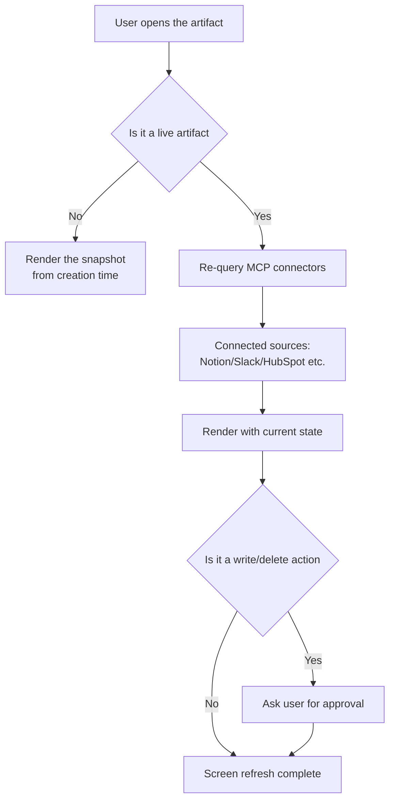

Until now, Claude Code artifacts were a way to capture the work from a session and freeze it into a single shareable web page. A pull request description with an annotated diff, an incident summary, a checklist: all static outputs that preserved the state of the moment they were created. This update pushes artifacts a step further. Artifacts can now **call MCP connectors directly** to fetch data and even perform actions. In other words, instead of a page fossilized at creation time, you get a **living app that re-queries connectors every time it opens and shows the current state**. This piece is for developers who are tired of hand-coding the same internal dashboards and ops tools over and over. The short version: you can now replace a good chunk of those dashboards with a single artifact, no frontend deployment required.

## Overview

The core shift is that artifacts moved from "read-only output" to "executable client." Where an old artifact rendered a snapshot of data, a live artifact sends queries to the actual source through a connector. The use cases this unlocks are obvious: CRM pipeline views, project trackers, morning briefings, weekly metrics boards, anything where the **underlying data keeps changing**. Because it pulls fresh data on every open, nobody has to hit refresh, and no separate backend has to push data in on a cron.

MCP is the plumbing behind this picture. MCP is an open protocol that lets Claude talk to tools outside the chat window, and connectors are the one-click integrations that Anthropic and its partners have built on top of it. When an artifact calls a connector, it means the artifact can now directly read and write data in the external systems attached to that MCP server.

## What Claude Code Artifacts and MCP Connectors Are

Let's start with artifacts. An artifact turns the work from a Claude Code session into a living, shareable visual page. A pull request description with an annotated diff, a dashboard assembled from session data, a timeline that fills in as an investigation progresses: all of these can be artifacts. A live artifact goes one step further and refreshes itself. Every time it opens, it re-queries the connectors it's wired to and shows the current state.

Connectors are the integration layer built on top of MCP servers. Library connectors attach with a single click and an OAuth login from the Connectors section under Customize. Notion, Gmail, Slack, HubSpot, Linear, Canva, Atlassian, and Microsoft 365 all live there. The connector directory lists 375+ integrations spanning files, email, project management, analytics, design, sales, and developer tools.

The diagram below shows the difference in data flow between a static artifact and a live artifact.



## How It Works

The mechanics come down to three rules.

First, **it re-queries every time it opens.** A live artifact lives in its own tab in the Cowork sidebar, and every time it opens it re-queries its connectors and draws the current state. You can wire it to a single connector or stitch several together into one screen. That's where a unified dashboard pulling from multiple sources comes from.

Second, **writes and deletes go through an approval gate.** When a connector doesn't just read data but actually performs an action that changes data at the connected source, Claude is required to ask the user for approval first. It's a safeguard against automation quietly touching the source of truth. When you're configuring a tool, the first thing to check is whether approval is required for the Write and Delete tool categories.

Third, **access scope is tied to the individual.** In Team or Enterprise organizations, only owners can add a connector to the organization, but the actual connection and activation happen per user. So Claude only accesses the tools and data that user already has permission for. A notable Team and Enterprise feature: when a shared artifact is used by a teammate, no extra cost hits the person who created it.

From an enterprise administration angle, there's also a flow for provisioning connectors at the organization level. Once an admin registers a connector through an identity provider like Okta, users get connector access automatically on first login with no extra setup. Authentication is configured centrally at the organization level, and this access is shared across Claude chat, Claude Code, and Cowork.

## A Practical Setup Example

Attaching an MCP server in Claude Code takes one command and one config file. Here's the actual command for adding a local MCP server.

```bash
# Register an MCP server with Claude Code
claude mcp add my-metrics --command "python3" --args "servers/metrics_mcp.py"

# Check registered servers
claude mcp list
```

MCP servers attached to a project can be declared in `.mcp.json` at the repository root and shared with the team. The structure looks like this.

```json
{
  "mcpServers": {
    "my-metrics": {
      "command": "python3",
      "args": ["servers/metrics_mcp.py"],
      "env": { "METRICS_DB_URL": "postgres://..." }
    }
  }
}
```

For remote connectors, you use a remote MCP endpoint and an OAuth flow. Library connectors are even simpler: go to the Connectors section under Customize in the UI, click the plus button, and search for the app you want to connect. Inside the artifact, that attached connector gets called like a function to fetch data, and the result gets rendered as a dashboard component. What we need to write isn't a frontend deployment pipeline, it's a natural language instruction for which connectors to query in what order and what to draw with the result.

## Implications for ThakiCloud's Product Line

This feature is the consumer-facing version of a problem we've been working on for a long time at Paxis. Paxis is ThakiCloud's Agent-Native Cloud, and it treats skills, tools, and policies as first-class resources. One of the core pieces of that tool layer is the plumbing that **manages MCP connectors with automatic OAuth reconnection**. Anthropic's move to let artifacts call connectors points at exactly the same spot our own design already aims at: agents that talk to external systems need connectors promoted to first-class resources.

What catches our attention in particular is the **approval gate and access scope**. The way live artifacts require approval for write and delete actions and tie access to individual permissions comes from the same underlying concern as Paxis's discipline of routing every agent action through a policy gate and audit log. As connectors get more powerful, the control plane that logs what a connector touched and when, and defers risky actions behind human approval, has to get stronger right along with them. The moment an artifact becomes a live app, a single dashboard turns into an execution path toward production data.

On the infrastructure side, ai-platform is the layer that serves the MCP servers a live artifact queries, reliably, on top of K8s. Once a team exposes the data it checks often, an internal metrics MCP, a deployment status MCP, a cost MCP, as MCP servers, developers can assemble their own ops dashboards with live artifacts without writing a single line of frontend code. A low-cost, reliably served MCP backend is what makes the agent economics work, which is why ai-platform's serving layer and Paxis's connector layer move as one.

## Limitations and Counterarguments

A few things need to be clear before adoption.

First, a large part of this feature is tied to Team and Enterprise plans, and to the Cowork environment. Live artifacts and organization-managed connectors don't carry over to individual plans as-is, so the value calculation should assume org-level adoption as the baseline.

Second, the fact that a live artifact re-queries connectors every time it opens means every view generates a request against an external system. If several people are frequently opening a dashboard with heavy queries, you need to watch rate limits and cost on the source system too. There are still screens where a static snapshot is the better choice.

Third, approval gates are powerful but not a cure-all. A query that looks read-only can still pull sensitive data onto a shareable surface like an artifact. An organizational policy on what's allowed to be exposed in a shared artifact needs to come before the approval gate, not after it. The more convenient this feature gets, the more worth asking what control that convenience is bypassing. That's the safe way to use it.

## Sources

- Claude Code now supports artifacts, Anthropic: [claude.com/blog/artifacts-in-claude-code](https://claude.com/blog/artifacts-in-claude-code)
- Connect Claude Code to tools via MCP, Claude Code Docs: [code.claude.com/docs/en/mcp](https://code.claude.com/docs/en/mcp)
- Get started with custom connectors using remote MCP, Claude Help Center: [support.claude.com/en/articles/11175166](https://support.claude.com/en/articles/11175166)
- Anthropic Claude Code Artifacts update, VentureBeat: [venturebeat.com/data/anthropics-claude-code-artifacts-update-brings-live-shared-dashboards-and-interactive-workspaces-to-enterprises](https://venturebeat.com/data/anthropics-claude-code-artifacts-update-brings-live-shared-dashboards-and-interactive-workspaces-to-enterprises)
