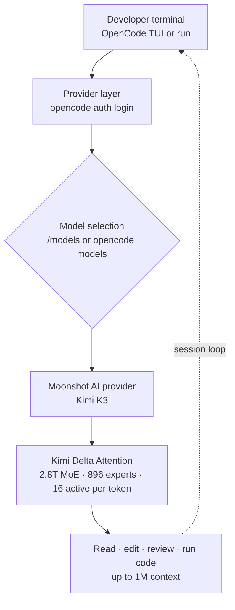

For the past few days, developer timelines have been full of "how to code with Kimi K3" threads.
The reactions split two ways. One is that the benchmarks are genuinely strong. The other is that
you can run this model from your own terminal, inside a coding agent you chose, rather than a single
company's closed tool. This post is about the second reaction. The reader we have in mind is a
developer who would rather swap models into an open-source tool than get locked into a vendor's GUI.
The short version: connect Moonshot AI's Kimi K3 as a provider to the open-source terminal agent
OpenCode, and you can code with a 2.8-trillion-parameter-class model without being tied to any one IDE.

## Overview

Moonshot AI released Kimi K3 on July 16, 2026. Per the company, it is a 2.8-trillion-parameter
Mixture-of-Experts model and among the largest open-weight models released to date. The interesting
part is not just the scores. This model is not confined to a proprietary chatbot; it connects as a
provider to an open-source coding agent that runs in the terminal. In other words, "which IDE you use"
and "which model you code with" can now be decoupled.

From ThakiCloud's vantage point, this pairing matters for two reasons. First, a coding agent that can
freely swap models instead of being vendor-locked lines up with the core premise of agent-platform
design. Second, a 2.8-trillion-parameter open-weight model has to be served on real GPUs by someone,
and that serving cost and on-prem requirement come straight back as infrastructure questions. Below we
install the tool first-hand to confirm the connection flow, then work through both perspectives.

## What Are These Tools

OpenCode is an open-source coding agent that runs in the terminal. It reads files in a codebase,
explains structure, edits code, reviews changes, and runs tasks through a connected LLM provider.
Because it is not bound to a single model and instead swaps providers, you can keep the same workflow
and change only the model underneath.

Kimi K3 is the model that goes in that provider slot. Per Moonshot AI's announcement, the key specs
are as follows. It is a 2.8-trillion-parameter MoE, with 16 of 896 experts activated per token.
Attention uses Kimi Delta Attention (KDA), a hybrid linear attention scheme. On top of that it adds
Attention Residuals (a replacement for residual connections), native vision understanding, and up to a
1-million-token context window. Full model weights are scheduled to release on July 27, 2026.

The flow that connects the two tools looks like this.



The difference from the usual approach is clear. A vendor's GUI agent ships the model and the tool as
one bundle. An open-source agent like OpenCode fixes the tool and swaps only the provider. A
self-hosted model yesterday, Kimi K3 today, a different model tomorrow, all through the same command
interface.

## Installation and Integration

We verified the install and connection flow first-hand in an isolated sandbox. The commands and
versions below are actual values captured during reproduction.

First install OpenCode. A global npm install worked immediately.

```bash
npm install -g opencode-ai
opencode --version
# 1.18.3
```

We checked the command surface the installed CLI exposes. From launching the TUI to headless
execution, provider management, model listing, and MCP server management, it covers what a coding
agent needs.

```bash
opencode --help
# opencode [project]        start opencode tui              [default]
# opencode run [message..]  run opencode with a message
# opencode providers        manage AI providers and credentials   [aliases: auth]
# opencode models [provider]  list all available models
# opencode mcp              manage MCP (Model Context Protocol) servers
# opencode agent            manage agents
# opencode serve            starts a headless opencode server
```

Provider authentication is handled by the `opencode auth` subcommands.

```bash
opencode auth --help
# opencode auth list    list providers and credentials   [aliases: ls]
# opencode auth login   log in to a provider
# opencode auth logout  log out from a configured provider
```

The order for wiring in Kimi K3 is as follows, per Moonshot AI's official OpenCode guide.

1. Create an API key on the Kimi Open Platform and keep it private.
2. Run `opencode auth login`, select **Moonshot AI** as the provider, and enter your API key.
3. Inside OpenCode, use `/models` (or `opencode models moonshotai` in the shell) to select **Kimi K3**.
4. Verify the connection with a low-risk task.

```bash
opencode run "Explain this project's folder structure and recommend the first three files I should read."
```

One fact worth pinning down: right after install, the default model catalog did not include the
Moonshot provider. During reproduction, filtering `opencode models` for Moonshot/Kimi returned nothing,
which means the provider has to be added explicitly via `auth login` before it shows up in the catalog.
So step 2 above is not optional; it is required.

## Actual Results

We separate values we captured directly from the model's published figures. The tool install and
connection flow are measured first-hand; the benchmark scores are reported figures from Moonshot and a
third party (Artificial Analysis).

Directly measured results:

- OpenCode install succeeded, version 1.18.3 (npm `opencode-ai`, exit code 0).
- Confirmed the CLI provides provider auth (`auth`), model listing (`models`), headless run (`run`),
  MCP management (`mcp`), and agent management (`agent`).
- Right after install, the default catalog did not include the Moonshot provider, so it must be added
  explicitly via `auth login`.

We did not run live Kimi K3 inference. Calling Kimi K3 requires a paid API key with balance (vouchers
from new-user verification cannot be used for K3), and this reproduction environment did not have such a
key. So we draw the line at "install and connection flow measured, actual code-generation quality cited
from public figures." We do not invent numbers we did not observe.

The model's published benchmarks are below. These scores are reported figures per Artificial Analysis,
and because weights are not yet fully public, they have not been verified by independent reproduction.

| Benchmark | Kimi K3 | Rank | Top / comparison models |
|---|---|---|---|
| GDPval-AA v2 | 1,687 | 3rd | Fable 5 Max 1,815 · GPT-5.6 Sol Max 1,747.8 · (Opus 4.8 1,600) |
| AA-Briefcase | 1,527 | 2nd | Fable 5 Max 1,587 · GPT-5.6 Sol Max 1,495 |

Read at face value, Kimi K3 sits in the band just below the top frontier models. Placing 2nd on
AA-Briefcase, which is meant to measure long-horizon knowledge work, is a signal that it can hold up on
multi-step agent tasks like coding. That said, these are reported figures, and the actual feel in a real
coding workflow is best verified against your own codebase.

## Implications for ThakiCloud

This pairing touches both of ThakiCloud's product lenses. One is the agent-platform lens, the other is
the infrastructure serving lens.

**Paxis lens (agents, tools, swappable models).** Paxis is ThakiCloud's Agent-Native Cloud control
plane that treats Skills, Tools, Policies, and Audit Logs as first-class resources. The "fix the tool,
swap the provider" structure that OpenCode demonstrates overlaps exactly with the Paxis design
philosophy. In Paxis, a coding agent selects from 960-plus skills via BM25, runs them in isolated
sandboxes, and passes every action through policy gates and audit logs. Attach an open-weight model like
Kimi K3 as the provider, and you can swap the agent's brain by cost and performance while keeping
execution isolation and auditing intact. The fact that OpenCode has built-in MCP server management
(`opencode mcp`) also connects naturally to how Paxis treats MCP connectors as first-class resources.

**ai-platform lens (serving a 2.8T model).** Open-weight means someone has to serve this model on real
GPUs. A 2.8-trillion-parameter MoE only activates 16 experts per token, so active parameters are far
smaller than the total, but the structure still requires holding all 896 experts in memory, so the bar
for on-prem serving is not low. This is where ThakiCloud's ai-platform answers the question. When
K8s- and Kueue-based GPU scheduling, vLLM/SGLang serving, and quantization for memory savings come
together, large open models like this can run economically in a multi-tenant environment. Once the
weights ship on July 27, the cost curve of self-hosting versus API calls can be compared for real. Lower
serving cost translates into agent economics, which in turn lowers the per-run cost of agents running on
Paxis. Both lenses point in the same direction.

## Limits and Counterarguments

A few sober counterpoints are worth stating.

First, benchmark scores and actual coding feel are different. A 2nd place on AA-Briefcase does not
guarantee "best on my codebase." A top-ranked model can be weaker on a specific language, framework, or
in-house convention, so adoption should be verified against your real work.

Second, this post's measurements go up to install and connection flow. Live Kimi K3 inference was not
run because of the paid API key constraint. Actual generation quality, latency, and token cost remain
things you have to re-measure with your own key.

Third, "open weight" does not mean "free" or "easy to operate." Even with weights public, serving a
2.8T MoE stably requires substantial GPU resources and operational skill. The break-even between
self-hosting and API calls depends on usage and latency requirements.

Fourth, the Kimi K3 API needs balance, and new-user vouchers cannot be used for K3. Do not expect
unlimited free use of a top-tier model. Even so, the structural freedom to choose tool and model
independently is a stronger long-term position than being locked to a single vendor.

## Sources

- VentureBeat, "China's Moonshot AI releases Kimi K3, the largest open-source model ever"
- MarkTechPost, "Moonshot AI Releases Kimi K3: A 2.8 Trillion Parameter Open MoE Model With Kimi Delta Attention and 1M Context" (2026-07-16)
- Fortune, "Moonshot's Kimi K3 pushes Chinese AI into Fable-level territory" (2026-07-16)
- Kimi API Platform, "Use Kimi Models in OpenCode" (platform.kimi.ai)
- OpenCode 1.18.3 (`npm install -g opencode-ai`): commands and version are directly captured reproduction values
