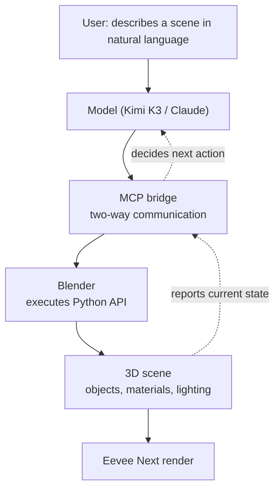

## Why This Matters

If you're a developer who wants agents to operate real software, reading the Blender MCP story as a 3D demo means missing the point. Here's the takeaway up front: **MCP is the standard that turns GUI apps like Blender into natural-language prompt boxes, and connecting Kimi K3 to Blender is a vivid demonstration of how far that capability has come.** This post isn't about how to build 3D scenes. It's about how agents came to operate arbitrary applications, and how to run that safely.

## Overview

Until now, most AI-generated images have been pixels. A model paints a picture, but editing the result again means a human has to start from scratch. Blender MCP touches a different layer. Instead of spitting out pixels, the model **operates Blender, an actual piece of 3D software**. Give it a sentence like "build a low-poly dungeon guarded by a dragon protecting a golden pot," and the model places objects, applies materials, and sets up lighting. What comes out isn't pixels, it's an editable scene file.

What matters here isn't 3D itself. Swap Blender for a different app and the same story holds. Spreadsheet tools, design software, internal admin consoles, all of them become potential "prompt boxes." Blender MCP is simply the case that makes this shift visible.

## What This Technology Is

MCP (Model Context Protocol) is a standard protocol connecting models to external programs. Blender MCP uses this protocol to set up a **two-way bridge** between Blender and the model. The model sends commands to Blender through the bridge, and Blender reports the current scene state back to the model. That round trip is what lets the model see what's already placed and decide its next move.

The key point is that the model ultimately **executes Blender's Python API**. Blender can be controlled almost entirely through Python internally, and the model translates natural-language requests into those Python calls. Instead of clicking through menus, the model writes scripts that build geometry, apply materials, and trigger a render.

## How It Works

The full flow goes like this. First, the user describes the desired scene in an ordinary sentence, sometimes starting from a single sketch. The model interprets that request and turns it into a Python script for Blender to run. Once the script executes, objects appear in the scene, and the model checks the changed state through the bridge. If lighting is missing, it adds lighting; if a position looks off, it moves things. At the end, a renderer like Eevee Next draws the result.

Kimi K3's role in this is exactly that "translation and judgment" layer. It turns natural-language requests into structured operations and handles the reasoning that reads scene state to decide the next move. Whether the model is Claude or Kimi K3, the flow underneath the bridge stays the same because MCP is the shared protocol. That's why beginners with almost no Blender experience report being able to build models using natural language alone.

## What's New Here

The new part is the shift from "generation" to "operation." Image generation models spit out a finished result in one pass, and opening it back up to fix things is hard. Operating an app instead means the **result stays in that app's native format**. In Blender's case, that's a scene file, one a human can reopen and keep refining. That makes it natural for AI to draft and humans to finish.

What makes this pattern significant is its reach. Any app you can attach an MCP server to becomes a tool an agent can put its hands on. If it worked for a 3D tool, the next target could be an internal tool at your own company.

## Implications for ThakiCloud's Products

This case describes exactly what our **Paxis** platform does. Paxis is an Agent-Native Cloud control plane running on top of ai-platform, and it treats MCP connectors as first-class resources. What Blender MCP demonstrates, turning an app into an agent tool, is precisely what Paxis does across many tools.

But Paxis emphasizes something this story treats lightly. A model executing arbitrary Python means that, used carelessly, arbitrary code gets executed. Paxis runs this kind of tool execution inside an **isolated sandbox** and routes every action through policy gates and audit logs. What an agent did can always be traced back, and disallowed actions get blocked at the gate. Operating Blender on a personal desktop and having many agents operate tools in a multi-tenant environment call for entirely different safety requirements. Paxis's sandbox isolation and policy gates are designed to close exactly that gap.

There's also an infrastructure angle through the **ai-platform** lens. 3D rendering and tool execution consume real CPU and GPU. When multiple agents run tools at once, resource contention follows, and queuing that work through K8s and Kueue lets resources get shared fairly. Treating tool execution as a workload and managing it on the cluster is exactly what we're good at.

## Limits and Counterarguments

The biggest risk is the security concern just described. Behind the convenience of controlling an app with natural language sits arbitrary code execution. If an untrusted prompt gets in, the model can write a dangerous script, so attaching this to production without isolation and permission limits is risky.

The limits on quality and determinism are just as real. Simple scenes work well, but the more intricate and complex the scene, the more often the model misses intent or produces mismatched results. The same prompt doesn't reliably give the same output either. Work that needs precise deliverables still ends up needing substantial human touch-up.

There's also a cost to iterative editing. Going back and forth over scene state through repeated fixes stacks up model calls, and adding headless rendering on top raises the resource burden further. And for well-defined tasks that don't need much creative freedom to begin with, a well-built template or script can be faster and more stable than natural-language operation. A flashy new tool doesn't mean every workflow should be handed to an agent.

## Wrap-Up

Saying Blender became a prompt box really means MCP has become the standard for turning real software into an agent's tool. The Kimi K3 and Blender combination is a good example that makes that capability visible, not the end of the story. The next candidate is the tool you use every day.

So the thing worth doing right now isn't a 3D experiment, it's a shift in perspective. Pick one app in your workflow where someone repeatedly clicks through the same steps, and sketch out what you'd hand to an agent and where you'd draw the line first. MCP gives you convenience, but sandboxes and policy give you safety. Designing both together comes before handing an agent a tool.

## Sources

- [irinatoxi (@irinatoxi), "Blender just became a prompt box" (X)](https://x.com/hjguyhan/status/2080679191104946236)
- [Blender MCP official site](https://blender-mcp.com/)
- [Kimi K3 + Blender: Turn a Sketch Into a 3D Scene (YouTube)](https://www.youtube.com/watch?v=U3E03pwk0RE)
