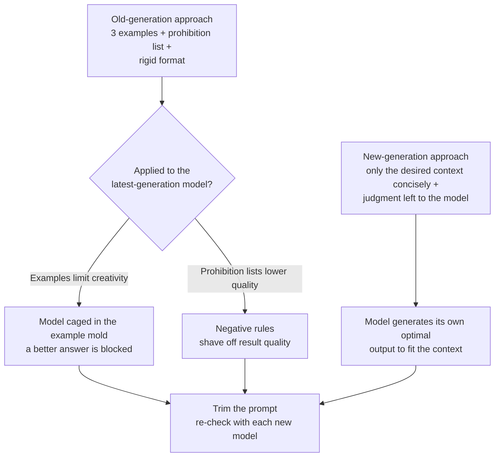

If you write and maintain system prompts yourself, you have probably felt at some point that results get better as you pack in more examples and rules. Yet the direction Anthropic recently shared flips that intuition head-on. The conclusion first: once a model is smart enough, examples and prohibition rules become not a help but a shackle that actually shaves off performance, and so the new best practice is to remove from the prompt rather than add to it. Anthropic applied this very principle to its own product and cut the Claude Code system prompt by more than 80%. This post lays out why that happened and how we should rewrite our prompts.

## Why Read This

This post is written for developers who design and maintain system prompts, and for platform owners who operate an agent harness. The core conclusion is this: when dealing with the latest generation of models, you get better results by conveying only the concise context of the outcome you want and leaving the rest to the model's judgment, rather than by attaching examples and lengthening lists of "do not do this, do not do that." Knowing this lets you break the habit of inheriting a prompt with each new model and endlessly bolting on more, and instead make trimming the prompt a regular checklist item.

## Overview

For the past few years, the common wisdom of prompt engineering was "be specific, be plentiful." Attaching two or three examples of the desired output, listing what not to do, and nailing down the format were seen as the path to stable results. And for the previous generation of models, this approach worked well, because a human was filling in with examples and rules the gaps the model could not fill on its own.

But as models grew smarter across generations, those gaps shrank. Anthropic trimmed the Claude Code system prompt by more than 80% for the latest generation of models and reported no measurable drop in coding evaluations. Even after stripping out a large body of examples and rules, results did not get worse. In some cases the diagnosis was that examples had been caging the model into a particular mold and blocking a better answer.

## Why Examples Become a Shackle

The heart of Anthropic's explanation is simple. The smarter a model gets, the fewer instructions, fewer constraints, and fewer examples it needs. When you attach an example, the model reads it as "so this is the shape you want" and fits itself to that shape. The problem arises when the latest model is more creative than that example. The example becomes a ceiling that pulls down the model's better answer.

Prohibition rules carry a similar trap. Listing "do not do this, do not do that" at length can actually lower result quality on the latest models. Anthropic now says it steers models in the desired direction through context rather than blocking them with rigid prohibition rules. Instead of building walls with rules, it gives the context of what it wants and lets the model judge within that.

So when a new model arrives, the advice is to trim the prompt rather than lengthen it. Much of the examples and rules accumulated for the previous model are, for the new model, an unnecessary burden or, worse, a performance-shaving shackle.

## That Does Not Mean Throwing Out Every Rule

Here an important balance must be noted. This advice is about dealing with the strongest, latest generation of models. For cheaper model tiers, or for batch work where the output format must be exactly the same on every call, the story is different. In scheduled outputs that must not waver in shape, such as a report that has to come out in the same form every day, or a JSON contract, a deterministic skeleton is still required.

Inside ThakiCloud we handle these two axes separately. For work where creativity of content is the deliverable, we give the strong model only context and widen its degrees of freedom; but numbers, enumerated values, and rendering format are owned by deterministic code, not the model. In other words, the advice to remove examples and the discipline to fix format in code do not conflict. The former is the domain of judgment and creation; the latter is the domain of format and aggregation. Lump the two into a single prompt without distinction, and you get the worst combination: examples that shackle the strong model and a format that wavers for the weak one.

## Implications for ThakiCloud Products

This discussion leads straight into practice from our Paxis viewpoint. Paxis is ThakiCloud's Agent-Native Cloud, a control plane that treats Skills, Tools, and Policies as first-class resources. It selects from more than 960 skills via BM25 and runs them in isolated sandboxes. Here, each skill's specification and system prompt are precisely the subject of the context engineering this post describes.

Carrying this post's lesson into the Paxis skill harness yields two practices. First, in skills that deal with strong models, minimize examples and prohibition lists and leave only the concise context and boundaries of the desired outcome. Keep the harness thin and the knowledge thick, but make that knowledge a set of judgment criteria distilled from failures, not a parade of examples. Second, when introducing a new model, do not automatically inherit skill specs and keep bolting on; instead, run a check that trims the examples and rules that have become unnecessary. This is the same idea as Anthropic's advice to trim the prompt with each new model.

There is a gain from the infrastructure ai-platform lens too. A shorter system prompt means fewer input tokens per call, which translates directly into cost savings in a K8s-based multi-tenant serving environment. Trimming a prompt is a rare piece of work that improves quality and cost at the same time.

## Limitations and Counterarguments

Accepting this advice uncritically is dangerous. First, "remove the examples" is limited to strong, latest models and does not transfer as-is to lower-capability models or to work with strict format requirements. Second, whether performance actually holds after stripping examples must be confirmed by evaluation. Anthropic's report of no drop in coding evaluations was itself a measured result, not a decision made on intuition alone. Skip evaluation while shrinking the prompt, and you may miss an invisible quality drop. Third, this direction leans on the characteristics of a specific model family, so we cannot conclude that the same margin holds for other vendors' models or for open-weight models.

## Wrap-Up

Boiled down to one sentence, the new rule of context engineering is this: when dealing with the latest models, do not try to fill the prompt by lengthening it; trim it and leave it to the model's judgment. Examples and prohibition lists were a safety net for the previous generation, but for this generation they can be a ceiling that blocks a better answer. That said, this advice is limited to strong models and the domain of creation; for work where format must not waver, a deterministic skeleton is still required. The next time you introduce a new model, before worrying about what more to add to the prompt, check first what you can remove. And after removing, always confirm with evaluation. That is how you make this shift your own, safely.

## Sources

- The new rules of context engineering for Claude 5 generation models, Anthropic (<https://claude.com/blog/the-new-rules-of-context-engineering-for-claude-5-generation-models>)
- A Fireside Chat with Cat and Thariq from the Claude Code team, Simon Willison (<https://simonwillison.net/2026/Jul/21/cat-and-thariq/>)
