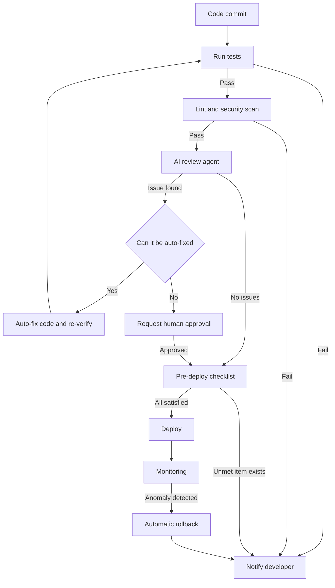

If you're building solo and have to ship every day on top of that, this post is meant to save you that time. With no colleague around to review your code, it walks through what to set up, and in what order, to hand testing, code review, and deploy decisions to AI agents, along with real workflow configuration.

In traditional CI/CD, the pipeline may run automatically, but the actual judgment call still comes from a human. You read the logs, track down the cause when a red light shows up, and click deploy by hand once tests pass. Hand that judgment process itself to an AI agent, and you can deploy twelve times a day without your review time growing at all.

The more solo the pipeline, the more likely hand-rolled judgment criteria are to drift from person to person, or even from one day's mood to the next. You might wave off a test failure today, then spend half a day stuck on the exact same failure next week. The sequence covered in this post is aimed at reducing that drift: lock in your judgment criteria as a document before writing any code, have both you and the AI agent reference that same document, and set conditions that catch anomalies on their own even after deployment. You can copy the configuration files below as-is to get started, then adjust just the values to fit your project.

## Define the Gate First

Before writing the pipeline, there's something to decide first: pinning down, as a document rather than code, what conditions must be met for something to become a deploy candidate. We call this a gate, and without one, even handing verification off to an AI agent leaves it with no basis for telling a pass from a failure.

When you set up a gate, write it in a form both a human can read and a tool can parse. Below is a gate definition you can actually use. Keep it as a file like `.github/deploy-gate.yml` at the project root, and have both the pipeline and the AI review agent reference the same file.

```yaml
# .github/deploy-gate.yml
gate:
  test_coverage_min: 70          # percent; fail if below this value
  lint_errors_max: 0             # allowed number of linter errors
  security_high_vuln_max: 0      # allowed number of high-priority vulnerabilities
  build_must_pass: true
checklist:
  - id: db_migration_rollback
    label: "If there is a DB migration, does a rollback script exist"
  - id: env_var_sync
    label: "Have newly added environment variables been reflected in the deploy environment"
  - id: api_docs_match
    label: "Does the API documentation match the actual response schema"
  - id: dependency_scan
    label: "If dependencies changed, did the vulnerability scan pass"
```

The values in this file aren't the point. A coverage threshold of 70 percent or zero vulnerabilities are just example thresholds, so adjust them to fit your project's nature. What matters isn't the numbers, it's that the gate conditions live in a single file separate from the pipeline code, and that both you and the AI agent look at that same file. If you want to change a condition, you only need to edit this file; there's no need to dig through the pipeline scripts.

Attaching the gate afterward flips the order. If you write the pipeline first and only then think about what to verify, you end up bolting conditions onto a script that's already running, and verification tends to get loose. Keep the order of deciding pass conditions first and then filling in each stage to match those conditions, and the workflow file you'll see next stays a thin layer that just reads and executes this gate file. The checklist items work the same way: it's realistic to start with just two or three and add items as you notice things you missed after deploying. Trying to build a perfect list from the start only delays getting going.

## Attach the Gate to the Workflow

If you're using GitHub Actions, the next step is wiring the gate file into the actual workflow. The configuration below runs tests and lint first when a commit is pushed, then only moves on to the AI review stage once both pass. Fill in the actual call in the AI review stage to match whatever review tool you use.

```yaml
# .github/workflows/deploy.yml
name: ai-native-deploy

on:
  push:
    branches: [main]

jobs:
  verify:
    runs-on: ubuntu-latest
    steps:
      - uses: actions/checkout@v4

      - name: Run tests
        run: |
          pip install -r requirements.txt
          pytest --cov=. --cov-report=xml --cov-fail-under=70

      - name: Run lint
        run: |
          pip install ruff
          ruff check . --exit-non-zero-on-fix

      - name: Security scan
        run: |
          pip install pip-audit
          pip-audit --strict

  ai-review:
    needs: verify
    runs-on: ubuntu-latest
    steps:
      - uses: actions/checkout@v4
      - name: Run AI review against the gate file
        run: |
          echo "Here you iterate over the checklist items in .github/deploy-gate.yml,"
          echo "call the AI review agent, and leave the result in the job summary"

  deploy:
    needs: ai-review
    runs-on: ubuntu-latest
    steps:
      - uses: actions/checkout@v4
      - name: Deploy
        run: echo "Here you run the actual deploy script"
```

If the `verify` job fails, neither `ai-review` nor `deploy` runs. Using the `needs` keyword to establish order and dependency between jobs prevents the waste of code with broken tests ever reaching AI review. Placing cheap checks first and expensive checks later is itself a design decision. Tests and lint finish in seconds, but calling AI review takes time and costs money.

You can slice this order even finer. Inside the `verify` job itself, let deterministic tools, the test runner, the linter, and the security scanner, decide pass and fail on their own, and only call a separate judgment agent when a numeric metric like code complexity or coverage crosses a specific threshold. Splitting things into these two stages means most commits pass through only the deterministic checks and stop there, and only genuinely ambiguous cases move on to the more expensive judgment stage. That beats running a heavy judgment pass on every single commit, both in time and in cost.

I'd also recommend, when logging the `ai-review` job, not just recording pass or fail but also leaving what was reviewed and on what grounds that judgment was made, in the job summary or a PR comment. When you later need to retrace why the pipeline let a particular commit through, or why it blocked one, that record becomes your only clue. Without a record, you have to start from scratch to find the cause every time the same problem recurs.

Here's the overall flow as a diagram.



The verification cost grows the further down and to the right you go. Getting caught at the test stage costs you a few seconds; getting rolled back after reaching deploy affects your users too. That's the reasoning behind arranging the verification order this way.

## Give the AI Review Agent Project Context

Just bolting on an AI review tool as-is gets you back generic remarks like "this function is too long." To get feedback specific to your project, you need a configuration file that tells the review agent your domain terms, your list of sensitive functions, and your project's own rules ahead of time.

```yaml
# .github/ai-review-context.yml
domain_terms:
  ps: "payment_status. Represents payment status; the value is one of pending / paid / refunded"
  ttl: "token time-to-live. Expiration time in seconds"

sensitive_functions:
  - path: "src/payments/*.py"
    reason: "Payment processing code must always go through security review when changed"
  - path: "src/auth/*.py"
    reason: "Auth logic changes must also confirm whether session invalidation is needed"

custom_rules:
  - id: api-error-shape
    description: "API error responses must always include the two fields error.code and error.message"
  - id: no-print-in-handler
    description: "Use the configured logger instead of print in request handlers"
```

With this file in place, when the AI review agent sees a variable named `ps`, it knows it's shorthand for `payment_status` and reviews it accordingly. You can also have it automatically route to a more careful review path whenever a file under `src/payments/` changes. Filling in just these three sections, domain terms, sensitive functions, and custom rules, already makes a noticeable difference in review quality.

You also need to decide ahead of time whether review results get applied to code automatically. The criterion is simple: auto-fix issues that just need a rule followed, like formatting, and have a human approve issues that require understanding intent, like security or business logic. In the workflow example above, the `E` (can it be auto-fixed) branch is exactly this criterion in practice.

When you first set this criterion, I'd recommend starting with a very short auto-fix list. For example, keep only formatting rule violations as auto-fix targets at first, and move slightly more complex items, like updating test stubs after an interface change, over once you've built up trust. Conversely, it's safer to exclude any path registered under `sensitive_functions`, like payments or auth, from auto-apply no matter how trivial the change looks. You can always widen the scope later, but the cost of undoing a wrongly auto-applied change is far higher.

## Rollback Conditions That Catch Post-Deploy Anomalies

Verification doesn't end when deployment finishes. A solo developer doesn't have the bandwidth to keep watching the monitoring screen right after deploying, so it's safer to define rollback conditions as code and let the system roll back on its own, without a human, once conditions are met.

```yaml
# .github/rollback-triggers.yml
triggers:
  - id: error-rate-spike
    condition: "http_5xx_rate > baseline_5xx_rate * 3"
    window_minutes: 5
  - id: latency-spike
    condition: "p95_latency_ms > baseline_p95_latency_ms * 5"
    window_minutes: 5
  - id: payment-failure-spike
    condition: "payment_failure_rate > baseline_payment_failure_rate * 2"
    window_minutes: 10
on_trigger:
  action: rollback_to_previous_deploy
  notify:
    - channel: slack
      target: "#deploy-alerts"
    - channel: email
```

There's a reason the thresholds are set as multiples of the baseline rather than absolute values. Because the normal range differs between low-traffic hours like the middle of the night and peak-traffic hours, a multiple of the baseline reduces false positives compared to a fixed number. And don't stop at just triggering the rollback; send what the problem was, when the rollback happened, and what the state looks like after rollback to your alert channel too, so you can act on the next step quickly.

After a rollback, keep the order of fixing the root cause and then reflecting that fix in tests. Adding one test case that reproduces the situation that tripped the rollback condition prevents the same cause from crashing a future deploy again.

When you first set the thresholds, it's reasonable to plug in the average from your last few deploys as `baseline`, then nudge the multiplier up a bit if false positives are frequent once you're operating it. Trying to find the perfect multiplier from day one just wastes time. And I'd recommend keeping a separate record of the `id`, trigger time, and previous deploy version each time a rollback fires. If the same trigger keeps firing months later, that's a signal the problem isn't the code, it's that the trigger threshold itself doesn't fit that endpoint's characteristics.

## The Tools Already Exist

You don't need to buy a pile of new tools for this setup. Below is a combination that fits a solo developer's budget.

| Purpose | Tool | Cost |
|---|---|---|
| Code repository | GitHub | Free |
| CI/CD pipeline | GitHub Actions | Free (with time limits) |
| Test automation | pytest, unittest | Free |
| Security scanning | pip-audit, Dependabot | Free |
| Deployment | Vercel, Railway | Has a free tier |

The core work isn't buying more tools, it's actually creating the three configuration files covered above, the deploy gate, the review context, and the rollback conditions, in your repository. If you adopt tools without these files, the AI agent has nothing to judge by and just gives you generic answers. Don't try to automate everything at once; I'd recommend starting by creating just the gate file and wiring it into the test and lint stages. Once that one is settled, add the review context file and the rollback condition file in order.

The reason for this order is to start with what's easy to undo if it fails. Even the gate file alone secures the minimum safety net that only what passes tests and lint gets deployed. Add the review context file on top, and the AI starts recognizing your project's own rules; finally add rollback conditions, and things get managed automatically even after deployment. Rather than trying to build all three files at once and failing, adding them one at a time and watching each stage actually work for a few days gets you to a stable pipeline faster in the end. Once this setup stabilizes in one repository, you can reuse it in other projects by copying the three files as-is and just changing the values.

## From ThakiCloud's Perspective

We serve our K8s-based AI platform in customers' on-premises environments, and we've repeatedly confirmed that gates and checklists like the ones above only get followed consistently across teams once they're established as a platform-level standard rather than something buried inside each application's own code. When every team defines its own gate file in its own repository, the standard splits into as many variants as there are projects; one repo has a coverage threshold, another doesn't. Keeping deploy gates and rollback triggers as an org-wide common template, with each repository only overriding values, has worked better in actual operation. The same principle applies just as well when a single solo developer is running several projects at once.

This post is adapted into a hands-on format from the content of our ebook, AI-Native CI/CD for Solo Developers.
