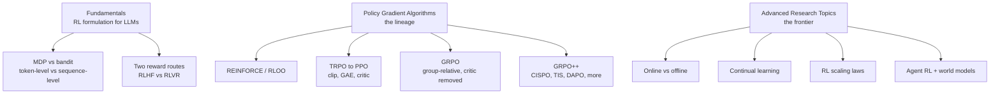

## Why read this

If you are an ML engineer who runs (or will run) LLM post-training, or a data scientist who wants to know "why reasoning models are trained with RLVR and alignment models with RLHF," read this guide. The bottom line first: the most systematic entry point available today for tracing the LLM reinforcement learning algorithm lineage (REINFORCE, PPO, GRPO, GRPO++ variants) and the frontier topics (online vs offline, scaling laws, continual learning, agent RL) from first principles in a single resource is Cameron Wolfe's post. You use it to get the map before reading individual papers, and dive deep only into the sections you need.

## Overview

"Reinforcement Learning for LLMs: The Complete Guide" by Cameron R. Wolfe (Ph.D., Netflix Research), published on his Substack Deep (Learning) Focus on August 24, 2026, is, as the subtitle says, a single standalone resource that "traces the evolution of RL in LLM research from first principles to the frontier of modern research." It is an integration of external resources and the author's own past writing, while providing deep-dive links for each section where you want more depth.

The guide's premise about RL's place is clear: from creating early instruction-following models to alignment and safety to solving complex reasoning problems, RL has played a decisive role in LLM history, and the hottest problems right now (reasoning, knowledge work, agents, token efficiency, reliability) are all being addressed through RL. The subject of this post is not "why RL matters in LLMs" but "which algorithms, with which design decisions, are used for the RL that has become so central," laid out on one map.

## The guide's structure

The whole splits into three major axes.

### Fundamentals: from formulation to the two reward routes

An LLM can compute both per-token probabilities and full-completion probabilities, so RL can be formulated as either an MDP or a bandit. Both are used in practice. REINFORCE and RLOO are usually bandit formulations, PPO an MDP formulation. The distinction matters because it changes the unit of reward and credit assignment. The MDP handles state, action, and reward at token level; the bandit handles outcomes at completion level.

Where the reward comes from splits into two routes. RLHF (Reinforcement Learning from Human Feedback) trains a reward model on preference data - prompts with chosen and rejected completion pairs - and runs RL on that model's scores. RLVR (Reinforcement Learning with Verifiable Rewards) uses the signal of a rule-based or deterministic verifier (correctness, test pass) directly as the reward. The move of reasoning-model post-training toward RLVR follows from the judgment that verifiable rewards are less biased and easier to scale than preference models.

### Policy gradient: from REINFORCE to GRPO

The algorithm lineage is the chronology of "how do we estimate policy gradients stably."

- **REINFORCE / RLOO**: the simplest policy gradient. RLOO uses the average of other samples for the same prompt as a baseline to reduce variance.
- **TRPO to PPO**: to prevent large updates from breaking performance, trust regions (KL constraints) are kept, and PPO simplifies TRPO's constraint problem with clipping. LLM PPO implementations usually estimate advantage with GAE (Generalized Advantage Estimation), a structure that accumulates TD residuals with gamma and lambda weights. The critic (value model) predicts per-token value, which produces both the advantage and the returns used to train the critic.
- **GRPO**: samples a group of completions for the same prompt and builds advantage from the relative position of rewards within the group (mean, standardization), removing the critic entirely. Removing one value model greatly cuts training pipeline cost and complexity, which is why GRPO became the default for LLM RL.
- **GRPO++ (variants)**: fine-tuning at the top of the lineage. CISPO uses the same importance ratio as PPO and GRPO, but instead of clipping to eliminate the contribution of a token whose ratio leaves the preferred range, it clips the ratio and uses it as a stop-gradient importance weight. The difference is that it modulates the magnitude of token contributions. TIS uses the ratio for a different purpose: correcting the systemic mismatch between training and inference engines. DAPO fixes loss aggregation and overlong handling. The original GRPO's "per-sequence average, then batch average" aggregation creates a subtle bias where tokens in longer sequences contribute relatively less to the gradient; DAPO corrects it with a plain average over all tokens in the batch. For completions exceeding the max length, it uses a soft length penalty that ramps up gradually instead of a hard penalty, and excludes cut-off samples with unreliable reward signals from the PG loss.

### Advanced: four frontier topics

Online vs offline is about "how often do you sample fresh data," and it is not a complete binary. On-policy data consistently showed positive effects on performance, and active exploration is needed in difficult settings where responses receiving high reward are rare under the initial policy. However, much of the online benefit can be recovered semi-online by periodically refreshing training data with on-policy samples, and asynchronous RL infrastructure leaves the problem of handling partially off-policy rollouts (long-running rollouts that finish after several policy updates). The common conclusion: fresh on-policy data is a necessary ingredient for good results.

Continual learning is another strength of on-policy RL. On-policy updates stay near the current model's plausible behavior, so distribution shift from the initial model (measured in KL) is small, which correlates strongly with reduced forgetting. SFT learns new tasks well but gradually loses old ones, while sequential RL approaches multi-task training nearly without replay buffers or regularization. Nemotron-Cascade is a real example of such a sequential RL pipeline.

RL scaling laws are messier than pretraining's. Pretraining scales smoothly with held-out cross-entropy, while RL uses application-specific metrics like downstream reward and accuracy, making universal laws hard. Still, RL performance does scale predictably with compute, early training phases can be extrapolated to filter recipes quickly, and beyond step count, batch size, data reuse, and rollout compute (samples per prompt) are confirmed performance levers.

Agent RL and world models are the far end of this map. The current research axis from reasoning to knowledge work, agents, token efficiency, and reliability is connected by the author to deep dives for each.

## ThakiCloud product implications

**Maxis lens.** If Maxis's RL fine-tuning pipeline documentation needs to explain "which algorithm, and why," the policy-gradient section of this guide is its skeleton. How much GRPO's critic removal actually cuts pipeline cost, which bias DAPO's loss-aggregation correction removes, how CISPO and TIS use the same importance ratio for different purposes - you get the comparison baseline in one place. In particular, the "training engine vs inference engine mismatch (TIS)" topic is a problem MLOps environments where the serving engine and training engine differ actually meet.

**Paxis lens.** The agent RL and continual learning fragments serve as design references for the Paxis self-evolution loop. The finding that on-policy data suppresses forgetting overlaps directly with the problem of "acquire new capabilities while retaining existing ones" in agent systems that add skills and policies sequentially.

**Caveat.** This post is an integrated guide, not primary research. The deep-dive links in each section (PPO for LLMs, GRPO++ tricks, RL scaling laws, online RL) and the original papers they cite are the source of truth. Some implementation-level code (GAE snippets, etc.) is included, but to use it as a reference when building pipelines directly, read it alongside framework docs such as trl and verl.

## Limitations and counterarguments

First, the depth limit of an integration. Compared to dedicated textbooks like Sutton and Barto or The RLHF Book, the focus is on concept and structure understanding rather than mathematical derivation. Readers who need to re-derive the algorithms need supplementary material.

Second, a snapshot of a moving field. The GRPO++ variants (CISPO, TIS, DAPO, etc.) are organized as of publication, and new variants after the guide's release date (2026-08-24) are not included. Use the frontier topics as the "current map," and verify detailed numbers against the originals.

Third, the Substack format. The body is free, but some of the author's other deep dives are tied to paid subscriptions, and the image-heavy exposition requires following original links for readers who want text only.

## Conclusion

For someone who has learned LLM reinforcement learning only as "paper fragments," this guide places the algorithm lineage and design decisions on one map. Four bones to remember. RL is formulated as both MDP and bandit, and reward has two routes, RLHF and RLVR. The lineage runs REINFORCE to PPO to GRPO, and GRPO's core is removing the critic with group-relative reward. The variants above it (CISPO, TIS, DAPO) subdivide the uses of ratio and loss aggregation.

The next action is simple. Take the RL setup you are running or preparing (algorithm, reward type, online/offline, critic presence or not) and place it on this map one by one. Knowing where you sit is itself the starting point for judgments like "why GRPO" and "do we need TIS."

---

*Source: [Cameron R. Wolfe, "Reinforcement Learning for LLMs: The Complete Guide"](https://cameronrwolfe.substack.com/p/llm-rl), Deep (Learning) Focus, 2026-08-24. Author site [cameronrwolfe.me](https://cameronrwolfe.me/). The descriptions in this guide were verified directly against the original (Substack).*
