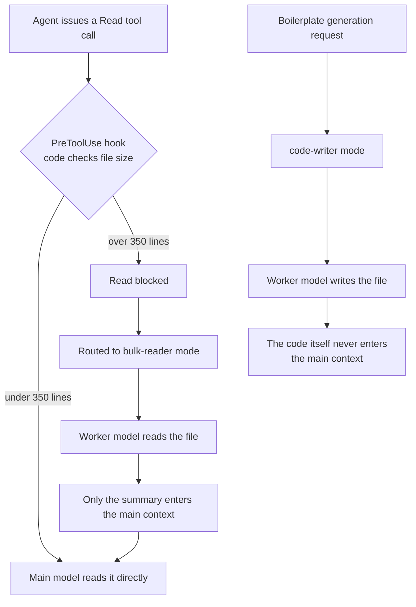

*The same read request takes different paths depending on file size. The decision is made by code, not by a model. That is the core of shunt.*

## Why read this

This post is for people who run Claude Code or a similar AI coding agent daily and have started to feel the token bill. Here is the headline conclusion first: Spotify's hook-based routing pattern is worth copying, but the "90% cut" in their post is a number from their environment. When we replayed the same pattern against 1,099 of our own session transcripts, the default threshold (350 lines) would have offloaded only 14% of our read bytes, and the median size of our reads is 158 lines. What matters more than the number is the principle: the routing decision belongs to deterministic code, not to the model.

## Overview

On September 7, 2026, a Spanish developer's X post went viral: "Spotify cut Claude Code token usage by 90%. How? With an internal intelligent router." The primary source is a [post on Spotify's engineering blog about Portal](https://engineering.atspotify.com/2026/9/portal-by-spotify-cut-my-claude-code-token-usage-by-90), and the tool itself is the shunt plugin in the [spotify/portal-ai-plugins repository](https://github.com/spotify/portal-ai-plugins).

shunt is a Claude Code-only plugin that uses Claude Code's PreToolUse hook to inspect incoming file-read requests. When a file exceeds the default of 350 lines, the read is blocked and handed off to an AiKA mode (an agent running on an ephemeral runtime) backed by a cheaper worker model. The bulk-reader mode reads the file instead and sends only a summary back into the main context. A second mode, code-writer, has the worker model write boilerplate directly to the file so that the generated code never enters the main model's context at all.

According to the blog, their Java monorepo test showed a mean 90% token saving in bulk-read scenarios. As the [dev.to analysis](https://dev.to/jamilxt/spotify-cut-claude-code-token-usage-by-90-percent-the-pattern-works-in-any-ai-agent-2i4b) notes, the worker model still consumes tokens, so nothing is free: what moves is the share of I/O work that used to be spent on the frontier model.

For context on Portal: it is Spotify's developer platform, rooted in the open-source developer portal framework Backstage. shunt uses Portal's AiKA modes as its execution body. An AiKA mode is a declarative agent that runs on an ephemeral runtime: the developer specifies the model, the instructions, and the tools, and Portal owns the infrastructure.

## What this tool is

The structure of shunt in one diagram:



Notice where the "intelligent" part actually is. The routing decision (size check, hand-off) is not made by a model. The PreToolUse hook is shell-level deterministic code; the only model that participates is the bulk-reader worker that reads and summarizes the file. The expensive model keeps the judgment, the cheap model takes the I/O, and the boundary between them is a single line of code.

One step slower on the mechanics: a Claude Code PreToolUse hook receives a tool call as JSON before execution and can return an allow/deny decision. shunt puts a file-size check at that point, denies the over-threshold read, and leaves the instruction "use the bulk-reader mode instead." No model opinion is involved at the routing step. The agent follows the instruction, invokes the worker mode, and only the summary returns to the original context.

There is a prerequisite. shunt requires a Spotify Portal instance for authentication (the plugin calls the Portal CLI), and it is currently exclusive to Claude Code. In other words, it only works out of the box for teams that already run Portal. But the pattern itself does not depend on Portal, and that is where our experiment starts.

## Install and integration

### Installing shunt (Portal users)

Per the upstream docs: add the Portal AI plugins marketplace to Claude Code, install both the `portal` and `shunt` plugins, and authenticate the Portal CLI.

### Our replay: validating the pattern against our own transcripts

The substance of shunt is the question "if we offload every Read result over 350 lines to a cheaper model, how much do we save?" That question can be answered without installing anything. Claude Code writes every session to JSONL transcripts under `~/.claude/projects/`, and those transcripts contain every Read tool_use, its tool_result, and the per-request usage (input_tokens, cache_read_input_tokens).

We paired Read results across 14 days of transcripts, counted lines and bytes, and ran the shunt threshold sweep. The script:

```python
# shunt_sim.py (full version: outputs/blog-impl/spotify-shunt-token-routing/)
# core: pair Read tool_use id -> tool_result, collect (lines, chars)
pending_read = set()
for rec in transcript:
    if rec.type == "assistant":
        for b in rec.message.content:
            if b.type == "tool_use" and b.name == "Read":
                pending_read.add(b.id)
        usage = rec.message.usage   # input_tokens, cache_read_input_tokens
    elif rec.type == "user":
        for b in rec.message.content:
            if b.type == "tool_result" and b.tool_use_id in pending_read:
                text = result_text(b.content)
                pairs.append((text.count("\n") + 1, len(text)))

# threshold sweep: byte share of results larger than T lines
for T in (100, 350, 1000):
    off = sum(ch for ln, ch in pairs if ln > T)
    print(f"T={T}: {100*off/total_chars:.1f}% of Read chars offloadable")
```

The run executed inside an isolated git worktree sandbox; the log is preserved as `run-2.log`.

## Real experiment results

The numbers from our recent 14 days (1,099 session transcripts):

| Metric | Value |
|---|---|
| Requests with usage | 39,681 |
| input_tokens sum (per-request cumulative) | 7,725,096,590 |
| cache_read sum | 3,652,655,545 |
| Read tool_use calls | 1,446 |
| Agent/Task tool_use calls | 102 |
| Paired Read results | 1,383 |
| Read result lines p50 / p90 / max | 158 / 180 / 1,018 |

The size distribution of Read results, split around shunt's 350-line threshold:

| Line range | Count | Chars (tokens ≈ chars / 3.5) |
|---|---|---|
| 0-100 | 549 | 1,464,181 |
| 101-350 | 774 | 6,693,269 |
| 351-1000 | 59 | 1,275,486 |
| over 1000 | 1 | 49,255 |

The chart makes it sharper:


*(a) Line-size distribution of 14 days of Read results. 70.6% of the bytes sit in the 101-350 line band. (b) Offloadable share of Read bytes when the shunt threshold is swept to 100/350/1000 lines.*

Three numbers matter.

First, **at the default threshold of 350 lines, only 14.0% of Read bytes are offloadable**. shunt's default fit their Java monorepo; it does not fit our reading habits. 70.6% of our read bytes live in the 101-350 band, one step below the default threshold.

Second, **dropping the threshold to 100 lines jumps the number to 84.6%**. The sweep gave 84.6% at T=100, 14.0% at T=350, and 0.5% at T=1000. The payoff of this pattern is not guessable from a threshold constant; it requires measuring your own read distribution.

Third, **Reads are 0.02% of total input traffic**. Estimated Read tokens (about 2.7M) divided by the sum of per-request input_tokens and cache_read (about 11.4B) is 0.02%. What dominates our token cost is not file reading but the resident context re-sent on every request, i.e. the cache_read axis. Whether shunt cuts "90%" or "14%", both percentages are shares inside Read bytes. If you do not know where that slice sits in the whole ledger, you will overestimate the saving.

## Implications for ThakiCloud products

This pattern is a miniature of what Paxis does every day.

Paxis designs agent workflows so that routing is owned by deterministic code rather than model discretion. BM25 selection over 960+ skills, permission scoping, parallel execution orchestration: all code-owned. The same principle as shunt's "hook checks size and hands off to a mode." The model produces content; code draws the boundary.

It is familiar from the ai-platform side too. Our fleet already runs "expensive model for judgment, cheap model for labor" routing on three layers.

| Layer | Our implementation | shunt equivalent |
|---|---|---|
| Session boundary | subagent-model-routing (read-only/search = haiku, implementation = sonnet) | delegation to bulk-reader |
| Schedule boundary | skill_model_policy (start at sonnet, escalate to opus on consecutive failures) | delegation to code-writer |
| Engine boundary | in-house Qwen gateway (31 unattended runners) | the worker model itself |
| Tool boundary | (not wired) | **PreToolUse hook = shunt** |

What shunt fills is the fourth row, the tool boundary. Delegating through the Agent tool costs a fixed price per delegation: the worker gets its own resident context (our measurement: roughly 200k). A hook-based hand-off, by contrast, spins up no session at all and delegates with a single API call, so its fixed cost is low. The trade-off is that the delegation target stays limited to "read/summarize" work. The two approaches are not competitors; they are different points on the cost-benefit curve of read size.

If you want the pattern without Portal, the minimal implementation is simple: a PreToolUse hook that counts the lines of the file a Read targets and, past your threshold, blocks the read and injects a cheap-model summary as the tool_result. A script of about a hundred lines. But remember the lesson above: do not start the threshold at 350. Measure your read distribution first, then pick it.

## Limits and counterarguments

First, 90% is a scenario number. Spotify's 90% is the mean saving in bulk-read scenarios, and the dev.to analysis notes that net savings shrink once the worker model's own consumption is counted. It is not "90% of your total session cost."

Second, the hook adds a round-trip to every Read. The step of counting file lines attaches to each read, so in workloads where reads are short and frequent, that fixed cost can eat into the offload gain. Our T=100 sweep showing 84.6% is on read bytes; the hook round-trip cost is not in that arithmetic.

Third, shunt presupposes Portal authentication. Teams without Portal cannot run the plugin at all and must port the pattern. Read it as "a pattern and its preconditions," not as an install-and-go tool.

Fourth, our measurement contains approximations. The chars-to-tokens conversion (1/3.5) is an estimate, and the line counts are based on the cat -n result format, which differs slightly from raw file lines. Direction and ratios are trustworthy; absolute values are not.

Fifth, and the most practical: routing reads to a cheaper model routes the comprehension of those reads down with them. If 5 lines out of a 350-line file carry the critical context and the worker's summary misses them, the main model decides blind. A threshold is not only a cost line; it is also a quality boundary.

## In summary

What Spotify's shunt shows is not the "90%". It is a way to move the token-routing decision out of the model and into code. When we measured the same pattern on 14 days of our own transcripts, the default 350-line threshold would offload only 14% of our read bytes, and our read distribution's median is 158 lines. Dropping the threshold to 100 lines would raise it to 84.6%, but the fact that Reads are 0.02% of total input traffic does not change.

So two actions follow. One: whether you use shunt or write your own hook, set the threshold from your own read distribution, not from 350. Two: before reaching for Read savings, look at the dominant line of the ledger, context re-send (cache_read). The biggest lesson shunt gave us is not a routing trick. It is the habit of checking what percentage of the whole a percentage refers to.

---

**Sources**

- midudev X post (2026-09-07): <https://x.com/hjguyhan/status/2097084562996449507>
- Spotify Engineering: Portal by Spotify cut my Claude Code token usage by 90% (2026-09): <https://engineering.atspotify.com/2026/9/portal-by-spotify-cut-my-claude-code-token-usage-by-90>
- GitHub: spotify/portal-ai-plugins (shunt): <https://github.com/spotify/portal-ai-plugins>
- dev.to: Spotify cut Claude Code token usage by 90%: the pattern works in any AI agent: <https://dev.to/jamilxt/spotify-cut-claude-code-token-usage-by-90-percent-the-pattern-works-in-any-ai-agent-2i4b>
