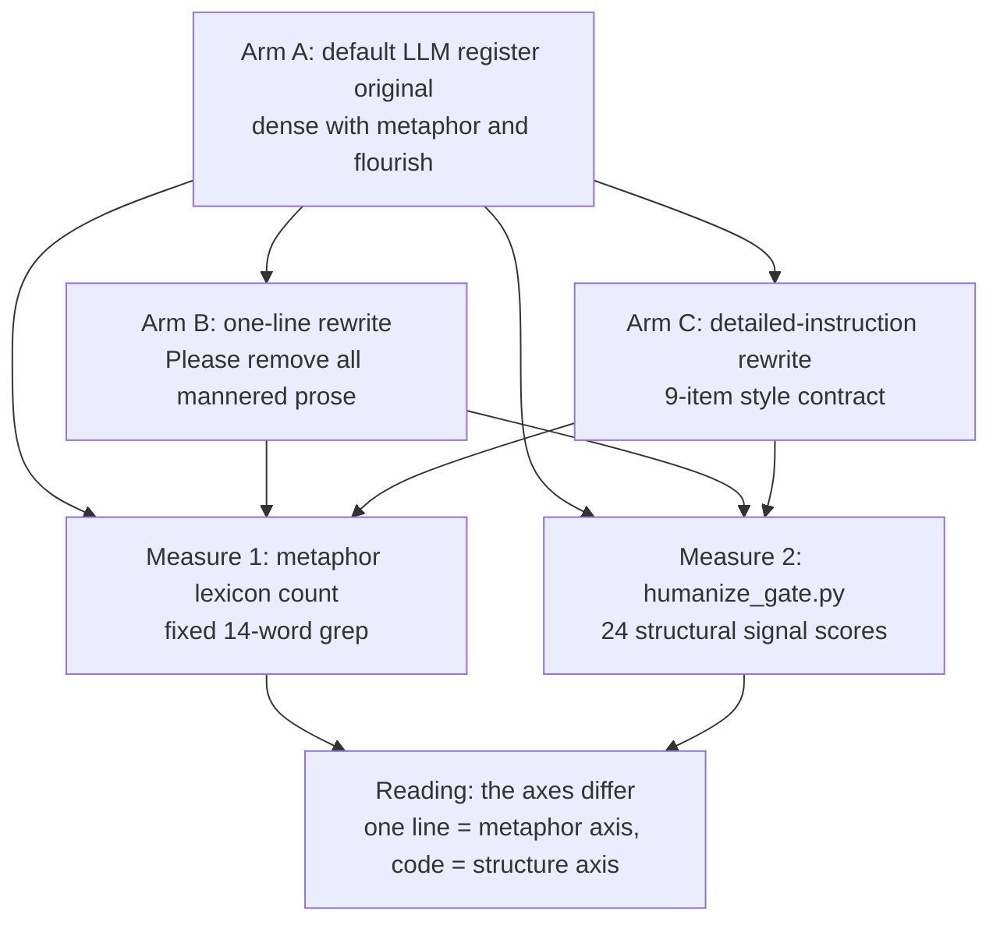

## Why read this

If your team produces blogs, whitepapers, or reports with LLMs, it is time to fix the price of de-AI-ing the output. This post splits that price with experiment numbers: how much does one line do, how much does a detailed instruction do, and what is left for a code gate.

The core conclusion first. The one-line instruction "Please remove all mannered prose", which Anthropic added to the Fable 5.1 prompting guide, removes exactly the axis it names: metaphor and flourish. It does not finish the job on structural tells like comma rhythm and nominalization. In our 3-round rewrite experiment, the one-liner took metaphors from 28 instances to 0 and cut structural-tell signals from 15 to 5. Different axes, different jobs. That division of labor is the conclusion of this post.


*The concept of the post: ornament reduced to a clean line.*

## Overview

In most LLM output quality discussions, "removing the AI smell" is handled as a sentence in the prompt. Please write naturally, please do not write like an AI. That is the usual shape. But what that sentence-level request actually removes has mostly been accumulated as a feeling, not as a measurement. This experiment starts from two facts. One is that Anthropic documented a one-line instruction in an official guide. The other is that our pipeline already measures structural tells with a deterministic code gate. If we measure the boundary between the two, the question "is one line enough" becomes "what can one line stand in for".

Let me pin down what mannered prose is. The definition in Anthropic's guide and in the third-party analyses that followed is the same. It is a style that substitutes direct statements with metaphors and flourishes, where the phrasing aims to display the writer rather than convey the idea clearly. "The wave of innovation", "a dial worth turning", "the first step into the future" are representative examples. One or two of these read as alive. Layered across an essay or a report, they make the text imprecise and raise the reader's effort.

## What this technique is

Anthropic's Fable 5.1 prompting guide on platform.claude.com treats "writing density" as a characteristic of the model, and recommends the one-line instruction "Please remove all mannered prose" as a style control rule. The example the tweet cites is the kind that says do not write "a parameter worth changing" as "a dial to turn". The same technique has spread through independent analyses, and titles like paddo.dev's "a dial worth turning" or willfrancis.com's "How to stop Claude writing like an AI" are the document's example phrasing itself.

There are three ways to use the one-liner. First, as a user message per request, when you want this answer fixed only. Second, wired into the system prompt, when every output of that session should carry it. Third, in the CLAUDE.md of a writing-dedicated project folder, which is the practical tip from the tweet. Once it is set there, every session opened in that folder takes that style as the default.

```markdown
<!-- CLAUDE.md of a writing-dedicated project -->
## Style contract
- Apply "Please remove all mannered prose" to all outputs.
- Use direct statements instead of metaphor and flourish.
- Keep at most one triad and one antithesis per document.
```

The three ways differ only in scope. The instruction itself is identical everywhere, and that is why the document can recommend a single line.

## Installation and integration

We put this instruction in as a layer in the existing pipeline, not as a new contract. Our document generation line already has a two-layer defense. The model side carries a detailed style instruction from the humanizer, and the output is measured by deterministic code, `humanize_gate.py`. The gate runs the im-not-ai engine's 70-pattern Korean AI-tell taxonomy calibrated on our own corpus, and scores 24 structural signals such as comma rhythm, nominalization, and pronoun density.

This experiment measures what the one line changes when it goes between those two layers. The design is 3 rounds, 3 arms.

- R1 through R3 are three topics: GPU serving cost efficiency, inference engine selection, and multi-tenant GPU isolation. All three are topics our platform documents actually cover, so the experiment text doubles as product material.
- Arm A is the baseline original for each topic in the default LLM register, controlled to carry typical AI style with dense metaphor and flourish. It is the "text with the AI smell" baseline.
- Arm B is Arm A rewritten with the one-line instruction only. No other instruction was given.
- Arm C is Arm A rewritten with a 9-item detailed instruction: remove metaphor, no rhetorical questions, one triad, one antithesis, drop throat-clearing openers, drop vague intensifiers, formal endings with varied sentence-final endings, no em or en dashes, keep facts and order. It is the style of instruction our humanizer uses.

Two axes were measured. The first is a metaphor lexicon count. From the D-14 (generated metaphor) family dictionary we fixed a set of 14 words (blueprint, cornerstone, threshold, tide, dial, springboard, horizon, wave, current, foundation, bedrock, lighthouse, gatekeeper, anchor) and counted them with grep. This axis is the closest measurement to "mannered prose proper", because generated metaphor is not one of the code gate's 24 signals. The second is the JSON output of `humanize_gate.py score`, which counts targeted structural signals and the risk band.



*The 3-round experiment pipeline. The same original is split by the one-liner and the detailed instruction, then recombined at the two measurement axes.*

## Actual experiment results

All the numbers. The experiment log is at `outputs/blog-impl/mannered-prose-one-liner/run-1.log`, and the table below is taken from that log.

| Round | Arm | Chars | Metaphor lexicon | Gate targets (C-11 excluded) | Risk band |
|---|---|---|---|---|---|
| R1 GPU serving cost | A | 686 | 11 | 5 | low |
| R1 | B (one line) | 504 | 0 | 1 | low |
| R1 | C (detailed) | 445 | 0 | 1 | low |
| R2 inference engine | A | 513 | 7 | 7 | medium |
| R2 | B | 315 | 0 | 2 | low |
| R2 | C | 285 | 0 | 1 | low |
| R3 multi-tenant isolation | A | 508 | 10 | 3 | low |
| R3 | B | 381 | 0 | 2 | low |
| R3 | C | 355 | 0 | 2 | low |
| Total | A | - | 28 | 15 | - |
| Total | B | - | 0 | 5 | - |
| Total | C | - | 0 | 4 | - |

The metaphor axis is unambiguous. Arm A's 28 instances fell to 0 in both Arm B and Arm C, the same shape across all three rounds. On the axis it names, the one-liner delivered the identical result as the detailed instruction. One line did everything the 9-item core of "strip the metaphor, reduce to direct statement" does.

The structure axis has a different shape. The baseline's 15 instances fell to 5 in Arm B and 4 in Arm C. Both instructions reduced structural tells as well, because stripping flourish simplifies the sentences themselves. The difference: in R1, Arm B's comma-rate signal (C-11) excess was 3.20 while Arm C was 0.34. The one-liner removed the metaphor but left the sentence's comma rhythm intact; the detailed instruction polished the rhythm too. In R2 and R3 the C-11 value was 3.20 in both arms, so the difference carries meaning only in R1.

One measurement caveat. C-11 is the ratio of commas at connective endings, and with small denominators in 300 to 700 character samples it saturates into discrete values. In this experiment, 5 of the 9 texts landed on the identical value (12.1933), which is why C-11 is excluded from the target totals in the table. Do not read short-sample C-11 differences as arm differences.

The nature of the experiment is noted honestly as well. All three arms were generated and rewritten by the same model (Claude Opus 5) under the controlled conditions. This experiment measures how far the model complies with the instruction; it is not a cross-model comparison. Arm A is a controlled reproduction of the typical AI register, not a capture of a real LLM output. The metaphor count is a subset of the D-14 canonical (family judgment, running-metaphor rule), so it is a lower bound. Each arm is n=1 per round, so do not expect statistical means.

## ThakiCloud product implications

This experiment attaches directly to the layer design of our document generation pipeline. Paxis is ThakiCloud's Agent-Native Cloud, and document production skills for reports, blogs, and whitepapers run on it. The style contract those skills used was the two-layer "detailed instruction + code gate". What this experiment showed is that placing the one-liner between those two layers fills the hole on the metaphor axis. Generated metaphor (D-14) is absent from the code gate's 24 structural signals, and upstream that axis has been operated as qualitative rules, not quantified metrics. The one-liner covers that blind spot for one line of prompt cost.

So the recommended combination for our line changes like this. Carry the one-liner (metaphor axis) on a standing basis, keep the detailed instruction (structure axis) in the production skills, and measure the output with `humanize_gate.py`. The three roles do not overlap. The one-liner strips the metaphor, the detailed instruction polishes the rhythm, and the code turns the self-report "the AI smell went down" into a number.

The ai-platform angle is serving economics. A one-line rewrite is a single LLM request that rewrites the original, one rewrite call per whitepaper or blog post. In our inference serving environment that kind of request is on the order of seconds, and because result verification is done by deterministic code it barely touches GPU time. Catching style quality with "one instruction line + code gate" instead of swapping models is an improvement that does not touch serving cost.

## Limitations and counterarguments

The strongest counterargument first. "If the one line gets this far, is the detailed instruction unnecessary?" The numbers do not make it easy to rebut. On the metaphor axis the one-liner is identical to the detailed instruction, and on the structure axis 5 versus 4 is the same order. However, R1's C-11 (3.20 versus 0.34) is evidence that the detailed instruction clearly polished the rhythm more. In long prose where comma rhythm matters, this difference can grow, so we do not retire the detailed instruction in favor of the one-liner.

The second counterargument: "How is this different from what our existing humanizer skill does?" The direction is the same. The difference is twofold. First, Anthropic's one-liner is now a vendor-documented rule. It is a style contract recommended by the model provider rather than one we made, which is a compatibility basis when moving to other models. Second, this experiment measured the one-liner's coverage axis by axis. When what the one line removes and what it leaves behind is on record as numbers, the gate verdict can replace the self-report "we reduced the AI smell".

The experiment's own limits, restated. Same-model compliance measurement, short samples, n=1, lexicon lower bound. What this experiment established is the axis coverage of the one-liner, not the proof that one line is sufficient. Whether it is sufficient depends on how many structural signals the gate leaves behind in your own outputs.

## Wrap-up

If your team produces LLM writing, do one thing today. Add "Please remove all mannered prose" to the standing instruction. The cost is one line of prompt, and we measured the metaphor and flourish axis falling from 28 instances to 0 on that one line. Then do one more thing: measure what is left with code. Structural tells like comma rhythm are the gate's share, and the gate turns the self-report into a number. The one line removes, and the code measures what remains. That is the whole experiment.

## Sources

- Anthropic, "Prompting Claude Fable 5.1" guide: https://platform.claude.com/docs/en/build-with-claude/prompt-engineering/prompting-claude-fable-5-1
- Original tweet (RT @yulmu_coffee, via @hjguyhan): https://x.com/hjguyhan/status/2097807825657618937
- Third-party analyses: https://paddo.dev/blog/a-dial-worth-turning/ · https://willfrancis.com/how-to-stop-claude-writing-like-an-ai/ · https://academy.dair.ai/resources/write-better-with-claude-fable-5-1
- Experiment ledger (internal): `outputs/blog-impl/mannered-prose-one-liner/run-1.log`
