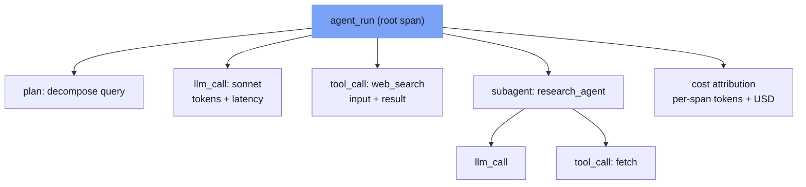

⏱️ **예상 읽기 시간**: 9분

<!-- evolve-diagram -->
*개념 다이어그램*



## 에이전트에서 로그가 의미없는 이유

단일 LLM 호출에는 전통적인 로깅이 충분히 작동합니다. 입력-출력 쌍을 기록하고, 레이턴시를 측정하고, 오류를 캡처하면 됩니다.

멀티에이전트로 넘어가면 상황이 달라집니다. 에이전트가 스스로 도구를 호출하고, 다른 에이전트에게 제어를 넘기고, 여러 LLM 호출을 연쇄합니다. 어떤 스텝에서 왜 잘못됐는지 알려면 "무슨 일이 있었다"가 아니라 "어떤 순서로, 어떤 컨텍스트에서, 무슨 결정이 내려졌는지"를 재구성할 수 있어야 합니다.

2025년 분석에서 에이전트 실패의 약 65%가 모델 능력이 아니라 컨텍스트 구성 문제에서 비롯됐다는 결과가 나왔습니다. 관찰가능성 없이는 이 종류의 실패를 진단할 수 없습니다.

---

## 에이전트 트레이싱의 세 가지 요소

### 1. 중첩 스팬

에이전트 실행은 트리 구조입니다. 루트 스팬이 전체 에이전트 실행을 감싸고, 자식 스팬이 각 LLM 호출, 도구 호출, 서브에이전트 호출을 나타냅니다.

OpenTelemetry 기반으로 직접 구현한다면 다음 구조를 따릅니다.

```python
with tracer.start_as_current_span("agent_run") as root_span:
    root_span.set_attribute("agent.name", "research_agent")
    root_span.set_attribute("input.query", query)
    
    with tracer.start_as_current_span("llm_call") as llm_span:
        llm_span.set_attribute("model", "claude-sonnet-4-6")
        llm_span.set_attribute("prompt_tokens", prompt_tokens)
        response = llm.invoke(prompt)
        llm_span.set_attribute("completion_tokens", completion_tokens)
    
    with tracer.start_as_current_span("tool_call") as tool_span:
        tool_span.set_attribute("tool.name", "web_search")
        tool_span.set_attribute("tool.input", search_query)
        result = search_tool.run(search_query)
```

중요한 건 부모-자식 관계를 스팬 컨텍스트로 전파하는 것입니다. 멀티에이전트 핸드오프에서는 이 전파가 에이전트 경계를 넘어야 합니다.

### 2. 메모리 및 상태 추적

에이전트가 각 스텝에서 어떤 컨텍스트를 갖고 있었는지를 기록해야 합니다. 특히 장기 실행 에이전트에서는 컨텍스트가 어떻게 변화했는지 추적하는 것이 진단에 필수적입니다.

상태 스냅샷을 각 주요 결정 포인트에서 저장합니다. 프로덕션 용량 문제로 전체 스냅샷이 부담스럽다면 상태의 해시와 델타만 기록해도 재구성이 가능합니다.

### 3. 비용 어트리뷰션

멀티에이전트 파이프라인에서 비용을 집계하는 것만으로는 부족합니다. 어떤 에이전트의 어떤 스텝에서 토큰이 소비됐는지 스팬 레벨로 내려가야 비용 최적화 방향을 잡을 수 있습니다.

```python
# 스팬에 비용 어트리뷰션 추가
span.set_attribute("cost.input_tokens", input_tokens)
span.set_attribute("cost.output_tokens", output_tokens)
span.set_attribute("cost.model_tier", "sonnet")  # haiku/sonnet/opus
span.set_attribute("cost.estimated_usd", estimated_cost)
```

---

## 평가 루프 설계

트레이싱이 "무슨 일이 일어났나"를 답한다면, 평가는 "잘 됐나"를 답합니다. 두 가지는 다른 레이어입니다.

### 오프라인 평가 vs 온라인 평가

**오프라인 평가**는 고정된 벤치마크 데이터셋으로 모델/프롬프트 변경을 배포 전에 검증합니다. CI/CD 파이프라인에 통합해서 회귀를 잡는 역할입니다.

**온라인 평가**는 프로덕션 트레이스를 실시간으로 샘플링해 품질 지표를 추적합니다. 분포 드리프트나 프롬프트 이슈를 배포 후에 잡습니다.

두 가지를 함께 운영해야 합니다. 오프라인만 있으면 프로덕션 실제 데이터의 분포 변화를 놓치고, 온라인만 있으면 배포 전 품질 게이트가 없습니다.

### LLM 기반 자동 평가의 함정

LLM을 평가자로 쓰는 패턴이 널리 쓰이지만 주의가 필요합니다. 평가 프롬프트가 생성 프롬프트와 같은 모델을 쓰면 자기 강화 편향이 생깁니다. 가능하면 생성 모델과 평가 모델을 다른 것으로 구성합니다.

또한 평가자 LLM의 판단 자체를 신뢰할 수 있는지 주기적으로 사람이 검토해야 합니다. 자동 평가 점수와 실제 사용자 피드백이 일치하는지 상관관계를 추적하는 것이 기본입니다.

### 평가 지표 선택

에이전트 태스크 유형에 따라 지표가 달라집니다.

| 태스크 유형 | 지표 예시 |
|------------|----------|
| 정보 검색 | 관련성, 완전성, 사실 정확성 |
| 코드 생성 | 테스트 통과율, 보안 이슈, 스타일 준수 |
| 도구 사용 | 올바른 도구 선택, 파라미터 정확성 |
| 다단계 추론 | 중간 스텝 정확성, 최종 답 정확성 |

단일 점수로 에이전트 품질을 요약하려는 욕구를 억제해야 합니다. 다차원 지표를 추적하고, 각 지표가 어느 임계값 이하로 떨어지면 알림을 보내는 구조가 더 유용합니다.

---

## 플랫폼 선택: MLflow vs LangSmith vs Arize

세 플랫폼 모두 프로덕션에서 사용 가능한 수준이지만 강점이 다릅니다.

**MLflow**는 오픈소스 기반이라 자체 호스팅이 가능하고, 에이전트 트레이싱에 리플레이 기능이 있습니다. 기존 ML 실험 추적 워크플로와 통합하기 좋습니다. 데이터를 외부로 보내기 어려운 엔터프라이즈 환경에 적합합니다.

**LangSmith**는 LangChain 생태계와 깊이 통합돼 있습니다. 에이전트 실행의 완전한 트리를 렌더링하는 고충실도 트레이스가 강점입니다. 프롬프트 관리와 평가를 함께 제공합니다.

**Arize AI**는 엔터프라이즈 규모에서의 스팬 레벨 트레이싱과 실시간 대시보드가 강점입니다. 오픈소스인 Phoenix 라이브러리로 로컬 개발 환경부터 시작할 수 있습니다.

세 플랫폼 모두 LangGraph, OpenAI Agents SDK, CrewAI 등 주요 프레임워크와 통합을 지원합니다.

---

## 프로덕션 디버깅 패턴

### 실패 트레이스 재현

에이전트 실패를 로컬에서 재현하려면 실패 시점의 전체 입력 상태(초기 쿼리, 모든 도구 호출 결과, 메모리 상태)를 스냅샷으로 저장해야 합니다. 이 스냅샷으로 동일한 에이전트를 로컬에서 재실행하면 실패를 재현할 수 있습니다.

MLflow는 이 목적으로 에이전트 리플레이 기능을 제공합니다. 트레이스에서 특정 스팬을 골라 그 시점부터 실행을 재시작할 수 있습니다.

### 컨텍스트 드리프트 감지

장기 실행 에이전트에서 자주 나타나는 실패 패턴입니다. 에이전트가 초기 목표를 망각하거나, 이전에 수집한 정보와 모순된 행동을 합니다.

진단 지표: 컨텍스트 윈도우 사용률 추적, 초기 지시사항과 현재 에이전트 행동 간의 시맨틱 유사도 측정, 도구 호출 패턴이 이전 스텝과 얼마나 다른지 추적합니다.

### 도구 오류 패턴 분류

도구 호출 실패를 단순히 오류율로만 보지 말고 유형별로 분류합니다.

- **파라미터 오류**: 에이전트가 도구에 잘못된 형식의 입력을 전달합니다. 도구 명세가 불명확하거나 에이전트 프롬프트가 도구 사용법을 잘못 설명한 경우입니다.
- **타임아웃**: 외부 API 의존 도구에서 빈번합니다. 재시도 로직과 서킷 브레이커가 필요합니다.
- **권한 오류**: 에이전트가 자신의 권한 범위를 초과한 도구를 호출하려 할 때 발생합니다.

각 유형별 빈도와 에이전트 컨텍스트를 함께 보면 시스템적인 원인을 찾을 수 있습니다.

---

## 관찰가능성 구축 순서

처음부터 완전한 시스템을 구축하려 하면 시간이 오래 걸립니다. 단계적으로 가는 것이 현실적입니다.

**1단계**: LLM 호출별 토큰 수와 레이턴시 로깅. 비용 파악과 병목 탐지에 충분합니다.

**2단계**: 도구 호출 스팬 추가. 어떤 도구가 얼마나 실패하는지 가시화합니다.

**3단계**: 에이전트 실행 전체를 루트 스팬으로 감싸고 중첩 트리를 구성합니다.

**4단계**: 핵심 태스크에 대한 오프라인 평가 데이터셋 구축과 CI 통합.

**5단계**: 프로덕션 트레이스 샘플링 기반 온라인 평가 추가.

처음부터 5단계까지 다 하려 하지 말고, 1-2단계를 먼저 안정화한 뒤 점진적으로 쌓는 것이 지속 가능합니다.

---

## 핵심 요약

관찰가능성 없이 프로덕션 에이전트를 운영하는 것은 계기판 없이 비행기를 모는 것과 같습니다. 잘 될 때는 괜찮아 보이지만 뭔가 잘못되면 어디서 잘못됐는지 알 방법이 없습니다.

트레이싱, 비용 어트리뷰션, 평가 루프는 선택이 아니라 프로덕션 에이전트의 운영 요건입니다. 처음에 단순하게 시작해도 좋습니다. 단, 나중에 추가하겠다는 생각으로 아예 없이 시작하면 실패 패턴이 쌓인 이후에야 인프라를 뒤늦게 구축하는 상황이 됩니다.

---

<!-- evolve-refs -->
## 참고 자료

- [MLflow Tracing](https://mlflow.org/docs/latest/genai/tracing/)
- [LangSmith](https://docs.langchain.com/langsmith)
- [Arize Phoenix](https://github.com/Arize-ai/phoenix)
- [OpenTelemetry GenAI Semantic Conventions](https://github.com/open-telemetry/semantic-conventions-genai)
