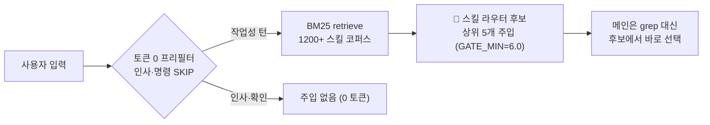
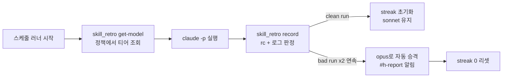

## 하루에 705달러를 태운 날

먼저 사고부터 공개합니다. 2026년 6월 1일, 우리는 9개 세션을 전부 Opus로 돌렸고 하루 추정 비용은 705달러였습니다. 그중 단 하나의 모니터링 세션이 381달러, 즉 54%를 차지했습니다. 9.4시간 동안 1145턴, ScheduleWakeup 138회를 한 세션에 누적한 결과입니다. 비용의 42%는 cache_read 195M에서 나왔습니다. 같은 날 `cd`를 153회 실행했고, 같은 파일을 10번 다시 읽었습니다.

흥미로운 점은, 그날 띄운 서브에이전트 18개는 전부 sonnet으로 올바르게 라우팅돼 있었다는 것입니다. 문제는 서브가 아니라 메인이었습니다. 메인을 Opus로 둔 채 거대한 컨텍스트를 반복 턴으로 굴린 것이 유일한 누수였습니다.

이 글은 그날 이후 우리가 박은 규칙들입니다. AI 플랫폼이나 GPU 이야기는 빼고, 에이전트 운영 자체의 비용을 라우팅과 토큰 위생으로 어떻게 접는지에만 집중합니다.

## 1. 모델 티어: 같은 일에 19배를 내지 않는다

가장 큰 레버는 모델 선택입니다. 우리 환경의 비용 배수는 명확합니다. haiku는 약 1배, sonnet은 약 4배, opus는 약 19배입니다. 같은 탐색 작업을 opus로 하면 haiku의 19배를 내는 셈입니다.

그래서 작업 유형에 모델을 고정 매핑합니다.

| 티어 | 언제 | 배수 |
|---|---|---|
| `haiku` | 탐색, 파일 읽기, 검색, grep, 요약, 번역 | ~1x |
| `sonnet` | 분석, 구현, 코드 생성, 리뷰, 글쓰기 (기본) | ~4x |
| `opus` | 아키텍처, 다단계 추론, 복잡한 디버깅, 스펙 작성 | ~19x |
| `fable` | 오케스트레이터/지휘자 (한도 절약) | 낮음 |

하드 룰이 하나 있습니다. 모든 서브에이전트 호출은 `model` 파라미터를 반드시 명시해야 합니다. 생략하면 세션 기본값으로 청구되는데, 그 기본값이 Opus면 19배입니다. 6월 1일 사고의 본질이 바로 이것이었습니다.

```python
# 좋음: 탐색은 haiku로 명시
Agent(subagent_type="Explore", model="haiku", prompt="...")
# 나쁨: model 생략 -> 세션 기본(opus) = 19x 청구
Agent(subagent_type="Explore", prompt="...")
```

여기에 한 가지 패턴을 더합니다. 세션 메인을 fable로 두고 지휘자 역할만 맡기는 것입니다. 라우팅, 분기, 집약은 저렴한 fable이 하고, 진짜 무거운 추론이 필요한 단계에서만 `Agent(model="opus")`로 단발 투입합니다. 탐색은 haiku입니다. 스폰 깊이는 최대 2이고, haiku 서브는 더 이상 서브를 만들지 않습니다.

## 2. 스킬 라우터: 메인이 코드베이스를 헤매지 않게

두 번째 레버는 스킬 라우터입니다. 우리에게는 1200개가 넘는 스킬이 있습니다. 메인 에이전트가 "어떤 스킬을 쓸까" 고민하며 직접 코드베이스를 grep하기 시작하면, 그 자체가 비싼 opus 토큰을 태웁니다.

그래서 `UserPromptSubmit` 훅 `skill-router-gate.py`가 매 턴 BM25 검색을 결정론 코드로 돌려, 상위 후보를 컨텍스트에 주입합니다.



점수는 이름 정확매칭에 가중치를 크게 주고(idf 기반), 설명 토큰에는 작게 줍니다. 인사나 단순 명령은 토큰 0 프리필터로 건너뛰고, 연속 동일 턴은 캐시합니다. 추가 LLM 패스 없이 입력 쪽 힌트만 주는 구조라 비용이 거의 없습니다. 효과는 메인이 탐색에 쓸 opus 토큰을 처음부터 아끼는 것입니다.

정직하게 한계도 밝힙니다. 복합 요청을 분해해 단계별로 검색하는 실험(SAD)에서, 완벽히 분해해도 우리 검색기 천장은 step coverage 42.5%였습니다. 논문이 말하는 "검색은 멀쩡, 분해만 고쳐라"가 우리 환경엔 그대로 적용되지 않았습니다. 그래서 결정론 정규식 분해는 기본 끄고, 분해는 복합 요청에만 opt-in으로 씁니다. 측정하지 않고 고치지 않는다는 원칙입니다.

## 3. 토큰 위생: 컨텍스트는 새기 쉽다

세 번째는 토큰 위생입니다. 핵심은 큰 출력이 메인 컨텍스트에 그대로 쌓이지 않게 하는 것입니다.

가장 중요한 규칙은 2K 토큰 룰입니다. 2K 토큰을 넘을 것으로 예상되는 도구 호출은 서브에이전트에 위임합니다. 서브가 읽고 처리해서 요약만 반환하고, 메인 컨텍스트는 깨끗하게 유지합니다. 200줄이나 2KB를 넘는 구조화 출력은 스크래치 파일이나 sqlite로 떨굽니다. 반복 구조의 JSON은 headroom의 결정론 압축으로 50% 이상 줄여 재투입합니다.

쉘 출력에는 `rtk` 프리픽스를 붙여 60~90% 압축합니다. MCP 서버는 각각 매 턴 약 1000토큰의 스키마 비용을 내므로, 안 쓰는 서버는 끄고 10개 이하로 유지합니다. 이것이 ghost token, 즉 로드만 되고 안 쓰이는 보이지 않는 매 턴 오버헤드입니다.

| 룰 파일 | 메커니즘 |
|---|---|
| `loop-monitor-cost-guard` | 폴링·모니터링은 Claude 핫루프에서 빼고 cron으로 (비용 $0), /loop는 50턴·40% 컨텍스트 전에 분할 |
| `ecc-token-strategy` | 2K 토큰 룰 위임, 200줄 초과는 스크래치 파일, JSON은 headroom 압축 |
| `rtk-token-optimization` | `rtk` 프리픽스로 명령 출력 60~90% 압축 |
| `token-diet-hygiene` | MCP 서버 10개 이하, 스킬 설명 512자 이하, ghost token 탐지 |
| `sonnet-format-determinism` | 포맷·enum·카운트는 코드가 소유, 모델은 내용만 |

마지막 룰은 비용과 직접 연결됩니다. 2026년 6월 16일, sonnet 워커 33개가 같은 지시에 `quality_gate`를 5가지 모양으로 출력하고, 24개가 판단 플래그를 과다 표기했습니다. 포맷을 모델에게 산문으로 부탁하면 매번 다르게 풉니다. 그래서 숫자, enum, 렌더링은 결정론 코드가 소유하고 모델은 내용만 생성하게 했습니다. 포맷 일관성 때문에 비싼 모델로 올릴 필요가 사라집니다.

## 4. 회고 기반 에스컬레이션: 싸게 시작, 실패하면 승격

스케줄로 도는 스킬은 모델을 하드코딩하지 않습니다. 중앙 정책 `skill_model_policy.json`이 기본 sonnet으로 시작하고, `skill_retro.py`가 회고로 모델을 정합니다.



bad run 판정은 보수적입니다. 종료 코드가 0이 아니거나, 로그에 인증 실패, API 에러, Traceback 같은 마커가 있을 때만입니다. 일시적인 한 번으로는 승격하지 않고, streak가 쌓여야 합니다. 깨끗하게 성공하면 초기화하고, 자동 강등은 없습니다. 비용 통제를 모델 일괄 강등이 아니라 데이터 기반 선별 승격으로 하는 것입니다. 품질이 정말 필요한 스킬만 비싸집니다. 실제로 `twitter-timeline-to-slack`은 sonnet이 enrichment 단계를 건너뛰어 opus로 핀했습니다.

## 5. 감사: 돈이 어디로 갔는지 본다

마지막은 측정입니다. `scripts/cost_audit.py`가 세션 트랜스크립트를 파싱해 티어별 비용, 캐시 적중률, 비싼 세션과 도구, 다시 읽은 파일을 보고합니다. 6월 1일의 "메인 Opus가 97% 청구" 같은 인사이트가 여기서 나오고, 그 결과가 다시 모델 핀으로 피드백됩니다.

전체 흐름을 한 줄로 요약하면 이렇습니다. 작업 유형으로 세션 모델을 고르고, 스킬 라우터가 메인의 탐색을 줄이고, 서브는 티어별로 라우팅하며, 토큰 위생으로 컨텍스트를 깨끗이 유지하고, 회고가 실패한 스킬만 승격하고, 감사가 다시 어디서 돈이 새는지 알려줍니다.

## ThakiCloud 관점: 비용은 룰로 박는 것

비용 최적화는 한 번의 영웅적 결단이 아니라, 매 턴 자동으로 적용되는 규칙의 누적입니다. 우리가 박은 룰들은 대부분 결정론 코드와 훅으로 동작해 사람이 매번 신경 쓰지 않아도 됩니다. 비싼 모델은 금지가 아니라 데이터가 정당화할 때만 투입됩니다.

이 규율은 온프레미스 환경에서 더 중요합니다. 토큰 단가가 곧 전력과 GPU 시간으로 환산되기 때문입니다. ThakiCloud가 제공하는 플랫폼은 이런 라우팅과 관측을 기본기로 내장해, 고객이 같은 레버를 자기 인프라에서 그대로 당길 수 있게 합니다.

## 마무리

705달러 사고의 교훈은 단순했습니다. 누수는 기계가 아니라 행동에 있었고, 행동은 룰로만 교정됩니다. 모델 티어를 작업에 맞추고, 스킬 라우터로 탐색을 줄이고, 토큰을 위생적으로 다루고, 실패한 것만 승격하고, 매일 감사하면, 같은 일을 19배 싸게 할 수 있습니다.

ThakiCloud는 이 비용 규율을 제품의 기본기로 만듭니다. 자세한 이야기는 홈페이지에서 확인하실 수 있습니다.
