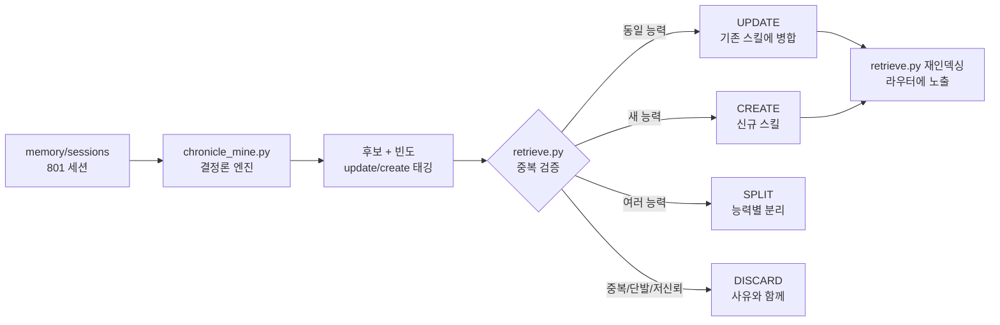
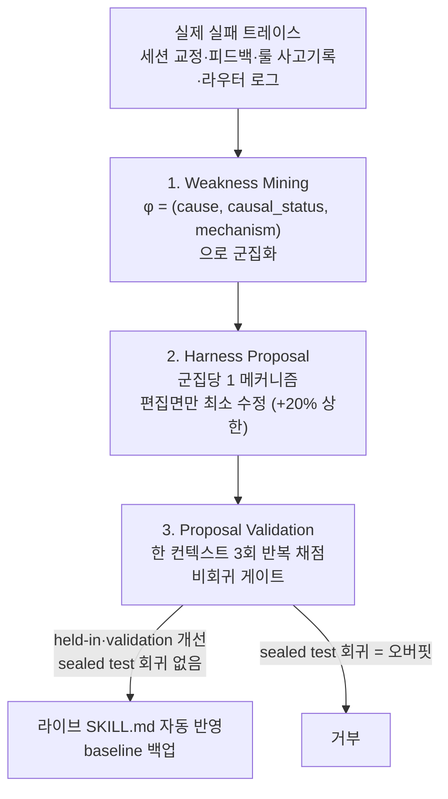

## 매번 같은 것을 다시 설명하고 있다면

에이전트를 오래 쓰다 보면 한 가지 패턴이 보입니다. 같은 작업을, 같은 관례로, 매번 처음부터 다시 지시하고 있다는 것입니다. "이 내용을 docs 폴더 아래 영어로 계획해줘", "이 깃헙을 받아서 스킬로 변환해줘" 같은 요청은 표현만 조금씩 다를 뿐 사실상 같은 워크플로입니다.

스킬은 공짜가 아닙니다. 인덱스에 올라가는 순간부터 이름과 설명이 매 세션 컨텍스트 비용을 차지합니다. 그래서 "반복하니까 일단 스킬로 만들자"는 무책임합니다. 정말로 반복되는지, 이미 있는 스킬과 겹치지 않는지, 만든 다음에 품질이 유지되는지가 전부 검증되어야 합니다.

이 글은 마케팅이 아니라 우리가 실제로 돌리는 두 개의 자율 루프를 그대로 공개합니다. 하나는 과거 대화에서 반복 워크플로를 캐내 스킬로 만드는 Chronicle 마이닝이고, 다른 하나는 실패를 근거로 기존 스킬의 본문을 스스로 고치는 selfharness 자가진화입니다.

## 1. Chronicle: 과거 대화를 코퍼스로 만든다

먼저 재료가 필요합니다. Claude Code 세션은 `~/.claude/projects/<repo>/*.jsonl`에 원본 트랜스크립트로 쌓입니다. 우리는 `scripts/memory/extract-sessions.py`로 이 원본에서 고신호 항목만 추려 `memory/sessions/` 아래에 마크다운 세션 로그로 추출해 둡니다. 현재 801개. 각 파일은 프론트매터에 `date`, `session_id`, `title`, `files_touched`를 담고 본문에 메시지를 담습니다.

이 코퍼스가 우리의 Chronicle입니다. 비용은 0입니다. 추출은 야간 메모리 파이프라인의 결정론 단계에서 증분으로만 돌기 때문입니다.

## 2. 카운팅은 모델이 아니라 코드가 소유한다

핵심 설계 원칙이 하나 있습니다. 빈도, 패턴 시그니처, 중복 판정 같은 숫자는 절대 모델에게 맡기지 않습니다. 모델은 "몇 개 세션에서 반복됐다"를 추정하면 거의 틀립니다. 그래서 마이닝 엔진 `scripts/skills/chronicle_mine.py`는 LLM을 한 번도 호출하지 않는 순수 결정론 코드입니다. 실행 비용은 사실상 0입니다.

엔진이 하는 일은 단순합니다. 세션의 제목과 작업한 파일에서 신호 토큰을 뽑고, 여러 세션에 걸친 문서 빈도를 셉니다. 임계치(기본 4개 세션) 이상 반복되는 토큰과 동시출현 쌍을 후보로 올립니다. 동시에 기존 `.claude/skills/`의 이름과 대조해 `update`(이미 존재) 와 `create`(신규) 를 태깅합니다.

진짜 어려운 부분은 노이즈입니다. 첫 실행에서 1위로 올라온 패턴은 `hooks+state`(260회), `cursor+plan`(198회) 같은 것이었습니다. 이건 반복 워크플로가 아니라 거의 모든 세션이 건드리는 레포 인프라 경로일 뿐입니다. 이른바 lexical mismatch입니다. 그래서 IDF 방식의 최대 문서빈도 컷오프를 넣었습니다. 코퍼스의 16%를 넘는 토큰은 "어디에나 있는" 환경 잡음으로 보고 버립니다.

```python
# 코퍼스의 16%를 넘는 토큰은 ambient(어디에나 있음) -> 워크플로 정체성 아님
MAX_DF_RATIO = 0.16
ambient = {t for t, c in raw_df.items() if c / n > MAX_DF_RATIO}
```

그래도 `.cursor/plugins/cache/` 아래 플러그인 캐시의 SKILL.md 이름들이 거짓 신호로 상위를 점령했습니다. 실제 세션 몇 개를 열어보고서야 원인을 찾았습니다. 그래서 캐시, 생성된 플랜, vendored 경로를 통째로 제외하고, 신호를 "사용자의 의도가 담긴 제목" 과 "실제로 호출한 스킬 정체성" 으로만 좁혔습니다. 그제서야 진짜 워크플로가 드러났습니다.

이 과정 자체가 교훈입니다. 품질이 안 나올 때 모델 등급부터 올리는 것은 게으른 선택입니다. 먼저 엔진을 측정하고, 노이즈의 원인을 데이터로 찾아 고쳐야 합니다.

## 3. 진화 판정: 업데이트냐, 신규냐, 분할이냐

후보가 나오면 마이너는 멈추고, 오케스트레이터 스킬 `chronicle-skill-miner`가 판정합니다. 코드의 중복 힌트는 참고일 뿐, 확정은 BM25 스킬 검색기로 다시 검증합니다.



실제로 801개 세션을 돌렸더니, 흥미로운 결론이 나왔습니다. 사용자의 반복 워크플로 대부분은 이미 기존 스킬 생태계가 커버하고 있었습니다. 주식 분석은 stock-jarvis, 소셜 인입은 x-to-slack, 깃헙 변환은 skill-seekers가 이미 담당합니다. 정직한 큐레이션 결과는 "대부분 폐기"였습니다. 중복 스킬을 양산하는 것이 아니라, 진짜로 빠진 워크플로 단 하나만 신규로 만드는 것이 옳습니다.

그 하나는 "내용을 docs 폴더 아래 영어 계획 문서로, 적절한 스킬을 라우팅해서, 소프트웨어 공학 핵심만" 이라는 사용자의 시그니처 워크플로였습니다. 39회 넘게 반복됐지만 어떤 스킬도 정확히 커버하지 않았습니다. 이것만 신규로 만들고, 트리거가 약했던 기존 스킬 하나를 보강했습니다. 나머지는 사유와 함께 폐기했습니다. 조용히 버리지 않고 임계 미달로 떨군 패턴 수까지 명시하는 것이 규칙입니다.

이 접근이 비슷한 상용 기능과 다른 점은 두 가지입니다. 첫째, 결정론 엔진이 카운팅과 노이즈 필터를 소유해 빈도 환각을 원천 차단합니다. 둘째, 1600개가 넘는 기존 스킬과 검색 기반으로 중복을 강제 검증합니다.

## 4. selfharness: 실패를 근거로 스킬 본문을 고친다

스킬을 만들었다고 끝이 아닙니다. 스킬은 실제 운영에서 틀리고, 그 틀린 방식에는 패턴이 있습니다. selfharness-evolve는 그 실패 패턴을 근거로 스킬의 본문을 스스로 고칩니다. Self-Harness 논문(arXiv:2606.09498)을 SKILL.md 콘텐츠에 이식한 것입니다.

세 단계로 돕니다.



1단계 약점 채굴은 실제 실패를 `φ = (원인, 인과상태, 메커니즘)` 시그니처로 군집화하고, 지지도와 실행가능성으로 순위를 매깁니다. 트레이스의 `cause`는 wrong_output, missing_step, stale_data, ignored_constraint, format_violation 같은 고정 집합에서 옵니다. 출처는 사용자가 스킬을 교정한 세션, 피드백 메모리, 룰 사고 기록, 라우터 로그입니다.

2단계 제안은 상위 군집을 변이 엔진(hermes)에 표적 피드백으로 넘깁니다. 한 변이는 한 메커니즘만 건드리고, 해당 군집의 편집면만 최소로 수정합니다. 성장률은 +20%로 하드 제한합니다. 신선도나 가드레일 수정은 보통 3~5줄입니다.

3단계 검증이 가장 중요합니다. 같은 컨텍스트에서 최소 3회 반복 채점하고, held-in과 validation이 모두 개선되어야 통과합니다. 그리고 결정적으로 `test` 분할은 봉인됩니다. 게이트는 절대 test를 보지 않습니다. 만약 통과했는데 봉인된 test가 회귀하면 그것은 오버핏으로 간주해 거부합니다. 이것이 논문 자체의 held-out 누수 문제를 고친 leak-free 설계입니다. 프론트매터와 모든 트리거 문구는 보존됩니다.

## 5. 두 개의 독립적인 자율 루프

여기서 자주 헷갈리는 지점을 명확히 합니다. 우리에게는 직교하는 두 개의 진화 루프가 있습니다.

하나는 방금 설명한 selfharness로, 스킬의 내용 품질을 진화시킵니다. 다른 하나는 `skill_retro.py`와 `skill_model_policy.json`으로, 스킬이 어떤 모델 티어에서 도는지를 진화시킵니다. 후자는 기본 sonnet으로 싸게 시작했다가, 연속 2회 실패하면 그 스킬만 opus로 자동 승격합니다. 깨끗하게 성공하면 실패 streak를 초기화합니다.

콘텐츠의 품질과 실행의 비용은 서로 다른 문제이고, 그래서 서로 다른 루프가 담당합니다. 이 비용 쪽 이야기는 다음 글에서 따로 다룹니다.

## ThakiCloud 관점: 쓸수록 똑똑해지는 운영

우리가 이 두 루프를 직접 운영하는 이유는 단순합니다. 1인 엔지니어가 1600개가 넘는 스킬 생태계를 관리하려면, 생태계가 사람의 개입 없이도 스스로 정돈되고 자라야 하기 때문입니다.

이것은 우리가 고객에게 제공하려는 온프레미스 AI 플랫폼의 철학과 같습니다. 좋은 자동화는 한 번 만들고 방치되는 것이 아니라, 실제 사용 데이터를 근거로 스스로 개선됩니다. 결정론 코드가 측정과 카운팅을 소유하고, 모델은 판단이 필요한 곳에만 비싸게 투입되며, 모든 변경은 비회귀 게이트를 통과해야 라이브에 반영됩니다. 환각을 구조적으로 막고, 비용을 데이터로만 올리는 이 규율이 우리가 파는 신뢰의 근거입니다.

## 마무리

반복되는 일은 스킬이 되어야 하지만, 아무 반복이나 스킬이 되어서는 안 됩니다. 우리는 과거 대화를 결정론 엔진으로 캐내 진짜 반복만 골라내고, 기존 생태계와 중복을 강제 검증하며, 만든 스킬을 실패 근거로 leak-free하게 진화시킵니다. 빈도는 코드가 세고, 품질은 비회귀 게이트가 지키고, 비용은 별도 루프가 통제합니다.

ThakiCloud는 이런 자기개선형 에이전트 운영을 온프레미스 환경에서 그대로 구현합니다. 같은 규율을 여러분의 인프라 위에서 돌리고 싶다면, 홈페이지에서 더 많은 이야기를 확인하실 수 있습니다.
