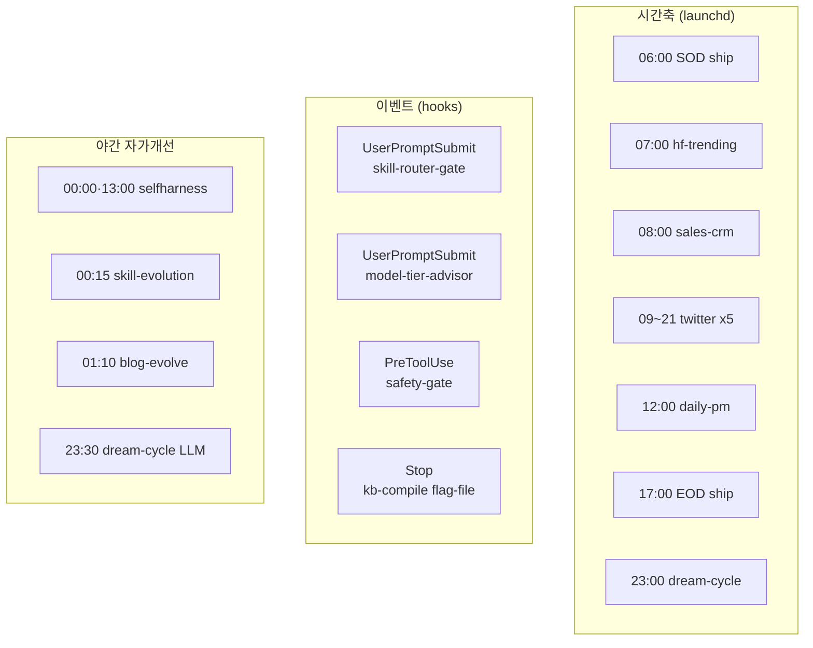
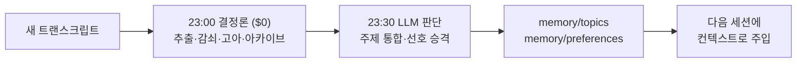

## "자동화했다"는 말의 정직한 정의

자동화 이야기는 대개 부풀려집니다. 그래서 이 글은 한 가지 기준만 지킵니다. 아키텍처 다이어그램에 그려져 있는 것이 아니라, 실제로 발화하도록 배선된 것만 적습니다. 그리고 각 항목을 비용으로 구분합니다. 결정론 파이썬이라 LLM 호출이 없는 것은 $0, `claude -p` 한 패스로 도는 것은 LLM 비용입니다.

전제 하나를 먼저 밝힙니다. 모든 LLM 러너는 `~/.config/claude-code/headless.env`의 구독 OAuth 토큰을 소스로 받아 돕니다. 종량 API 청구를 피하기 위해서입니다. keychain이 잠긴 launchd 환경에서도 동작합니다.

전체 토폴로지는 세 축으로 나뉩니다. 시간으로 도는 스케줄, 사건으로 도는 훅, 그리고 밤에 도는 자가개선 루프입니다.

## 1. 시간축: launchd 스케줄 잡

`scripts/launchd/`의 plist들이 하루를 채웁니다. 평일 아침 6시 SOD ship이 깃 동기화와 정리로 하루를 열고, 7시 hf-trending이 허깅페이스 트렌드를 수집하고, 8시 sales-crm이 영업 브리프를 만들고, 9시부터 21시까지 세 시간 간격으로 트위터 타임라인을 다섯 번 슬랙에 정리합니다. 10시 bespin 뉴스, 12시 daily-pm 오케스트레이터, 17시 EOD ship이 하루의 변경을 리뷰하고 커밋과 PR로 닫습니다.

| 잡 | 시각 (KST) | 하는 일 | 비용 |
|---|---|---|---|
| sod-ship | 평일 06:00 | 시작 깃 동기화 + ship | LLM |
| hf-trending | 매일 07:00 | 허깅페이스 트렌드 인텔리전스 | LLM (sonnet) |
| sales-crm-morning | 평일 08:00 | 영업 CRM 브리프 | LLM (opus 핀) |
| twitter-timeline | 평일 09/12/15/18/21 | 타임라인 분류 후 슬랙 정리 | LLM (opus 핀) |
| daily-pm | 평일 12:00 | 저녁 파이프라인 오케스트레이터 | LLM (sonnet) |
| eod-ship | 평일 17:00 | 종료 리뷰·커밋·PR | LLM |
| memkraft-dream-cycle | 매일 23:00 | 결정론 메모리 단계 | $0 |

여기서 비용 원칙이 보입니다. 폴링성 모니터는 Claude 핫루프에 절대 넣지 않습니다. 토스 가격 모니터 같은 것은 `scripts/toss_monitor_tick.sh`가 5분 cron으로 돌며 특이사항이 있을 때만 슬랙에 푸시합니다. 비용은 $0입니다. Claude는 사람이나 사건이 있을 때만 부릅니다.

## 2. 이벤트축: 훅은 전부 결정론이라 $0

`.claude/settings.json`에 등록된 훅들은 전부 결정론 파이썬이나 셸이라 비용이 0입니다. 이들이 매 턴, 매 도구 호출에 조용히 끼어들어 품질과 안전을 지킵니다.

| 이벤트 | 스크립트 | 하는 일 |
|---|---|---|
| UserPromptSubmit | `skill-router-gate.py` | BM25로 스킬 후보 주입 (인사·명령은 0토큰 SKIP) |
| UserPromptSubmit | `model-tier-advisor.py` | 탐색·위험 의도 감지 시 위임·Plan Mode 권고 주입 |
| PreToolUse(Bash) | `pre-tool-safety-gate.sh` | 위험 명령 차단 (예: `rm -rf .venv`) |
| PreToolUse(Bash) | `preorder-check-guard.py` | 트레이딩 주문 가드 |
| PostToolUse | `post-edit-format.sh` | 편집된 파일 자동 포맷 |
| Stop | `kb-intel-compile.py` | flag-file 패턴: 플래그 있을 때만 위키 재컴파일 |

마지막 Stop 훅이 좋은 패턴입니다. 매 턴 무거운 작업을 돌리는 것이 아니라, 생산자 스킬이 `.compile-pending` 플래그를 남겼을 때만 위키를 재컴파일하고 플래그를 지웁니다. 플래그가 없으면 즉시 종료해 오버헤드가 0입니다. 비싼 작업을 특정 생산 턴 뒤에만 트리거하는 깔끔한 방법입니다.

## 3. 야간 자가개선 루프

밤에는 시스템이 스스로를 손봅니다.

자정과 오후 1시에 selfharness-evolve가 실제 실패를 근거로 스킬 본문을 진화시킵니다. 0시 15분에 skill-evolution이 자율로 스킬을 만들고 개선하되, 한 번에 신규 3개와 개선 2개로 상한을 둡니다. 1시 10분에 blog-evolve가 기술 블로그를 스스로 개선합니다.

여기에 회고 기반 모델 에스컬레이션이 겹쳐 돕니다. 각 LLM 러너는 종료 시 자기 실행 결과를 기록하고, 연속 2회 실패하면 그 스킬만 sonnet에서 opus로 자동 승격합니다. 에스컬레이션 장부 자체는 $0이고, 승격된 실행만 비싸집니다. 콘텐츠 품질을 진화시키는 selfharness와, 실행 비용 티어를 진화시키는 retro 루프는 서로 직교하는 두 개의 독립 루프입니다.

## 4. 메모리 파이프라인: 결정론과 판단을 분리한다

memkraft dream-cycle은 6단계로 메모리를 정돈합니다. 비용 때문에 결정론 단계와 판단 단계를 시각으로 분리한 것이 특징입니다.

23시에 도는 결정론 단계($0)는 세션 추출, 주의력 감쇠, 고아 해소, 아카이브 스윕입니다. 세션 추출은 새 트랜스크립트에서 고신호 항목만 `memory/sessions/`로 증분 추출합니다. 주의력 감쇠는 하루 0.02씩 점수를 낮춰 HOT, WARM, COLD, 아카이브 티어로 분류하고, 접근하면 0.15를 더합니다.

23시 30분에 도는 LLM 판단 단계는 주제 통합과 선호 승격입니다. 3회 이상 등장하고 신뢰도 0.8 이상인 패턴만 선호로 승격합니다. 결정론으로 충분한 것은 결정론으로, 판단이 필요한 것만 모델로 보내는 이 분리가 비용과 품질을 동시에 잡습니다.

## ThakiCloud 관점: 무인 운영은 신뢰의 문제

1인 엔지니어가 이만큼을 돌릴 수 있는 이유는 자동화가 많아서가 아니라, 자동화가 정직하게 배선되어 있기 때문입니다. 결정론으로 충분한 곳은 $0로 돌리고, LLM은 판단이 필요한 곳에만 투입하며, 모든 무인 러너는 실패를 기록하고 회고로 스스로 교정합니다.

이것이 우리가 온프레미스 AI 플랫폼에서 고객에게 보여주려는 운영 모델입니다. 자동화는 화려한 데모가 아니라, 실패해도 안전하게 멈추고 데이터로 스스로 나아지는 시스템이어야 합니다. 시간축과 이벤트축과 자가개선 루프가 맞물려 돌고, 각 톱니가 비용까지 의식하는 이 구조가 무인 운영의 신뢰를 만듭니다.

## 마무리

자동화의 척도는 개수가 아니라, 사람 없이도 안전하게 도는가입니다. 우리는 시간으로 도는 스케줄, 사건으로 도는 훅, 밤에 스스로를 고치는 루프를 비용까지 구분해 운영합니다. 결정론은 공짜로, 판단은 신중하게, 실패는 회고로 교정합니다.

ThakiCloud는 이 무인 운영의 규율을 제품으로 만듭니다. 더 많은 이야기는 홈페이지에서 확인하실 수 있습니다.
