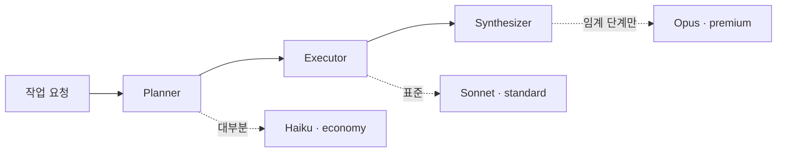

## 클라우드의 다음 질문은 "에이전트를 어떻게 운영하나"

지난 10년의 클라우드는 무엇을 다루느냐로 세대가 나뉘었습니다. 처음에는 서버와 인프라를 다뤘고, 다음에는 데이터와 파이프라인을 다뤘습니다. 지금 현장에서 터지는 질문은 다릅니다. AI 에이전트를 여러 개 돌리기 시작한 순간, 누가 무엇을 했는지 통제가 안 되고, 비용이 예측을 벗어나고, 보안·감사 요구를 맞추지 못하고, 팀마다 같은 것을 따로 만듭니다.

Paxis는 이 빈자리를 겨냥합니다. 기존 클라우드가 컴퓨트·데이터베이스·네트워크를 일급 자원으로 다뤘다면, Paxis는 AI 에이전트의 능력(Skill)·도구(Tool)·정책(Policy)·감사(Audit)를 일급 자원으로 다룹니다. 고객은 "AI 직원 한 팀"을 코드 없이 채용하고, 관리하고, 감사하게 됩니다. 우리는 이 범주를 Agent-Native Cloud라고 부릅니다.


이 글은 마케팅 슬로건이 아니라 실제로 기동한 PoC를 코드와 함께 설명합니다. 아래 수치는 모두 실제 서버(`localhost:8080`)에서 확인한 값입니다.

## 핵심 모듈: 외울 것은 세 가지

Paxis 백엔드는 Go로 작성됐고, 아키텍처는 세 계층으로 읽으면 됩니다. 아래는 인프라 위에 코어, 그 위에 능력 계층이 올라가는 구조입니다.

- 에이전트 런타임(Native Loop): ReAct 루프와 도구 실행, 비용 추적, 자율도 게이트가 모이는 단일 실행 진입점.
- 스킬 하니스(Skill Harness): 부팅 시 스킬을 자동 탑재하고 TF-IDF로 관련 스킬을 선택.
- 하이브리드 지식 엔진(HKE): 팀별 위키를 인제스트·쿼리하는 Git 기반 지식 계층.
- LLM 게이트웨이: 여러 모델 프로바이더를 추상화하고 비용 라우팅의 단일 출처를 제공.
- 보안·정책: 자율도 매트릭스(L0-L3), 프롬프트 보안, 전 행동 감사.
- 메모리: 세션 메모리와 pgvector 의미 검색, 출처(provenance) 추적.

나머지는 샌드박스 실행과 멀티 에이전트 오케스트레이션이 받칩니다. 핵심만 기억한다면 런타임·하니스·지식엔진 셋입니다.

## 능력 추가 = 파일 한 장

Paxis에서 새 능력을 더하는 비용은 코드 배포 0입니다. `skills/<도메인>/<이름>/SKILL.md` 파일 하나를 두면, 서버가 디렉터리를 자동 탐색해 즉시 반영합니다.

```markdown
---
name: competitor-digest
description: >-
  경쟁사 뉴스를 수집해 요약한다. Use when 경쟁사 동향, 뉴스 다이제스트.
allowed-tools: [web_search, web_fetch]
---
# Competitor Digest
## 지시사항
지정한 출처에서 최신 기사를 모아 핵심만 불릿으로 정리한다.
```

저장하면 서버 재시작 없이 `GET /api/v1/skills`에 바로 잡힙니다. PoC 서버에서 부팅 직후 자동 탑재된 스킬은 849개, 기본 제공 도메인 에이전트는 14개입니다. 이 "두꺼운 스킬, 얇은 하니스" 원칙 덕분에 능력은 파일로 쌓이고 하니스는 가볍게 유지됩니다.

자연어로 주기 작업을 만드는 것도 같은 결입니다.

```bash
curl -X POST http://localhost:8080/api/v1/tasks \
  -H "Authorization: Bearer $TOKEN" \
  -d '{"team_id":"dev-team","agent_id":"research-bot",
       "schedule":{"type":"cron","expr":"0 9 * * *"},
       "skill":"competitor-digest","params":{"topN":10}}'
```

채팅에서 "매일 아침 9시에 경쟁사 뉴스 10건 요약해줘"라고 말하면, LLM이 이 cron·스킬·파라미터로 변환해 등록합니다. 코드는 0줄입니다.

## CostRouter: 작업마다 모델을 코드가 고른다

"AI 비용 폭탄"은 대부분 모든 작업에 비싼 모델을 쓰기 때문에 생깁니다. Paxis는 작업을 세 단계(Planner → Executor → Synthesizer)로 나누고, 각 단계에 맞는 모델을 자동 배정합니다.



모델 계층은 `models.yaml`이 단일 출처로 관리합니다. 출력 100만 토큰 기준 단가로 보면 격차가 큽니다.

| 계층 | 모델 | 출력 $/1M | 용도 |
|---|---|---|---|
| economy | Haiku 4.5 | $4 | 대부분의 작업 |
| standard | Sonnet 4.6 | $15 | 균형 |
| strong | GPT-4o / Kimi | 중간 | 보강 |
| premium | Opus 4.8 | $25 | 임계 단계만 (opt-in) |

핵심은 대부분의 작업이 가장 싼 Haiku로 충분하고, Opus는 정말 중요한 단계에만 쓴다는 것입니다. 거기에 실행당 예산 상한이 걸려, 비용이 예측 가능해지고 Command Center에서 당일·주간으로 보고됩니다. 그리고 쓸수록 어떤 작업에 싼 모델로 충분한지 라우팅이 학습되어, 반복 작업의 실행당 비용은 점점 내려갑니다.

## 기존 RAG와 무엇이 다른가: HKE

전통 RAG는 그때그때 검색해 붙이는 일회성에 가깝습니다. Paxis의 하이브리드 지식 엔진(HKE)은 지식이 자산으로 쌓입니다.

| 전통 RAG | Paxis HKE |
|---|---|
| stateless 단발 검색 | Git 기반 영속 위키 (쌓인다) |
| 도메인 경계 없음 | 에이전트별 도메인 스코핑 격리 |
| 출처 신뢰 미추적 | provenance(누가·언제·어느 출처) 기록 |
| 비용 무제어 | tool-budget로 큰 결과 절단·지연 fetch |

문서나 코드를 올리면 정제를 거쳐 지식 그래프로 자라고, 답변에는 출처가 인용됩니다. 팀 단위로 격리되어 한 팀의 위키가 다른 팀에 노출되지 않습니다. 그 아래에는 세션·pgvector 의미 검색·팀 위키·provenance의 4계층 메모리가 있어, 대화가 반복될수록 맥락이 누적됩니다.

## 통제되는 에이전트: 거버넌스가 해자

데모가 화려한 에이전트 도구는 많지만, 거버넌스가 약하면 엔터프라이즈에 들어갈 수 없습니다. Paxis는 통제를 기본값으로 둡니다.

- 자율도 매트릭스 L0-L3: 작업 위험도 × 권한으로 실행 전 게이트.
- 프롬프트 보안과 개인정보 제거.
- 전 행동 감사 체인: 누가·언제·무엇을 했는지 전수 기록.
- 멀티테넌시 팀 격리.

여기에 더해, 능력이 사용과 함께 다듬어지는 방향으로 설계돼 있습니다. 제안(Propose) → 증류(Distill) → 패치(Patch)로 이어지는 큐레이터 루프와, 능력의 신뢰도가 사용에 따라 system → learned → promoted로 올라가는 사다리가 그것입니다. 이 자기개선 루프는 일부 동작하고 일부는 고도화 중인 PoC 단계임을 분명히 해둡니다. 과장 없이 방향과 골격은 이미 코드에 들어가 있습니다.

## 영업이 바로 쓰는 데모 3장면

Paxis의 강점은 우리 영업팀이 직접 쓰면서 동시에 고객에게 보여줄 수 있다는 점입니다.

1. 자는 동안 일하는 비서: Proactive 토글 ON 한 번이면 다음 날 아침 브리핑이 Slack에 자동 도착합니다.
2. 말로 일을 시킨다: 자연어 한 줄이 cron과 스킬로 등록됩니다.
3. 문서가 팀 지식이 된다: 제안서 PDF를 끌어다 놓으면 팀 전체가 챗으로 질문하고, 출처까지 인용됩니다.

이 모든 것을 단 하나의 화면(Command Center)에서 스케줄·비용·협업·감사로 관제합니다.

## ThakiCloud 관점: 왜 이 방향인가

ThakiCloud의 AI 플랫폼은 Kubernetes 위에서 Kueue로 GPU를 스케줄링하고 vLLM으로 모델을 서빙하는 멀티테넌트 환경을 운영합니다. Paxis는 그 위에서 에이전트를 안전하게 운용하기 위한 컨트롤 플레인입니다.

이 조합이 의미 있는 이유는 세 가지입니다. 첫째, 거버넌스(L0-L3 자율도·전 행동 감사·팀 격리)가 내장돼 있어, 보안·감사·데이터 분리를 요구하는 공공·금융·대기업 환경에 그대로 맞출 수 있습니다. 둘째, 온프레미스와 self-hosting을 전제로 설계해, 데이터를 외부로 내보낼 수 없는 조직에서도 동작합니다. 셋째, CostRouter가 작업마다 모델을 고르고 예산 상한을 거는 구조라, GPU·API 비용을 통제하면서 운영할 수 있습니다. 낮은 서빙 비용에서의 경쟁력은 그대로 제품의 해자가 됩니다.

현재 Paxis는 PoC 단계입니다. 코어(대화·스킬·스케줄러·관제·비용 라우팅·HKE)는 동작하며, 일부 고도화 기능은 로드맵에 있습니다. "오늘 데모 가능, 한 워크플로부터 파일럿"이 우리의 정직한 메시지입니다.

## 더 보기

- 소스: [github.com/ThakiCloud/praxis](https://github.com/ThakiCloud/praxis)
- 경영 데모 덱(33장, 발표 노트 포함): [Google Slides](https://docs.google.com/presentation/d/11E5ixfWgV6uY-akebEZ--Kwp1JmRQJG1OpPaChbJLmc/edit)

함께 만들 동료와 파일럿 고객을 찾고 있습니다. Agent-Native Cloud라는 범주를 우리가 먼저 정의하려 합니다.
