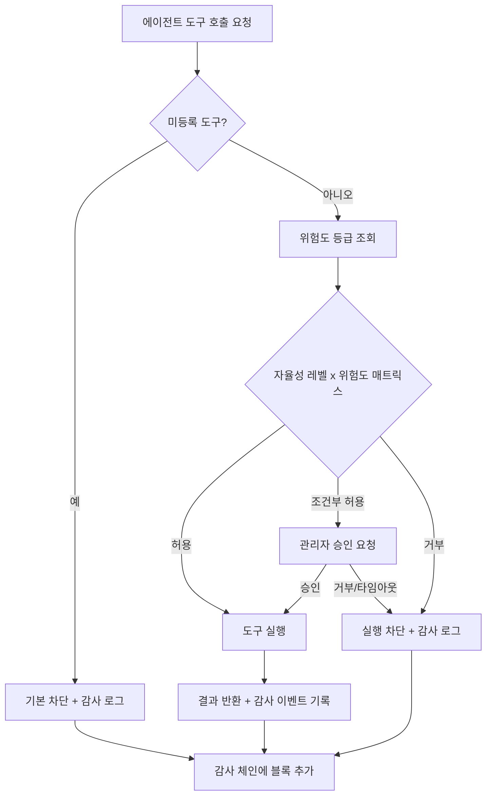

## 개요

금융 산업에서 AI 에이전트 도입은 더 이상 선택지가 아닙니다. 여신 심사 자동화, 이상거래 탐지, 고객 상담 지원 등 적용 범위가 넓어지면서 각 금융기관은 운영 효율과 규제 준수라는 두 목표를 동시에 달성해야 하는 상황에 놓여 있습니다.

문제는 기존 AI 플랫폼이 이 두 목표를 함께 다루지 않는다는 데 있습니다. 클라우드 기반 LLM API는 강력하지만 데이터가 해외 서버를 경유하는 구조이고, 오픈소스 에이전트 프레임워크는 감사 추적이나 접근 통제가 빠져 있는 경우가 많습니다. 반면 규제 당국은 전자금융감독규정, ISMS-P, 금융보안원 가이드라인에 따라 AI의 모든 판단 행위에 대한 추적 가능성을 요구합니다.

이 글에서는 가상의 국내 은행 케이스를 통해 AI 에이전트가 금융 규제를 충족하며 실질적인 업무 자동화를 달성하는 아키텍처를 살펴봅니다. 핵심은 자율성 통제 메커니즘과 위변조를 방지하는 감사 체계입니다.

---

## 금융권이 AI 도입에서 막히는 지점

### 데이터 국내저장 요건

전자금융감독규정 제13조의2와 금융위원회 클라우드 이용 가이드라인은 고객 금융정보가 해외 서버에서 처리·저장되는 것을 원칙적으로 금지하거나 사전 허가를 요구합니다. 생성형 AI를 외부 API 방식으로 그대로 사용하면 프롬프트에 포함된 계좌번호, 거래 내역, 고객 식별 정보가 해외 데이터센터로 전송될 수 있습니다. 이 문제 하나만으로도 많은 금융사 PoC가 중단됩니다.

### 감사 추적 부재

AI가 특정 여신 한도를 추천하거나 의심 거래를 자동 정지시킨 근거를 사후에 재현할 수 없다면, 금융감독원 검사나 내부 감사 시 심각한 리스크가 됩니다. "AI가 했습니다"는 규제 당국이 수용하는 답변이 아닙니다. 어떤 모델이, 어떤 입력으로, 어떤 도구를 호출해서, 어떤 결과를 냈는지 시간 순서대로 재현 가능한 기록이 필요합니다.

### 자율 에이전트의 통제 불확실성

단순한 챗봇 수준을 넘어 외부 API를 호출하고, 파일을 읽고, 이메일을 발송하며, 시스템 명령을 실행하는 에이전트를 도입할 때 "이 에이전트가 어디까지 할 수 있는가"를 명확히 정의하지 않으면 예상치 못한 행동이 발생할 수 있습니다. 금융 영역에서 자율 에이전트가 잘못된 자율성으로 트랜잭션을 실행한다면 재무적 손실은 물론 규제 위반으로 이어집니다.

### 멀티테넌시와 내부 격리

증권 업무, 보험 업무, 신탁 업무를 담당하는 각 본부가 동일한 AI 인프라를 공유하더라도 각 팀의 데이터와 감사 로그는 완전히 격리되어야 합니다. 한 부서의 에이전트가 다른 부서의 고객 정보나 거래 내역에 접근할 수 있다면 내부 통제 원칙 위반입니다.

---

## 거버넌스 아키텍처: 정책엔진과 자율성 x 위험 매트릭스

### 정책엔진이 존재해야 하는 이유

에이전트에게 도구(Tool)를 주는 것과 도구를 안전하게 사용하도록 통제하는 것은 다른 문제입니다. 단순히 "이 에이전트는 고객 조회 API를 쓸 수 있다"고 설정하면, 에이전트가 판단 착오로 수천 건의 조회를 연속 실행하거나 민감한 필드를 과도하게 읽는 상황을 막을 수 없습니다.

Praxis의 정책엔진은 모든 도구 호출이 실행되기 전에 두 가지 차원을 교차 검토합니다.

**자율성 4단계:**

- **L0 (완전 수동):** 에이전트가 제안만 하고 사람이 모든 실행을 승인합니다.
- **L1 (낮은 위험 자율):** 읽기 전용, 비금전적 작업만 자동 실행합니다.
- **L2 (중간 위험 자율):** 사전 정의된 역치 이하의 트랜잭션은 자동 실행하고, 초과 시 승인 요청합니다.
- **L3 (높은 자율):** 정책 엔진이 허용한 범위 내에서 광범위하게 자율 실행합니다.

**위험도 7등급:**

도구 호출은 위험도에 따라 1등급(단순 조회)부터 7등급(비가역적 외부 트랜잭션)으로 분류됩니다. 예를 들어 고객 잔액 조회는 1등급, 계좌 간 이체 실행은 6-7등급에 해당합니다. 내장 도구 각각에 대해 위험도가 사전 등록되어 있으며, 미등록 도구는 기본값으로 차단됩니다.

### 정책 판단 흐름

### 가상 케이스: A은행 여신심사 에이전트

A은행은 중소기업 여신 심사 업무에 AI 에이전트를 도입하고자 합니다. 에이전트가 수행하는 업무는 다음과 같습니다.

1. NICE 신용조회 시스템에서 기업 신용 정보 조회 (위험도 2등급)
2. 내부 대출 이력 데이터베이스 조회 (위험도 1등급)
3. 재무제표 분석 및 여신 한도 추천 (판단만, 외부 실행 없음)
4. 심사 의견서 초안 작성 (문서 생성)
5. 승인 시 한도 등록 API 호출 (위험도 6등급)

이 케이스에서 에이전트의 자율성 레벨은 L2로 설정됩니다. 1-4번 작업은 자동 실행되지만, 5번 한도 등록 API 호출은 위험도 6등급으로 반드시 담당자 승인이 필요합니다. 승인 없이 에이전트가 직접 한도를 등록하는 일은 구조적으로 불가능합니다.

고위험 작업 9종(계좌 해지, 대량 이체, 외부 시스템 연동 변경 등)은 자율성 레벨에 무관하게 관리자 승인이 필수로 요구됩니다.

---

## 감사 및 추적: 해시체인 로그와 개인정보 마스킹

### 해시체인 감사 로그의 작동 방식

Praxis의 감사 체계는 해시체인(Hash Chain) 구조로 설계되어 있습니다. 각 감사 이벤트는 이전 이벤트의 해시값을 포함하므로, 중간 레코드를 삭제하거나 수정하면 이후 모든 블록의 해시 검증이 실패합니다. 이 구조는 DB 관리자가 실수로 또는 의도적으로 로그를 변조하는 경우에도 위변조를 탐지할 수 있게 합니다.

기록되는 이벤트 유형은 20가지 이상이며, 주요 항목은 다음과 같습니다.

- `agent.tool.invoked`: 도구 호출 요청 (에이전트 ID, 도구명, 실행 컨텍스트)
- `agent.tool.policy.denied`: 정책 엔진에 의한 차단 (위험도, 자율성 레벨, 판단 근거)
- `agent.tool.approval.requested`: 관리자 승인 요청 발생
- `agent.tool.approval.decided`: 승인/거부 결과 (결정자 ID, 타임스탬프)
- `agent.session.started`: 에이전트 세션 시작 (팀 ID, 에이전트 ID, 세션 ID)
- `sandbox.exec`: 샌드박스 내 코드 실행 이벤트

각 이벤트는 `run_id`로 키잉되어, 하나의 여신 심사 처리 흐름을 구성하는 모든 도구 호출, 정책 판단, 승인 이력을 단일 `run_id`로 조회하고 재현할 수 있습니다. 감사 로그는 90일 이상 보관됩니다.

### 개인정보 16종 자동 마스킹

에이전트가 처리하는 데이터에는 주민등록번호, 계좌번호, 전화번호, 이메일 등 개인정보가 포함될 수 있습니다. Praxis의 프롬프트 보호 레이어는 입력 단계에서 16종 개인정보 패턴을 실시간으로 탐지하고 자동 마스킹합니다.

예를 들어 고객 정보 조회 결과에 주민등록번호가 포함되어 있으면, 에이전트가 이를 LLM에 전달하기 전에 `[주민등록번호 마스킹]` 형태로 치환됩니다. 감사 로그에도 원본 데이터 대신 마스킹된 형태로만 기록되므로, 로그 자체가 개인정보 유출 경로가 되는 리스크를 줄입니다.

또한 프롬프트 인젝션 공격 패턴 11종(역할 바꾸기, 지시 무시, 탈출 시도 등)을 실시간으로 탐지하여 악의적인 입력으로 에이전트를 오동작시키는 시도를 차단합니다.

### 멀티테넌시 격리

A은행에서 여신 담당 부서와 자산관리 부서가 동일한 Praxis 인스턴스를 사용하더라도, 팀 식별자(team ID)를 기반으로 위키, 세션, 설정, 감사 로그가 완전히 격리됩니다. 여신 팀의 에이전트가 자산관리 팀의 고객 데이터에 접근을 시도하면, 데이터 자체가 "없음"으로 응답되어 존재 여부조차 노출되지 않습니다.

---

## ThakiCloud 적용 시사점

### 온프레미스 + 에어갭 배포로 데이터 국내저장 충족

ThakiCloud AI Platform은 K8s 기반으로 금융기관 전산 센터 내부망에 직접 배포할 수 있습니다. 모든 추론 연산이 기관 내부에서 이루어지므로 고객 금융 정보가 외부로 전송되지 않습니다. Praxis 로드맵에는 에어갭(Air-Gap) 배포 키트가 포함되어 있으며[추정: Q1 2027], 외부 네트워크가 완전히 차단된 폐쇄망 환경에서도 독립적으로 운영 가능한 구성을 지원할 예정입니다.

관측 인프라(VictoriaMetrics/VictoriaLogs)도 함께 내부망에 배포되어 에이전트 운영 현황, 비용, 이상 행동을 실시간으로 모니터링할 수 있습니다.

### Keycloak OIDC RBAC으로 기존 사용자 디렉토리 연동

금융기관은 일반적으로 AD(Active Directory) 또는 LDAP 기반의 임직원 디렉토리를 운영합니다. ThakiCloud AI Platform은 Keycloak을 통한 OIDC 연동으로 기존 디렉토리와 통합되어, 직원 계정 생성·삭제·권한 변경이 AI 플랫폼에도 즉시 반영됩니다. 퇴직자 계정이 AI 에이전트 접근 권한을 유지하는 상황을 방지할 수 있습니다.

### 정책엔진과 내부통제 프레임워크의 연계

자율성 x 위험도 매트릭스는 금융기관의 내부통제 프레임워크와 직접 매핑될 수 있습니다. 예를 들어 금융위원회 내부통제 기준이 요구하는 "핵심 업무에 대한 2인 이상 승인" 원칙을 정책엔진의 고위험 작업 승인 필수 규칙으로 구현할 수 있습니다.

감사팀은 `run_id` 기반으로 특정 여신 건의 전체 처리 이력을 조회하고, 에이전트가 어떤 데이터를 참조했는지, 정책 엔진이 어떤 판단을 내렸는지, 승인자가 누구인지를 단일 화면에서 확인할 수 있습니다. 이는 AI 행위의 사후 검증 가능성을 금융감독원 검사 수준에서 확보하는 데 기여합니다.

### LLM 라우터를 통한 비용 최적화

10개 이상의 LLM 제공사와 ThakiCloud 자체 Metis를 지원하는 LLM 라우터는 금융기관이 보안 승인을 받은 특정 모델만을 사용하도록 제한하거나, 작업 유형에 따라 비용이 저렴한 모델과 정확도가 높은 모델을 자동으로 라우팅할 수 있습니다. 온프레미스 Metis를 기본 추론 백엔드로 사용하고 외부 프로바이더를 폴백으로만 활용하는 하이브리드 구성은 데이터 국내저장 요건과 비용 효율을 동시에 달성합니다.

---

## 한계 및 고려사항

솔직한 평가가 필요합니다. 아키텍처가 아무리 정교해도 현실적인 제약이 존재합니다.

**규제 해석의 불확실성:** 금융 AI 거버넌스에 관한 국내 규제는 아직 진화 중입니다. 전자금융감독규정의 AI 활용 조항과 금융보안원의 AI 보안 가이드라인이 구체적인 기술 요건을 명시하지 않은 경우가 많아, 실제 준수 여부는 법무팀 및 규제 당국과의 사전 협의가 필요합니다. Praxis가 제공하는 감사 로그와 정책엔진이 특정 규제 요건을 충족한다는 보장은 없으며, 이는 기관별로 별도 검토가 필요합니다.

**SOC 2 Type II 인증:** Praxis의 SOC 2 Type II 인증 로드맵은 Q2 2027 이후로 예정되어 있습니다. 현 시점에서 SOC 2 Type II 인증을 요구하는 금융기관은 이 타임라인을 감안해야 합니다.

**정책 설계의 복잡성:** 자율성 x 위험도 매트릭스는 강력한 도구이지만, 이를 조직의 업무 프로세스에 맞게 올바르게 설계하는 데는 상당한 도메인 지식과 시간이 필요합니다. 초기 정책 설계가 잘못되면 에이전트가 너무 많은 작업을 차단(과도한 제한)하거나 너무 많은 자율성을 가지는(과도한 허용) 문제가 발생합니다. 단계적 배포와 운영 데이터 기반의 정책 조정이 필수입니다.

**에이전트 행동의 예측 불가능성:** 정책엔진은 도구 호출 레벨에서 통제를 제공하지만, LLM의 추론 과정 자체를 완전히 통제하지는 않습니다. 에이전트가 정책적으로 허용된 도구만 사용하더라도 예상치 못한 순서나 조합으로 실행할 수 있습니다. 특히 여신 심사처럼 판단의 정확성이 중요한 업무에서 AI 에이전트는 최종 결정권을 가지는 것이 아니라 담당자의 의사결정을 지원하는 역할로 명확히 정의되어야 합니다.

**내부망 운영의 기술적 부담:** 온프레미스 K8s 환경 운영은 클라우드 SaaS 대비 상당한 인프라 운영 역량을 요구합니다. ArgoCD GitOps, Keycloak 관리, 모델 업데이트 배포 등 운영 사이클 전반에 걸쳐 전문 인력이 필요합니다. 이 부분은 ThakiCloud와의 운영 지원 계약 또는 내부 역량 확보 계획과 함께 검토되어야 합니다.

---

금융권의 AI 에이전트 도입은 기술 문제가 아니라 거버넌스 문제입니다. 데이터가 어디에 저장되는지, 에이전트가 어디까지 자율적으로 행동할 수 있는지, 그 모든 행동이 검증 가능한 방식으로 기록되는지가 핵심입니다. 정책엔진과 해시체인 감사 로그는 이 세 가지 질문에 대한 기술적 답변을 제공하지만, 그것이 규제 준수의 전부가 아니라는 점을 함께 기억해야 합니다.
