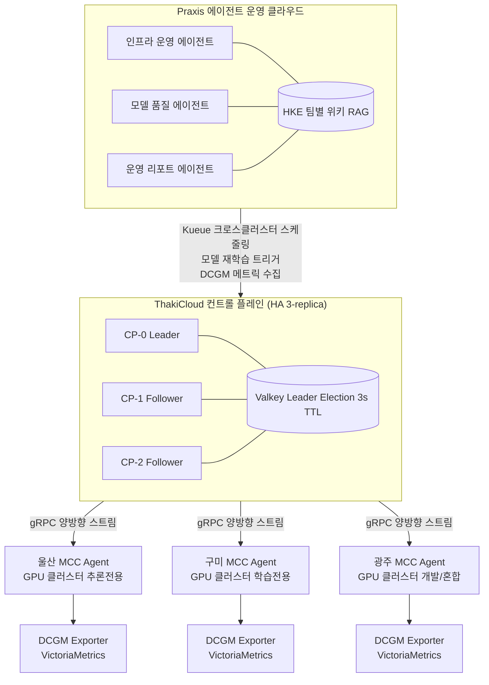

## 개요

현대 제조업은 AI 도입 의지는 높지만 운영 인력은 부족하다는 구조적 모순에 직면해 있습니다. 생산 현장에 비전 검사 모델을 배포하고 싶어도, 그 모델을 유지·보수·재학습시킬 MLOps 전문가가 없습니다. 세 개 공장의 GPU 클러스터를 각각 다른 팀이 관리하다 보니 리소스 낭비와 가동 중단이 반복됩니다.

이 글은 멀티페르소나 자율 에이전트팀이 이 문제를 어떻게 해소하는지, 그리고 여러 공장에 분산된 GPU 클러스터를 단일 컨트롤 플레인으로 통합 관리하는 방법을 가상 제조사 "HanTek"의 사례로 설명합니다. 다룰 핵심 기술은 ThakiCloud AI Platform의 멀티클러스터 중앙관리와 Praxis 에이전트 운영 클라우드입니다.

---

## 제조 AI 운영의 인력 병목

HanTek은 울산·구미·광주에 각각 GPU 클러스터를 운영하는 중견 전자 부품 제조사입니다. 지난 2년간 각 공장 라인에 비전 AI 모델을 도입했지만, 운영 현장에서는 아래 세 가지 문제가 반복적으로 발생했습니다.

**첫째, MLOps 인력의 절대적 부족.** 모델 재학습, 배포, 성능 모니터링에는 전담 엔지니어가 필요합니다. 그러나 HanTek의 ML 팀은 3명으로, 세 공장 모두의 모델 라이프사이클을 감당하기 어려웠습니다. 모델 성능이 떨어지기 시작해도 재학습 요청이 큐에서 며칠씩 대기하는 일이 일상이 됐습니다.

**둘째, 멀티클러스터 관리의 파편화.** 각 공장의 GPU 클러스터는 독립적으로 운영됐습니다. 울산 클러스터가 유휴 상태여도 구미 클러스터의 학습 잡이 대기하는 상황이 발생했고, 관리자가 Slack으로 수동 조율해야 했습니다. DCGM 메트릭도 공장별로 따로 수집돼 전사 GPU 가동률을 한눈에 파악할 수 없었습니다.

**셋째, 24/7 대응의 불가능.** 야간·주말 라인에서 품질 이상이 감지돼도 ML 팀이 즉각 대응하기 어려웠습니다. 알림은 오지만 실제 조치는 다음날 오전으로 미뤄졌고, 그 사이 불량품이 다음 공정으로 넘어가는 사례가 발생했습니다.

이러한 문제는 HanTek만의 이야기가 아닙니다. 제조업 전반에서 AI를 도입했지만 운영 역량이 따라가지 못해 효과가 반감되는 패턴이 반복됩니다.

---

## 자율 에이전트팀 구성 - 멀티페르소나와 동적 작업

HanTek이 도입한 해법은 Praxis 기반의 멀티페르소나 자율 에이전트팀입니다. Praxis는 에이전트를 "AWS의 VM처럼" 일급 리소스로 취급하는 에이전트 운영 클라우드입니다. Skills, Tools, Policies, Audit Logs가 플랫폼의 핵심 리소스이며, 각 에이전트는 자신의 도메인 위키(Hybrid Knowledge Engine, HKE)를 참조해 축적된 지식을 바탕으로 판단합니다.

HanTek은 세 가지 페르소나로 에이전트팀을 구성했습니다.

### 인프라 운영 에이전트

인프라 운영 에이전트는 GPU 클러스터 상태 감시, 잡 스케줄링 최적화, 이상 감지 시 자동 복구를 담당합니다. Kueue와 KAI Scheduler의 메트릭을 지속적으로 수집하고, 특정 클러스터의 큐 대기시간이 임계치를 초과하면 다른 클러스터로 잡을 재배치하는 결정을 자율적으로 내립니다.

이 에이전트는 Praxis의 동적 작업 스케줄러를 통해 "매일 오전 7시 GPU 가동률 리포트 생성"처럼 자연어로 정의된 반복 작업을 실행합니다. 운영자가 별도 cron 스크립트를 작성할 필요 없이, 채팅 또는 Slack에서 작업 명세를 입력하면 에이전트가 스스로 스케줄링합니다.

### 모델 품질 에이전트 (벤치마크 분석가 페르소나)

모델 품질 에이전트는 각 라인의 비전 AI 모델 성능을 지속적으로 모니터링합니다. VictoriaMetrics에서 수집된 추론 지연, 정확도 지표를 분석하고, 성능 저하가 임계치를 넘으면 재학습 파이프라인을 자동으로 트리거합니다. 재학습 완료 후에는 벤치마크 결과를 ML 팀 Slack 채널에 요약해 게시합니다.

이 에이전트는 HKE에 축적된 라인별 모델 히스토리를 참조합니다. "이 라인의 모델은 3개월마다 재학습이 필요하고, 기준 정확도는 98.5% 이상"과 같은 도메인 지식이 위키에 기록돼 있어 에이전트가 맥락 있는 판단을 내릴 수 있습니다.

### 운영 리포트 에이전트 (보고서 자동화 페르소나)

운영 리포트 에이전트는 일간·주간·월간 AI 운영 보고서를 자동으로 생성하고 배포합니다. GPU 가동률, 모델별 추론 건수, 품질 이상 감지 이벤트, 재학습 현황을 집계해 경영진이 읽기 쉬운 형식으로 가공합니다. Praxis의 멀티채널 배달 기능을 통해 Slack, 이메일, 웹 대시보드에 동시 게시됩니다.

### 에이전트팀의 협업 구조

세 에이전트는 독립적으로 작동하지만 Praxis의 Multi-Agent Orchestration을 통해 필요 시 협업합니다. 예를 들어 모델 품질 에이전트가 재학습을 트리거할 때, 인프라 운영 에이전트에게 학습용 GPU 클러스터 확보를 요청하는 크로스 에이전트 위임이 자동으로 이뤄집니다. 이 위임 과정은 Policy Engine과 Audit Log를 통해 모든 의사결정이 기록됩니다.

---

## 멀티클러스터 중앙관리 - 여러 공장의 GPU 통합

에이전트팀이 제대로 동작하려면 여러 공장의 GPU 클러스터를 단일 컨트롤 플레인에서 통합 관리할 수 있어야 합니다. ThakiCloud AI Platform의 Multi-Cluster Cloud(MCC) 시스템이 이 역할을 합니다.

아래 다이어그램은 HanTek의 실제 구조를 단순화한 것입니다.

### 컨트롤 플레인과 데이터 플레인 분리

ThakiCloud AI Platform은 컨트롤 플레인(CP)과 데이터 플레인(DP)을 엄격히 분리합니다. 이 분리가 제조 환경에서 중요한 이유는 **CP 장애 시에도 공장 라인의 추론 잡이 계속 실행**된다는 점입니다. 울산 공장의 비전 AI가 CP 네트워크 단절 중에도 중단 없이 동작하는 것은 이 아키텍처 덕분입니다.

각 공장 클러스터에는 MCC Agent가 배포됩니다. 이 에이전트는 CP와 gRPC 양방향 스트리밍으로 통신하며, 네트워크 지연이 발생해도 Make-Before-Break 재연결 방식으로 연결을 유지합니다. WAN 링크가 완전히 끊겨도 데이터 플레인의 잡은 영향을 받지 않습니다.

### Kueue와 KAI Scheduler의 크로스클러스터 GPU 스케줄링

각 공장 클러스터는 Kueue와 KAI Scheduler를 통해 GPU 워크로드를 관리합니다. KAI Scheduler는 GPU > CPU > 메모리 > 디스크 순으로 클러스터 간 점수를 계산해 최적의 배치를 결정합니다. 인프라 운영 에이전트는 이 스케줄러의 메트릭을 읽어 "울산 클러스터 학습 큐 대기시간이 30분 초과"와 같은 신호를 감지하면, 구미 클러스터로 잡 재배치를 제안하거나[추정] 자동 실행합니다.

GPU 사용률이 클러스터 평균 80%를 지속적으로 초과하면 VictoriaMetrics 알림이 트리거되고, 인프라 운영 에이전트가 용량 확장 권고 리포트를 생성해 ML 팀 채널에 게시합니다.

### DCGM 기반 GPU 텔레메트리 통합

각 클러스터의 DCGM(Data Center GPU Manager) Exporter가 VictoriaMetrics로 GPU 텔레메트리를 수집합니다. HanTek은 이전에 공장별로 따로 구성된 Grafana 대시보드를 봐야 했지만, 이제는 VictoriaLogs와 VictoriaMetrics가 중앙 집계된 단일 관측 레이어를 제공합니다. 모델 품질 에이전트는 이 메트릭을 직접 쿼리해 추론 지연 이상을 탐지합니다.

### ArgoCD GitOps와 클러스터 일관성

세 공장 클러스터의 모델 배포와 설정 변경은 모두 ArgoCD를 통해 GitOps 방식으로 관리됩니다. MCC Agent가 새 클러스터에 등록되면 ArgoCD 클러스터 시크릿이 자동 생성됩니다. 운영 리포트 에이전트가 특정 모델의 업데이트를 감지하면, 해당 Git 저장소에 PR을 생성하고[추정] ArgoCD가 자동으로 각 공장 클러스터에 배포합니다.

---

## ThakiCloud 적용 시사점

HanTek 사례에서 얻을 수 있는 실제 적용 시사점은 다음과 같습니다.

**인력 병목 해소의 실질적 접근.** 멀티페르소나 에이전트팀은 MLOps 엔지니어를 대체하는 것이 아니라 반복·감시·리포팅 업무를 위임받는 구조입니다. 엔지니어는 모델 아키텍처 개선과 이상 케이스 분석 같은 고부가가치 작업에 집중하고, 에이전트가 일상 운영을 맡습니다. HKE 위키에 도메인 지식을 축적할수록 에이전트의 판단 정확도가 높아지는 점이 장기적 가치를 만듭니다.

**동적 작업 스케줄러의 운영 유연성.** Praxis의 동적 작업 스케줄러는 자연어로 작업을 정의할 수 있어 IT 부서를 거치지 않고 현장 운영자가 직접 자동화 작업을 설정할 수 있습니다. "매주 월요일 오전 8시에 전주 품질 이상 요약 보고서를 팀장 이메일로 발송"처럼 구체적인 운영 요구사항을 즉시 반영할 수 있습니다.

**멀티클러스터 통합의 가시성 확보.** 단일 컨트롤 플레인을 통한 멀티클러스터 관리는 전사 GPU 가동률, 잡 대기열 현황, 클러스터별 비용을 한눈에 파악하게 합니다. 이전에는 불가능했던 "세 공장 통합 GPU 가동률이 60% 미만일 때 새 학습 잡을 자동 허용" 같은 정책을 컨트롤 플레인 레벨에서 설정할 수 있습니다.

**정책 엔진과 감사 로그의 신뢰성.** 제조 환경에서는 AI가 내린 의사결정에 대한 추적 가능성이 중요합니다. Praxis의 Policy Engine과 Audit Log는 모든 에이전트 행동을 기록하고, 어떤 근거로 어떤 조치가 이뤄졌는지 감사 가능한 형태로 남깁니다. 이는 품질 인증 심사나 내부 컴플라이언스 요구사항을 충족하는 데 실질적으로 도움이 됩니다.

---

## 한계 및 고려사항

이 접근법이 모든 제조 환경에 그대로 적용되는 것은 아닙니다. 도입 전에 검토해야 할 현실적 제약이 있습니다.

**초기 도메인 지식 구축 비용.** HKE 위키에 에이전트가 활용할 도메인 지식을 구축하는 데 초기 투자가 필요합니다. 라인별 모델 특성, 정상 가동 범위, 재학습 기준과 같은 암묵적 지식을 명시적으로 문서화해야 합니다. 이 과정 없이 에이전트를 배포하면 초기 판단 오류가 발생할 수 있습니다.

**에이전트 자율성의 범위 설정.** 에이전트가 자율적으로 내릴 수 있는 결정의 범위를 명확히 정해야 합니다. 모델 재학습 트리거나 리포트 생성은 자율 실행이 적합하지만, 프로덕션 라인에 영향을 미치는 모델 교체나 클러스터 재구성은 인간 승인 단계를 유지하는 것이 안전합니다. Praxis의 Policy Engine을 통해 이 경계를 설정할 수 있습니다.

**네트워크 환경의 현실.** 국내 중공업 공장 환경에서는 공장 내부망과 클라우드 연결에 방화벽 정책이 엄격한 경우가 많습니다. MCC Agent의 gRPC 연결이 허용되는지, WAN 대역폭이 안정적인지를 사전에 검증해야 합니다. 온프레미스 전용 환경이라면 CP와 DP 모두 사내에 배포하는 구성을 고려해야 합니다.

**에이전트 협업의 복잡도.** 멀티 에이전트 오케스트레이션은 단일 에이전트보다 장애 시나리오가 복잡해집니다. 한 에이전트가 잘못된 크로스 에이전트 위임을 보낼 경우를 대비한 롤백 정책과 알림 체계를 설계해야 합니다. Praxis의 Plan-Execute Pipeline이 Planner-Executor-Synthesizer 3단계로 실행을 구조화하지만, 이상 케이스에 대한 테스트를 충분히 해야 합니다.

**운영 성숙도의 점진적 확보.** 처음부터 모든 운영을 에이전트에게 위임하는 것은 권장하지 않습니다. 리포팅 자동화처럼 낮은 리스크의 작업부터 시작해 에이전트의 판단 품질을 검증하고, 신뢰가 쌓인 다음 자율성을 확대하는 점진적 접근이 현실적입니다.

---

제조 AI 운영의 인력 병목은 단순히 채용으로 해결되지 않습니다. 자율 에이전트팀이 반복 운영 업무를 맡고, 멀티클러스터 중앙관리가 GPU 리소스 낭비를 줄이며, 사람은 더 복잡한 판단과 개선에 집중하는 구조가 지속 가능한 제조 AI 운영의 방향입니다. ThakiCloud AI Platform과 Praxis는 이 구조를 기술적으로 구현하는 구체적인 수단을 제공합니다.
