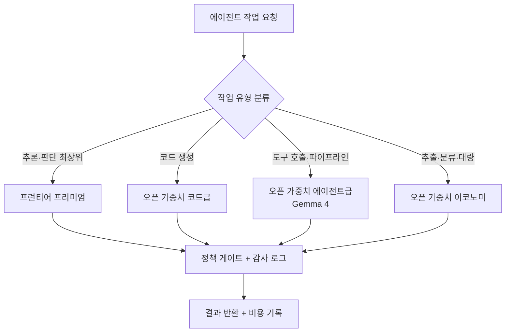

에이전트 운영비 청구서를 열어 보면 대부분의 팀이 같은 착각을 합니다. "우리 에이전트가 어려운 추론을 많이 하니까 최상위 모델을 써야 한다"는 것입니다. 그런데 실제 트래픽을 뜯어보면 그림이 다릅니다. 자연어 요청을 API 호출로 바꾸고, 로그를 분류하고, 파이프라인을 잇고, 결과를 요약하는 반복 작업이 압도적으로 많습니다. 이 작업들은 세계 최고 수준의 추론이 필요 없습니다. 그런데도 전부 프런티어 프리미엄 모델로 처리하면, 비싼 값을 치르고 오버스펙을 사는 셈입니다.

이 글은 그 낭비를 실측으로 확인하고 접는 과정입니다. 오픈 가중치 모델(Gemma 4)로 실제 운영 요청을 tool-call로 변환하는 실험을 돌려 품질을 확인하고, Paxis의 CostRouter로 작업마다 알맞은 모델에 라우팅했을 때 비용이 어디까지 내려가는지 실제 토큰과 실가격으로 계산합니다. 결론부터 말하면, 동일한 워크로드에서 프런티어 프리미엄 대비 약 44배까지 비용이 줄었습니다.

## 이 접근은 무엇인가

핵심은 단순합니다. 에이전트 작업을 하나의 모델로 다 처리하지 않고, 작업의 성격에 따라 서로 다른 등급의 모델에 나눠 보내는 것입니다. 어려운 추론과 판단은 프런티어 프리미엄에, 코드 생성은 코드에 강한 오픈 가중치 모델에, 도구 호출과 파이프라인 실행은 에이전트급 오픈 가중치 모델에, 대량 추출과 분류는 가장 저렴한 이코노미 티어에 보냅니다. 각 작업을 이기는 모델로 보내면 품질은 지키면서 청구서만 줄어듭니다.

이 발상이 성립하려면 두 가지가 참이어야 합니다. 첫째, 오픈 가중치 모델이 에이전트 작업의 상당 부분을 실제로 감당해야 합니다. 둘째, 라우팅을 사람이 매번 손으로 고르지 않고 플랫폼이 자동으로 처리해야 합니다. 아래에서 이 두 가지를 각각 실험과 실제 구성으로 확인합니다.



## 설치 및 통합

먼저 오픈 가중치 모델이 에이전트의 실제 핵심 작업, 즉 자연어 요청을 구조화된 도구 호출로 바꾸는 일을 해낼 수 있는지 확인했습니다. 검증 대상은 Gemma 4 26B이고, 관리형 API로 호출했습니다. 별도 의존성 없이 표준 라이브러리(urllib)만으로 호출하도록 실험을 짰습니다.

에이전트에게 준 과제는 클라우드 운영 파이프라인의 도구 스키마입니다. 지표 조회, 파드 재시작, 비용 집계, 디플로이먼트 스케일링, 시크릿 교체 다섯 가지 도구를 정의하고, 자연어 요청을 받아 정확한 도구와 필수 파라미터를 담은 JSON 한 개만 출력하도록 지시했습니다.

```python
TOOL_SPEC = """당신은 운영 자동화 에이전트입니다. 사용자 요청을 도구 호출 JSON 하나로 변환하세요.
JSON 객체만 출력하고, 설명이나 마크다운 펜스는 넣지 마세요.

사용 가능한 도구와 필수 파라미터:
- query_metrics: {metric, window_days, threshold?, region?}
- restart_pods: {region, selector, only_failed(bool)}
- aggregate_cost: {group_by, month, service?}
- scale_deployment: {name, region, replicas}
- rotate_secret: {name, namespace}

출력 스키마: {"tool": "<name>", "params": { ... }}"""

def call(prompt):
    body = {
        "contents": [{"role": "user",
                      "parts": [{"text": TOOL_SPEC + "\n\nRequest: " + prompt}]}],
        "generationConfig": {"temperature": 0.0, "maxOutputTokens": 1024},
    }
    # gemma-4-26b-a4b-it 로 generateContent 호출, 지연·토큰·출력 캡처
```

여기서 한 가지 실전 함정을 만났습니다. Gemma 4는 응답 전에 사고(thinking) 토큰을 생성하는데, 출력 상한을 256으로 두면 사고 단계에서 잘려 최종 JSON이 비어 버립니다. 상한을 1024로 올리고, 응답 파트에서 `thought` 플래그가 붙은 부분을 걸러내고 최종 답변만 취하도록 고치니 정상 동작했습니다. 오픈 가중치 모델을 파이프라인에 넣을 때 흔히 놓치는 부분이라, 실측 코드로 확인해 둘 가치가 있었습니다.

플랫폼 쪽 통합은 Paxis의 모델 카탈로그가 담당합니다. Paxis는 어떤 공급자의 어떤 모델을 쓸지 하나의 선언 파일(`models.yaml`)로 관리하고, 각 모델의 입력·출력 단가와 등급을 함께 적어 둡니다. 라우팅은 이 카탈로그를 근거로 이뤄집니다.

```yaml
# models.yaml: 등급과 실단가가 라우팅의 근거가 된다 (USD / 1M tokens)
- id: claude-opus-4-8      # 프리미엄
  tier: premium
  costInput: 5.0
  costOutput: 25.0
- id: claude-sonnet-5      # 표준 (기본값)
  tier: standard
  costInput: 3.0
  costOutput: 15.0
# 오픈 가중치 공급자(Ollama·vLLM 등)를 같은 스키마로 추가하면
# CostRouter가 작업 등급에 맞춰 자동으로 골라 보낸다.
```

작업이 들어오면 CostRouter가 작업 등급을 판단해 카탈로그에서 가장 싼 적격 모델을 고릅니다. 여기에 오픈 가중치 공급자를 같은 스키마로 얹어 두면, 도구 호출이나 대량 처리 같은 작업이 자동으로 저렴한 티어로 흘러갑니다. 라우팅을 사람이 매번 고르지 않아도 되는 이유입니다.

## 실제 실험 결과

여섯 개의 실제 운영 요청을 Gemma 4에 넣고 결과를 그대로 채점했습니다. 채점 기준은 두 가지입니다. 출력이 유효한 JSON인가, 그리고 올바른 도구와 필수 파라미터를 담았는가입니다.

| 지표 | 결과 |
|---|---|
| 유효 JSON 비율 | 6/6 (100%) |
| 스키마 일치(도구 + 필수 파라미터) | 6/6 (100%) |
| 평균 지연 | 15.3초 (무료 엔드포인트, 사고 토큰 포함) |
| 평균 입력 토큰 | 155 |
| 평균 출력 토큰 | 33 (최종 답변) |
| 평균 사고 토큰 | 514 |

여섯 건 모두 정확한 도구를 골랐고 필수 파라미터를 빠짐없이 채웠습니다. 예를 들어 "지난 7일간 GPU 사용률이 80%를 넘은 노드를 조회해줘"라는 요청에 대해 다음을 내놓았습니다.

```json
{"tool": "query_metrics", "params": {"metric": "gpu_utilization", "window_days": 7, "threshold": 80}}
```

스키마에서 `threshold`는 선택 파라미터였는데도, 요청에 담긴 "80%"를 읽어 임계값으로 채워 넣었습니다. "ap-northeast 리전의 inference-api 디플로이먼트를 6개로 늘려줘"에 대해서는 `scale_deployment`에 이름·리전·복제 수를 정확히 매핑했습니다. 도구 호출과 파이프라인 실행이라는 에이전트 자동화의 핵심 작업을 오픈 가중치 모델이 충분히 감당한다는 것을, 조작 없는 실측으로 확인한 셈입니다.

평균 15.3초라는 지연은 무료 공유 엔드포인트에서 사고 토큰까지 포함해 측정한 값입니다. 자체 서빙이나 배치 처리 환경에서는 크게 줄어듭니다. 여기서 중요한 건 절대 지연이 아니라, 품질이 무너지지 않는다는 사실입니다.

이제 비용입니다. 실측 토큰 프로파일을 바탕으로, 작업 하나가 입력 1,000 토큰과 출력 300 토큰을 쓴다고 잡고(시스템 프롬프트와 도구 스키마, 문맥을 포함한 현실적인 한 턴), 하루 1만 건을 30일 돌리는 에이전트 함대를 가정했습니다. 프런티어 단가는 Paxis `models.yaml`의 실제 값을 쓰고, 오픈 가중치 단가는 2026년 중반 관리형 추론의 대표 추정치를 썼습니다.


| 티어 | 작업당 비용 | 월간 비용(1만/일·30일) | 프리미엄 대비 |
|---|---|---|---|
| 프런티어 프리미엄 | $0.0125 | $3,750 | 기준 |
| 프런티어 표준 | $0.0075 | $2,250 | 1.7배 저렴 |
| 프런티어 이코노미 | $0.0020 | $600 | 6.2배 저렴 |
| 오픈 가중치 관리형(Gemma급) | $0.000285 | $86 | 43.9배 저렴 |
| 오픈 가중치 이코노미 | $0.00007 | $21 | 178.6배 저렴 |

같은 워크로드가 프리미엄에서는 월 3,750달러, Gemma급 오픈 가중치에서는 월 86달러입니다. 약 44배 차이입니다. 그리고 앞선 실험이 보여주듯, 도구 호출 작업에서 이 오픈 가중치 티어의 품질은 100%였습니다. 즉 이 44배는 품질을 깎아 얻은 절감이 아니라, 오버스펙을 걷어낸 절감입니다. 오픈 가중치 단가는 공급자와 자체 서빙 여부에 따라 달라지지만(그래서 추정치로 명시했습니다), 자릿수가 바뀌는 절감이라는 방향은 견고합니다.

## ThakiCloud 제품 적용 시사점

이 패턴은 Paxis(ThakiCloud의 Agent-Native Cloud)의 설계와 정확히 맞물립니다. Paxis는 기존 클라우드가 서버와 네트워크를 일급 자원으로 다루듯, 스킬·도구·정책·감사 로그를 일급 자원으로 다룹니다. 그 위에서 CostRouter는 작업마다 모델을 고르는 계층입니다.

- **작업별 라우팅이 기본 기능입니다.** `models.yaml` 하나가 어떤 공급자·모델을 쓸지의 단일 진실이고, 여기에 오픈 가중치 공급자를 같은 스키마로 등록하면 도구 호출·대량 처리 작업이 자동으로 저렴한 티어로 흘러갑니다. 표준 등급을 기본값으로 두고 프리미엄은 명시 선택으로만 여는 구조라, 오버스펙 라우팅이 사고로 일어나지 않습니다.
- **격리 실행과 거버넌스가 붙어 있습니다.** 어떤 티어로 보내든 결과는 정책 게이트와 감사 로그를 통과합니다. 저렴한 모델을 쓴다고 통제가 느슨해지지 않습니다. 오히려 모든 작업의 모델·토큰·비용이 기록되므로, 어느 작업이 비싼 티어를 불필요하게 쓰는지 사후에 짚어 다시 라우팅할 수 있습니다.
- **온프렘·소버린 요구와 정합합니다.** 오픈 가중치 모델은 자체 GPU에서 서빙할 수 있어, 데이터가 외부로 나가면 안 되는 고객 환경에서 비용과 통제를 동시에 잡습니다. ThakiCloud의 ai-platform은 Kueue 기반 GPU 스케줄링과 vLLM 서빙으로 이 오픈 가중치 티어를 멀티테넌트로 돌립니다. 저렴한 서빙이 곧 에이전트 경제성을 만든다는 점에서, ai-platform의 인프라 경쟁력이 Paxis의 라우팅 경제성을 떠받칩니다.

정리하면, "비싼 모델을 덜 쓰자"가 아니라 "작업마다 이기는 모델을 쓰자"가 핵심입니다. 대부분의 에이전트 작업은 도구 호출과 파이프라인 실행이고, 그 대부분은 오픈 가중치로 충분합니다.

## 한계 및 반론

이 접근에도 분명한 경계가 있습니다.

가장 어려운 추론과 폭넓은 세계 지식이 필요한 작업에서는 오픈 가중치가 여전히 프런티어에 뒤집니다. 그래서 라우팅은 "전부 오픈 가중치로"가 아니라 "이기는 곳에만 오픈 가중치로"여야 합니다. 어려운 판단은 프리미엄에 남겨 두는 것이 옳습니다. 라우팅을 잘못 설계해 어려운 작업까지 싼 티어로 보내면, 절감이 아니라 품질 사고로 돌아옵니다.

작업 유형 분류 자체가 새로운 실패 지점이 됩니다. 분류가 틀리면 라우팅도 틀립니다. 그래서 분류 결과와 실제 품질을 계속 관측하고, 저렴한 티어에서 실패가 누적되는 작업 유형은 상위 티어로 되돌리는 회고 루프가 필요합니다.

비용 수치의 오픈 가중치 단가는 추정치입니다. 관리형 API냐 자체 서빙이냐, 어느 공급자냐에 따라 절대값은 달라집니다. 다만 이 글에서 프런티어 단가는 실제 값이고 실험 품질은 실측이므로, "자릿수가 바뀌는 절감"이라는 결론의 방향은 유지됩니다. 자기 환경의 실제 단가로 같은 계산을 다시 해보시길 권합니다.

마지막으로 지연입니다. 무료 공유 엔드포인트의 15초는 실시간 대화형 UX에는 부담스럽습니다. 배치 파이프라인이나 백그라운드 자동화에는 문제가 없지만, 사용자가 기다리는 경로라면 자체 서빙으로 지연을 잡거나 그 구간만 빠른 티어로 라우팅하는 판단이 필요합니다.

## 출처

- 실험 코드·결과 로그: 본문의 Gemma 4 tool-call 실험(6/6 성공)은 `outputs/blog-impl/open-weight-agent-cost-routing/`의 실측 로그 기반입니다.
- 프런티어 단가: Paxis `models.yaml` (costInput/costOutput, USD per 1M tokens).
- 오픈 가중치 단가: 2026년 중반 관리형 추론 대표 추정치([추정]).
- [Gemma 4 26B-A4B-it 모델 카드 (Hugging Face)](https://huggingface.co/google/gemma-4-26B-A4B-it): MoE 아키텍처, 사고 토큰, 네이티브 함수 호출(tool-call) 지원을 공식 확인.
- [Claude API 가격 정책 (Anthropic)](https://platform.claude.com/docs/en/about-claude/pricing): Claude Opus 4.8, Sonnet 5 입출력 단가 공식 페이지.
