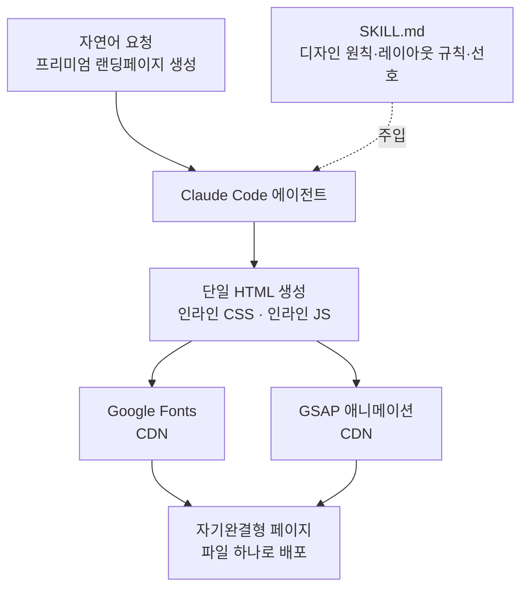

최근 X에서 한 개발자가 "Claude Code가 프리미엄 랜딩페이지를 한 번에 만들도록 스킬을 만들었다"며 영상 속 세 개의 사이트를 모두 원샷으로 뽑았다고 공유했습니다([@the_cyw](https://x.com/the_cyw/status/2075338024406409239)). 반응이 뜨거웠던 이유는 결과물의 완성도 때문이지만, 엔지니어 입장에서 더 흥미로운 지점은 따로 있습니다. 똑같은 모델에 똑같이 "랜딩페이지 만들어줘"라고 해도 평범한 결과가 나오는데, 스킬 하나를 얹었더니 에이전시급 페이지가 한 번에 나온다는 사실입니다. 이 글은 그 스킬이 실제로 어떤 구조로 동작하는지 분해하고, 스킬을 일급 리소스로 다루는 ThakiCloud의 운영 관점에서 검증합니다.

## 개요

Claude Code 스킬은 마법이 아니라 **표준 작업 절차서(SOP)**입니다. 모델을 더 똑똑하게 바꾸는 것이 아니라, 모델이 이미 가진 능력을 특정 방향으로 강하게 제약해 평균 품질을 끌어올립니다. 랜딩페이지 스킬의 경우 그 제약이 곧 디자인 원칙, 레이아웃 규칙, 산출 포맷입니다.

이 관점은 ThakiCloud가 에이전트를 운용하는 원칙과 정확히 겹칩니다. 에이전트의 품질은 모델 등급이 아니라 그 모델을 감싸는 계약 구조에서 나온다는 것입니다. 랜딩페이지 스킬은 그 계약 구조를 프런트엔드 디자인이라는 좁은 영역에 집중시킨 좋은 사례입니다. 자유도를 줄여 평균 품질을 올리는 전형적인 스킬 설계이기도 합니다.

## 이 기술은 무엇인가

Claude Code 스킬은 본질적으로 `SKILL.md`라는 마크다운 파일 하나입니다. 이 파일 안에는 에이전트가 특정 작업을 할 때 따라야 할 원칙과 규칙, 그리고 사용자의 선호가 담깁니다. 사용자가 자연어로 요청하면, 관련 스킬이 에이전트의 컨텍스트에 주입되고, 에이전트는 그 지침을 SOP처럼 따르며 로컬에서 HTML과 CSS, 자바스크립트를 직접 생성합니다.

랜딩페이지 스킬이 만들어 내는 산출물의 형태는 공개된 여러 스킬에서 공통적으로 관찰됩니다. 하나의 자기완결형 HTML 파일로, 모든 CSS는 `<style>` 안에 인라인으로, 모든 자바스크립트는 `<script>` 안에 인라인으로 들어갑니다. 외부 의존성은 Google Fonts와 CDN으로 불러오는 GSAP 애니메이션 라이브러리 정도로 제한됩니다([Claude Directory](https://www.claudedirectory.org/skills/claude-skills-landing)). 파일 하나만 있으면 어디든 올려서 바로 서비스할 수 있는 구조입니다.

핵심은 "원샷"이라는 표현입니다. 사용자가 원하는 바를 평범한 문장으로 설명하면, 에이전트가 여러 번의 왕복 없이 한 번에 전체 페이지를 만들어 냅니다. 이것이 가능한 이유는 모델이 창의력을 발휘해서가 아니라, 스킬이 이미 "좋은 랜딩페이지란 무엇인가"에 대한 결정을 대부분 대신 내려 주기 때문입니다.

## 스킬이 대신 내려 주는 결정들

스킬 없이 랜딩페이지를 요청하면 결과가 제네릭한 이유는 명확합니다. 에이전트가 매번 처음부터 레이아웃, 여백, 타이포그래피, 색 대비, 애니메이션 타이밍을 새로 판단해야 하고, 그 판단은 안전한 평균값으로 수렴하기 때문입니다. 공개된 프리미엄 랜딩페이지 스킬들은 바로 이 판단을 미리 고정합니다([MindStudio 분석](https://www.mindstudio.ai/blog/claude-code-landing-page-generator-skill-city-service-matrix-seo)).

이런 스킬이 담는 디자인 철학은 대체로 일관됩니다. 불필요한 요소를 걷어 낸 의도적 절제를 바탕에 깔고, 대칭을 깨는 비대칭 레이아웃으로 시선을 유도하며, 그 위에 전환율을 높이는 심리적 장치를 얹습니다. 결과물이 템플릿처럼 보이지 않고 사람이 직접 다듬은 것처럼 느껴지도록 브랜드 권위와 전환이라는 두 축을 함께 겨냥합니다. 어떤 스킬 제작자는 이를 "정상급 디자인 에이전시의 전문성을 에이전트에게 이식하는 것"이라고 표현하기도 합니다.

여기서 얻는 교훈은 프런트엔드에만 국한되지 않습니다. 좋은 스킬은 모델에게 자유를 주는 것이 아니라, 검증된 골격을 주고 그 안을 채우게 하는 것입니다. 디자인 토큰, 레이아웃 그리드, 산출 포맷을 코드처럼 고정할수록 매 호출의 편차가 줄고 평균 품질이 올라갑니다. 반대로 "멋지게 만들어줘" 같은 산문 부탁만으로는 매번 다른 결과가 나옵니다.

## 직접 만들 때의 유의점

이런 스킬을 직접 작성해 본다면 몇 가지가 중요합니다. 첫째, 산출 포맷을 명시적으로 못박아야 합니다. "단일 HTML, 인라인 CSS/JS, 외부 의존성은 폰트와 GSAP만"처럼 구조를 규정하면 배포와 이식이 단순해집니다. 둘째, 디자인 판단을 규칙으로 환원해야 합니다. 여백 스케일, 타이포그래피 대비, 허용 색 팔레트, 애니메이션은 레이아웃을 흔들지 않는 `transform`과 `opacity` 위주로 같은 규칙을 SOP에 적어 두면 에이전트가 매번 다시 고민하지 않습니다. 셋째, 실패 사례를 담아야 합니다. 스킬에서 가장 밀도 높은 정보는 "이렇게 하지 마라" 목록입니다. 레이아웃을 흔드는 애니메이션 금지, 접근성 기본 위반 금지 같은 항목이 결과 품질을 실제로 지켜 줍니다([Ryan Doser 가이드](https://ryandoser.com/claude-code-landing-pages/)).

한 가지 덧붙이면, 스킬은 세금이기도 합니다. 스킬이 컨텍스트에 로드되는 순간부터 토큰 비용을 지불하므로, 모든 문장이 "이게 없으면 에이전트가 틀리는가"라는 질문을 통과해야 합니다. 불필요한 미사여구는 순손실입니다.

## ThakiCloud 제품 적용 시사점

이 사례가 ThakiCloud에 특별히 와닿는 이유는, 우리가 스킬을 일급 리소스로 다루는 플랫폼을 직접 운용하기 때문입니다.

**Paxis 관점(에이전트·스킬).** Paxis는 ThakiCloud의 Agent-Native Cloud로, Skills와 Tools, Policies, Audit Logs를 일급 리소스로 다룹니다. 랜딩페이지 스킬 같은 단위 능력은 정확히 Paxis의 Skill Harness가 관리하는 대상입니다. 우리는 수백 개 규모의 스킬을 BM25로 선택해 요청에 맞는 것만 에이전트 컨텍스트에 주입하고, 격리된 샌드박스에서 실행하며, 모든 행동을 정책 게이트와 감사 로그로 통과시킵니다. 랜딩페이지 스킬 하나가 잘 동작한다는 것은, 같은 패턴을 슬라이드 생성, 문서 렌더링, 인프라 배포 같은 다른 도메인으로 확장할 수 있다는 뜻이기도 합니다. 실제로 이 블로그의 이미지와 문서 산출물도 동일한 스킬 하네스 위에서 생성됩니다.

특히 이번 사례가 보여 주는 "포맷은 코드가 소유하고 모델은 내용만 채운다"는 원칙은 Paxis의 설계 철학과 그대로 맞닿아 있습니다. 산출 구조를 결정론적으로 고정하고 모델에게는 판단할 여지를 좁혀 줄수록, 다양한 모델 등급에서도 일관된 품질이 나옵니다.

**ai-platform 관점(인프라).** 이런 생성 워크로드를 외부 API에만 의존하지 않고 자체 인프라에서 돌리고 싶은 고객도 있습니다. ThakiCloud의 ai-platform은 K8s와 Kueue 기반 GPU 스케줄링 위에서 생성 모델을 서빙하므로, 온프레미스나 소버린 환경에서도 이런 스킬 기반 파이프라인을 자체 호스팅할 수 있습니다. 랜딩페이지 생성처럼 반복적이고 정형화된 작업일수록, 낮은 서빙 비용이 곧 에이전트 경제성으로 이어집니다.

## 한계 및 반론

물론 과장은 경계해야 합니다. "한 번에 프리미엄 페이지"라는 표현은 시연 조건에서 가장 잘 성립합니다. 실제 제품 랜딩페이지는 브랜드 자산, 카피 검수, 접근성 준수, 성능 예산, A/B 테스트 같은 요구가 겹치므로 원샷 산출물은 훌륭한 초안이지 최종본이 아닙니다. 특히 인라인으로 뭉친 단일 HTML은 빠른 배포에는 유리하지만, 여러 페이지가 자산을 공유하는 실제 사이트에서는 캐싱과 유지보수 측면에서 다시 분리해야 할 수 있습니다.

또한 스킬이 담은 디자인 취향이 곧 결과의 상한입니다. 스킬이 특정 미감에 최적화되어 있으면 그 미감에서 벗어난 요구에는 오히려 저항합니다. 이것은 버그가 아니라 설계된 트레이드오프입니다. 자유도를 줄여 평균을 올린 대가로 극단값을 포기한 것이며, 다양한 브랜드를 다뤄야 하는 팀이라면 스킬을 하나로 두지 않고 미감별로 나누는 편이 낫습니다.

결론적으로 이 사례의 진짜 가치는 "예쁜 페이지가 한 번에 나온다"가 아니라, **에이전트 품질은 모델이 아니라 스킬 설계에서 나온다**는 원칙을 눈에 보이게 증명했다는 데 있습니다. 그리고 그 원칙을 플랫폼 차원에서 운용 가능한 형태로 제품화한 것이 바로 Paxis입니다.

## 관련 슬라이드

본문 내용을 NotebookLM(`structured_mint` 스타일)으로 요약한 슬라이드입니다.

## 출처

- [@the_cyw, "I built a skill to let my Claude Code build premium landing pages"](https://x.com/the_cyw/status/2075338024406409239)
- [Claude Directory: Landing Page Skills](https://www.claudedirectory.org/skills/claude-skills-landing)
- [MindStudio: Claude Code Landing Page Generator Skill](https://www.mindstudio.ai/blog/claude-code-landing-page-generator-skill-city-service-matrix-seo)
- [Ryan Doser: How to Build Landing Pages With Claude Code](https://ryandoser.com/claude-code-landing-pages/)
