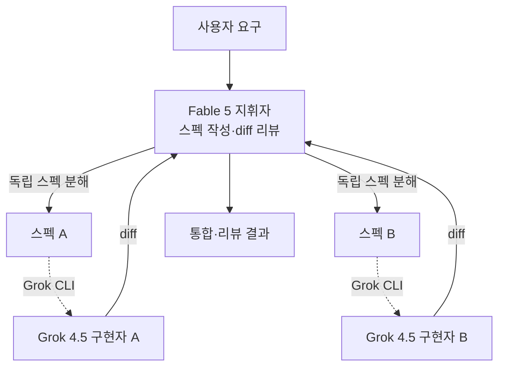

코딩 에이전트를 쓰다 보면 자연스럽게 드는 생각이 있습니다. 스펙을 정교하게 쓰고 결과 diff를 날카롭게 리뷰하는 일과, 실제로 코드를 한 줄 한 줄 타이핑하는 일은 성격이 다른 작업인데, 왜 같은 모델 하나가 둘을 다 해야 하는가입니다. 최근 공개되어 화제가 된 `fable-advisor` 플러그인은 이 질문에 정면으로 답합니다. **Claude Fable 5는 지휘만 하고, 실제 구현은 Grok 4.5가 전담**하는 크로스벤더 워크플로입니다. 이 글은 그 구조를 분해하고, 멀티에이전트와 모델 라우팅을 일급 리소스로 다루는 ThakiCloud의 운영 관점에서 이 설계가 무엇을 시사하는지 검증합니다.

## 개요

지금까지 멀티에이전트 코딩 워크플로는 대체로 한 벤더 안에서 이루어졌습니다. Claude Code라면 Opus가 지휘하고 Sonnet이나 Haiku가 서브에이전트로 도는 식입니다. `fable-advisor`가 흥미로운 지점은 이 분업을 **벤더 경계를 넘어** 구성한다는 데 있습니다. Anthropic의 Fable 5가 오케스트레이션 레이어를, xAI의 Grok 4.5가 구현 레이어를 맡습니다.

이 설계의 핵심 통찰은 명료합니다. 지휘와 구현은 요구하는 능력이 다르고, 비용 구조도 다릅니다. 스펙 작성과 diff 리뷰는 판단과 추론의 영역이라 지휘자에게 적합한 모델이 필요하고, 대량의 코드 타이핑은 처리량과 비용 효율이 중요합니다. `fable-advisor`는 이 둘을 서로 다른 벤더의 모델에 각각 배치해, 각 레이어에 가장 잘 맞는 모델을 쓰도록 합니다. 무료 오픈소스이며 라우팅 로직을 직접 커스터마이징할 수 있다는 점도 실전 도입 문턱을 낮춥니다.


## 이 기술은 무엇인가

`fable-advisor`는 Claude Code에 얹는 플러그인으로, 세 가지 역할 분리를 강제합니다.


첫째, **지휘자(Fable 5)**는 스펙을 쓰고 결과를 리뷰합니다. 사용자의 요구를 받아 구현 스펙으로 분해하고, 구현이 끝난 뒤 diff를 검토합니다. 중요한 점은 지휘자가 **코드를 직접 쓰지 않는다**는 것입니다. 판단과 계약 정의에 집중합니다.

둘째, **구현자(Grok 4.5)**는 실제 타이핑을 전담합니다. 지휘자가 넘긴 스펙을 받아 Grok CLI를 경유해 Grok 4.5가 코드를 작성합니다. 저장소 이력을 보면, v3부터 기존의 Sonnet/Opus 구현 에이전트가 `grok-implementer`로 교체되어 Grok 4.5가 기본 타이핑 레인이 되었습니다. 즉 이 플러그인은 처음부터 크로스벤더였던 것이 아니라, 구현 레인을 저비용·고처리량 모델로 옮기는 방향으로 진화한 결과물입니다.

셋째, **병렬 실행**입니다. 서로 독립적인 스펙은 병렬 에이전트로 동시에 실행됩니다. 지휘자가 작업을 서로 의존하지 않는 단위로 분해하면, 각 단위가 별도 구현 에이전트로 동시에 진행됩니다. 이는 단순한 순차 위임이 아니라 DAG(방향성 비순환 그래프) 형태의 분업에 가깝습니다.

전체 흐름을 도식으로 보면 다음과 같습니다.



## 설치 및 통합

플러그인 설치는 한 줄입니다. Claude Code의 플러그인 마켓플레이스에 저장소를 추가하면 됩니다.

```bash
claude plugin marketplace add DannyMac180/fable-advisor
```

구현 레인을 담당하는 Grok CLI는 별도 인증이 필요합니다. `grok login`으로 로그인하면 SuperGrok 또는 X Premium+ 구독 기반의 OAuth 인증으로 동작하며, 저장소 설명에 따르면 이 경로는 **토큰당 API 과금 없이** 구독만으로 구현 에이전트를 돌릴 수 있습니다. 이 지점이 비용 구조의 핵심입니다. 지휘자는 판단이 필요한 소량의 호출만 하고, 대량의 코드 타이핑은 구독형 요금제 안에서 처리되므로 종량 과금이 붙는 부분을 최소화합니다.

통합 관점에서 눈여겨볼 점은 라우팅 로직이 열려 있다는 것입니다. 어떤 작업을 어느 모델에 보낼지, 어떤 조건에서 병렬화할지를 사용자가 직접 조정할 수 있으므로, 팀의 예산과 품질 요구에 맞춰 레인을 재구성할 수 있습니다.

## 이 설계가 실제로 어떻게 동작하는가

`fable-advisor`는 벤치마크 수치를 내세우는 도구가 아니라 워크플로 패턴이므로, 여기서는 재현 가능한 성능 수치 대신 설계가 만들어 내는 구조적 효과를 짚습니다. 저장소가 정량 지표를 제시하지 않으므로, 이 글에서도 수치를 지어내지 않고 구조적 이점만 다룹니다.

가장 큰 효과는 **비용과 품질의 분리**입니다. 판단이 필요한 오케스트레이션은 지휘자에게, 처리량이 필요한 구현은 저비용 구현자에게 배치하면, 전체 워크플로의 단가는 낮아지면서도 판단 품질은 유지됩니다. "지휘자는 싸게 자주 부르지 않고, 구현자는 비싸지 않게 많이 부른다"는 배치가 자연스럽게 성립합니다.

두 번째 효과는 **교차 검증**입니다. 구현자와 리뷰어가 서로 다른 벤더의 모델이라는 점은 흥미로운 부수 효과를 냅니다. 같은 모델이 자기 코드를 리뷰하면 같은 실수를 함께 놓치기 쉽지만, 다른 계열의 모델이 diff를 검토하면 서로의 사각지대를 잡아낼 여지가 커집니다. 지휘자-워커 분리가 단순 분업을 넘어 일종의 상호 검증 장치가 되는 셈입니다.

세 번째는 **병렬화로 인한 지연 단축**입니다. 독립적인 스펙을 동시에 구현하면, 전체 작업 시간이 순차 합계가 아니라 가장 오래 걸리는 단일 체인에 수렴합니다. 지휘자가 작업을 잘 분해할수록 이 이점은 커집니다.


## 지휘자-워커 패턴의 일반화

`fable-advisor`를 개별 플러그인이 아니라 하나의 설계 패턴으로 보면, 더 넓은 맥락이 보입니다. 이 패턴의 본질은 "메인 세션은 지휘만, 무거운 작업은 위임"입니다. 크로스벤더는 이 패턴의 한 변형일 뿐이고, 실제로는 같은 벤더 안에서도 성립합니다. 예를 들어 Claude Code에서 Fable 5를 지휘자로 두고 탐색은 Haiku, 구현은 Sonnet, 복잡한 추론은 Opus 서브에이전트로 분기하는 구성이 이미 널리 쓰입니다. `fable-advisor`가 한 일은 이 위임의 대상 모델을 벤더 경계 밖까지 넓힌 것입니다.

이 관점에서 보면 지휘자 모델의 선택 기준이 명확해집니다. 지휘자는 판단·분기·집약을 담당하므로, 정확도와 추론 품질이 중요하되 호출 빈도는 상대적으로 낮습니다. 반대로 구현자는 처리량과 단가가 중요합니다. 따라서 좋은 오케스트레이션은 "가장 비싼 모델을 지휘자에 두고 모든 것을 그 모델로 처리한다"가 아니라, "각 레이어에 그 레이어가 요구하는 특성의 모델을 배치한다"입니다. `fable-advisor`가 구현 레인을 구독형 저비용 모델로 옮긴 v3의 진화는 정확히 이 원칙을 따른 결과입니다.

한 가지 유의할 점은, 이 패턴이 유효하려면 위임의 경계가 명확해야 한다는 것입니다. 지휘자가 스펙을 모호하게 넘기면 구현자는 추측으로 채우고, 그 결과 리뷰 부담이 오히려 커집니다. 위임의 이득은 스펙이 충분히 구체적일 때만 실현됩니다. 이는 사람 조직의 분업과 다르지 않습니다. 명세가 분명할수록 위임이 잘 작동합니다.

## ThakiCloud 제품 적용 시사점

이 설계는 ThakiCloud가 에이전트를 운용하는 방식과 놀라울 만큼 겹칩니다.

**Paxis 관점**에서 가장 직접적입니다. Paxis는 ThakiCloud의 Agent-Native Cloud 제어 평면으로, DAG 형태의 멀티에이전트 실행을 핵심 능력으로 다룹니다. `fable-advisor`가 보여 주는 "스펙 작성 → 분산 구현 → 교차 리뷰" 구조는 Paxis의 스킬 하네스가 작업을 서브태스크로 분해하고, 격리 샌드박스에서 병렬 실행한 뒤, 검증 스테이지로 닫는 설계와 같은 골격입니다. 특히 지휘자가 코드를 직접 쓰지 않고 판단과 계약 정의에 집중한다는 원칙은, 능력을 모델 등급이 아니라 주변 계약 구조에서 끌어낸다는 우리 설계 철학과 정확히 일치합니다. 서로 다른 모델의 결과를 지휘자가 다시 리뷰하는 흐름은, 멀티에이전트 fan-out을 검증 스테이지로 닫아 환각 누적을 막는다는 우리 운영 원칙과도 맞닿습니다.


**ai-platform 관점**에서는 비용 구조의 각도가 유효합니다. ThakiCloud의 ai-platform은 K8s와 Kueue 기반으로 GPU 워크로드를 스케줄링하며 고객사의 추론·학습 워크로드를 서빙합니다. `fable-advisor`가 구현 레인을 저비용 모델로 위임해 전체 워크플로 단가를 낮추는 발상은, GPU 클라우드 고객사가 자기 워크로드를 설계할 때 그대로 적용할 수 있는 패턴입니다. 무거운 추론이 필요한 소수의 판단 단계와, 처리량이 중요한 다수의 실행 단계를 서로 다른 티어의 자원에 배치하면, 같은 결과를 더 낮은 비용으로 얻습니다. 저비용 서빙이 곧 에이전트 경제성을 만든다는 점에서, ai-platform의 비용 효율과 Paxis의 에이전트 오케스트레이션은 서로를 보완합니다.


## 한계 및 반론

이 설계에도 분명한 대가가 따릅니다. 첫째는 **운영 복잡도**입니다. 두 벤더의 모델을 한 워크플로에 엮는다는 것은, 두 개의 인증 체계와 두 개의 요금제, 두 개의 장애 지점을 관리한다는 뜻입니다. 한쪽 벤더의 CLI가 바뀌거나 인증이 만료되면 워크플로 전체가 멈출 수 있습니다. 단일 벤더 워크플로의 단순함을 포기하는 대신 얻는 이점이므로, 그 이점이 복잡도를 정당화하는지 팀마다 판단이 다를 수 있습니다.

둘째는 **품질 위임의 위험**입니다. 구현을 저비용 모델에 맡긴다는 것은, 지휘자의 스펙과 리뷰가 충분히 촘촘하지 않으면 낮은 품질의 구현이 그대로 통과할 수 있다는 뜻입니다. 이 워크플로의 품질은 결국 지휘자의 리뷰 게이트가 얼마나 엄격한가에 달려 있습니다. 리뷰가 형식적이면 크로스벤더 분업의 교차 검증 효과가 사라지고, 비용만 아낀 저품질 파이프라인이 됩니다.

셋째는 **구독 기반 인증의 제약**입니다. Grok CLI가 구독 기반 OAuth로 동작한다는 점은 개인이나 소규모 팀에는 비용 이점이지만, 대규모 자동화나 무인 파이프라인에서는 구독 한도와 인증 갱신이 병목이 될 수 있습니다. 종량 과금이 없다는 장점은, 뒤집으면 사용량이 한도를 넘는 순간 확장이 막힌다는 뜻이기도 합니다.

그럼에도 `fable-advisor`가 던지는 메시지는 분명합니다. 코딩 에이전트의 미래는 하나의 만능 모델이 아니라, 각 레이어에 가장 잘 맞는 모델을 조합하는 오케스트레이션에 있다는 것입니다. 이는 멀티에이전트와 모델 라우팅을 일급 리소스로 다루는 ThakiCloud의 방향과 정확히 같은 곳을 가리킵니다.

## 출처

- [fable-advisor (GitHub)](https://github.com/DannyMac180/fable-advisor)
- [Grok CLI (x.ai/cli)](https://x.ai/cli)
