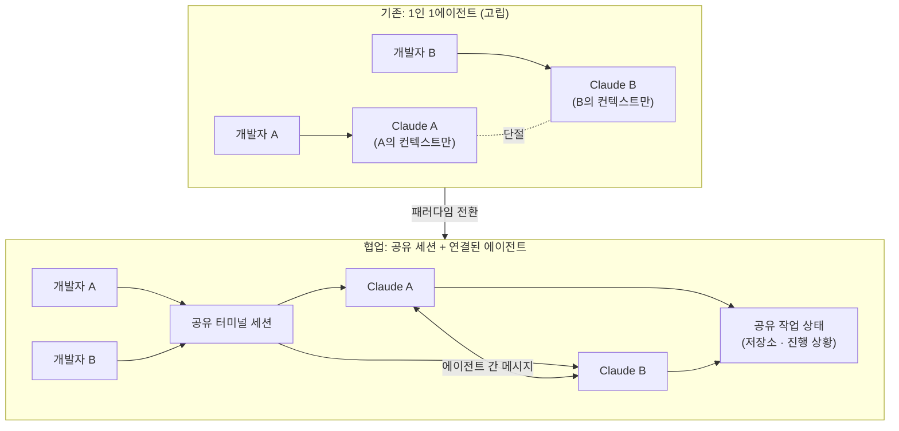

코딩 에이전트를 팀에서 쓰다 보면 이상한 벽에 부딪힙니다. 에이전트는 나 혼자만의 것입니다. 옆자리 동료가 같은 저장소를 만지고 있어도, 각자의 Claude는 서로의 존재를 모릅니다. 사람은 슬랙과 화면 공유로 협업하는데, 정작 우리를 대신해 코드를 만지는 에이전트들은 각자의 섬에 갇혀 있습니다. 최근 공개되어 화제가 된 **멀티플레이어 Claude Code**는 바로 이 벽을 겨냥합니다. 같은 터미널을 여러 사람이 함께 쓰고, 각자의 Claude를 서로 연결해 에이전트끼리 대화하게 만드는 실험입니다. 이 글은 이 시도를 계기로 협업 코딩 에이전트가 풀어야 할 설계 과제를 분해하고, 멀티에이전트와 정책을 일급 리소스로 다루는 ThakiCloud의 운영 관점에서 이 방향이 무엇을 시사하는지 검증합니다.

## 개요

지금까지 코딩 에이전트의 기본 단위는 **1인 1에이전트**였습니다. Claude Code는 내 터미널에 살면서 내 코드베이스를 이해하고 내 명령을 받습니다. 이 구조는 개인 생산성에는 훌륭하지만, 소프트웨어가 애초에 팀 작업이라는 사실과는 어긋납니다. 개발자 도라 로하니(Dorsa Rohani)가 공개한 멀티플레이어 Claude Code는 이 전제를 뒤집습니다. 발표에 따르면 이 도구는 두 가지를 가능하게 합니다. 첫째, 여러 사람이 **같은 터미널 세션**을 공유하며 함께 작업합니다. 둘째, 각자의 Claude를 **서로 연결해 에이전트끼리 대화**하도록 만듭니다.

주목할 점은 이것이 단발성 장난감이 아니라 더 큰 흐름의 한 조각이라는 것입니다. 비슷한 시기에 여러 사람이 여러 코딩 에이전트를 하나의 작업 공간에 모으는 프로젝트들이 잇따라 등장했습니다. 팀 우선 멀티에이전트 오케스트레이션을 표방한 `oh-my-claudecode`, Codex와 Claude를 비롯한 여러 에이전트를 한 워크스페이스에서 섞어 쓰는 `claude_codex_bridge`, 여러 에이전트 세션을 집계하는 협업 워크스페이스 `codeg` 같은 도구들이 그 예입니다. 방향은 하나로 수렴합니다. **에이전트를 고립된 단말이 아니라 서로 통신하는 참여자로 다루는 것**입니다.

이 흐름이 왜 중요한지는 명확합니다. 실제 개발 조직에서 가치 있는 일의 상당 부분은 조율에서 나옵니다. 누가 어느 파일을 만지는지, 이 변경이 저 모듈을 깨뜨리지 않는지, 리뷰어가 무엇을 걱정하는지 같은 것들입니다. 에이전트가 이 조율에 참여하지 못하면, 우리는 결국 에이전트가 각자 만든 결과물을 사람이 손으로 다시 봉합해야 합니다. 협업 에이전트는 그 봉합 비용을 줄이려는 시도입니다.

## 멀티플레이어 코딩 에이전트란 무엇인가

멀티플레이어라는 단어는 게임에서 왔지만, 여기서는 두 개의 서로 다른 축을 동시에 가리킵니다. 하나는 **사람 대 사람** 축입니다. 여러 개발자가 같은 세션을 공유하며 하나의 에이전트에 함께 지시를 내리는 형태입니다. 다른 하나는 **에이전트 대 에이전트** 축입니다. 각자의 에이전트가 서로 메시지를 주고받으며 작업을 나누는 형태입니다. 멀티플레이어 Claude Code가 흥미로운 이유는 이 두 축을 함께 다룬다는 데 있습니다.

아래 도표는 기존의 고립된 구조와 협업 구조의 차이를 보여줍니다.

기존 구조에서 두 개발자의 에이전트는 같은 저장소를 만지더라도 서로를 인식하지 못합니다. 각자 자기 컨텍스트 안에서만 판단하므로, A의 Claude가 리팩터한 인터페이스를 B의 Claude가 모른 채 예전 시그니처로 호출하는 일이 벌어집니다. 협업 구조에서는 세션과 상태가 공유되고, 에이전트끼리 메시지를 주고받기 때문에 이 어긋남을 실시간에 가깝게 줄일 여지가 생깁니다.

다만 발표된 정보만으로는 이 연결이 어느 수준까지 구현되었는지 단정하기 어렵습니다. 공유 터미널이 화면 스트리밍 수준인지, 아니면 에이전트가 실제로 서로의 계획과 편집 의도를 구조화된 형태로 교환하는지에 따라 실용성은 크게 갈립니다. 이 글은 공개된 개념을 근거로 설계 과제를 짚는 데 초점을 맞추며, 검증되지 않은 내부 동작은 단정하지 않습니다.

## 왜 지금 이 방향인가

협업 에이전트가 지금 등장하는 데에는 이유가 있습니다. 모델이 강해지면서 에이전트 한 대가 처리하는 작업의 크기가 커졌고, 그 결과 **여러 에이전트가 동시에 큰 변경을 만드는 상황**이 실제로 잦아졌기 때문입니다. 한 사람이 서브에이전트를 병렬로 띄워 파일을 나눠 고치는 패턴은 이미 흔합니다. 여기서 한 걸음만 더 나가면 서로 다른 사람의 에이전트가 같은 코드베이스에서 겹치는 순간이 옵니다. 조율이 없으면 이 순간은 곧 충돌이 됩니다.

또 하나의 배경은 도구 생태계의 파편화입니다. 팀마다 Claude Code를 쓰는 사람, Codex를 쓰는 사람, Cursor를 쓰는 사람이 섞여 있습니다. 앞서 언급한 여러 벤더의 에이전트를 한 워크스페이스로 묶는 프로젝트들이 등장한 것은, 이 파편화를 조율 계층으로 흡수하려는 시도입니다. 즉 협업 에이전트는 단순히 사람을 더 붙이는 기능이 아니라, **이질적인 에이전트들이 공존하는 현실을 다루는 인프라 문제**로 커지고 있습니다.

## 협업 에이전트가 풀어야 할 설계 과제

멋진 개념 뒤에는 만만치 않은 엔지니어링이 있습니다. 협업 에이전트를 실무에 올리려면 최소 네 가지를 풀어야 합니다.

첫째, **동시성과 충돌**입니다. 두 에이전트가 같은 파일의 같은 영역을 동시에 편집하면 어떻게 되는지 정해야 합니다. 사람의 협업에서는 git 브랜치와 병합이 이 문제를 흡수했지만, 실시간 공유 세션에서는 그보다 짧은 주기의 조정이 필요합니다. 잠금을 걸 것인지, 낙관적 편집 후 병합할 것인지, 아니면 애초에 작업 영역을 겹치지 않게 분배할 것인지가 설계의 갈림길입니다.

둘째, **컨텍스트 공유의 범위**입니다. 에이전트끼리 대화하게 하려면 무엇을 공유할지 정해야 합니다. 전체 대화 이력을 통째로 넘기면 토큰 비용이 폭증하고 컨텍스트가 오염됩니다. 반대로 너무 적게 공유하면 협업의 의미가 사라집니다. 결국 필요한 것은 **요약되고 구조화된 상태 교환**입니다. "나는 이 파일의 이 함수를 이렇게 바꿀 계획이다"라는 의도를, 원문이 아니라 압축된 형태로 주고받아야 합니다.

셋째, **신뢰 경계**입니다. 내 에이전트가 남의 에이전트가 제안한 변경을 얼마나 신뢰해야 하는지의 문제입니다. 사람이 리뷰 없이 병합하지 않듯, 에이전트도 다른 에이전트의 산출물을 무검증으로 받아들여서는 안 됩니다. 멀티에이전트 시스템의 오래된 교훈은 명확합니다. **검증 단계 없이 여러 에이전트의 결과를 합치면 환각이 누적됩니다.** 협업 에이전트일수록 각 참여자의 산출물을 적대적으로 검증하는 게이트가 더 필요합니다.

넷째, **감사와 책임 추적**입니다. 여러 사람과 여러 에이전트가 같은 코드를 만졌을 때, 어떤 변경이 누구의(혹은 어느 에이전트의) 판단에서 나왔는지 추적할 수 없다면 사고가 났을 때 원인을 되짚을 수 없습니다. 협업이 늘어날수록 감사 로그는 선택이 아니라 필수가 됩니다.

## ThakiCloud 제품 적용 시사점

이 설계 과제들은 ThakiCloud가 **Paxis**에서 이미 정면으로 다루고 있는 문제들과 정확히 겹칩니다. Paxis는 ai-platform 위에서 도는 Agent-Native Cloud 제어 평면으로, Skills·Tools·Policies·Audit Logs를 일급 리소스로 취급합니다. 멀티플레이어 코딩 에이전트가 던지는 질문에 Paxis의 구조는 다음과 같이 대응합니다.

에이전트 간 협업의 골격은 Paxis의 **DAG 멀티에이전트** 오케스트레이션입니다. 여러 에이전트를 무작정 같은 공간에 풀어놓는 대신, 작업을 방향성 비순환 그래프로 분해해 각 노드가 담당 영역을 갖게 하면, 앞서 말한 동시성 충돌의 상당 부분을 구조적으로 회피할 수 있습니다. 겹치는 편집을 사후에 병합하는 대신, 애초에 겹치지 않도록 작업을 배분하는 방식입니다.

신뢰 경계 문제에는 Paxis의 **정책 게이트와 감사 로그**가 답합니다. 한 에이전트의 산출물이 다른 에이전트나 실제 시스템으로 흘러가기 전에 정책 게이트를 통과해야 하고, 모든 행동이 감사 로그에 남습니다. 이는 "여러 에이전트의 결과를 검증 없이 합치지 않는다"는 원칙을 인프라 차원에서 강제하는 셈입니다. 협업이 늘어날수록 이 게이트의 가치는 커집니다.

컨텍스트 공유의 비용 문제는 Paxis의 **Skill Harness**와 지식 엔진이 완화합니다. 960개가 넘는 스킬을 BM25로 선택해 격리 샌드박스에서 실행하는 구조는, 에이전트가 매번 전체 컨텍스트를 짊어지는 대신 그때그때 필요한 능력만 불러오도록 설계돼 있습니다. 협업 에이전트가 상태를 통째로 교환하는 대신 요약된 형태로 주고받아야 한다는 요구와 같은 방향입니다.

그 아래에서 실행 자원을 받쳐주는 것은 **ai-platform**입니다. 여러 사람과 여러 에이전트가 동시에 격리된 샌드박스에서 코드를 실행하려면 멀티테넌트 격리와 탄력적인 컴퓨트가 필요합니다. K8s와 Kueue 기반 GPU 스케줄링, 멀티테넌트 격리는 협업 에이전트가 실제로 돌아갈 토대를 제공합니다. 온프레미스와 소버린 환경에서도 이 협업 구조를 안전하게 세울 수 있다는 점은, 데이터 유출을 우려하는 조직에 특히 의미가 있습니다.

정리하면, 멀티플레이어 Claude Code가 개인 도구 층에서 실험하는 협업 개념을, Paxis는 제어 평면 층에서 정책과 감사와 오케스트레이션으로 구조화합니다. 두 층은 경쟁이 아니라 보완입니다. 협업 에이전트가 재미있는 데모에서 신뢰할 수 있는 운영으로 넘어가려면, 결국 정책 게이트와 감사 로그와 자원 격리를 갖춘 제어 평면이 필요하기 때문입니다.

## 한계 및 반론

협업 에이전트를 낙관만 할 수는 없습니다. 가장 큰 반론은 **조율 비용이 협업 이득을 잡아먹을 수 있다**는 것입니다. 사람 사이의 회의가 그렇듯, 에이전트끼리 주고받는 메시지가 늘어나면 그 자체가 지연과 토큰 비용이 됩니다. 두 에이전트가 서로의 계획을 계속 확인하느라 정작 코드를 못 만드는 상황은 충분히 가능합니다. 협업이 항상 병렬 단독 작업보다 빠른 것은 아닙니다.

둘째, **실패 모드의 결합**입니다. 에이전트가 서로 연결되면 한 에이전트의 잘못된 판단이 다른 에이전트로 전파됩니다. 고립된 구조에서는 한 사람의 실수가 그 사람 안에 머물지만, 연결된 구조에서는 오류가 사슬을 타고 번집니다. 검증 게이트가 없다면 협업은 오히려 사고를 증폭시킵니다.

셋째, 지금 공개된 멀티플레이어 도구가 실제로 어느 수준의 상태 교환을 구현했는지는 아직 검증되지 않았습니다. 공유 터미널이 화면 공유에 가까운 것인지, 진짜 구조화된 에이전트 간 프로토콜인지에 따라 실용성은 크게 달라집니다. 개념의 방향성은 분명하지만, 프로덕션에 올리기 전에는 신뢰 경계와 감사 추적을 반드시 확인해야 합니다. 흥미로운 데모와 신뢰할 수 있는 인프라 사이에는 여전히 상당한 거리가 있습니다.

그럼에도 방향 자체는 되돌리기 어렵다고 봅니다. 소프트웨어가 팀 작업인 한, 그 팀을 대신하는 에이전트들도 결국 서로 대화해야 합니다. 관건은 협업을 켜느냐 마느냐가 아니라, 그 협업을 **정책과 검증과 감사가 받쳐주는 구조 위에 세우느냐**입니다.

## 출처

- Dorsa Rohani, "We made Claude Code multiplayer!" (X, 2026-07-08): [https://x.com/dorsa_rohani/status/2074963064231952832](https://x.com/dorsa_rohani/status/2074963064231952832)
- Claude Code (Anthropic 공식 저장소): [https://github.com/anthropics/claude-code](https://github.com/anthropics/claude-code)
- oh-my-claudecode (팀 우선 멀티에이전트 오케스트레이션): [https://github.com/yeachan-heo/oh-my-claudecode](https://github.com/yeachan-heo/oh-my-claudecode)
- claude_codex_bridge (다중 에이전트 CLI 워크스페이스): [https://github.com/SeemSeam/claude_codex_bridge](https://github.com/SeemSeam/claude_codex_bridge)
