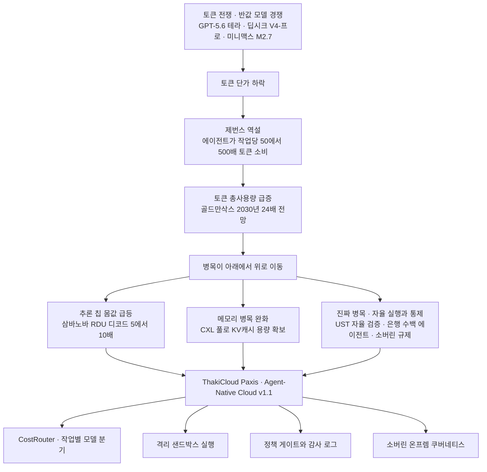

## 같은 주에 도착한 두 개의 정반대 뉴스

이번 주 AI 지면에는 서로 어긋나 보이는 두 소식이 나란히 실렸습니다. 하나는 값이 내려간다는 뉴스입니다. 오픈AI가 GPT-5.6을 솔, 테라, 루나 세 단계 가격으로 내놓으면서 중간 등급인 테라를 이전 세대의 절반 값에 걸었습니다. 딥시크 V4-프로는 클로드 오퍼스 4.7의 10~20% 수준 가격으로 코딩 성능을 맞췄고, 미니맥스 M2.7은 동급 대비 최대 3분의 1 값을 제시했습니다. 업계는 이 국면을 아예 '토큰 전쟁'이라고 부릅니다.

다른 하나는 값이 오른다는 뉴스입니다. 추론 전용 칩 스타트업 삼바노바가 기업가치 110억 달러, 약 16조 원을 인정받으며 시리즈F 1차로 10억 달러를 조달했습니다. 불과 5개월 전 시리즈E 때 몸값이 22억 달러였으니, 5개월 만에 다섯 배가 뛴 셈입니다. 토큰 한 알의 값은 반토막이 나는데, 그 토큰을 찍어내는 칩을 만드는 회사의 값은 다섯 배가 됐습니다. 둘 중 하나가 틀린 걸까요. 그렇지 않습니다. 두 뉴스는 같은 하나의 흐름을 앞과 뒤에서 찍은 사진입니다.

## 값이 내려가면 더 쓴다는 오래된 법칙

19세기 경제학자 윌리엄 제번스는 석탄을 효율적으로 쓰는 증기기관이 나오면 석탄 소비가 줄 것이라는 통념을 뒤집었습니다. 연료가 싸지자 사람들은 아끼기는커녕 더 많은 기계를 돌렸고, 결국 석탄 총소비는 오히려 늘었습니다. 자원의 단가가 내려가면 그 자원의 총사용량은 늘어난다는 이 역설이, 지금 추론 시장에서 거의 교과서처럼 재현되고 있습니다.

디지털데일리가 짚은 '토큰 역설'이 정확히 이 대목입니다. 2023년 이후 토큰 단가는 꾸준히 내려왔는데, 기업이 체감하는 AI 총비용은 오히려 급증하고 있습니다. 범인은 AI 에이전트입니다. 스스로 검색하고 도구를 호출하며 여러 단계를 거쳐 일을 끝내는 에이전트는, 한 번 묻고 한 번 답하던 챗봇보다 작업 한 건당 최소 50배에서 많게는 500배의 토큰을 삼킵니다. 골드만삭스는 전 세계 월간 토큰 소비량이 올해 월 5000조 개에서 2030년 월 12경 개로 24배 늘어날 것으로 봤습니다. 단가가 절반이 되어도 사용량이 스무 배로 뛰면 청구서는 열 배가 됩니다. 값을 깎는 경쟁이 치열할수록 총지출은 더 커지는 구조입니다.

## 병목은 아래에서 위로 올라갑니다

여기까지 오면 삼바노바의 몸값이 왜 뛰었는지가 자연스럽게 풀립니다. 토큰을 헤아릴 수 없이 많이 쓰게 된다면, 토큰 한 알을 더 싸고 빠르게 찍어내는 하드웨어의 가치는 반대로 치솟습니다. 삼바노바가 GPU 대신 자체 설계한 RDU 아키텍처는 최신 SN40, SN50 칩에서 LLM 추론의 디코드 성능을 엔비디아 GPU 대비 5~10배 끌어올려 토큰당 비용을 낮춘다고 회사는 설명합니다. JP모건체이스가 이 칩으로 사내 데이터센터에 민감한 금융 데이터를 처리하는 온프레미스 추론 인프라를 짓기로 했다는 대목이 특히 의미심장합니다. 학습이 아니라 추론이, 그것도 규제 산업의 온프레미스 추론이 대형 자본을 빨아들이는 자리가 됐다는 뜻이니까요.

같은 압력이 메모리에서도 나타납니다. 삼성전자가 이번 주 공개한 CXL 평가 결과를 보면, AI 추론이 대화 맥락을 저장하는 KV캐시 요구량이 수백 기가바이트 단위로 폭증하면서 GPU에 붙은 HBM만으로는 용량을 감당하기 어려운 병목이 드러납니다. 512기가바이트 D램은 KV캐시가 넘칠 때 성능이 무너졌지만, 1테라바이트 CXL 메모리 풀은 8-GPU 환경에서도 D램 대비 92% 성능을 지켜냈습니다. 시장조사기관 욜은 CXL 시장이 올해 21억 달러에서 2028년 약 160억 달러로 커질 것으로 봅니다. HBM이 대역폭 문제를 풀었다면 CXL은 용량과 비용 문제를 푸는 상호 보완재로 자리를 잡아가고 있습니다.

이 폭증하는 수요는 실물 지표로도 확인됩니다. 대만의 6월 수출액은 748억 달러로 월간 기준 역대 세 번째 규모였고, 그래픽카드와 AI 서버가 포함된 정보통신 품목 출하가 전년보다 72.3% 폭증하며 실적을 끌었습니다. 그 뒤에는 HBM과 CoWoS 첨단 패키징 수요가 있습니다. 최태원 SK 회장이 글로벌 투자자 앞에서 HBM 리더십을 축으로 한 AI 반도체 청사진을 직접 편 것도 같은 맥락입니다. 토큰이 흔해질수록, 그 토큰을 감당하는 칩과 메모리는 귀해집니다. 값이 내려가는 층 바로 아래에서 병목이 위로 밀려 올라오는 그림입니다.

## 진짜 비싼 것은 토큰이 아니라 자율 실행입니다

그런데 병목이 하드웨어에서만 멈추지 않는다는 점이 오늘 지면의 진짜 신호입니다. UST가 앤스로픽과 손잡고 클로드를 반도체 검증에 붙인 사례를 보시죠. 클로드 코드가 칩 핀아웃과 하드웨어 회로도를 직접 읽고, 엔지니어가 손으로 짜던 회귀 테스트를 스스로 작성하고 실행하며, 실제 장비 데이터를 디지털 트윈과 대조해 결함을 자동으로 잡아냅니다. 통상 4일 걸리던 검증 턴어라운드가 48시간으로 압축됐고, 검증 사이클타임은 50~70% 줄었습니다. 에이전트가 더 이상 코드 자동완성기가 아니라, 폐루프로 돌며 실제 엔지니어링 공정을 자율 수행하는 작업자가 된 것입니다.

국내 은행권도 같은 방향으로 달리고 있습니다. 우리은행은 884억 원을 들여 5대 영역 29개 업무에 175개 이상의 에이전트를 붙였고, KB금융은 연내 59개 업무에 300여 개 에이전트를 구축해 'Agentic Banking'을 겨냥합니다. 하나은행은 기업 신용평가 심사의견 작성을 평균 30분에서 약 10초로 줄여 연간 2만7000시간 이상을 아낄 것으로 봅니다. 이 정도 규모로 에이전트가 심사와 자산관리, 내부통제 같은 핵심 업무에 직접 손을 대기 시작하면, 경영진이 밤에 걱정하는 질문은 바뀝니다. "토큰값이 얼마인가"가 아니라 "이 수백 개의 자율 실행을 누가, 어떻게 통제하고 감사하는가"로요. 금융권이 오랫동안 지켜온 이중 승인 원칙과 이 에이전트들을 어떻게 엮을지가 다음 과제로 떠오른 것도 그래서입니다.

통제의 무게는 규제 쪽에서도 커지고 있습니다. 중국은 다섯 개 기관이 함께 만든 인공지능 의인화 상호작용 관리 조치를 7월 15일부터 시행하고, 바이트댄스와 알리바바는 이에 맞춰 챗봇의 맞춤형 페르소나 기능을 접기 시작했습니다. 안전성 요건이 서비스 설계 단계로 곧장 밀고 들어온 사례라, 국내 사업자도 남의 일로 보기 어렵습니다. 여기에 소버린 AI 논의까지 겹칩니다. 미국이 국가안보를 이유로 클로드 페이블5의 해외 접근을 통제했다가 재개하고 중국도 자국 모델의 해외 접근 제한을 검토하면서, 프론티어 AI를 어디서나 쓸 수 있던 시대가 저물고 있습니다. 프론티어급 모델을 국경 안에서 직접 갖추는 데는 막대한 자본과 시간이 들지만, 그럼에도 값싼 모델을 밖에서 빌려 쓰는 편의와 민감한 데이터를 국경 안에 두려는 주권은 정면으로 부딪히기 시작했습니다.

## 값싼 토큰의 홍수에는 수도관이 필요합니다

빅테크의 셈법도 이 압력을 뒷받침합니다. 알파벳, 마이크로소프트, 메타, 아마존 4사의 2026년 합산 자본지출은 사상 최고인 약 7250억 달러로 매출 대비 30%에 이르고, 이들 합산 잉여현금흐름은 약 10년 만에 가장 낮은 수준으로 주저앉았습니다. 아마존의 최근 12개월 잉여현금흐름은 1년 전 259억 달러에서 12억 달러로 95% 급감했습니다. 값싼 토큰의 홍수를 그냥 흘려보내기만 하는 조직은, 청구서가 먼저 무너뜨립니다. 필요한 것은 더 굵은 파이프가 아니라, 홍수를 안전하게 나눠 보내는 잘 설계된 수도관입니다.

ThakiCloud의 Paxis는 정확히 그 수도관을 겨냥한 정식 제품, Agent-Native Cloud v1.1입니다. 토큰 전쟁이 열어젖힌 반값 모델들은 CostRouter 관점에서는 위협이 아니라 무기가 됩니다. 단순 반복 작업은 저가 경량 모델로, 복잡한 추론만 프론티어 모델로 작업별로 갈라 보내면 제번스 역설의 청구서를 구조적으로 눌러낼 수 있으니까요. UST처럼 회로도를 직접 읽는 에이전트에게는 격리된 샌드박스 실행이, 우리은행식 수백 개 에이전트 배치에는 정책 게이트와 감사 로그, 그리고 L0에서 L3까지 나눈 자율도 거버넌스가 이중 승인 원칙을 대신할 안전장치가 됩니다. 삼바노바와 JP모건이 보여준 온프레미스 추론 수요, 소버린 AI를 향한 주권 논의는 소버린 온프렘 K8s 위에서 Skills와 Tools, Policies, Audit Logs를 일급 리소스로 다루는 Paxis의 설계와 그대로 맞닿습니다.

정리하면 이렇습니다. 토큰이 싸질수록 우리는 토큰을 더 많이, 더 자율적으로 쓰게 되고, 그럴수록 병목과 위험은 단가가 아니라 실행과 통제의 층위로 올라갑니다. 반값 경쟁의 뉴스와 몸값 5배의 뉴스가 모순이 아니라 한 몸이었던 이유가 여기에 있습니다. 값이 싸진 세계에서 이기는 쪽은 토큰을 가장 아끼는 곳이 아니라, 흘러넘치는 토큰을 가장 안전하게 다스리는 곳일 것입니다.

## 참고 자료

- [AI업계 덮친 토큰 전쟁, 그리고 가벼워지는 토큰값과 무거워지는 청구서의 역설 (디지털데일리)](https://www.ddaily.co.kr/page/view/2026071016360758815)
- [OpenAI GPT-5.6 3단계 요금제 상세 (eesel.ai)](https://www.eesel.ai/blog/gpt-5-6-pricing)
- [삼바노바, 시리즈F 1차 클로징에서 110억 달러 밸류에이션 (TechCrunch)](https://techcrunch.com/2026/07/08/sambanova-draws-1b-at-11b-valuation-in-series-f-first-close/)
- [삼바노바 SN50 RDU, 에이전틱 추론 전용 칩과 JPMorgan 온프레미스 채택 (SambaNova)](https://sambanova.ai/blog/introducing-the-sn50-rdu-purpose-built-for-agentic-inference)
- [CXL로 AI 추론 병목 해소, 넥스트 HBM에 속도 내는 삼성 (헤럴드경제)](https://biz.heraldcorp.com/article/10805245)
- [대만 6월 수출 748억 달러, AI 서버가 끌어올린 실적 (서울경제)](https://www.sedaily.com/article/20066169)
- [최태원, AI에 수백억 달러 투자하고 HBM 공급부족은 지속될 것 (파이낸셜뉴스)](https://www.fnnews.com/news/202607110443238428)
- [UST와 앤스로픽의 클로드 반도체 검증 파트너십 (Anthropic)](https://www.anthropic.com/news/ust-claude)
- [우리은행, 884억 원 들여 175개 AI 에이전트 구축 (BIkorea)](https://m.bikorea.net/news/articleView.html?idxno=45433)
- [중국 AI 의인화 상호작용 관리 조치 시행, 챗봇 페르소나 기능 중단 (ZDNet Korea)](https://zdnet.co.kr/view/?no=20260707224246)
- [빅테크 7250억 달러 AI 투자에 잉여현금흐름은 10여 년 만에 최저 (파이낸셜뉴스)](https://www.fnnews.com/news/202605111154590244)
