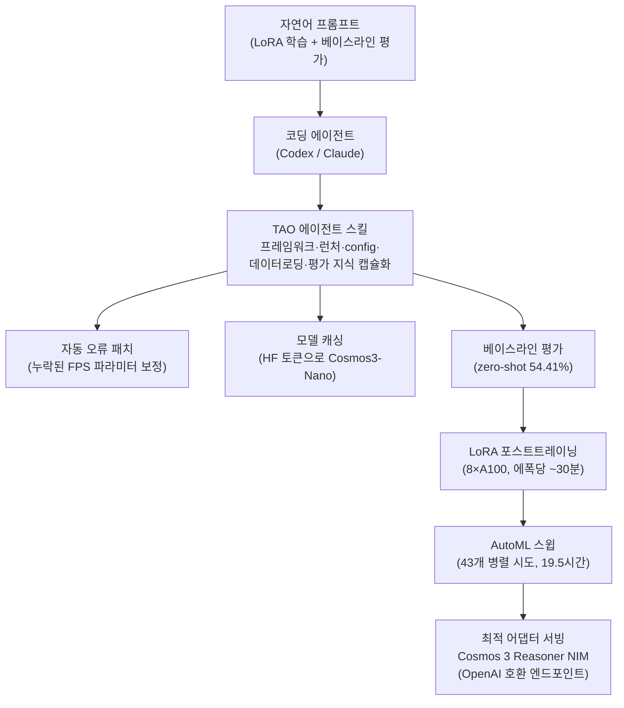

지난주 우리는 디자인시스템 UI 생성 실험에서 "모델보다 게이트를 먼저 만들어야 한다"는 결론에
도달했습니다. NVIDIA가 이번에 공개한 Cosmos 3 포스트트레이닝 사례는 그 이야기의 다른 절반입니다.
여기서는 사람이 게이트를 손으로 만드는 대신, **에이전트 스킬**이라는 캡슐화된 지식을 코딩 에이전트에게
쥐여 주고, 그 에이전트가 파인튜닝과 평가와 하이퍼파라미터 탐색을 직접 운전합니다. 읽는 대상은
자기 인프라 위에서 파운데이션 모델을 포스트트레이닝하려는 ML·플랫폼 엔지니어입니다. 결론부터 말하면,
이 사례의 진짜 주인공은 모델도 GPU도 아니라 **워크플로 지식을 스킬로 굳혀 에이전트가 반복 실행하게
만든 하네스**입니다.


*에이전트 스킬은 GPU 학습·평가·튜닝의 반복 노동을 지휘합니다. 사람은 프롬프트로 목적만 줍니다.*

## Cosmos 3와 에이전트 스킬은 무엇인가

Cosmos 3는 NVIDIA가 물리 세계를 다루기 위해 만든 파운데이션 모델입니다. 텍스트와 이미지, 영상,
주변 소리, 동작 추적을 하나로 묶는 Mixture-of-Transformers 구조를 쓰고, 논리와 계획을 담당하는
자기회귀 추론 타워와 미래 상태를 예측하는 디퓨전 트랜스포머를 함께 갖습니다. NVIDIA는 이 모델이
VANTAGE-Bench, PAI-Bench, Physics-IQ, RoboLab, RoboArena 여러 벤치마크에서 1위라고 밝혔습니다.
크기는 64B의 Cosmos 3 Super와 16B의 Cosmos 3 Nano가 있고, 이번 사례는 Nano를 씁니다.

핵심은 모델이 아니라 그 옆에 붙은 **TAO 에이전트 스킬**입니다. TAO 에이전트 스킬은 비전 모델의
포스트트레이닝 워크플로를 자동화하는 지식 묶음입니다. 프레임워크 세부, 런처 동작, config 구조,
데이터 로딩 방식, 평가 워크플로 같은 태스크별 지식을 캡슐화해서, Codex나 Claude 같은 코딩 에이전트가
사람의 개입을 최소한으로 하고도 학습 파이프라인을 스스로 조율하게 만듭니다. 다시 말해 스킬은
프롬프트 한 줄이 아니라, 실행 가능한 절차와 실패 복구까지 포장한 재사용 단위입니다.

## 두 개의 프롬프트로 끝나는 포스트트레이닝

이 사례가 인상적인 이유는 사람이 입력한 것이 자연어 프롬프트 두 개뿐이라는 점입니다.

첫 번째 프롬프트는 LoRA 포스트트레이닝을 지시합니다. Toyota의 Woven Traffic Safety 데이터셋으로
`nvidia/Cosmos3-Nano`를 LoRA로 학습하되, 비교를 위해 베이스라인 평가를 먼저 하라는 요청입니다.

```
Perform LoRA post-training of the Cosmos 3 model on the Woven Traffic
Safety dataset. Training data: /home/.../WTS_dataset/wts_data_train
Validation data: /home/.../WTS_dataset/wts_data_val
Base model on Hugging Face: nvidia/Cosmos3-Nano
Also perform a baseline evaluation first, to compare with the post-trained model.
```

이 프롬프트 하나로 에이전트는 여러 일을 순서대로 처리했습니다. 데이터 파이프라인에서 누락된 FPS
파라미터를 스스로 찾아 오류를 패치하고, Hugging Face 토큰으로 모델을 캐싱하고, 학습 전 zero-shot
베이스라인을 54.41%로 측정한 다음, LoRA 학습을 돌렸습니다. 여기서 눈여겨볼 대목은 "베이스라인
평가를 먼저 하라"는 지시입니다. 학습 후 결과를 자기 보고로 믿는 대신, 학습 전 숫자를 측정 기준선으로
박아 두고 개선을 실제로 잰 것입니다. 지난주 우리 실험에서 얻은 교훈과 정확히 같은 원리입니다.

두 번째 프롬프트는 AutoML 스윕입니다. 탐색 전략과 어떤 하이퍼파라미터를 튜닝할지는 TAO에게 맡기고,
검증 정확도를 최적화한 뒤 가장 좋은 모델을 요약하라는 요청입니다.

```
Run an AutoML sweep to improve the LoRA result. Let TAO choose suitable
search strategies and tune the important training hyperparameters. Optimize
validation accuracy and summarize the best models.
```

전체 흐름을 도식으로 보면 사람은 양 끝에만 있고, 가운데의 반복 작업은 스킬이 채웁니다.



환경 준비는 토큰 세 개와 설치 스크립트 한 줄입니다. 터미널에 `HUGGINGFACE_TOKEN`, `NGC_API_KEY`,
`AUTOML_LLM_API_KEY`를 넣고, 아래 스크립트로 에이전트 스킬을 설치합니다.

```bash
export HUGGINGFACE_TOKEN="your_hf_token"
export NGC_API_KEY="your_ngc_key"
export AUTOML_LLM_API_KEY="your_llm_key"

curl -fsSL https://raw.githubusercontent.com/NVIDIA-TAO/tao-skills-bank/main/scripts/install-codex-agents.sh | bash
```

학습 데이터는 Toyota의 Woven Traffic Safety 데이터셋으로, 8,000개가 넘는 학습·검증 샘플을 가진
영상 질의응답 과제입니다. 도로 구조, 도로 유형, 교통 안전 상황을 묻는 4지선다 문제로 구성됩니다.

## 두 프롬프트가 만든 숫자

성능은 명확하게 올랐습니다. 아래 수치는 전부 NVIDIA가 공개한 값이며, 우리가 재현한 결과가 아닙니다.


*프롬프트 두 개로 검증 정확도가 54.41%에서 93.35%까지 올랐습니다. NVIDIA 공개 수치.*

zero-shot 베이스라인은 54.41%였고, 단일 프롬프트 LoRA가 87.14%로 32.73포인트 올렸습니다. 여기에
AutoML 스윕이 베이지안 최적화로 하이퍼파라미터를 조율해 93.35%까지, 베이스라인 대비 38.94포인트를
끌어올렸습니다. 사람이 손으로 하이퍼파라미터를 만지지 않고, 에이전트가 탐색 전략을 고르고 반복
학습을 돌려서 얻은 숫자라는 점이 핵심입니다.

비용 쪽 숫자도 함께 봐야 정직합니다. LoRA 학습은 8장의 A100 80GB에서 에폭당 약 30분이 걸렸고,
AutoML 스윕은 여러 A100 노드에 걸쳐 43개 시도를 병렬로 돌려 19.5시간이 걸렸습니다. 비교군으로 돌린
풀 파라미터 SFT는 H100에서 3시간 34분이 걸렸는데, LoRA는 이 풀 SFT 대비 GPU 시간을 약 7분의 1로
줄였다고 NVIDIA는 밝혔습니다. 학습이 끝난 뒤에는 Cosmos 3 Reasoner NIM이 LoRA 어댑터를 OpenAI 호환
엔드포인트로 서빙합니다. vLLM 의존성이나 CUDA 설정을 손으로 맞출 필요 없이 사전 빌드된 마이크로
서비스로 바로 배포되는 구조입니다.

## 우리는 이것을 직접 돌려봤나

정직하게 밝히면, 이 워크플로를 우리 환경에서 재현하지는 못했습니다. Cosmos 3 계열 가중치는 게이트가
걸린 Hugging Face 저장소이고, 8장의 A100과 NGC 및 AutoML LLM 키가 필요하며, 사례가 쓴 병렬
스윕은 여러 GPU 노드를 전제로 합니다. 우리는 이 자원 조합을 이 글을 위해 확보하지 않았습니다.
그래서 위의 모든 숫자는 NVIDIA 공개 값을 인용한 것이고, 우리가 측정한 결과처럼 제시하지 않습니다.
재현 없이 만든 벤치마크는 만들지 않는다는 원칙을 지킵니다. 대신 우리가 할 수 있는 것은 이 사례의
구조를 뜯어보고, 우리 플랫폼에서 이미 돌고 있는 것과 무엇이 같고 무엇이 다른지 정확히 대조하는
일입니다.

## ThakiCloud 제품 적용 시사점

이 사례는 우리 두 제품의 관점이 모두 맞물리는 드문 주제입니다.

**Paxis 렌즈에서 보면, 이것은 스킬을 일급 리소스로 다룬다는 우리 명제의 외부 검증입니다.** Paxis는
ThakiCloud의 Agent-Native Cloud 제어 평면으로, Skills와 Tools, Policies, Audit Logs를 일급 리소스로
취급합니다. Skill Harness는 960개가 넘는 스킬을 BM25로 골라 격리된 샌드박스에서 실행하고, 모든 행동을
정책 게이트와 감사 로그로 통과시킵니다. NVIDIA의 TAO 에이전트 스킬이 증명한 것은, 프레임워크 세부와
실패 복구까지 캡슐화한 스킬이 있으면 코딩 에이전트가 복잡한 워크플로를 안정적으로 반복한다는 사실입니다.
이는 우리가 스킬을 프롬프트가 아니라 실행 단위로 정의해 온 방향과 정확히 같습니다. 다만 차이도 분명합니다.
TAO 스킬은 NVIDIA 스택에 강하게 묶여 있어 TAO 런처와 Cosmos 모델, NGC와 NIM을 벗어나면 그대로
쓰기 어렵습니다. Paxis의 스킬 하네스는 특정 벤더나 모델에 종속되지 않는 것을 목표로 하며, 이 지점이
우리가 온프렘과 소버린 환경에서 제공하려는 가치의 핵심입니다.

**ai-platform 렌즈에서 보면, 이것은 우리가 매일 스케줄링하는 GPU 학습·서빙 그 자체입니다.** 43개의
AutoML 시도를 여러 노드에 병렬로 던지는 일은 우리 플랫폼에서 Kueue가 GPU 큐를 관리하는 방식과
직접 겹칩니다. LoRA 어댑터를 OpenAI 호환 엔드포인트로 서빙하는 NIM은 우리가 vLLM으로 제공하는 서빙
경로와 같은 문제를 풉니다. 그리고 LoRA가 풀 SFT 대비 GPU 시간을 크게 줄인다는 사실은, 저비용 서빙과
저비용 학습이 결국 에이전트 경제성을 만든다는 우리 논지를 뒷받침합니다. 고객이 자기 데이터로 파운데이션
모델을 포스트트레이닝하려 할 때, 우리는 게이트가 걸린 외부 클라우드가 아니라 자기 클러스터 위에서
Kueue로 GPU를 나누고 vLLM으로 어댑터를 서빙하는 경로를 제공합니다.

두 렌즈를 합치면 그림이 완성됩니다. 저비용 학습·서빙을 ai-platform이 받치고, 그 위에서 Paxis가
스킬과 정책과 감사로 에이전트를 운전합니다. NVIDIA 사례는 이 조합이 실제 성능 개선으로 이어진다는
것을 남의 벤치마크로 보여 준 셈입니다.

## 한계 및 반론

이 사례를 과장하지 않으려면 네 가지를 함께 봐야 합니다. 첫째, "하루 만에"는 벽시계 기준이지 GPU
시간 기준이 아닙니다. 8장의 A100과 여러 노드에 걸친 19.5시간 스윕은 결코 저렴하지 않으며, 7분의 1은
풀 SFT 대비 상대값이지 절대적으로 싸다는 뜻이 아닙니다. 둘째, 93.35%는 4지선다 교통 안전 영상 QA라는
좁은 과제의 숫자입니다. 일반적인 물리 추론 능력이 그만큼 올랐다는 주장으로 확대하면 안 됩니다.
셋째, 자동화는 벤더 종속을 감춥니다. 에이전트가 "스스로" 오류를 패치할 수 있었던 이유는 스킬 뱅크가
정확히 그 프레임워크의 오류 패턴을 미리 알고 있었기 때문입니다. 스택을 벗어나면 이 매끄러움은 사라집니다.
넷째, "최소한의 개입"이 개입 제로는 아닙니다. 사람이 API 키를 넣고, 데이터셋 경로를 지정하고, 애초에
그 태스크에 맞는 스킬 뱅크를 설치해야 흐름이 시작됩니다. 에이전트가 지운 것은 반복 노동이지 판단
자체가 아닙니다.

그럼에도 방향은 분명합니다. 워크플로 지식을 스킬로 굳히고, 그 스킬을 에이전트가 반복 실행하며, 개선을
자기 보고가 아니라 측정된 게이트로 확인하는 구조는 특정 벤더의 전략이 아니라 에이전트 시대의 공통
설계입니다. 우리가 Paxis와 ai-platform으로 만들려는 것도 바로 그 구조입니다.

## 출처

- NVIDIA Developer Blog, "Post-Train NVIDIA Cosmos 3 in One Day Using Agent Skills" (<https://developer.nvidia.com/blog/post-train-nvidia-cosmos-3-in-one-day-using-agent-skills/>)
- GitHub: NVIDIA/cosmos, NVIDIA-TAO/tao-skill-bank
- Hugging Face: nvidia/Cosmos3-Nano, nvidia/Cosmos3-Super
- 데이터셋: Woven Traffic Safety (WTS), Toyota
