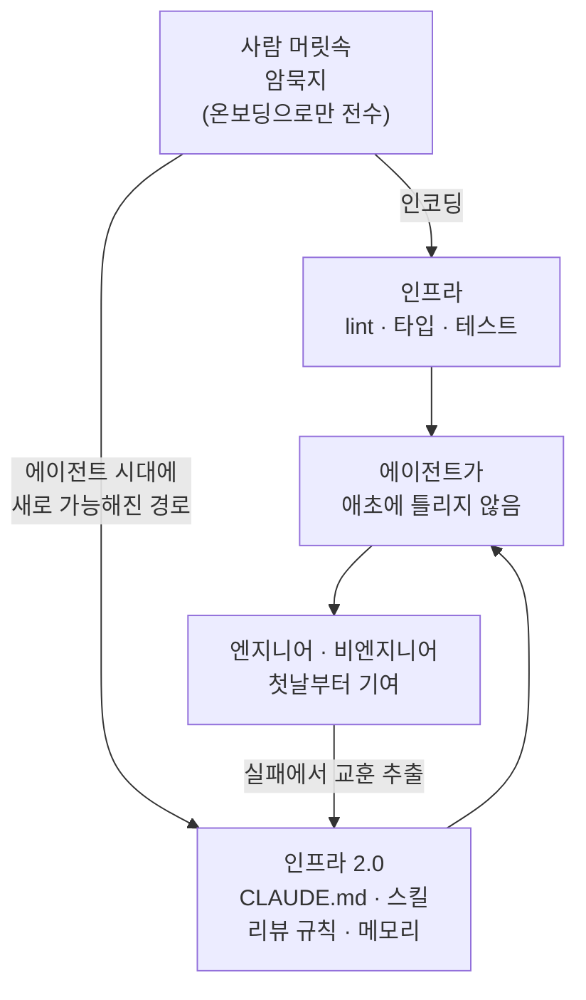

## 개요

Anthropic에서 Claude Code를 만든 Boris Cherny가 최근 흥미로운 생각을 공유했습니다. 요지는 이렇습니다. 과거에 가장 뛰어난 엔지니어들은 자기 작업을 자동화하는 데 많은 시간을 썼습니다. 더 나은 편집기 매크로, 반복되는 실수를 잡는 lint 규칙, 손으로 스모크 테스트할 필요를 없애는 e2e 스위트 같은 것들입니다. 이런 자동화가 가장 높은 레버리지 활동이었던 이유는 산출물을 배가시켰기 때문입니다.

그의 관찰은 여기서 한 걸음 더 나아갑니다. 에이전트 시대에 이런 자동화는 예전보다 더 중요해졌다는 것입니다. 이 글은 그 주장을 세 갈래로 풀고, 마지막에는 ThakiCloud가 이 원칙을 실제로 얼마나 지키고 있는지를 저장소의 실측 숫자로 정직하게 점검합니다. 자화자찬이 아니라, 우리가 만든 인프라가 정말 도메인 지식을 담고 있는지, 아니면 담은 척만 하는지를 확인하는 자기 감사입니다.

## 자동화의 위상이 왜 달라졌나

에이전트가 등장하면서 자동화의 가치는 세 가지 이유로 커졌습니다.

첫째, 인프라와 개발자 경험 자동화는 속도를 높입니다. 그리고 여러 에이전트를 동시에 운영한다면 그 에이전트 각각도 빨라집니다. 자동화가 늘수록 단위 시간당 산출물이 늘어나는데, 이제 그 산출물의 주체가 사람 한 명이 아니라 에이전트 여러 대가 됩니다. 곱셈의 크기가 달라진 셈입니다.

둘째, 작업을 코드로 옮기면 효율이 올라갑니다. 에이전트가 같은 문제를 볼 때마다 그때그때 고칠 수는 있습니다. 하지만 그건 토큰을 소모하고 경우를 놓치기도 합니다. 대신 에이전트가 lint 규칙이나 CI 단계, 혹은 루틴을 한 번 작성해 두면 그 유형의 문제는 영원히 자동화됩니다. 사람들이 흔히 말하는 "루프"의 진짜 의미가 이것입니다. 개별 문제를 푸는 게 아니라 문제의 유형 전체를 자동화하는 것입니다. 새로운 아이디어도 아닙니다. 엔지니어들은 오랫동안 이렇게 일해 왔습니다.

셋째, 그리고 가장 중요하게, 자동화는 다른 사람이 코드베이스에 기여하기 쉽게 만듭니다. 요즘 점점 자주 보이는 광경은 엔지니어가 에이전트의 코드베이스 탐색 덕분에 입사 첫날부터 기여하는 모습입니다. 비엔지니어도 엔지니어만큼 효과적으로 기여합니다. 이 두 가지를 가로막는 것은 자동화가 아니라 사람의 머릿속에 든 도메인 지식이었습니다. 온보딩하며 배워야 했던 그 암묵지 말입니다.

## 도메인 지식을 인프라로 인코딩한다는 것

에이전트가 바꾼 핵심은 이것입니다. 인프라로 인코딩할 수 있는 도메인 지식이 더 이상 lint 규칙, 타입, 테스트로 표현 가능한 것에 국한되지 않는다는 점입니다.

예전에는 "이 함수는 nil을 반환하면 안 된다" 같은 규칙만 코드로 박을 수 있었습니다. 하지만 "우리 팀은 이 API를 호출하기 전에 반드시 이 권한을 확인한다", "이 마이그레이션은 배포 창 안에서만 안전하다", "이 화면은 이 아키텍처 패턴을 따라야 한다" 같은 지식은 문서 어딘가에, 혹은 선임의 머릿속에만 있었습니다.

이제는 이런 지식을 코드 주석, 스킬, CLAUDE.md 규칙, 메모리로 거의 전부 포착할 수 있습니다. 제가 모르는 iOS 코드베이스에 PR을 올렸는데 리뷰어가 잘못된 프레임워크를 썼다고 거부한다면, 혹은 디자이너가 만든 기능이 아키텍처 패턴을 따르지 않아 거부된다면, 이것들은 사람의 실수가 아니라 자동화의 실패입니다. 그 지식이 인프라에 박혀 있었다면 에이전트가 애초에 틀리지 않았을 테니까요.

여기서 판단 기준 하나가 나옵니다. 모든 규칙, 모든 스킬 문장은 "이게 없으면 에이전트가 틀리는가"라는 질문을 통과해야 합니다. 통과하지 못하는 문장은 매 세션 컨텍스트 비용만 지불하는 순손실입니다. 스킬은 공짜가 아니라 세금입니다.

이 그림의 마지막 화살표가 중요합니다. 에이전트가 무언가를 틀렸을 때, 그것을 일회성으로 고치고 넘어가는 게 아니라 "왜 틀렸는가"를 규칙이나 스킬로 다시 인코딩합니다. 그러면 같은 유형의 실패가 영원히 사라집니다. 이 되먹임 고리가 있어야 시스템이 시간이 지날수록 스스로 나아집니다.

## ThakiCloud는 실제로 어떻게 하고 있나

주장은 여기까지입니다. 이제 우리 자신에게 같은 질문을 던집니다. ThakiCloud의 에이전트 인프라는 도메인 지식을 정말 담고 있을까요, 아니면 담은 척만 할까요. 저장소를 실측했습니다.

우리 백엔드 모노레포에는 항상 로드되는 상시 규칙(`.claude/rules/`)이 52개, 총 3,536줄 있습니다. 이 규칙들은 코딩 스타일 같은 일반론이 아니라, 대부분 구체적인 사고에서 뽑아낸 교훈입니다. 예를 들어 "매크로 데이터 소스" 규칙은 특정 라이브러리가 환율을 25원 높게, 그것도 전일 종가로 반환해 아침 브리핑을 틀리게 보고했던 실제 사고에서 나왔습니다. 그 이후로 환율은 지정된 권위 소스만 쓰도록 코드가 강제합니다. 규칙 52개 중 상당수가 이런 "2026년 몇월 며칠 사고:" 헤더로 시작하고, gotchas 섹션을 갖춘 규칙이 18개입니다. 실패가 문서가 되고, 문서가 강제 규칙이 되는 경로가 실제로 돌고 있다는 뜻입니다.

온디맨드로 로드되는 스킬은 외부 플러그인을 포함해 1,800개가 넘습니다. 여기에는 보고서 생성, 코드 리뷰, 논문 작성, 배포 파이프라인처럼 반복되는 워크플로가 재사용 가능한 형태로 패키징되어 있습니다. 스킬은 단순 프롬프트와 다릅니다. 버전 관리가 되고, 스크립트와 템플릿과 실패 사례가 함께 묶이며, 입력부터 에러 복구까지 하나의 워크플로로 재사용됩니다. 능력을 얇은 하네스가 아니라 두꺼운 스킬에 쌓는다는 원칙입니다.

역할별 전문 에이전트는 63개, 자동 실행되는 훅은 13개입니다. 그리고 정해진 시각에 사람 없이 도는 무인 자동화(launchd)가 41개 있습니다. 아침 브리핑, 뉴스 다이제스트, 블로그 진화, 스킬 자기 개선 같은 작업이 여기에 들어갑니다. 이 글의 원본 작업 흐름도 그중 하나입니다. 지금 읽고 계신 이 문장을 쓰는 파이프라인 자체가, 초안을 쓰고 AI 흔적을 제거하고 존댓말 격식을 통일하고 세 개 언어로 번역해 배포하는 과정을 코드로 강제합니다. 포맷은 모델이 즉흥으로 정하지 않고 결정론 코드가 소유합니다.

CLAUDE.md는 최상위 저장소 하나에만 있지 않습니다. 서브모듈과 하위 패키지까지 합쳐 20곳이 넘는 위치에 존재합니다. 프론트엔드 모노레포, 멀티클러스터 메시, AI 어시스턴트 제품이 각자의 CLAUDE.md로 자기 영역의 규칙을 선언합니다. 백엔드 작업을 하는 에이전트는 백엔드 CLAUDE.md를, 프론트 작업을 하는 에이전트는 프론트 CLAUDE.md를 온디맨드로 읽습니다. 지식이 한곳에 뭉치지 않고 필요한 곳에 배치되는 점진적 공개 구조입니다.

정리하면, Boris Cherny가 말한 네 가지 인코딩 채널(코드 주석, 스킬, CLAUDE.md 규칙, 메모리)이 우리 시스템에서 모두 살아 있습니다. 특히 "실패를 규칙으로 되먹이는" 고리가 형식적 장식이 아니라 실제로 사고를 소재로 돌고 있다는 점이 저희가 이 원칙을 흉내가 아니라 실천으로 지키고 있다는 근거입니다.

## 아직 부족한 것과 반론

균형을 위해 반대편도 봅니다. 이 접근이 마냥 좋기만 한 것은 아닙니다.

첫째, 인프라 자체가 비용입니다. 항상 로드되는 규칙 3,500줄은 매 세션 토큰을 먹습니다. 규칙이 늘수록 컨텍스트가 비대해지고, 정작 중요한 코드가 밀려납니다. 그래서 저희는 "이게 없으면 에이전트가 틀리는가" 게이트를 통과하지 못하는 규칙은 지우고, 항상 필요하지 않은 지식은 규칙이 아니라 온디맨드 스킬로 강등합니다. 인코딩은 무한정 늘리는 게 아니라 끊임없이 다이어트해야 하는 대상입니다.

둘째, 인코딩된 지식은 낡습니다. 6개월 전 사고에서 나온 규칙이 지금은 틀린 전제일 수 있습니다. 실제로 저희 규칙 중 하나는 과거의 잡주 매매 일화에 기반한 "물타기 절대 금지"였는데, 현재 포트폴리오 맥락에 맞지 않아 삭제되고 다른 원칙으로 대체되었습니다. 인프라는 심는 것만큼 솎아내는 일이 중요합니다.

셋째, 1,800개의 스킬은 그 자체로 노이즈입니다. 후보가 많을수록 잘못된 스킬을 고를 위험이 커집니다. 이름만 부분적으로 겹친다고 스킬을 로드하면 정확도가 떨어집니다. 그래서 저희는 검색 기반 라우팅과 억지 매칭 금지 규칙으로 후보를 좁힙니다. 인코딩의 양이 곧 품질은 아니라는 점을 늘 경계해야 합니다.

이 한계들은 원칙 자체를 부정하지 않습니다. 오히려 원칙을 제대로 실천하려면 인코딩과 정리를 같은 무게로 다뤄야 한다는 것을 말해 줍니다.

## 마치며

Boris Cherny의 결론은 담백합니다. 모든 팀은 에이전트가 추가 컨텍스트 없이도 코드베이스에서 생산적으로 일할 수 있게 하는 CLAUDE.md, 리뷰 규칙, 스킬, 문서를 작성해야 합니다. 미친 소리처럼 들리지만, 동시에 엔지니어가 늘 해온 일의 자연스러운 확장입니다. 자동화하고, 도메인 지식을 인프라로 인코딩하는 것 말입니다.

모델이 똑똑해지고 하네스가 성숙할수록 이 작업은 쉬워집니다. 그 사이에 모든 팀이 해야 할 일은 명확합니다. 머릿속과 문서에 흩어진 도메인 지식을, 에이전트가 읽고 따를 수 있는 인프라로 옮기는 것입니다. 그래야 Claude가 더 나은 코드를 쓰고, 코드 리뷰가 문제를 자동으로 잡고, 다음에 이 코드베이스에서 일하는 사람이 더 쉽게 기여할 수 있습니다. ThakiCloud는 이 원칙 위에서 플랫폼과 그 운영 자동화를 함께 짓고 있습니다.

## 출처

- Boris Cherny, "자동화와 도메인 지식의 인프라화", X(구 Twitter), [원문 링크](https://x.com/bcherny/status/2077460395279692197)
