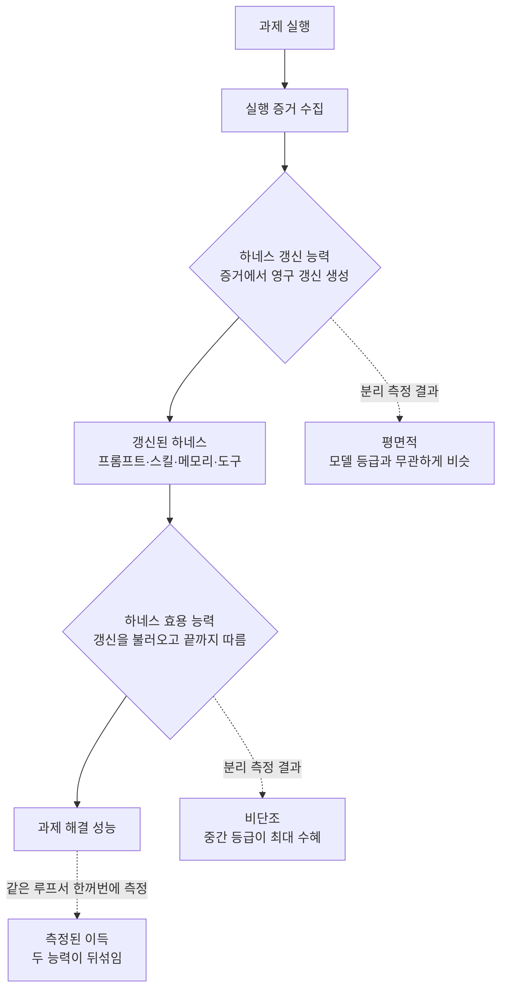

에이전트를 오래 굴린 사람이라면 한 번쯤 이런 그래프를 봤을 겁니다. 에이전트가 스스로 프롬프트와
스킬과 메모리를 고쳐 나가자 벤치마크 점수가 올라가고, 그래서 "자가진화 하네스가 작동한다"는
결론을 냈던 경험입니다. 그런데 최근 공개된 한 연구는 그 그래프의 상당 부분이 **착시일 수 있다**고
지적합니다. 올라간 점수가 정말로 하네스가 좋아져서인지, 아니면 그저 그 모델이 원래 지시를 잘
따라서인지, 지금까지의 평가 방식으로는 구분할 수 없었기 때문입니다. 이 글을 읽는 대상은 에이전트를
운영하며 스킬 라이브러리와 하네스를 진화시키는 ML·플랫폼 엔지니어입니다. 결론부터 말하면, 우리가
성능이 안 나올 때 습관적으로 "모델을 올리자"고 말하던 방향이, 이 연구의 데이터 앞에서는 절반만
맞습니다.

## 개요

이 연구의 제목은 「Harness Updating Is Not Harness Benefit」입니다. 직역하면 "하네스를 갱신하는
것과 하네스로 이득을 보는 것은 다르다"입니다. 자가진화 에이전트를 다루는 대부분의 시스템은 이 둘을
한 덩어리로 측정해 왔습니다. 에이전트가 과제를 풀고, 그 실행 기록에서 프롬프트나 스킬을 고치고,
고쳐진 하네스로 다음 과제를 다시 푸는 루프를 돌린 뒤, 최종 점수가 올랐으면 "진화가 작동했다"고
판정하는 식입니다.

문제는 이 판정에 두 개의 서로 다른 능력이 섞여 있다는 점입니다. 하나는 실행 증거에서 쓸 만한
영구적 갱신을 만들어 내는 능력이고, 다른 하나는 그렇게 갱신된 하네스를 과제 해결에 실제로 활용하는
능력입니다. 두 능력은 같은 모델 안에 있지만 성격이 완전히 다릅니다. 그리고 지금까지의 평가는 이 둘을
**같은 실행 루프 안에서 한꺼번에** 측정했기 때문에, 최종 점수만 봐서는 향상이 어디에서 왔는지
알 수 없었습니다. 저자들은 이 뒤섞임을 풀어내는 실험 설계를 제안하고, 그 결과가 실무의 통념과
정반대라는 것을 보입니다.

## 이 연구는 무엇을 묻는가

먼저 용어를 정리합니다. 여기서 **하네스**는 모델 파라미터를 건드리지 않고 에이전트의 행동을 바꾸는
편집 가능한 외부 구성 요소 전체를 말합니다. 프롬프트, 스킬, 메모리, 도구 정의가 모두 하네스입니다.
자가진화란 에이전트가 자기 실행 결과를 보고 이 하네스를 스스로 고쳐 나가는 과정입니다. 모델은
그대로 두고 그 주변의 지식과 도구만 바뀝니다.

연구는 이 진화 과정을 두 개의 능력으로 쪼갭니다.

첫째는 **하네스 갱신 능력(harness-updating)**입니다. 과제를 실행한 증거를 보고, 다음에 재사용할 수
있는 유용한 영구 갱신을 만들어 내는 능력입니다. 실패한 케이스에서 교훈을 뽑아 스킬 문서에 박거나,
반복되는 패턴을 발견해 프롬프트에 규칙으로 굳히는 일이 여기에 해당합니다.

둘째는 **하네스 효용 능력(harness-benefit)**입니다. 그렇게 갱신된 하네스가 주어졌을 때, 그것을
실제로 불러오고 따라서 과제 성능을 끌어올리는 능력입니다. 좋은 스킬이 라이브러리에 있어도 그것을
호출하지 않거나, 호출해 놓고 지시를 끝까지 지키지 못하면 효용은 0입니다.

핵심 통찰은 이 두 능력을 **분리해서 측정**해야 한다는 것입니다. 갱신을 만든 모델과 그 갱신을
사용하는 모델을 서로 다르게 짜맞추면, 향상이 갱신의 질에서 왔는지 활용의 질에서 왔는지 구분할 수
있습니다. 아래 다이어그램이 뒤섞임의 구조와 분리의 지점을 보여 줍니다.

## 두 능력을 분리하면 무엇이 보이는가

분리 실험의 결과는 두 문장으로 요약됩니다. 그리고 두 문장 모두 실무 직관과 어긋납니다.

첫째, **하네스 갱신 능력은 모델 등급에 대해 평평합니다.** 서로 다른 능력 등급의 모델들이 만들어 낸
하네스 갱신이 놀라울 만큼 비슷한 이득을 냈습니다. 저자들의 표현을 빌리면, 9B 규모의 소형 모델이
만든 갱신조차 최상위 프런티어 모델이 만든 갱신에 필적하는 이득을 냈습니다. 다시 말해, "누가
스킬을 쓰느냐"는 갱신 품질을 거의 가르지 않았습니다. 규칙을 뽑아 문서로 굳히는 일은 생각보다
저렴한 인지 작업이라는 뜻입니다.

둘째, **하네스 효용 능력은 등급에 대해 비단조입니다.** 갱신된 하네스를 쥐여 주었을 때, 약한 등급의
모델은 이득을 거의 못 봤고, 중간 등급의 모델이 가장 크게 이득을 봤으며, 최상위 등급의 모델은
중간 등급보다 오히려 이득이 작았습니다. 위로 갈수록 좋아지는 단조 곡선이 아니라 가운데가 봉긋한
곡선이었습니다.

이 두 결과를 겹쳐 놓으면 그림이 뒤집힙니다. 자가진화 시스템에서 값비싼 프런티어 모델을 **갱신을
만드는 진화자(evolver)** 자리에 앉히는 것은 예산 낭비에 가깝습니다. 갱신 품질은 어차피 평평하기
때문입니다. 반대로 값비싼 모델을 **과제를 실제로 푸는 에이전트** 자리에 앉히는 것도 효용이 비단조라
반드시 최선은 아닙니다. 강한 모델은 이미 자기 방식이 굳어 있어 외부 하네스의 지시를 덜 따르는
경향이 있습니다.

## 약한 모델이 못 얻는 이유

가장 실무적인 대목은 약한 등급 모델이 왜 이득을 못 보는지에 대한 분석입니다. 저자들은 두 가지
실패 모드를 짚습니다.

첫 번째는 **활성화 실패**입니다. 라이브러리에 딱 맞는 스킬이 있는데도 그것을 불러오지 못하는
경우입니다. 관련 하네스 아티팩트를 상황에 연결하는 판단 자체가 안 되는 것입니다. 스킬은 존재하지만
검색과 선택 단계에서 누락되므로, 아무리 좋은 갱신을 쌓아도 소용이 없습니다.

두 번째는 **불충실한 이행**입니다. 스킬을 불러오는 데는 성공했지만, 그 안의 여러 단계 지시를
끝까지 정확히 따르지 못하는 경우입니다. 긴 호흡의 지시를 지키는 능력이 부족하면, 좋은 하네스가
중간에 어긋난 실행으로 흘러가 버립니다.

이 진단이 향하는 처방은 분명합니다. 자가진화의 성능을 끌어올리려면 진화자의 지능을 올리는 것이
아니라, **하네스 호출(활성화)과 긴 지시의 충실한 이행**을 겨냥해야 합니다. 능력 예산은 갱신을
만드는 쪽이 아니라 갱신을 쓰는 쪽, 그중에서도 이 두 병목에 투자하는 편이 이득이 큽니다.

## ThakiCloud 제품 적용 시사점

이 연구의 결론은 우리가 Paxis를 운영하며 쌓아 온 규율과 정확히 맞물립니다. Paxis는 ThakiCloud의
Agent-Native Cloud로, 스킬과 도구와 정책을 일급 리소스로 다룹니다. 960개가 넘는 스킬을 BM25로
선택해 격리 샌드박스에서 실행하고, 자가진화 스킬 루프가 실패에서 교훈을 뽑아 스킬 문서를 고쳐
나갑니다. 즉 우리는 이미 "하네스를 갱신하는" 루프를 매일 돌리고 있습니다.

이 연구가 우리에게 주는 첫 번째 교훈은 **진화자에 비싼 모델을 붙이지 말라**는 것입니다. 스킬을
개선하고 회고를 기록하는 야간 진화 루프는 갱신 품질이 평평하다는 전제 아래 저비용 티어로 돌려도
됩니다. 실제로 우리 스킬 모델 정책은 진화·오케스트레이션 단계를 기본 sonnet으로 시작하고, 콘텐츠
품질 자체가 산출물인 소수 스킬에만 상위 모델을 핀으로 고정합니다. 이 연구는 그 선택이 비용
절감을 넘어 **품질 손실 없는 최적화**였다는 근거를 줍니다.

두 번째 교훈은 병목이 "활성화와 이행"이라는 진단입니다. 우리 환경에서 이는 곧 **스킬 라우팅과
게이트 준수**의 문제입니다. 스킬이 아무리 많아도 요청 시점에 맞는 스킬이 검색되지 않으면
활성화 실패이고, 스킬을 불러 놓고 그 안의 결정론적 게이트를 지키지 못하면 불충실한 이행입니다.
Paxis가 스킬 검색을 BM25 라우터로 강화하고, 포맷과 검증을 모델의 산문 판단이 아니라 코드 게이트가
소유하도록 설계한 것은 바로 이 두 병목을 겨냥한 조치입니다. 좋은 스킬을 더 쌓는 것보다, 있는
스킬을 정확히 불러오고 그 지시를 끝까지 강제하는 배관이 성능을 가릅니다.

인프라 관점에서도 함의가 있습니다. ai-platform은 K8s와 Kueue 위에서 여러 등급의 모델을 서빙합니다.
이 연구는 자가진화 파이프라인을 배치할 때 진화자와 과제 해결자에 **서로 다른 등급의 모델을 서로
다른 자리에** 배치하는 것이 합리적임을 시사합니다. 값싼 모델을 진화자로, 중간 등급 모델을 과제
해결자로 두는 혼합 배치는 멀티테넌트 GPU 스케줄링에서 비용을 크게 아끼면서 품질은 지킬 수 있는
설계입니다.

## 한계 및 반론

이 연구를 실무에 그대로 옮기기 전에 몇 가지를 짚어야 합니다.

첫째, "평평하다"와 "비단조"라는 결론은 실험이 다룬 과제 분포와 하네스 종류에 묶여 있습니다.
스킬 문서 갱신처럼 규칙을 뽑아내는 작업에서는 갱신 능력이 평평할 수 있지만, 복잡한 도구 구현이나
긴 오케스트레이션 코드를 생성하는 갱신에서는 모델 등급이 다시 벌어질 여지가 있습니다. 우리 환경의
갱신이 어느 쪽에 가까운지는 각자 측정해야 합니다.

둘째, 최상위 모델이 외부 하네스의 이득을 덜 본다는 결과는 "강한 모델은 이미 잘하니까 개선 여지가
작다"는 천장 효과로도 해석됩니다. 이것이 하네스가 무용하다는 뜻은 아닙니다. 절대 성능은 여전히
강한 모델이 높을 수 있고, 하네스는 그 위에 얹히는 한계 이득의 문제일 뿐입니다.

셋째, 우리처럼 "진화는 싸게, 게이트는 비싸게"를 이미 실천하는 조직에는 이 연구가 새로운 방향
전환이라기보다 기존 규율의 정량적 뒷받침에 가깝습니다. 반대로 자가진화의 성능이 안 나올 때
반사적으로 진화자 모델을 올려 온 팀이라면, 이 데이터는 예산을 다시 배치하라는 분명한 신호입니다.

## 마치며

결국 이 연구가 남기는 실천 규칙은 하나입니다. 자가진화 하네스의 성능을 하나의 점수로 보지 말고
**갱신과 효용, 두 축으로 분해해서 측정**하라는 것입니다. 그렇게 분리해야 어디에 능력 예산을 써야
하는지가 비로소 보입니다.

## 출처

- Harness Updating Is Not Harness Benefit: Disentangling Evolution Capabilities in Self-Evolving LLM Agents, arXiv 2605.30621: [arxiv.org/abs/2605.30621](https://arxiv.org/abs/2605.30621)
- Hugging Face Papers 페이지: [huggingface.co/papers/2605.30621](https://huggingface.co/papers/2605.30621)
- 관련 배경: Agentic Harness Engineering, arXiv 2604.25850: [arxiv.org/html/2604.25850v3](https://arxiv.org/html/2604.25850v3)
