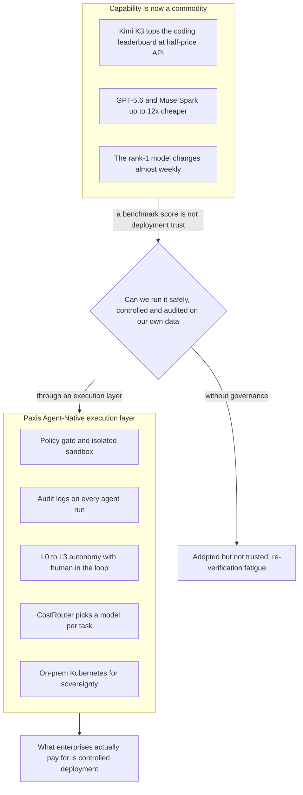

리더보드 화면을 캡처하는 순간이 있습니다. 어느 신생 모델이 익숙한 1등의 이름을 밀어내고 맨 위에 올라선 장면입니다. 2026년 7월, 중국 문샷AI의 오픈웨이트 모델 키미 K3가 바로 그 캡처를 만들어냈습니다. AI 평가 플랫폼 아레나의 프런트엔드 코딩 리더보드에서 앤스로픽 클로드 페이블 5를 제치고 1위에 올랐고, 매개변수 2조8000억개로 지금까지 공개된 오픈웨이트 모델 중 가장 큽니다. API 가격도 절반 이하입니다. 디지털투데이가 전한 실리콘밸리의 반응은 그런데 환호가 아니라 한 문장이었습니다. "벤치마크는 이겼는데 글쎄."

이 냉담함이 오늘의 진짜 뉴스입니다. 그리고 같은 주에 정반대 방향의 장면이 하나 더 겹쳤습니다.

## 정상에서 멈칫한 두 장면

구글은 순다르 피차이 CEO가 5월 개발자 행사에서 6월 출시를 직접 공언했던 제미나이 3.5 프로를 세 번 연기해 7월로 밀었습니다. 뉴스로드 보도에 따르면 기존 아키텍처를 폐기하고 처음부터 다시 설계하는 전면 재구축을 단행했고, 코딩 성능이 내부 목표치에 미달한 것이 핵심 원인으로 지목됐습니다. 지연 소식 이후 주가가 한때 4%가량 빠졌고, 최근 6일 사이 제미나이 핵심 연구원 네 명이 앤트로픽으로 자리를 옮겼습니다.

뉴스로드는 지연의 배경으로 기술 난이도만 지목하지 않았습니다. 구글 클라우드와 딥마인드, 안드로이드 등 여러 조직이 각자 별도의 AI 코딩 도구를 만들며 자원을 중복 투입하는 구조, 그리고 중요한 코드는 사람이 직접 작성해야 한다는 내부 엔지니어링 문화가 속도를 늦췄다는 지적입니다. 성능의 최전선에서조차 사람이 어디까지 개입하고 무엇을 자동화에 맡길지가 아직 정리되지 않았다는 뜻입니다.

한쪽에서는 신생 오픈웨이트 모델이 리더보드 정상을 찍었는데 시장은 지갑을 열지 않고, 다른 한쪽에서는 프런티어 선두조차 다음 버전을 세 번이나 미룹니다. 두 장면은 모순처럼 보이지만 같은 이야기를 합니다. 성능 곡선의 정점에서, 벤치마크 숫자와 실제 배포 사이의 간극이 그 어느 때보다 크게 벌어졌다는 이야기입니다.

## 값이 내려갈수록 질문이 바뀝니다

능력 자체는 오히려 흔해지고 있습니다. 조선일보가 정리한 모델 가격표를 보면 경쟁 축은 이미 성능에서 가성비로 넘어갔습니다. 오픈AI GPT-5.6은 고성능 솔과 중저가 테라, 루나로 라인업을 쪼갰고, 메타 뮤즈 스파크는 출력 토큰 기준으로 앤스로픽 페이블 5의 약 12분의 1 가격을 부릅니다. 스페이스X의 그록 4.5는 코딩 평가에서 경쟁 모델보다 출력 토큰을 4배 넘게 적게 쓴다고 주장합니다. 키미 K3의 반값 API도 이 흐름의 한 갈래입니다.

가격이 바닥을 향하면 질문이 바뀝니다. "가장 똑똑한 모델이 무엇인가"에서 "이 능력을 우리 데이터와 업무에서 안전하게, 통제된 채, 감사 가능하게 돌릴 수 있는가"로 옮겨갑니다. 리더보드 1위가 안 팔리는 이유가 여기 있습니다. 기업이 결제하는 대상은 지능지표가 아니라 배포 가능성입니다. 벤치마크는 능력을 증명하지만 신뢰를 증명하지는 못합니다.

## 도입한 사람들이 먼저 말합니다

이 간극을 가장 정직하게 증언하는 쪽은 회의론자가 아니라 이미 도입한 사람들입니다. 도입 자체는 폭발하고 있습니다. 하나투어는 멀티 AI 에이전트 하이(H-AI)를 카카오톡 안의 챗GPT 창과 연동해 별도 앱 설치 없이 여행 추천을 받게 했고, 생성형 AI 검색 최적화를 적용한 뒤 챗GPT를 통한 유입량이 약 850% 늘었습니다. 익숙한 메신저 표면으로 AI가 파고드는 속도는 이렇게 가파른데, 정작 그 결과를 조직이 얼마나 믿고 맡길지는 별개의 곡선을 그립니다.

유통 대기업들은 AI 에이전트를 실제 업무에 깔기 시작했습니다. 롯데칠성음료는 생성형 AI와 OCR, RAG를 결합해 제품 라벨 검토 시간을 절반 이상 줄였고, 동원그룹은 계열사에 AI 사원을 도입해 하반기까지 약 50개를 추가할 계획입니다. 그런데 주간한국이 전한 이 확산 기사에서 딜로이트가 덧붙인 권고가 핵심입니다. 확산 초기 단계에서는 사람이 결과를 검증하고 승인하는 휴먼 인 더 루프 체계를 유지하라는 것입니다.

경영진을 AI로 대체하는 실험을 공개한 뤼튼 박민준 대표의 고백은 더 날카롭습니다. 역할별 AI가 토론해 의견을 내면 대표가 종합해 결정하는 구조를 돌려봤더니, 처음엔 편했지만 한 달 뒤부터는 AI 답변을 재확인하는 데 시간이 더 걸렸다고 했습니다. 그는 AI를 똑똑한 신입사원에 비유하며 회사 데이터와 조직 문화를 충분히 학습시켜야 제 역할을 한다고 강조했습니다.

같은 통증을 시장으로 바꾼 회사도 있습니다. 지란지교소프트가 과기정통부와 KISA의 우수 정보보호 기술로 지정받은 솔루션은 임직원이 챗GPT나 클로드에 무언가를 입력할 때 엔드포인트 단에서 실시간으로 검사해 개인정보와 기업 기밀이 새어 나가는 것을 막고, 프롬프트 입력 이력과 메일 발송 기록을 통합 감사합니다. 능력을 파는 것이 아니라 능력을 안전하게 쓰는 틀을 팝니다. 세 사례가 가리키는 방향은 똑같습니다. 모델이 똑똑해지는 것과 그 모델을 조직이 믿고 맡기는 것은 완전히 다른 문제입니다.

## 국가가 같은 값을 다르게 부릅니다

기업 단위에서 보이는 이 신호는 국가 단위로 올라가면 소버린 AI라는 이름을 답니다. 배경훈 부총리는 업무보고에서 앤트로픽 미토스급 프런티어 모델 개발에는 GPU 약 1만 장이 필요하다며 국가 주도 컴퓨팅 확충을 예고했고, 정부는 12월 전 국민 무료 서비스 모두의 AI를 내놓기로 했습니다. LG AI연구원 컨소시엄은 독자 파운데이션 모델 1차 평가에서 벤치마크와 전문가, 사용자 평가 전 부문 1위를 기록하며 행정안전부 서비스에 실증 적용됐습니다. 일본은 소니와 소프트뱅크, 혼다 등 44개사가 출자한 노에트라 컨소시엄이 엔비디아 루빈 GPU 약 2만7500장을 확보해 국가 AI 인프라를 짓습니다.

이 흐름을 단순한 국가주의로 읽으면 절반만 본 셈입니다. 국가들이 막대한 돈을 자국 모델과 자국 컴퓨팅에 쏟는 진짜 이유는, 능력이 흔해질수록 정작 희소해지는 자원이 통제된 실행이기 때문입니다. 누구의 인프라 위에서, 어떤 정책 아래, 무엇이 기록된 채 모델이 도는가. 국가가 소버린 AI라 부르는 값어치와 기업이 감사 로그와 휴먼 인 더 루프라 부르는 값어치는 규모만 다를 뿐 같은 것입니다.

## 돈도 신중해지기 시작했습니다

능력이 흔해지는 이 국면에서 무한정 쌓아 올리기만 하던 자본도 표정을 바꾸고 있습니다. 글로벌이코노믹이 짚은 대로, AI 설비투자를 지탱해온 하이퍼스케일러들의 신규 채권이 발행가 대비 평균 3.3포인트 하락하며 우량 IT 채권으로서는 이례적인 약세를 보였습니다. 골드만삭스 같은 대형 금융기관은 이들의 기초체력이 튼튼해 채무불이행 위험은 없다며 조기 거품론을 반박했지만, 북미 클라우드 사업자의 설비투자 증가율이 올해 83%에서 내년 23% 수준으로 둔화할 것이라는 전망이 함께 나옵니다. 무작정 짓는 시대가 끝나가고 선별의 시대가 열린다는 신호입니다.

그 비용은 이미 다른 곳으로 번지고 있습니다. 디지털투데이에 따르면 세계 2위 스마트폰 시장인 인도의 2분기 출하량이 6년 만에 최대 폭인 10% 감소했는데, 하이퍼스케일러의 AI 인프라 투자가 D램과 낸드 공급을 잠식해 저가 스마트폰의 메모리 원가를 밀어 올린 것이 원인으로 지목됐습니다. 능력을 원자재처럼 쓰는 세계의 청구서가 인도의 210달러짜리 스마트폰 소비자에게까지 도착한 셈입니다. 능력을 더 쌓는 방향의 수익은 얇아지고, 능력을 더 잘 다루는 방향의 수익이 두꺼워지는 전환이 이렇게 여러 지표에서 동시에 나타납니다.

## 모델을 고르는 시대에서 실행 계층을 소유하는 시대로

메타가 광고 대신 자사 컴퓨팅을 앤트로픽에 100억 달러 규모로 임대하려는 협상까지 겹쳐 보면 그림이 선명해집니다. 컴퓨팅은 상품이 되고, 모델은 반값으로 흔해지고, 리더보드 1위는 매주 바뀝니다. 이렇게 능력이 원자재가 되는 세계에서 값어치는 능력 위가 아니라 능력을 감싸는 실행 계층으로 옮겨갑니다. 어떤 모델을 고르느냐가 아니라 그 모델을 누구의 통제 아래 돌리느냐가 경쟁력이 됩니다.

아래 그림은 이 전환을 한 장으로 요약합니다. 상품이 된 능력이 왜 그 자체로는 배포되지 못하고, 실행 계층이라는 관문을 지나야 기업이 지불하는 통제된 배포가 되는지를 보여줍니다.

ThakiCloud의 Paxis는 정확히 그 실행 계층을 제품으로 만든 Agent-Native Cloud입니다. 스킬과 툴, 정책, 감사 로그를 일급 리소스로 두어, 뤼튼 대표가 겪은 재확인의 피로와 딜로이트가 권고한 휴먼 인 더 루프를 L0에서 L3까지의 자율도 거버넌스로 설계합니다. 사람이 어디까지 손을 떼도 되는지를 감으로 정하지 않고 정책과 게이트로 정합니다. 지란지교소프트가 판 감사 기능은 Paxis에서 모든 에이전트 실행에 붙는 기본값이고, 정책 게이트와 격리 샌드박스는 반값 오픈웨이트 모델을 도입하면서도 기밀이 새지 않게 막는 틀이 됩니다. 가성비로 넘어간 모델 경쟁은 작업마다 다른 모델을 붙이는 CostRouter로 흡수하고, 소버린 AI가 부르는 주권의 요구는 온프렘 쿠버네티스 기반 ai-platform이 받습니다.

리더보드 1위가 안 팔리는 이유를 다시 뒤집으면 답이 됩니다. 기업이 사는 것은 정점의 점수가 아니라 통제된 실행입니다. 벤치마크가 사주지 못하는 그 신뢰를, 실행 계층이 대신 만듭니다.

## 참고 자료

이 글은 아래 뉴스를 종합해 작성했습니다.

- 위키트리, [메타, 광고 대신 컴퓨팅 판다… 앤트로픽과 100억 달러 임대 초기 협상](https://www.wikitree.co.kr/articles/1147052)
- 위키트리, [스페이스X, 펜타곤 AI 컴퓨팅 공급 협상…규모 수십억달러](https://www.wikitree.co.kr/articles/1147053)
- 굿모닝경제, [AI 인프라 550조 베팅…전력망부터 반도체까지 재편](https://www.goodkyung.com/news/articleView.html?idxno=289308)
- AI타임스, [일본, 엔비디아 '루빈'으로 국가 AI 인프라 구축…'피지컬 AI' 승부](https://www.aitimes.com/news/articleView.html?idxno=212885)
- 뉴스로드, [구글 차세대 AI '제미나이 3.5 프로' 출시 수개월 지연](http://www.newsroad.co.kr/news/articleView.html?idxno=61703)
- 디지털투데이, ["벤치마크는 이겼는데 글쎄"…中 키미 K3를 보는 실리콘밸리의 시선](https://www.digitaltoday.co.kr/news/articleView.html?idxno=684999)
- 조선일보, [AI 모델 경쟁, '최고 성능'보다 '가성비'로](https://www.chosun.com/economy/tech_it/2026/07/17/VQDA7CI2ERF4LG2YLQ76R6JG2A/)
- 한스경제, [카카오톡 안에 여행 추천 AI… 하나투어, 서비스 확대](http://www.hansbiz.co.kr/news/articleView.html?idxno=850868)
- 주간한국, ['업무 혁신' 유통家, 'AI 에이전트' 도입 본격화](https://weekly.hankooki.com/news/articleView.html?idxno=7173721)
- 동아일보, [박민준 뤼튼 대표 "경영진부터 AI로 대체할 것"](https://www.donga.com/news/Economy/article/all/20260717/134316474/1)
- 이데일리, ["미토스급 AI에 과감한 투자"… 배경훈 부총리, 첨단 인프라 확대](https://www.edaily.co.kr/news/newspath.asp?newsid=02696166645515504)
- 천지일보, [[K-AI 국가대표①] 빅테크 벽 넘은 LG AI연구원 'K-엑사원' AI 주권](https://www.newscj.com/news/articleView.html?idxno=3417568)
- 매일경제, [비용·용량 제한없는 '온국민 AI' 12월에 나온다…재원은 글쎄](https://www.mk.co.kr/article/12100854)
- 매일경제, [日, 소뱅 등 44곳 참여 소버린 AI 개시…올해 기반 모델 공개](https://www.mk.co.kr/article/12100992)
- 글로벌이코노믹, [AI 투자 숨고르기 조짐… 빅테크 조달 부담에 HBM 수요 '속도 변수'](https://www.g-enews.com/view.php?ud=202607180708261959fbbec65dfb_1)
- 뉴스로드, [車 두뇌 잡는 마이크론, 현대모비스·퀄컴과 '3~5년짜리' 메모리 동맹](http://www.newsroad.co.kr/news/articleView.html?idxno=61704)
- 디지털투데이, [AI 메모리 수요 여파에 인도 스마트폰 출하 10% 감소…6년 만에 최대 낙폭](https://www.digitaltoday.co.kr/news/articleView.html?idxno=685002)
- 매일일보, ['AI 보안기술기반 중소기업 정보유출 예방'…지란지교소프트, AI 보안](https://www.m-i.kr/news/articleView.html?idxno=1392577)

