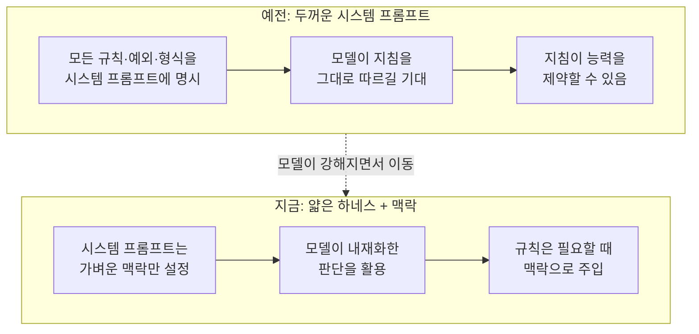

## 개요

최근 개발자 커뮤니티에서 짧은 소식 하나가 유독 많이 인용됐습니다. Anthropic이 Claude Code의 시스템 프롬프트를 약 80% 걷어냈다는 이야기입니다. 흥미로운 부분은 삭감 자체보다 그 이유였습니다. Anthropic의 Tariq Shihipar(@trq212)는 새 Fable 5 계열 모델이 "더 작은 시스템 프롬프트를 원한다"고 말했고, 지침과 예시를 많이 넣는 것이 오히려 모델의 발목을 잡을 수 있다고 설명했습니다. 모델이 우리가 적어 준 규칙보다 더 상상력이 풍부하기 때문이라는 것입니다.

이 문장은 단순한 제품 최적화 소식이 아닙니다. 지난 몇 년간 프롬프트 엔지니어링은 "빠뜨리지 말고 다 적어라"는 방향으로 진화해 왔습니다. 하지 말아야 할 것, 지켜야 할 형식, 예외 상황까지 시스템 프롬프트에 촘촘히 박아 넣는 것이 좋은 하네스라고 여겨졌습니다. 그런데 모델이 충분히 강해지면 그 촘촘함이 자산이 아니라 부채가 될 수 있다는 신호가 나온 것입니다.

ThakiCloud는 쿠버네티스 기반 AI/ML SaaS 플랫폼을 운영하면서, 그 위에서 도는 에이전트 제어 평면 Paxis를 통해 960개가 넘는 스킬과 수십 개의 상시 룰을 하네스로 관리합니다. 그래서 "시스템 프롬프트를 얼마나 넣을 것인가"는 우리에게 트렌드 문장이 아니라 매일 마주하는 설계 결정입니다. 이 글은 이번 삭감이 무엇을 뜻하는지, 왜 똑똑한 모델일수록 얇은 하네스를 원하는지, 그리고 그 원리를 실제 운영에 어떻게 옮길 수 있는지를 정리합니다.

## 무엇이 바뀌었나

보도된 내용의 핵심은 두 가지입니다. 첫째, Claude Code의 시스템 프롬프트 분량이 대폭 줄었다는 사실입니다. 둘째, 그 근거가 "모델이 약해서 더 채운다"가 아니라 "모델이 강해져서 덜 채운다"는 방향이라는 점입니다.

Anthropic 측 설명을 옮기면, 새 모델은 훈련 과정에서 행동 규범을 스스로 내재화하는 정도가 커졌습니다. 예전에는 배포 시점의 시스템 프롬프트에 일일이 풀어써야 했던 것들을, 이제는 모델이 가중치 안에 어느 정도 지니고 있다는 것입니다. 그 결과 시스템 프롬프트의 역할이 "모든 규칙을 담은 규정집"에서 "가벼운 맥락 설정자"로 옮겨간다는 해석이 뒤따랐습니다. 또한 딱딱한 금지문("이것을 하지 마라") 대신 맥락으로 방향을 잡아 주는 방식으로 모델을 스티어링한다는 언급도 있었습니다.

아래는 이 변화의 구조를 도식화한 것입니다. 왼쪽의 두꺼운 규정집 방식과, 오른쪽의 얇은 맥락 설정 방식이 각각 어디에 능력을 쌓는지가 다릅니다.

여기서 조심해야 할 부분이 있습니다. "시스템 프롬프트를 줄여라"가 곧 "지침을 없애라"는 뜻은 아닙니다. 줄어든 것은 배포 시점에 항상 얹혀 있던 상시 하네스이고, 도메인 지식과 판단 근거는 여전히 어딘가에 있어야 합니다. 바뀐 것은 그 지식을 어디에 두느냐입니다.

## 왜 똑똑한 모델은 얇은 프롬프트를 원하나

이 현상은 감으로만 도는 이야기가 아닙니다. 에이전트 스캐폴딩(하네스)이 많아질수록 성능이 좋아지지 않고 오히려 서로 간섭한다는 연구들이 나오고 있습니다. 예를 들어 "More Is Not Always Better: Cross-Component Interference in LLM Agent Scaffolding"(arXiv 2605.05716)은 하네스 구성 요소를 더 넣을수록 요소끼리 간섭이 생겨 전체 성능이 꺾이는 지점을 다룹니다. 지침을 더 넣는 것이 단조 증가하는 이득이 아니라는 관찰입니다.

직관적으로 풀어 보면 이렇습니다. 시스템 프롬프트에 규칙을 하나 넣을 때마다 모델은 그 규칙을 매 순간 지켜야 할 제약으로 인식합니다. 규칙이 적을 때는 이 제약이 유용한 가드레일이지만, 규칙이 수십 개로 늘어나면 서로 충돌하거나 현재 작업과 무관한 지침이 판단을 흐립니다. 약한 모델은 명시적 지침이 없으면 헤매므로 이 비용을 감수할 가치가 있었습니다. 그러나 강한 모델은 상황을 스스로 읽어 내는 능력이 커졌기 때문에, 불필요한 지침이 주는 간섭 비용이 지침이 주는 이득을 넘어서기 시작합니다.

바로 이 지점에서 "모델이 우리가 준 지침보다 더 상상력이 풍부하다"는 표현이 이해됩니다. 촘촘한 규칙은 최악의 출력을 막는 하한선을 세우지만, 동시에 최선의 출력을 누르는 천장이 되기도 합니다. 모델이 그 천장보다 높이 올라갈 수 있게 되면, 규칙을 걷어내는 것이 곧 성능을 여는 일이 됩니다.

다만 이 논리는 무조건적이지 않습니다. 하한선을 걷어내면 평균은 오를 수 있어도 분산이 커집니다. 즉 가끔 나오는 나쁜 출력을 막아 주던 가드레일이 사라집니다. 그래서 실무에서는 "무엇을 걷어낼 것인가"가 "얼마나 걷어낼 것인가"보다 중요합니다.

## 규칙에서 맥락으로

이번 소식에서 가장 실무적으로 유용한 대목은 "딱딱한 금지문 대신 맥락으로 스티어링한다"는 부분입니다. 같은 의도를 전달하는 두 가지 방식이 있습니다.

첫째는 하드 규칙입니다. "전문 용어를 쓰지 마라", "이 형식을 반드시 지켜라"처럼 금지와 강제로 표현합니다. 이 방식은 명확하지만 상시 하네스로 쌓이면 앞서 말한 간섭을 만듭니다. 둘째는 맥락 설정입니다. "이 글은 열여섯 살이 읽을 수준으로 쉽게 풀어 씁니다"처럼 원하는 결과의 상태를 서술합니다. 강한 모델에게는 후자가 더 안정적으로 작동하는 경우가 많습니다. 부정형 지시를 이해하지 못해서가 아니라, 긍정적으로 서술된 목표가 모델이 스스로 세부를 채울 여지를 주기 때문입니다.

여기서 중요한 구분이 하나 생깁니다. 모든 지식을 시스템 프롬프트에서 빼는 것이 아니라, 상시 하네스와 온디맨드 지식을 분리하는 것입니다. 매 순간 필요한 최소한만 상시로 두고, 특정 작업에서만 필요한 지식은 그 작업이 시작될 때 맥락으로 불러옵니다. 이렇게 하면 상시 하네스는 얇게 유지되고, 도메인 지식은 필요한 순간에 두껍게 공급됩니다.

단, 형식의 일관성처럼 흔들리면 안 되는 것은 여전히 결정론적 코드가 소유해야 합니다. 모델에게 "매번 같은 JSON 형식으로 답하라"고 부탁하는 대신, 출력 형식과 집계는 코드가 강제하고 모델은 내용만 생성하게 하는 편이 안전합니다. 프롬프트를 얇게 만드는 흐름과 형식을 코드로 고정하는 원칙은 충돌하지 않습니다. 오히려 서로를 보완합니다. 흔들리면 안 되는 것은 코드로 내리고, 판단이 필요한 것은 모델에게 맡기며, 상시 하네스에서는 둘 다 덜어 냅니다.

## ThakiCloud 제품 적용 시사점

이 흐름은 ThakiCloud의 에이전트 플랫폼 Paxis 설계 철학과 정확히 맞닿아 있습니다. Paxis는 ai-platform 위에서 도는 Agent-Native Cloud 제어 평면으로, 스킬(Skills)·도구(Tools)·정책(Policies)·감사 로그(Audit Logs)를 일급 리소스로 다룹니다. 핵심 설계 원칙 중 하나가 바로 "얇은 하네스, 두꺼운 스킬"입니다. 모델 루프와 권한, 보안 같은 하네스는 최소로 유지하고, 도메인 지식과 판단과 실패 사례는 스킬 쪽에 두껍게 쌓습니다.

Paxis의 스킬 하네스는 960개가 넘는 스킬을 상시 시스템 프롬프트에 모두 얹지 않습니다. 대신 요청이 들어오면 BM25 검색으로 관련 스킬만 골라 그 순간에 맥락으로 불러옵니다. 이것이 정확히 이번 소식이 말하는 "가벼운 맥락 설정자"의 구현입니다. 상시로 지불하는 하네스 비용은 얇게 유지하면서, 특정 작업에서만 두꺼운 지식을 공급하는 구조입니다. 스킬 하나를 인덱스에 올리는 순간부터 그 이름과 설명은 매 세션 토큰 비용을 발생시키므로, 우리는 "이게 없으면 에이전트가 틀리는가"라는 기준으로 각 문장의 상시 탑재 여부를 판정합니다.

맥락 스티어링 원칙도 우리 운영과 연결됩니다. Paxis의 정책 게이트와 감사 로그는 흔들리면 안 되는 규칙을 결정론적 코드로 강제합니다. 반면 콘텐츠 품질이나 판단이 필요한 영역은 모델에게 맡기되, 얇은 룰로 방향만 잡아 줍니다. 상시 룰은 매 턴 토큰을 지불하기 때문에, 항상 필요한 규칙만 상시로 두고 가끔 필요한 것은 스킬로 내려 온디맨드로 로드합니다. Anthropic이 시스템 프롬프트에서 배운 교훈을, 우리는 스킬과 룰의 경계를 긋는 일에서 매일 적용하고 있는 셈입니다.

인프라 관점에서도 함의가 있습니다. 시스템 프롬프트가 얇아지면 입력 토큰이 줄고, 이는 서빙 비용과 지연에 직접 영향을 줍니다. ai-platform이 vLLM으로 모델을 서빙하고 멀티테넌트로 운용하는 환경에서, 상시 하네스를 줄이는 것은 단순한 품질 문제가 아니라 경제성 문제이기도 합니다. 낮은 서빙 비용이 에이전트를 더 많이, 더 자주 돌릴 수 있는 여력을 만들고, 그 여력이 다시 에이전트 경제성을 만듭니다.

## 한계 및 반론

이 흐름을 그대로 일반화하는 데는 주의가 필요합니다. 몇 가지 반론을 정직하게 짚습니다.

첫째, "얇게 만들수록 좋다"는 결론은 위험합니다. 프롬프트 삭감이 성능을 여는 것은 모델이 충분히 강할 때의 이야기이며, 그 임계는 모델과 작업마다 다릅니다. 약한 모델이나 고위험 작업에서 하네스를 성급히 걷어내면 하한선이 사라져 나쁜 출력이 늘어납니다. 실제로 우리 운영에서도 저비용 모델이 콘텐츠 품질에서 흔들릴 때는 형식을 코드로 더 강하게 고정하는 방향으로 대응합니다.

둘째, 이번 소식의 구체 수치는 Anthropic 담당자의 공개 발언과 이를 정리한 매체 보도에 기반한 것으로, 삭감 전후의 정확한 프롬프트 길이나 벤치마크 수치가 공개된 것은 아닙니다. "80%"라는 숫자는 발표된 표현이지만, 그 성능 효과를 우리가 독립적으로 재현해 측정한 것은 아니라는 점을 분명히 해 둡니다.

셋째, 프롬프트를 걷어낸 자리를 무엇이 채우는지가 관건입니다. 지침을 시스템 프롬프트에서 뺀다고 지식이 사라지지는 않습니다. 그 지식은 모델의 가중치, 온디맨드로 불러오는 스킬, 또는 결정론적 코드 게이트 중 어딘가로 옮겨가야 합니다. 옮길 곳을 마련하지 않고 그냥 지우기만 하면, 얇아진 하네스는 곧 통제되지 않는 출력으로 돌아옵니다. 결국 이것은 "적게 쓰기" 경쟁이 아니라 "무엇을 어디에 둘 것인가"라는 설계 문제입니다.

정리하면, 이번 삭감은 프롬프트 엔지니어링의 무게 중심이 옮겨가고 있음을 보여 주는 하나의 지표입니다. 모델이 강해질수록 상시 하네스는 얇아지고, 규칙은 맥락과 코드로 나뉘어 재배치됩니다. ThakiCloud는 이 원칙을 Paxis의 얇은 하네스와 두꺼운 스킬로 이미 운용하고 있으며, 이번 소식은 그 방향이 우리만의 취향이 아니라 업계가 함께 향하는 흐름임을 확인시켜 줍니다.

## 출처

- Anthropic, Tariq Shihipar(@trq212) 공개 발언 정리 보도, the-decoder.com
- "Anthropic Slashes Claude Code System Prompt by 80%", ClaudeAINews
- "More Is Not Always Better: Cross-Component Interference in LLM Agent Scaffolding", arXiv 2605.05716
