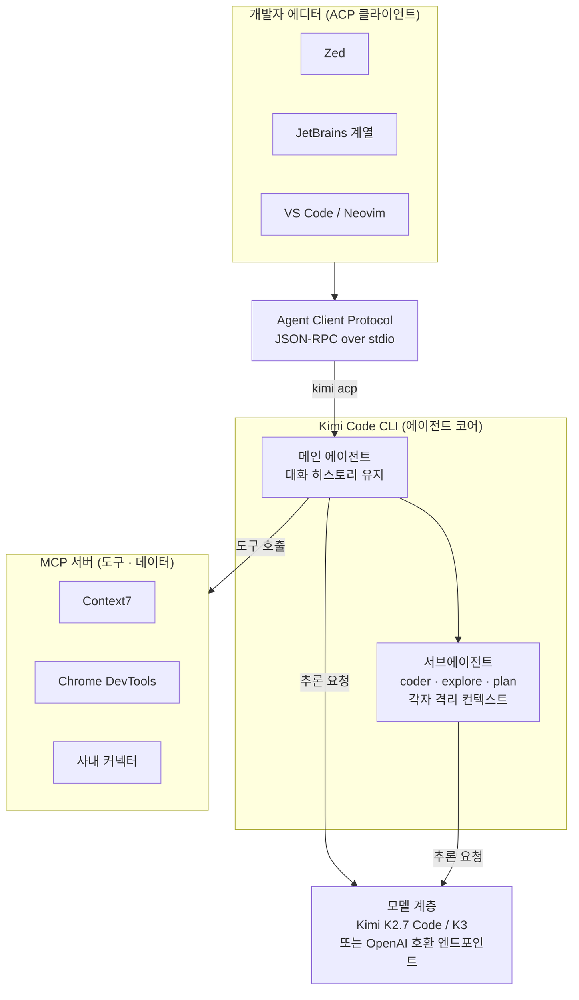

지난주 문샷AI가 오픈웨이트 모델 Kimi K3를 공개하면서 코딩 리더보드 1위를 가져갔습니다. 그런데 모델보다 개발자 워크플로에 더 직접 닿는 물건이 조용히 같이 나왔습니다. **Kimi Code CLI**, 문샷이 MIT 라이선스로 공개한 오픈소스 터미널 코딩 에이전트입니다. 링크드인 타임라인에는 "클로드 코드에 없는 기능을 준다"는 소개가 돌았습니다. 저희는 그 문장을 그대로 옮기지 않고 공식 저장소와 문서를 직접 확인했습니다. 결론부터 말하면 소개의 절반은 사실이고 절반은 과장입니다. 그리고 진짜 흥미로운 지점은 홍보 문구가 강조하지 않은 곳에 있었습니다.

이 글은 Kimi Code CLI가 무엇인지, 무엇을 실제로 제공하는지, 그리고 K8s 기반 AI 플랫폼을 운영하는 저희 관점에서 왜 눈여겨볼 만한지를 정리합니다. 특히 Agent Client Protocol이라는 개방 표준이 왜 에이전트 생태계의 판을 바꾸는 조각인지에 지면을 많이 할애했습니다.

## Kimi Code CLI는 무엇인가

Kimi Code CLI는 터미널에서 도는 에이전트형 코딩 도구입니다. 클로드 코드나 제미나이 CLI, 코덱스 CLI와 같은 계열입니다. 공식 저장소는 [MoonshotAI/kimi-code](https://github.com/MoonshotAI/kimi-code)이며, 이전 프로젝트인 [MoonshotAI/kimi-cli](https://github.com/MoonshotAI/kimi-cli)가 여기로 진화하면서 기존 세션과 설정이 이어집니다. 두 저장소 모두 문샷 공식이며, 이름이 비슷한 서드파티 프로젝트와 혼동하지 않도록 주의가 필요합니다.

여기서 첫 번째 정정이 필요합니다. 이 CLI의 정식 이름은 "Kimi K3용 CLI"가 아니라 **Kimi Code CLI**입니다. 모델에 종속되지 않는 도구이고, 기본값으로 문샷의 코딩 특화 모델인 Kimi K2.7 Code를 붙여 쓰지만 설정으로 K3를 포함해 다른 모델로도 전환할 수 있습니다. K3는 CLI가 붙일 수 있는 여러 모델 중 하나이지, CLI가 K3 전용으로 만들어진 것은 아닙니다. K3 자체는 문샷이 2026년 7월 16일 공개한 2조8000억 매개변수급 오픈 MoE 모델로, Kimi Delta Attention과 최대 100만 토큰 컨텍스트를 내세웁니다. 이 부분은 CNBC, 블룸버그, 포브스 등 주요 매체가 함께 보도했습니다.

전체 그림을 먼저 세워두면 이후 세부가 훨씬 잘 붙습니다. Kimi Code CLI가 한쪽으로는 MCP 클라이언트로 도구와 데이터에 연결되고, 다른 한쪽으로는 ACP 서버로 에디터에 연결되는 이중 역할이 핵심입니다.



## 서브에이전트: 컨텍스트를 나눠서 메인을 깨끗하게

Kimi Code CLI는 세 종류의 내장 서브에이전트를 제공합니다. **coder**는 파일을 읽고 쓰고 명령을 실행해 실제 변경을 반영하는 범용 엔지니어링 담당입니다. **explore**는 읽기 전용으로 코드베이스를 훑는 탐색 담당입니다. **plan**은 셸 명령 없이 구현 계획과 아키텍처 설계만 내놓는 담당입니다. 이 구분은 공식 문서 [Agents and Sub-Agents](https://moonshotai.github.io/kimi-code/en/customization/agents.html)에 명시되어 있습니다.

핵심은 이름이 아니라 컨텍스트 격리입니다. 각 서브에이전트는 완전히 독립된 컨텍스트 윈도우를 가지며, 메인 에이전트가 명시적으로 넘긴 작업 설명만 봅니다. 메인의 대화 히스토리는 서브에이전트에 노출되지 않고, 서브에이전트가 돌리는 중간 추론과 도구 호출 로그도 메인 히스토리에 섞이지 않습니다. 서브에이전트는 최종 결론만 반환합니다. 긴 세션에서 메인 컨텍스트가 로그로 부풀지 않고 얇게 유지되는 이유가 여기 있습니다. 백그라운드 실행과 병렬 실행도 지원해서, 여러 탐색 작업을 동시에 돌리고 완료되면 자동으로 결과가 돌아옵니다.

이 패턴은 저희에게 낯설지 않습니다. 이 블로그를 운영하는 내부 오케스트레이션 하네스도 탐색은 저비용 서브에이전트에 위임하고 요약만 회수해 메인 컨텍스트를 보호합니다. 컨텍스트 위생이 곧 비용이자 품질이라는 원칙은 도구가 달라도 같습니다.

## MCP: JSON을 손으로 고치지 않는 설정 경험

Model Context Protocol 연동은 두 경로로 관리합니다. 첫째, CLI 서브커맨드입니다. `kimi mcp add`, `kimi mcp list`, `kimi mcp remove`, `kimi mcp authorize`로 서버를 다룹니다. 예를 들어 HTTP 트랜스포트로 문서 검색 서버를 붙이거나, stdio 트랜스포트로 브라우저 자동화 서버를 붙일 수 있습니다.

```bash
# HTTP 트랜스포트 (OAuth 옵션 지원)
kimi mcp add --transport http context7 https://mcp.context7.com/mcp

# stdio 트랜스포트로 로컬 프로세스 연결
kimi mcp add --transport stdio chrome-devtools -- npx chrome-devtools-mcp@latest
```

둘째, TUI 안에서 쓰는 대화형 슬래시 명령 `/mcp-config`입니다. JSON 설정 파일을 직접 편집하지 않고 서버를 추가, 수정, 인증할 수 있습니다. `/mcp`는 현재 연결된 서버와 로드된 도구 목록을 보여줍니다. 링크드인 소개가 강조한 "JSON을 직접 수정할 필요가 없다"는 부분은 사실입니다. 다만 이 편의성 자체가 클로드 코드에 없는 것은 아닙니다. 이 지점은 뒤에서 다시 정리합니다. 관련 문서는 [MCP 설정](https://moonshotai.github.io/kimi-cli/en/customization/mcp.html)에 있습니다.

## Agent Client Protocol: 이 도구에서 가장 중요한 조각

여기가 이 글에서 가장 흥미로운 부분입니다. Agent Client Protocol, 줄여서 ACP는 Zed 에디터 팀이 만든 개방 표준입니다. Apache 라이선스이고, JSON-RPC 2.0을 stdio 위에서 주고받습니다. 에디터가 에이전트를 자식 프로세스로 띄우고 표준 입출력으로 통신하는 방식으로, 전송 메커니즘 자체는 언어 서버 프로토콜과 동일합니다.

비유가 이해를 크게 돕습니다. LSP가 등장하기 전에는 에디터마다 언어마다 별도 통합을 만들어야 했습니다. LSP는 이 M 곱하기 N 문제를 M 더하기 N으로 바꿨습니다. 에디터 하나가 표준만 구현하면 누가 만든 언어 서버든 그 덕을 봅니다. ACP는 정확히 같은 일을 에이전트에 합니다. 에디터 하나가 ACP를 구현하면 누가 만든 에이전트든 그 에디터에 표준 방식으로 꽂힙니다. 이 개념은 [Zed의 ACP 소개](https://zed.dev/acp)와 [마크 누리의 해설 글](https://blog.marcnuri.com/agent-client-protocol-acp-introduction)에서 확인할 수 있습니다.

MCP와 헷갈리기 쉬운데 방향이 반대입니다. MCP는 에이전트에서 도구와 데이터로 향합니다. 이때 에이전트가 MCP 클라이언트입니다. ACP는 에디터에서 에이전트로 향합니다. 이때 에이전트가 ACP 서버이고 에디터가 ACP 클라이언트입니다. 같은 에이전트가 한쪽으로는 MCP 클라이언트, 다른 쪽으로는 ACP 서버 역할을 동시에 맡습니다. 앞의 다이어그램이 이 이중 역할을 그린 이유입니다.

Kimi Code CLI는 `kimi acp` 서브커맨드로 이 프로토콜을 별도 설치 없이 네이티브로 지원합니다. Zed는 네이티브로, JetBrains는 플러그인으로 연결되고, Zed의 ACP 레지스트리 기준으로는 여러 에디터 통합이 이미 올라와 있습니다. 개발자는 익숙한 에디터를 떠나지 않고 그 안에서 Kimi 세션을 몰 수 있습니다.

## 이미지와 비디오 입력, 정확히 어디까지 되나

링크드인 소개는 "화면 캡처를 그대로 입력으로 전달할 수 있다"고 적었습니다. 여기에 정정이 필요합니다. 문샷이 정면에 내세우는 기능은 정적 스크린샷이 아니라 **화면 녹화 영상 입력**입니다. 저장소 설명은 화면 녹화나 데모 클립을 채팅에 떨어뜨리면 에이전트가 말로 설명하기 어려운 동작을 직접 보고 이해한다고 표현합니다. 물론 CLI 입력창에서 이미지 붙여넣기도 지원하며, 기본 모델 Kimi K2.7 Code가 4억 매개변수 비전 인코더 MoonViT를 갖춘 네이티브 멀티모달이라 텍스트, 이미지, 비디오를 모두 받습니다. 다만 커스텀 모델을 붙일 때는 해당 모델의 modalities에 이미지 지원을 명시해야 정상 동작합니다. 요약하면 이미지 입력이 되긴 하지만, 진짜 차별 포인트로 홍보되는 것은 영상 입력이며 "스크린샷"이라는 표현은 다소 부정확합니다.

## 설치는 실제로 세 단계

설치 흐름은 소개대로 간결합니다. 아래 명령은 [공식 시작 가이드](https://moonshotai.github.io/kimi-cli/en/guides/getting-started.html) 기준이며, 저희 사내 샌드박스가 해당 배포 도메인에 접근 권한이 없어 직접 실행 로그는 남기지 않았습니다. 따라서 벤치마크 수치는 만들지 않고, 검증된 명령만 옮깁니다.

```bash
# 1) 설치 스크립트 실행 (uv를 함께 설치)
curl -LsSf https://code.kimi.com/install.sh | bash

# 2) 프로젝트 디렉터리에서 실행
kimi

# 3) 인증 설정
/login
```

macOS는 `brew install kimi-code`, 윈도우는 파워셸 스크립트도 제공합니다. 소스에서 개발하려면 Node 24.15 이상과 pnpm이 필요합니다. 라이선스는 MIT라서, 코드를 열어 보고 포크하고 사내 배포하는 데 제약이 적습니다.

## 모델과 프로바이더 개방성

컨텍스트 길이는 K2.6 계열이 최대 25만6000 토큰이고, K3는 문샷 마케팅 기준 최대 100만 토큰입니다. 더 중요한 것은 프로바이더 개방성입니다. `~/.kimi-code/config.toml`에서 OpenAI 호환 엔드포인트, Anthropic API 키, 구글 GenAI나 Vertex AI까지 다중 프로바이더로 등록할 수 있습니다. CLI가 특정 모델에 락인되지 않는다는 뜻입니다. 서드파티 추론 모델의 reasoning_content 필드도 자동 처리합니다. 관련 문서는 [Providers and models](https://moonshotai.github.io/kimi-cli/en/configuration/providers.html)에 있습니다.

## 클로드 코드에는 없는 기능인가: 정직한 비교

가장 널리 퍼진 소개 문구는 "클로드 코드에는 없는 기능을 제공한다"였습니다. 검증 결과 이 프레이밍은 대부분 과장입니다.

서브에이전트와 격리 컨텍스트는 클로드 코드도 서브에이전트 기능으로 같은 방식을 제공합니다. MCP도 클로드 코드가 stdio, SSE, HTTP 전송을 이미 성숙하게 지원합니다. 이미지 붙여넣기도 클로드 코드에 있습니다. 이 세 가지는 차별점이 아닙니다.

진짜 차이는 두 곳에 있습니다. 첫째, ACP 지원 방식입니다. Kimi Code CLI는 `kimi acp` 서브커맨드로 CLI 자체에 ACP를 1차 기능으로 내장합니다. 반면 클로드 코드는 Zed가 만든 별도 어댑터 패키지를 거쳐 베타로 연결됩니다. 사용자 입장에서 전자는 도구를 켜면 바로 되고, 후자는 브릿지를 하나 더 얹어야 합니다. 둘째, 모델 개방성입니다. Kimi는 오픈웨이트 K 시리즈에 멀티 프로바이더 전환까지 열려 있는 반면, 클로드 코드는 앤트로픽 모델 전용입니다. 여기서 셀프호스팅 가능성이라는 세 번째 차이가 파생됩니다. Kimi는 오픈소스 CLI에 오픈웨이트 모델이라 온프렘 서빙이 가능하지만, 클로드 코드는 CLI는 열려 있어도 모델이 API 전용입니다. 관련 근거는 [Zed의 클로드 코드 ACP 베타 글](https://zed.dev/blog/claude-code-via-acp)에서 확인할 수 있습니다.

## ThakiCloud 제품 적용 시사점

이 주제는 에이전트 도구인 동시에 개방 모델과 온프렘이라는 인프라 축을 건드립니다. 그래서 두 렌즈를 함께 씁니다.

Paxis 렌즈로 보면 Kimi Code CLI의 구조가 저희 제품의 설계 방향과 상당히 겹칩니다. Paxis는 ThakiCloud의 Agent-Native Cloud 제어 평면으로, 스킬과 도구와 정책과 감사 로그를 일급 리소스로 다룹니다. Kimi의 coder, explore, plan 서브에이전트가 격리 컨텍스트에서 병렬로 도는 방식은 Paxis의 스킬 하네스가 960개 넘는 스킬을 BM25로 선택해 격리 샌드박스에서 실행하는 방식과 같은 철학을 공유합니다. 특히 ACP는 벤더 중립 표준이라는 점에서 Paxis에 직접적인 기회입니다. 저희가 배포하는 어떤 에이전트든, 자체 파인튜닝 모델을 얹은 것까지 포함해서, ACP를 구현하면 고객의 Zed나 JetBrains 같은 개발 에디터에 표준 방식으로 꽂힐 수 있습니다. MCP 커넥터로 데이터에 연결하고 ACP로 에디터에 연결하는 이중 표준 조합은 정확히 저희가 지향하는 통합 그림입니다.

ai-platform 렌즈로 보면 개방성이 곧 배포 자유입니다. 오픈웨이트 K 시리즈를 저희 클러스터의 Kueue GPU 스케줄링과 vLLM 서빙 위에 올리고, CLI를 사내 엔드포인트로 라우팅하면 외부 API 의존이나 데이터 반출 없이 사내 코딩 에이전트를 구축할 수 있습니다. 코드가 외부로 나가면 안 되는 금융이나 공공 영역, 그리고 국정원 요구사항 같은 온프렘 보안 요건과 정합합니다. 능력이 흔해지고 싸질수록 기업이 실제로 지불하는 것은 통제된 실행 환경이라는 관점은 저희가 이전 글에서도 다룬 주제입니다. Kimi Code CLI는 그 실행 계층을 오픈소스로 열어 놓았다는 점에서 의미가 있습니다.

## 한계 및 반론

몇 가지는 냉정하게 봐야 합니다. 첫째, 서드파티 딥다이브에서 언급되는 내부 엔진 명칭이나 계층 구조는 공식 문서에 없는 표현이라 리버스 엔지니어링일 가능성이 있습니다. 사실로 인용하기 전에 공식 문서를 기준으로 삼는 편이 안전합니다. 둘째, ACP 경로가 다른 연결 방식보다 응답 품질이 낫다는 커뮤니티 보고가 있지만 벤치마크가 아니라 체감입니다. 검증된 수치가 아닙니다. 셋째, 오픈웨이트라 해도 2조8000억 매개변수급 모델을 온프렘에서 실제로 서빙하려면 상당한 GPU 자원이 필요합니다. 개방성이 곧 손쉬운 셀프호스팅을 뜻하지는 않습니다. 작은 팀에는 API 경로가 여전히 현실적입니다. 넷째, 도구 생태계의 성숙도와 안정성은 클로드 코드나 코덱스 CLI가 앞서 있을 수 있습니다. 오픈소스라는 사실이 곧 프로덕션 준비 완료를 의미하지는 않습니다.

## 마치며

그럼에도 개방 표준 위에서 에이전트와 에디터가 느슨하게 결합되는 방향은 분명한 흐름입니다. 특정 벤더의 CLI에 종속되지 않고, 모델과 에디터를 각각 갈아 끼울 수 있는 세계가 개발자에게 더 유리합니다. Kimi Code CLI는 그 세계를 앞당기는 조각 중 하나입니다.

## 출처

- [MoonshotAI/kimi-code (공식 저장소)](https://github.com/MoonshotAI/kimi-code)
- [MoonshotAI/kimi-cli (이전 저장소)](https://github.com/MoonshotAI/kimi-cli)
- [Kimi Code CLI 시작 가이드](https://moonshotai.github.io/kimi-cli/en/guides/getting-started.html)
- [Agents and Sub-Agents 문서](https://moonshotai.github.io/kimi-code/en/customization/agents.html)
- [MCP 설정 문서](https://moonshotai.github.io/kimi-cli/en/customization/mcp.html)
- [Zed - Agent Client Protocol](https://zed.dev/acp)
- [ACP: The LSP for AI Coding Agents](https://blog.marcnuri.com/agent-client-protocol-acp-introduction)
- [Zed - Claude Code via ACP (베타)](https://zed.dev/blog/claude-code-via-acp)
- [MarkTechPost - Kimi K3 공개](https://www.marktechpost.com/2026/07/16/moonshot-ai-releases-kimi-k3-a-2-8-trillion-parameter-open-moe-model-with-kimi-delta-attention-and-1m-context/)
