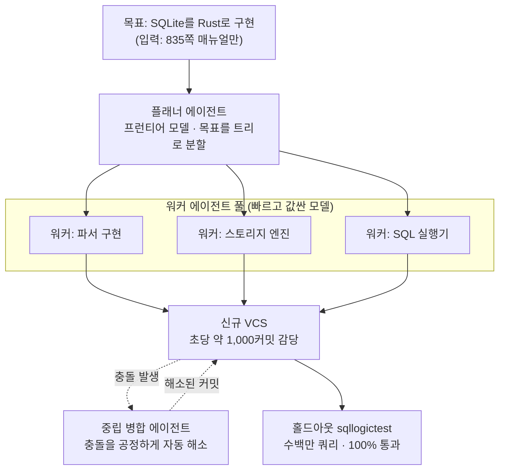

Cursor가 지난 주말 흥미로운 데모 하나를 공개했습니다. 에이전트 여러 대를 묶은 스웜(swarm)에게 SQLite를 처음부터 다시 만들라고 시켰습니다. 소스코드도, 기존 테스트 스위트도, 인터넷도 주지 않았습니다. 준 것은 SQLite의 835쪽짜리 공식 문서 하나뿐이었습니다. 스웜은 이 문서만 읽고 Rust로 SQLite 복제본을 짰고, 그 복제본은 따로 숨겨둔 홀드아웃 테스트 스위트(sqllogictest)를 100% 통과했습니다.

숫자 자체도 눈길을 끌지만, 이 글이 주목하는 지점은 데모의 스펙터클이 아닙니다. 링크드인과 X 타임라인에는 "AI가 SQLite를 다시 썼다"는 문장만 돌았습니다. 저희는 그 문장을 그대로 옮기지 않고 Cursor 공식 블로그와 발표 원문을 직접 확인했습니다. 진짜 이야기는 "됐다/안 됐다"가 아니라, **모델을 어떻게 조합하느냐에 따라 같은 결과의 비용이 15배까지 벌어졌다**는 데 있었습니다. 멀티에이전트를 실제로 운영하는 입장에서 이 15배가 무엇을 의미하는지가 이 글의 핵심입니다.

## 무슨 일이 있었나

Cursor가 검증에 쓴 과제는 "SQLite를 Rust로, 문서만 보고 처음부터 구현하기"였습니다. 이 과제는 예전 스웜이 이미 한 번 실패했던 것이라, 시스템이 실제로 나아졌는지를 재는 리트머스 시험지 역할을 했습니다. 결과를 공식 수치로 정리하면 이렇습니다.

- **정확성**: 새 스웜이 만든 Rust 복제본은 홀드아웃 sqllogictest 스위트를 100% 통과했습니다. 이 스위트는 수백만 건의 쿼리로 구성됩니다.
- **진척 속도**: Grok 4.5 조합으로 돌렸을 때 4시간 만에 80% 지점에 도달했습니다. 반면 예전 스웜은 같은 과제에서 진척이 무너져 두 번째 시간이 되기 전에 중단해야 했습니다.
- **비용 편차**: 완전히 동일한 목표를 달성하는 데 든 비용이 모델 조합에 따라 **15배** 차이 났습니다. 가장 저렴한 조합인 Opus 4.8 플래너 + Composer 2.5 워커는 1,339달러, 모든 역할을 GPT-5.5로 돌린 조합은 10,565달러였습니다.

마지막 항목이 이 발표의 진짜 헤드라인입니다. 결과물의 품질은 같은데 청구서만 15배 벌어졌다면, 멀티에이전트에서 승부를 가르는 변수는 "어떤 모델이 가장 똑똑한가"가 아니라 "어떤 모델을 어디에 배치하는가"라는 뜻이기 때문입니다.

## 이 스웜은 어떻게 생겼나

Cursor의 스웜은 두 종류의 에이전트로 구성됩니다. **플래너(planner)** 에이전트는 가장 똑똑한 프런티어 모델이 맡아 목표를 트리 구조로 쪼개고 하위 작업으로 위임합니다. **워커(worker)** 에이전트는 빠르고 값싼 모델이 맡아 위임받은 조각을 실제로 실행합니다. Cursor는 이 구조가 고정된 토폴로지를 강제하는 기존 오케스트레이션의 상위 집합이라고 설명합니다. 문제의 윤곽에 맞춰 스웜의 모양이 자라나고, 연산과 컨텍스트가 과제 복잡도에 비례해 늘어나는 방식입니다.

여기까지는 익숙한 그림입니다. 진짜 엔지니어링이 들어간 부분은 그다음, **버전관리와 병합충돌** 처리입니다.

## 왜 새 버전관리 시스템을 만들었나

숫자 하나가 이 결정을 전부 설명합니다. 예전에 브라우저를 만들던 스웜은 Git에서 시간당 약 1,000커밋이 최대치였습니다. 새 시스템은 **초당** 약 1,000커밋에서 정점을 찍습니다. 시간 단위가 초 단위로 바뀌었으니 약 3,600배입니다. 표준 버전관리 도구는 이 속도를 감당하지 못하기 때문에, Cursor는 버전관리 시스템 자체를 새로 만들었습니다.

속도만 문제가 아니었습니다. 여러 에이전트가 같은 코드베이스를 동시에 건드리면 병합충돌이 폭발합니다. Cursor의 공식 수치에 따르면, 예전 방식의 실행은 중단 시점까지 7만 건이 넘는 충돌을 쌓았고, 그 수가 안정화되기는커녕 오히려 가속했습니다. 반면 새 실행은 4시간 전체에 걸쳐 충돌이 1,000건 미만이었습니다.

이 차이를 만든 것이 **중립 병합 에이전트**입니다. 제3자 에이전트 하나가 병합충돌에 개입해 모든 당사자를 대신해 충돌을 해소합니다. 이 에이전트의 유일한 목표는 공정하고 효율적으로 처리하는 것입니다. 엔지니어링 팀의 머지 큐(merge queue)가 작동하는 방식과 비슷합니다. 즉 스웜을 실제로 굴러가게 만든 것은 더 똑똑한 개별 모델이 아니라, 충돌을 흡수하는 **오케스트레이션 인프라**였다는 이야기입니다.

## 실제로 무엇이 검증됐나

발표에서 확인된 사실과 아직 확인되지 않은 것을 구분하는 편이 정직합니다.

확인된 것은 다음과 같습니다. 문서만으로 SQLite급 시스템 소프트웨어를 재구현하는 일이 이제 스웜에게 가능하다는 점, 그리고 그 재구현이 독립적인 홀드아웃 테스트로 검증됐다는 점입니다. 홀드아웃 스위트를 100% 통과했다는 것은 에이전트가 테스트에 과적합한 것이 아님을 어느 정도 보증합니다. 훈련 중에 본 적 없는 쿼리로 검증했기 때문입니다.

동시에 유보할 부분도 있습니다. "SQLite를 다시 썼다"는 문장은 sqllogictest가 커버하는 SQL 의미론 범위 안에서 참입니다. 실제 SQLite가 수십 년간 다뤄 온 파일 포맷 호환성, 크래시 복구, 극단적 동시성, 미묘한 성능 경로까지 동일하게 재현했다는 뜻은 아닙니다. 이 데모는 "테스트로 표현 가능한 명세를 스웜이 채울 수 있다"는 증거이지, "프로덕션 SQLite와 1:1 대체 가능"이라는 증거는 아닙니다. Cursor 자신도 이를 벤치마크 과제로 제시했지 제품 출시로 제시하지 않았습니다.

## ThakiCloud 제품 적용 시사점

이 사례는 저희가 만드는 **Paxis**(Agent-Native Cloud)의 설계 가정을 거의 그대로 확인해 줍니다. 동시에 그 밑을 받치는 **ai-platform**(K8s 기반 AI/ML 인프라)의 경제성 논리와도 맞물립니다.

**Paxis 렌즈, 오케스트레이션이 곧 능력입니다.** Cursor의 교훈을 한 문장으로 줄이면 "더 똑똑한 모델보다 더 나은 오케스트레이션이 결과를 만든다"입니다. Paxis는 이 가정 위에 서 있습니다. Paxis는 Skills·Tools·Policies·Audit Logs를 일급 리소스로 다루는 제어 평면으로, 960개가 넘는 스킬을 BM25로 선택해 격리 샌드박스에서 실행하고, DAG 기반 멀티에이전트로 작업을 분해합니다. Cursor의 플래너/워커 분리는 Paxis의 DAG 오케스트레이션과 정확히 같은 골격입니다. 특히 Cursor가 병합충돌을 중립 에이전트로 흡수한 대목은, Paxis가 모든 에이전트 행동을 **정책 게이트와 감사 로그**로 통과시키는 설계와 같은 문제의식에서 나옵니다. 여러 에이전트가 공유 상태를 동시에 건드릴 때, 무질서를 막는 것은 개별 지능이 아니라 조율 규칙입니다.

**ai-platform 렌즈, 15배는 배치 문제입니다.** 비용이 모델 조합에 따라 15배 벌어졌다는 사실은, 멀티에이전트 경제성이 결국 **모델을 어디에 배치하느냐**로 결정된다는 뜻입니다. 프런티어 모델을 플래너에, 값싼 모델을 워커에 두면 1,339달러, 전부 최고가 모델로 밀면 10,565달러입니다. ThakiCloud의 ai-platform은 바로 이 배치를 인프라 레벨에서 저렴하게 만드는 것을 목표로 합니다. Kueue 기반 GPU 스케줄링으로 워커 계층을 저비용으로 밀도 있게 채우고, vLLM 서빙과 멀티테넌트 격리로 값싼 모델의 대량 병렬 추론 단가를 낮추며, 온프레미스·소버린 배포로 API 종량 과금 대신 자체 호스팅 경제성을 확보합니다. Cursor가 클라우드 API 조합으로 15배를 줄였다면, 자체 인프라를 가진 조직은 워커 계층을 self-hosting으로 내려 그 곡선을 한 번 더 눌러쓸 수 있습니다. 저비용 서빙(ai-platform)이 곧 에이전트 경제성(Paxis)을 만든다는 구조입니다.

정리하면, Cursor의 데모는 "에이전트가 놀라운 일을 했다"는 이야기가 아니라 "에이전트를 저렴하게 조율하는 인프라가 승부처"라는 이야기입니다. 그리고 그 인프라를 제품으로 만드는 것이 저희가 하는 일입니다.

## 한계 및 반론

가장 강한 반론부터 적습니다. 이 수치들은 전부 Cursor 자신이 공개한 것입니다. 홀드아웃 스위트의 구성, 실패한 케이스, 중단된 실행의 세부는 외부에서 독립 검증되지 않았습니다. 15배 비용 편차도 Cursor의 특정 스웜 구현·특정 과제·특정 시점의 모델 가격 기준이며, 다른 워크로드에 그대로 이전된다고 보기 어렵습니다. 모델 가격은 분기 단위로 바뀌므로 이 배수 자체가 오래가지 않을 가능성이 높습니다.

둘째, "SQLite를 다시 썼다"는 프레임은 과장의 여지가 있습니다. 앞서 적었듯 테스트로 표현 가능한 명세를 채운 것과, 수십 년의 엣지케이스가 녹아든 프로덕션 데이터베이스를 대체하는 것은 다릅니다. 시스템 소프트웨어에서 "테스트 100% 통과"와 "믿고 쓸 수 있음" 사이에는 넓은 간극이 있습니다.

셋째, 초당 1,000커밋을 위해 버전관리 시스템을 새로 만들었다는 것은 이 방식이 **막대한 인프라 투자를 전제**한다는 뜻이기도 합니다. 대부분의 팀에게는 스웜을 굴리는 것보다 그 스웜을 감당할 VCS·격리·병합 인프라를 갖추는 쪽이 더 큰 장벽입니다. 이 지점이 역설적으로 Agent-Native Cloud 같은 제어 평면이 필요한 이유이기도 합니다. 스웜의 가치는 개별 에이전트가 아니라 그것을 굴릴 수 있는 인프라에서 나오며, 그 인프라를 직접 만들 여력이 없는 조직에게는 제품화된 오케스트레이션 계층이 대안이 됩니다.

마지막으로 균형을 위해 반대 방향도 적어 둡니다. 이 모든 유보에도 불구하고, 문서만으로 SQLite급 소프트웨어의 SQL 의미론을 홀드아웃 검증까지 통과시켰다는 사실 자체는 1년 전이라면 회의적으로 봤을 결과입니다. 방향성은 분명합니다. 남은 질문은 "가능한가"가 아니라 "얼마나 싸게, 얼마나 믿을 수 있게 조율하는가"이며, 그 질문의 답이 바로 인프라에 있습니다.

## 출처

- [Agent swarms and the new model economics (Cursor 공식 블로그)](https://cursor.com/blog/agent-swarm-model-economics)
- [Cursor 공식 발표 (X)](https://x.com/cursor_ai/status/2079256614238814551)
- [Cursor's AI Swarm Rebuilt SQLite From Scratch at 15x Lower Cost (AlphaSignal)](https://alphasignal.ai/news/cursor-s-ai-swarm-rebuilt-sqlite-from-scratch-at-15x-lower-cost)
