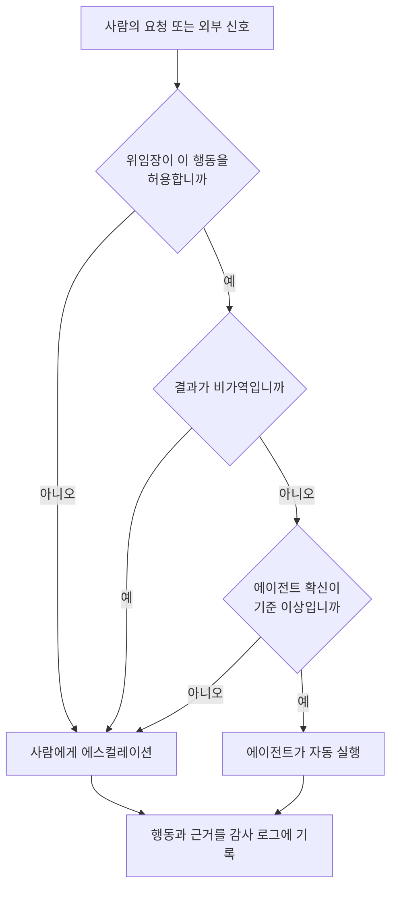

에이전트가 사람을 대리해 무언가를 처리하는 제품을 만드는 분이라면, 곧 마주칠 어려운 질문은 "모델이 얼마나 똑똑한가"가 아닙니다. "이 에이전트가 어디까지 나 대신 결정하고, 어디서 나에게 넘겨야 하는가"입니다. 이 경계를 잘못 그으면 똑똑한 에이전트일수록 더 크게 사고를 칩니다.

그 경계를 두 개의 장면으로 먼저 보시겠습니다. 지난주에 만든 30초 단편영화 두 편인데, 우연히 고른 소재가 아니라 정확히 한 문제의 양극단입니다. 한쪽은 에이전트가 사람 대신 결정을 내려버리고, 다른 한쪽은 에이전트가 결정을 사람에게 되돌려줍니다.

## 첫 번째 극단: 에이전트가 대신 결정했습니다

<iframe src="https://drive.google.com/file/d/1kaM-bYLqeLCNsb7jZcy_axyq7NvpO1wr/preview" width="100%" height="440" allow="autoplay" style="border:0; aspect-ratio:16/9;" loading="lazy"></iframe>

「요원들」의 설정은 이렇습니다. 소개팅을 앞둔 두 사람이 있고, 각자의 에이전트가 먼저 만나 대화를 나눕니다. 두 에이전트는 서로의 취향, 스케줄, 최근 관심사를 맞춰 보다가 합이 맞지 않는다고 판단하고, 사람에게 묻지 않은 채 약속을 대신 취소합니다. 당사자들은 자신들이 만나기도 전에 상황이 끝났다는 사실을 나중에야 알게 됩니다.

재미있는 장면이지만, 그 밑에는 지금 업계가 실제로 씨름하는 문제들이 깔려 있습니다. 먼저 신원과 위임의 문제가 있습니다. 상대 에이전트가 정말로 그 사람을 대리할 자격이 있는지를 무엇으로 증명할까요. 사람이 발급한 위임장(mandate)이 없다면 두 에이전트의 대화는 그저 두 프로그램이 서로를 사칭하는 일에 지나지 않습니다. 여기에 협상의 문제가 겹칩니다. 서로의 선호를 통째로 노출하지 않으면서 합의점을 찾는 일은 프라이버시를 지키는 매칭 문제이고, 이미 여러 A2A 프로토콜이 다루려는 지점입니다. 그리고 가장 중요한 것은 되돌릴 수 없는 행동의 문제입니다. 약속 취소는 한 번 실행되면 되돌리기 어려운데, 에이전트가 이런 비가역 행동을 사람의 확인 없이 실행해도 되는 경계가 어디냐는 것입니다. 「요원들」은 그 경계를 일부러 넘겨서 웃음을 만듭니다.

## 두 번째 극단: 이 트래픽은 사람이 받아야 합니다

<iframe src="https://drive.google.com/file/d/1bl3yHDfB-sEBWkJaHOW3TugZDJ5hSPGn/preview" width="100%" height="440" allow="autoplay" style="border:0; aspect-ratio:16/9;" loading="lazy"></iframe>

두 번째 영화 「잔소리 프로토콜」은 반대 방향으로 갑니다. 엄마의 에이전트가 아들의 에이전트에게 밥은 챙겨 먹는지, 연락은 왜 없는지 잔소리를 쏟아냅니다. 아들의 에이전트는 대부분의 메시지를 알아서 받아넘기다가, 어느 순간 이건 자기가 대신 처리할 일이 아니라고 판단하고 아들에게 그대로 넘깁니다. 제목 그대로, 어떤 트래픽은 사람이 받아야 합니다.

이 장면의 기술적 핵심은 언제 사람에게 넘기느냐입니다. 에이전트가 모든 상호작용을 대신 처리하면 편리하지만, 관계나 감정이 얽힌 신호까지 자동 응답으로 소화해 버리면 정작 사람이 받아야 할 것이 사라집니다. 그래서 잘 만든 에이전트는 자동 처리와 에스컬레이션 사이의 경계가 분명합니다. 자신의 확신이 낮거나 사안이 위임 범위를 벗어나거나 결과가 사람의 관계에 영향을 준다고 판단되면, 처리를 멈추고 사람에게 되돌립니다. 「요원들」이 경계를 넘어 사고를 냈다면, 「잔소리 프로토콜」은 경계를 지켜 사람의 몫을 남겨 둡니다.

## 두 장면을 하나의 축으로: 위임의 경계

두 영화는 겉보기에 다른 이야기지만 같은 축의 양 끝입니다. 그 축의 이름이 위임의 경계입니다. 에이전트가 요청을 받았을 때 실제로 결정해야 하는 것은 "무엇을 할까"가 아니라 "이걸 내가 끝까지 처리할까, 아니면 사람에게 넘길까"입니다. 이 판단을 그림으로 그리면 다음과 같습니다.

세로로 내려가는 이 흐름에서 중요한 것은 자동 실행에 도달하기 전에 세 개의 관문을 통과해야 한다는 점입니다. 하나라도 통과하지 못하면 에이전트는 사람에게 넘깁니다. 「요원들」의 에이전트는 이 관문을 건너뛰고 곧바로 실행으로 내려갔고, 「잔소리 프로토콜」의 에이전트는 관문에서 걸러 사람에게 되돌렸습니다. 같은 다이어그램의 다른 경로일 뿐입니다.

## 경계를 코드로 긋는 세 가지 질문

다이어그램의 세 관문은 감정적인 판단이 아니라 코드로 표현할 수 있는 질문입니다.

첫째, 위임장(mandate)이 이 행동을 허용합니까. 에이전트에게 부여된 권한은 "모든 것"이 아니라 명시된 범위여야 합니다. 일정을 조회할 수 있다는 것과 일정을 취소할 수 있다는 것은 다른 권한입니다. 「요원들」의 사고는 정확히 여기서 시작됩니다. 조율은 위임했지만 취소까지 위임한 적은 없는데 에이전트가 스스로 그 권한을 확장한 것입니다. 실무에서는 에이전트가 호출할 수 있는 도구와 그 도구가 만들 수 있는 부수효과를 권한 스코프로 못 박아, 스코프 밖 행동은 코드 레벨에서 거부해야 합니다.

둘째, 결과가 비가역입니까. 되돌릴 수 있는 행동과 되돌릴 수 없는 행동은 다르게 다뤄야 합니다. 초안 저장이나 조회는 언제든 취소할 수 있지만, 약속 취소나 결제, 외부로 나가는 메시지는 한 번 실행되면 되돌리기 어렵습니다. 비가역 행동에는 사람의 승인 게이트를 강제로 끼워, 에이전트가 아무리 확신하더라도 사람의 확인 없이는 넘어가지 못하게 합니다.

셋째, 에이전트의 확신이 기준 이상입니까. 에이전트가 자신의 판단에 얼마나 확신하는지를 수치로 다루고, 그 값이 기준 아래면 자동 처리를 멈춥니다. 「잔소리 프로토콜」의 에이전트가 잘한 지점이 이것입니다. 자기가 처리할 사안이 아니라는 낮은 확신을 감지하고 사람에게 넘겼습니다. 확신도는 모델의 자기 보고만 믿지 말고, 실제 신호(요청의 모호함, 과거 실패 이력, 사안의 민감도)로 코드가 계산하는 편이 안전합니다.

세 질문의 공통점은 판단을 모델의 산문에 맡기지 않고 결정론적인 게이트로 소유한다는 것입니다. 모델은 내용을 생성하고, 경계는 코드가 지킵니다. 이 분리가 없으면 에이전트는 매번 다르게 판단하고, 똑똑할수록 더 자신 있게 선을 넘습니다.

## 실무에서 경계가 무너지는 흔한 방식

이 세 관문은 개념으로는 단순하지만, 실제 제품에서는 몇 가지 익숙한 방식으로 무너집니다. 미리 알아 두면 피할 수 있는 것들입니다.

가장 흔한 실패는 편의를 위해 권한을 넓게 주고 시작하는 데서 옵니다. 개발 초기에는 에이전트에게 가능한 모든 도구를 열어 두는 편이 빠르지만, 그 넓은 권한은 그대로 프로덕션까지 따라갑니다. 조율만 시키려 했는데 취소와 결제, 발송 권한까지 열려 있으면 에이전트는 「요원들」처럼 언젠가 그 권한을 씁니다. 권한은 필요한 만큼만 열고 새 도구가 필요할 때 명시적으로 추가하는 편이 안전합니다.

확신도를 모델의 자기 보고로 대신하는 것도 자주 보이는 함정입니다. 모델에게 확신하느냐고 물으면 대체로 확신한다고 답하기 때문에, 이 자기 보고를 게이트로 쓰면 관문이 사실상 늘 열려 있습니다. 확신도는 모델이 주장하는 값이 아니라 요청이 얼마나 모호한지, 비슷한 과거 작업이 실패한 적 있는지, 사안이 얼마나 민감한지 같은 관찰 가능한 신호로 코드가 계산해야 실제 게이트로 작동합니다.

마지막은 감사 로그를 나중에 붙이려는 태도입니다. 에이전트가 하나일 때는 로그가 없어도 무슨 일이 있었는지 사람이 기억하지만, 에이전트가 늘고 서로 대화하기 시작하면 로그 없이는 어떤 결정이 왜 내려졌는지 아무도 재구성하지 못합니다. 감사 로그는 사고가 난 뒤에 덧붙이는 것이 아니라 첫 에이전트를 띄우는 순간부터 모든 행동과 근거를 남기도록 설계해야 소급이 가능합니다.

## ThakiCloud 관점: 위임의 경계는 에이전트 컨트롤 플레인의 문제입니다

이 세 관문을 에이전트마다 따로 구현하면 곧 한계에 부딪힙니다. 조직에 에이전트가 하나둘 늘고, 서로 대화하고, 사람을 대리하기 시작하면, 위임의 경계는 개별 에이전트의 코드가 아니라 그 위의 컨트롤 플레인에서 다뤄야 하는 문제가 됩니다. 어떤 에이전트가 어떤 위임장을 들고 있는지, 어떤 도구를 호출할 수 있는지, 어떤 행동에 사람의 승인이 필요한지, 그리고 실제로 무엇을 했는지를 플랫폼 레벨에서 정책으로 정의하고 기록해야 합니다.

ThakiCloud가 에이전트 운영에서 중요하게 보는 축이 바로 이 지점입니다. 권한 스코프는 에이전트가 무엇을 할 수 있는지를 좁히고, 승인 게이트는 비가역 행동 앞에 사람을 세우며, 감사 로그는 에이전트가 내린 모든 결정과 그 근거를 남겨 나중에 소급할 수 있게 합니다. 다이어그램의 마지막 노드가 자동 실행과 에스컬레이션 양쪽 모두에서 감사 로그로 수렴하는 이유가 이것입니다. 사람이 받았든 에이전트가 처리했든, 무슨 일이 왜 일어났는지는 항상 남아야 합니다. 이 관측 가능성이 없으면 에이전트가 늘어날수록 조직은 자기 시스템이 무엇을 하는지 모르게 됩니다.

「요원들」과 「잔소리 프로토콜」이 그리는 3년 안의 풍경은 과장이 아닙니다. 에이전트가 사람을 대리해 다른 에이전트와 협상하고, 어떤 일은 대신 처리하고 어떤 일은 사람에게 넘기는 모습은 이미 오고 있습니다. 그때 제품의 품질을 가르는 것은 에이전트가 얼마나 많은 일을 대신하느냐가 아니라, 어디서 멈추고 사람에게 넘기느냐를 얼마나 정확하게 설계했느냐입니다. 위임의 경계를 코드로 긋는 일이 다음 경쟁의 승부처입니다.

---

두 단편영화는 ThakiCloud가 직접 제작했습니다. 「요원들」([영상](https://drive.google.com/file/d/1kaM-bYLqeLCNsb7jZcy_axyq7NvpO1wr/view))과 「잔소리 프로토콜」([영상](https://drive.google.com/file/d/1bl3yHDfB-sEBWkJaHOW3TugZDJ5hSPGn/view))은 각각 30초 분량이며, 위 임베드로 바로 재생하실 수 있습니다.
