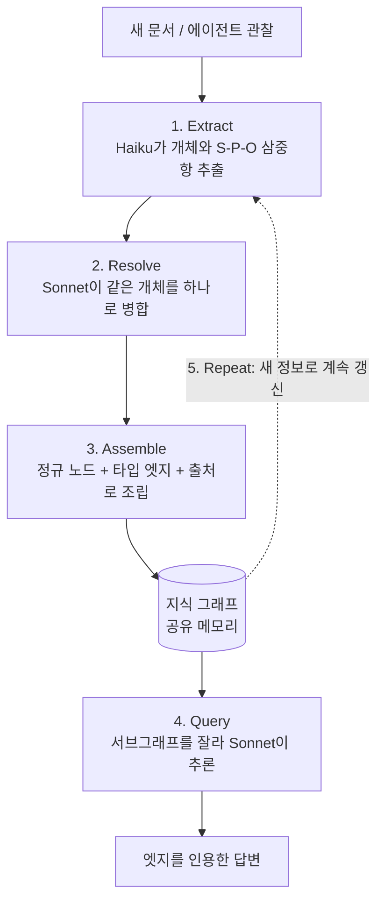

## 왜 읽어야 하나

멀티에이전트 시스템이나 오래 도는 에이전트 제품을 만드는 엔지니어라면, 이 글은 "모델을 더 큰 걸로 바꿔야 하나"라는 질문을 잠시 내려놓게 해드립니다. 핵심 결론부터 말씀드리면 이렇습니다. **에이전트의 기억은 컨텍스트 창과 함께 죽고, 지식 그래프를 공유 메모리로 두어야 그 기억이 영구화됩니다.** 최근 한 Anthropic 시니어 엔지니어가 멀티에이전트 시스템을 위한 그래프 엔지니어링을 12쪽짜리 문서로 정리했는데, 그 뼈대인 다섯 단계(Extract, Resolve, Assemble, Query, Repeat)가 왜 지금 중요한지, 그리고 실제 시스템에 어떻게 붙이는지를 이 글에서 풀어드립니다.

## 개요

에이전트를 오래 돌려보신 분은 같은 벽에 부딪힙니다. 어제 워커가 알아낸 사실을 오늘 워커가 모릅니다. 대화가 길어지면 앞부분이 컨텍스트 창 밖으로 밀려나고, 그 순간 에이전트는 방금까지 알던 것을 잊습니다. 기억이 세션 단위로 증발하는 구조입니다.

흔한 처방은 벡터 RAG입니다. 문서를 임베딩해서 유사한 조각을 다시 불러오는 방식입니다. 이것으로 "비슷한 내용 찾기"는 되지만, "누가 무엇을 했고 그것이 무엇과 연결되는지"는 여전히 흐릿합니다. 같은 인물이 문서마다 다른 이름으로 등장하면 벡터는 그 둘을 하나로 묶지 못합니다. 관계를 따라 두세 다리 건너 추론하는 일도 임베딩 유사도만으로는 안정적이지 않습니다.

그래프 엔지니어링은 여기서 다른 답을 냅니다. 정보를 통째로 저장하는 대신, 개체와 개체 사이의 **관계를 명시적인 그래프**로 남깁니다. 그러면 에이전트의 기억이 문장 덩어리가 아니라 조회 가능한 구조가 됩니다.

## 이 기술은 무엇인가

핵심 아이디어는 단순합니다. 에이전트가 읽고 겪은 것을 **주어-서술어-목적어(S-P-O) 삼중항**으로 뽑아 지식 그래프에 쌓고, 필요할 때 그 그래프의 일부를 잘라내어 질의합니다. 노드는 개체이고, 엣지는 타입이 붙은 관계이며, 모든 삼중항에는 어디서 나왔는지를 가리키는 출처(provenance)가 함께 붙습니다.

컨텍스트 창이 "지금 이 순간 볼 수 있는 것"이라면, 지식 그래프는 "지금까지 확정된 것"입니다. 전자는 세션이 끝나면 사라지고, 후자는 남습니다. 이 분리가 그래프 엔지니어링의 전부라고 해도 지나치지 않습니다.

아래는 다섯 단계가 도는 순환 구조입니다.

## 다섯 단계 자세히 보기

**1. Extract.** 문서 하나가 들어오면 값싼 모델(Haiku)이 개체와 S-P-O 삼중항을 뽑습니다. 문서당 한 번의 호출이면 충분합니다. 여기서 흥미로운 지점은 별도의 학습 데이터가 필요 없다는 것입니다. 무엇을 어떤 모양으로 뽑을지는 **Pydantic 스키마 하나**가 정의합니다. 스키마가 곧 유일한 학습 신호 역할을 합니다. 출력 형식을 코드가 소유하고 모델은 내용만 채우는 구조라, 결과가 흔들리지 않습니다.

**2. Resolve.** 추출된 개체 중 같은 대상을 가리키는 것들을 하나로 묶습니다. 이 단계는 조금 더 똑똑한 모델(Sonnet)이 맡습니다. 예를 들어 "Edwin Aldrin"과 "Buzz Aldrin"은 글자가 하나도 겹치지 않지만 같은 사람입니다. 문자열 매칭으로는 절대 못 잡습니다. 개체마다 붙은 설명을 문맥으로 삼아 모델이 "이 둘은 같다"를 판단합니다. 개체 해소(entity resolution)의 품질이 그래프 전체의 신뢰도를 좌우하는 자리입니다.

**3. Assemble.** 병합된 개체를 정규 노드로 만들고, 타입이 붙은 엣지로 연결하며, 모든 삼중항에 출처를 박아 하나의 연결된 그래프로 조립합니다. 출처가 붙어 있다는 점이 중요합니다. 나중에 "이 사실은 어느 문서에서 나왔는가"를 되짚을 수 있어야, 틀린 정보를 추적하고 걷어낼 수 있습니다.

**4. Query.** 질문이 오면 관련된 서브그래프를 직렬화해서 모델(Sonnet)에게 넘기고, 모델은 삼중항 위에서 추론합니다. 이때 모든 답변은 **특정 엣지를 인용**합니다. "왜 그렇게 답했는가"가 그래프의 어느 관계에 근거하는지 드러나므로, 답변이 검증 가능해집니다.

**5. Repeat.** 새 문서나 새 관찰이 들어오면 다시 1단계로 돌아갑니다. 그래프는 한 번 만들고 끝나는 산출물이 아니라, 계속 갱신되는 살아 있는 메모리입니다.

모델 라우팅이 단계마다 다르다는 점을 눈여겨보시면 좋습니다. 대량 추출은 값싼 Haiku가, 판단이 필요한 개체 해소와 질의 추론은 Sonnet이 맡습니다. 비싼 모델을 전 단계에 바르지 않고, 판단이 필요한 곳에만 씁니다. 이것은 저희가 사내 배치 작업에서 지키는 원칙과 정확히 같습니다. 워커는 싸게, 게이트만 비싸게 둡니다.

## 멀티에이전트에 어떻게 붙나

지식 그래프의 진짜 값어치는 여러 에이전트가 **같은 메모리를 공유**할 때 드러납니다. 워커 에이전트는 알아낸 것을 그래프에 씁니다. 평가 에이전트는 워커의 주장을 그래프에 비추어 사실 확인합니다. 그리고 밤새 도는 루프는 이 그래프를 통해 어제의 진척을 오늘로 이어받습니다.

이 그림은 저희가 여러 자동화 루프를 운영하며 얻은 교훈과 겹칩니다. 팬아웃한 서브에이전트의 결과는 반드시 검증 스테이지로 닫아야 하는데, 그 검증의 기준점이 될 공유 사실 저장소가 없으면 각 에이전트가 백지에서 다시 시작합니다. 그래프는 그 기준점 역할을 합니다. 워커가 쓰고, 평가자가 대조하고, 다음 루프가 물려받는 구조가 자연스럽게 만들어집니다.

## ThakiCloud 제품 적용 시사점

이 기법은 저희 **Paxis**에 특히 잘 맞습니다. Paxis는 ai-platform 위에서 도는 Agent-Native Cloud 제어 평면으로, Skills와 Tools, Policies, Audit Logs를 일급 리소스로 다룹니다. 그래프 엔지니어링의 다섯 단계는 Paxis의 몇몇 축과 그대로 대응됩니다.

먼저 지식 축입니다. Paxis의 위키 지식 엔진은 문서와 개체를 연결된 지식으로 다루는데, 여기에 S-P-O 삼중항과 개체 해소를 얹으면 에이전트가 조회할 수 있는 공유 메모리가 됩니다. 다음으로 오케스트레이션 축입니다. DAG 멀티에이전트가 팬아웃할 때, 각 워커가 그래프에 쓰고 평가자가 그래프로 대조하면 검증 루프가 데이터로 닫힙니다. 마지막으로 감사 축입니다. 모든 삼중항에 출처를 박는 provenance는 Paxis의 정책 게이트와 감사 로그 철학과 정확히 같은 방향입니다. 답변이 어느 근거에서 나왔는지 추적 가능하다는 것은, 규제와 온프렘 요구가 강한 환경에서 그 자체로 경쟁력입니다.

인프라 관점에서는 저희 **ai-platform** 렌즈도 붙습니다. 추출은 값싼 모델을 대량으로 호출하고 질의는 더 큰 모델을 선택적으로 호출하는 구조라, 모델 티어별로 서빙을 나누어 K8s 위에서 돌리기에 알맞습니다. Kueue로 배치 추출 작업을 스케줄링하고 vLLM으로 소형 모델을 값싸게 서빙하면, 그래프를 계속 갱신하는 비용을 통제할 수 있습니다. 저비용 서빙(ai-platform)이 그래프 유지 비용을 낮추고, 그것이 다시 에이전트의 경제성(Paxis)을 만듭니다.

## 한계 및 반론

그래프 엔지니어링이 만능은 아닙니다. 가장 아픈 지점은 개체 해소가 틀렸을 때입니다. 서로 다른 두 개체를 하나로 잘못 병합하면, 그 오류가 그래프 전체로 번져 이후 모든 질의를 오염시킵니다. 반대로 같은 개체를 갈라 두면 기억이 조각납니다. 이 단계에 모델 판단이 들어가는 이상, 완벽한 자동화는 어렵고 주기적인 감사가 필요합니다.

추출 단계의 환각도 문제입니다. 모델이 문서에 없는 삼중항을 지어내면, 출처가 붙어 있어도 그 출처 안에 실제로 그 관계가 있는지는 별도로 확인해야 합니다. 스키마가 형식은 강제하지만 내용의 진위까지 보장하지는 않습니다.

규모가 커지면 그래프가 비대해지고 질의 지연이 늘어납니다. 관련 서브그래프를 잘라내는 일 자체가 또 하나의 검색 문제가 되며, 잘라낸 조각이 너무 크면 다시 컨텍스트 창 한계로 돌아옵니다. 그리고 애초에 관계 추론이 필요 없는 단순한 조회라면, 무거운 그래프보다 평범한 벡터 RAG가 더 싸고 빠릅니다. 문제의 성격이 "비슷한 것 찾기"인지 "관계 따라가기"인지를 먼저 가르는 것이 순서입니다.

## 정리

에이전트에게 영구 기억을 주는 일은 더 큰 모델을 사는 것으로 해결되지 않습니다. 기억이 컨텍스트 창과 함께 죽는 구조를 바꾸어야 하고, 지식 그래프를 공유 메모리로 두는 것이 지금까지 나온 가장 실용적인 답입니다. Extract로 뽑고, Resolve로 묶고, Assemble로 조립하고, Query로 근거와 함께 답하고, Repeat로 갱신하는 다섯 단계가 그 방법입니다.

시작은 거창하지 않아도 됩니다. 여러분의 도메인에서 가장 중요한 개체와 관계 몇 가지를 정의한 **작은 Pydantic 스키마 하나**를 만들고, 값싼 모델로 문서 하나를 추출해 보십시오. 거기서부터 그래프가 자랍니다. 다음에 에이전트가 "그거 어제 알았는데 잊어버렸다"고 할 때, 답은 더 큰 모델이 아니라 더 나은 기억 구조라는 것을 기억하시면 됩니다.

## 관련 슬라이드

본문 내용을 NotebookLM(`blue_collage` 스타일)으로 요약한 슬라이드입니다.

## 출처

- [Codez (@0xCodez), "Graph Engineering for multi-agentic systems" (X)](https://x.com/0xCodez/status/2080250266851463209)
- [Anthropic Engineering, "How we built our multi-agent research system"](https://www.anthropic.com/engineering/multi-agent-research-system)
