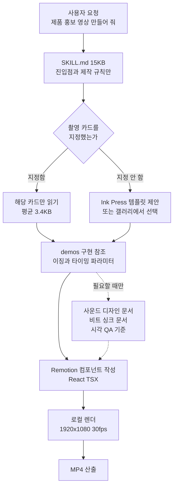

에이전트에게 제품 홍보 영상을 맡길 수 있느냐는 질문에, 이번에는 직접 렌더해 본 수치로 답을 드리겠습니다. 결론부터 말씀드리면 1920x1080 해상도에 36.17초 길이인 완성형 홍보 영상이 12코어 맥북에서 22.76초 만에 나왔습니다. 실시간 재생 시간보다 빠릅니다. 그런데 이 글에서 정말 눈여겨볼 대목은 렌더 속도가 아니라, 그 결과를 만들어 내는 스킬이 어떤 구조로 포장되어 있느냐입니다.


## 왜 읽어야 하나

이 글은 에이전트에게 반복 가능한 산출물을 맡기려는 플랫폼 엔지니어와, 사내 스킬 카탈로그를 설계하는 담당자를 위한 글입니다. 마케팅 영상 제작 자체가 목적이신 분보다는, 잘 만들어진 에이전트 스킬이 어떤 구조를 갖는지 보고 자기 스킬에 이식하려는 분에게 쓸모가 큽니다. 핵심 결론은 이렇습니다. video-shotcraft가 5일 만에 별 1,387개를 모으고 그 다음 주에 2,000개를 넘긴 이유는 모션이 예뻐서가 아니라, 1.33MB에 달하는 촬영 지식을 15KB짜리 진입점 하나 뒤에 접어 넣는 점진적 공개 구조를 정확히 지켰기 때문입니다. 이 구조는 영상과 무관한 어떤 도메인 스킬에도 그대로 옮길 수 있습니다.

## 개요

에이전트 스킬 생태계에서 요즘 가장 빠르게 성장한 저장소 중 하나가 video-shotcraft입니다. GitHub API로 확인한 시점 기준으로 저장소는 2026년 7월 19일에 만들어졌고, 8일 뒤인 7월 27일에 별 2,098개와 포크 182개를 기록했습니다. 라이선스는 Apache-2.0이며 주 언어는 TypeScript입니다. 마지막 푸시도 같은 날이었으니 아직 활발히 손이 가고 있는 프로젝트입니다.

이 스킬이 하는 일은 한 문장으로 요약됩니다. Claude Code나 Codex 같은 에이전트를 모션 디자인 스튜디오로 바꿔서, 제품 화면을 가리키면 스토리보드를 짜고 애니메이션을 붙이고 사운드까지 설계해 Remotion으로 영상을 뽑아 줍니다. Remotion은 React 컴포넌트를 영상 프레임으로 렌더하는 프레임워크입니다. 즉 에이전트가 잘하는 일인 코드 작성으로 영상 제작 문제를 환원한 셈입니다.

저희가 이 프로젝트를 주목한 이유는 두 가지입니다. 첫째, 사내에 이미 hyperframes와 video-producer 계열의 영상 스킬을 운영하고 있어 비교 기준이 필요했습니다. 둘째, 그리고 이쪽이 더 중요한데, GPU 클라우드 없이 로컬 렌더링만으로 이 정도 반응을 얻었다는 사실이 경량 스킬 배포 전략에 시사하는 바가 있었습니다. 그래서 격리된 작업 트리에 저장소를 클론하고 템플릿을 끝까지 렌더해 봤습니다.

## 이 도구는 무엇인가

video-shotcraft의 뼈대는 촬영 레시피 카드입니다. 카드 한 장이 하나의 모션 기법을 문서화합니다. 용도와 에너지 강도, 권장 길이, 파라미터, 구현 노트, 그리고 알려진 함정까지 적혀 있습니다. 에이전트는 사용자가 원하는 영상 설명을 받아 적절한 카드를 고르고, 그 카드에 대응하는 Remotion 구현을 참고해 실제 컴포넌트를 씁니다.

저장소를 클론해 직접 세어 본 결과 카드는 104장이었고, 10개 기능 범주로 나뉘어 있었습니다. 범주별 분포는 전환 15장, 화면 진입 15장, 타이포그래피 14장, 인터랙션 11장, 이펙트 10장, 리듬 10장, 오프닝 9장, 데이터 8장, 카메라 7장, 아웃트로 5장입니다. 참고로 저장소 설명문에는 106장으로 적혀 있는데, README와 실제 파일 수는 모두 104장이었습니다. 문서 사이의 사소한 시차로 보이며, 이 글의 수치는 클론한 파일을 직접 센 값입니다.

카드만 있는 것이 아닙니다. 각 카드에 대응하는 Remotion 구현이 demos 디렉터리에 153개의 TSX 파일로 들어 있고, 여기에 실제 이징과 타이밍 파라미터가 담겨 있습니다. 오디오 자산은 5개의 배경음악과 16개 장면 범주로 정리된 149개의 효과음으로 구성됩니다. 사운드 카테고리를 먼저 고르고 음색을 고르라는 지침이 문서에 명시되어 있어서, 에이전트가 효과음을 무작위로 집는 상황을 방지합니다.

여기서 구조가 흥미로워집니다. 저장소 전체는 92MB이고, 참조 문서만 111개 파일에 454,668바이트, 데모 구현은 905,392바이트입니다. 문서와 구현을 합치면 1.3MB가 넘습니다. 그런데 에이전트가 처음 읽는 진입점인 SKILL.md는 203줄, 15,238바이트에 불과합니다. 전체 지식 묶음의 약 1.1퍼센트만 상시 노출되고, 나머지는 필요할 때 경로로 찾아 들어가는 구조입니다.


상시 노출되는 진입점과 전체 지식 묶음의 비율입니다.



문서 구성도 이 원칙을 따릅니다. 저장소에는 제작 파이프라인 문서와 재사용 가능한 영상 구조 모음, 시각 QA 기준, 배경음악 분석과 비트 싱크 방법론, 사운드 디자인 지침이 각각 별도 파일로 놓여 있습니다. 에이전트는 스토리보드를 짤 때 파이프라인 문서를, 소리를 얹을 때 사운드 문서를, 마지막 점검에서 QA 기준을 읽습니다. 한 파일에 모든 것을 몰아넣고 매번 통째로 읽히는 방식과 비교하면 컨텍스트 사용량이 크게 달라집니다.

카드 한 장의 평균 크기는 약 3.4KB입니다. 그러니까 에이전트는 104장 전부를 컨텍스트에 올리는 대신, 필요한 서너 장만 읽고 작업합니다. 저희가 사내 규율로 반복해서 강조해 온 원칙, 즉 능력은 얇은 하네스가 아니라 두터운 스킬 쪽에 쌓되 매 세션 비용은 최소로 유지한다는 원칙이 이 저장소 구조에 그대로 구현되어 있습니다.

## 설치 및 통합

설치 경로는 세 가지입니다. 가장 직접적인 방법은 에이전트에게 저장소 링크를 그냥 던지는 것입니다.

```text
Install this skill for me: https://github.com/Vincentwei1021/video-shotcraft
```

에이전트가 알아서 클론하고 스킬 디렉터리에 연결합니다. 스킬 전용 CLI를 쓰는 방법도 있습니다.

```bash
npx skills add Vincentwei1021/video-shotcraft
```

수동 설치는 클론한 뒤 심볼릭 링크를 거는 방식입니다.

```bash
git clone https://github.com/Vincentwei1021/video-shotcraft.git
cd video-shotcraft
ln -s "$(pwd)" ~/.claude/skills/video-shotcraft   # Claude Code
ln -s "$(pwd)" ~/.codex/skills/video-shotcraft    # Codex
```

저희는 재현성을 위해 격리된 작업 트리에서 진행했습니다. 실험은 메인 워킹 트리를 건드리지 않는 임시 worktree 안에서 돌렸고, 결과 로그만 저장소 바깥 경로에 보존했습니다.

```bash
bash scripts/blog/impl_sandbox.sh setup video-shotcraft-agent-video-skill
bash scripts/blog/impl_sandbox.sh run video-shotcraft-agent-video-skill -- \
  git clone --depth 1 https://github.com/Vincentwei1021/video-shotcraft.git vs
```

템플릿의 의존성은 단출합니다. package.json 기준으로 remotion과 @remotion/cli가 4.0.484, react와 react-dom이 19.2.7, TypeScript는 6 계열입니다. 실행 스크립트는 studio 실행, 전체 렌더, 스틸 추출 세 개뿐입니다.

```json
{
  "scripts": {
    "dev": "remotion studio src/index.ts",
    "render": "remotion render src/index.ts AiflPromo out/promo.mp4",
    "still": "remotion still src/index.ts AiflPromo"
  },
  "dependencies": {
    "@remotion/cli": "4.0.484",
    "react": "19.2.7",
    "react-dom": "19.2.7",
    "remotion": "4.0.484"
  }
}
```

## 실제 실험 결과

측정 환경은 12코어 애플 실리콘 맥북, Node v24.1.0입니다. 모든 수치는 캡처한 실행 로그에서 가져왔습니다.

먼저 컴포지션 정보를 확인했습니다. 템플릿이 노출하는 AiflPromo 컴포지션은 30fps에 1920x1080, 총 1085프레임으로 36.17초입니다. README가 밝힌 36.2초와 일치합니다.

```text
The following compositions are available:
AiflPromo    30      1920x1080      1085 (36.17 sec)
```

의존성 설치는 230개 패키지에 1.73초가 걸렸습니다. npm 캐시가 이미 따뜻한 상태였으므로 최초 설치는 이보다 오래 걸립니다. 코드 번들링은 446밀리초였습니다.

스틸 프레임 한 장을 뽑는 데는 10.11초가 걸렸습니다. 이 시간에는 콜드 상태에서의 번들링이 포함되어 있어서, 이후 렌더는 캐시된 번들을 재사용해 더 빨라집니다. 산출된 PNG는 85,379바이트였습니다.

```bash
npx remotion still src/index.ts AiflPromo out/frame.png --frame=60 --concurrency=1
# real  0m10.110s
```

동시성을 1로 묶고 90프레임짜리 클립을 뽑았을 때는 5.68초가 걸렸습니다. 초당 15.8프레임입니다. 그다음 동시성 제한 없이 1085프레임 전체를 렌더했더니 22.76초에 끝났습니다. 초당 47.7프레임이고, 30fps 영상 기준으로 실시간의 1.59배 속도입니다. 최종 MP4는 20.7MB였습니다.

```bash
npx remotion render src/index.ts AiflPromo out/promo.mp4
# Encoded 1085/1085
# + out/promo.mp4 20.7 MB
# real  0m22.758s
```


측정한 파이프라인 단계별 소요 시간과 렌더 처리량입니다. 붉은 점선은 30fps 실시간 기준선입니다.

이 수치가 실무적으로 의미하는 바는 분명합니다. 36초짜리 제품 홍보 영상 한 편을 고치고 다시 뽑는 반복 주기가 30초 안쪽이라는 뜻입니다. 카피 한 줄을 바꾸고 결과를 확인하는 데 커피를 타러 갈 필요가 없습니다. GPU도 필요 없고 외부 영상 생성 API 호출료도 들지 않습니다. 렌더는 전적으로 CPU 바운드이고 로컬에서 끝납니다.

다만 저장소 문서가 밝힌 헤드리스 환경의 함정 세 가지는 그대로 유효합니다. 코어 수가 적은 리눅스 서버에서는 동시성 상한이 2로 걸려 실패하므로 `--concurrency=1`을 명시해야 하고, 최근 크롬이 구형 헤드리스 모드를 제거해서 시스템 크로미움을 그대로 가리키면 기동에 실패하므로 chrome-headless-shell 바이너리를 써야 하며, remotion.media CDN이 막힌 망에서는 헤드리스 셸 자동 다운로드가 거부되므로 `--browser-executable`로 직접 지정해야 합니다. 저희 측정은 맥북 로컬 환경이라 이 세 가지 문제를 만나지 않았고, 따라서 리눅스 CI에서의 재현은 이번에 검증하지 못했습니다.

## ThakiCloud 제품 적용 시사점

이 실험에서 저희가 가져갈 것은 영상 자체가 아니라 스킬 포장 방식입니다. Paxis는 ThakiCloud의 Agent-Native Cloud로, Skills와 Tools, Policies, Audit Logs를 일급 리소스로 다루는 제어 평면입니다. 960개가 넘는 스킬을 BM25로 선택해 격리된 샌드박스에서 실행하고, 모든 행동을 정책 게이트와 감사 로그로 통과시킵니다. 스킬이 많아질수록 카탈로그 전체를 상시 노출하는 비용이 문제가 되는데, video-shotcraft는 그 문제를 푸는 좋은 참고 사례입니다.

구체적으로 세 가지를 이식할 만합니다. 첫째는 진입점과 본문의 분리 비율입니다. 15KB 진입점 뒤에 1.3MB를 접어 넣는 1.1퍼센트 구조는 스킬 라우터가 후보를 고를 때 지불하는 비용을 최소화하면서도, 선택된 뒤에는 충분히 두터운 지식을 제공합니다. 둘째는 카드 단위 모듈화입니다. 기법 하나당 파일 하나, 평균 3.4KB라는 규격은 에이전트가 필요한 것만 정확히 집어 들게 만듭니다. 셋째는 검증된 완성 템플릿을 기본 경로로 두는 설계입니다. 사용자가 아무것도 지정하지 않으면 이미 통과 검증된 템플릿을 먼저 제안하는데, 이는 자유 설계를 검증된 골격에 채우기로 강등시켜 평균 품질을 올리는 저희 규율과 정확히 같은 발상입니다.

ai-platform 렌즈에서도 볼 대목이 있습니다. 이 워크로드는 GPU가 아니라 CPU를 씁니다. 마케팅 영상 수십 편을 배치로 뽑아야 하는 상황이라면 K8s 잡으로 병렬화하기에 적합한 형태이고, GPU 큐를 점유하지 않으므로 학습과 추론 워크로드와 자원 경합을 일으키지 않습니다. 저희가 운영하는 멀티테넌트 클러스터 관점에서는 값비싼 가속기를 비워 두고 유휴 CPU 노드로 소화할 수 있는 종류의 작업입니다.

사내 영상 스킬과의 비교도 숙제로 남았습니다. hyperframes와 video-producer 계열은 파이프라인 오케스트레이션과 다국어 나레이션 쪽에 강점이 있지만, 촬영 기법 카탈로그의 밀도에서는 104장 대 상당한 격차가 있습니다. 카드 형식의 기법 문서화는 저희 쪽에서 그대로 빌려올 수 있는 부분입니다.

## 한계 및 반론


도입을 검토하실 때 먼저 확인하셔야 할 세 가지입니다.

먼저 이 도구가 만능이 아니라는 점을 분명히 해야겠습니다. 대상 범위가 웹과 데스크톱 제품 홍보 영상에 맞춰져 있습니다. 실사 촬영본을 편집하거나 인물이 등장하는 영상에는 맞지 않고, 화면 캡처와 UI 모션을 다루는 영역에서만 강점을 보입니다.

라이선스도 짚어야 합니다. 저장소 자체는 Apache-2.0이지만, 렌더를 담당하는 Remotion은 별도 라이선스를 갖습니다. 개인과 소규모 팀에는 무료이나 기업은 유료 라이선스가 필요할 수 있습니다. 사내 도입을 검토하신다면 저장소 라이선스만 보고 판단하지 마시고 Remotion 라이선스 조건을 먼저 확인하셔야 합니다. 번들된 오디오 자산도 각자의 라이선스 조건을 따르며, 저장소는 출처와 조건을 별도 문서로 관리하고 있습니다.

템플릿에 포함된 제품 스크린샷은 시연용 자산입니다. 저장소 문서도 배포 전에 대상 제품의 화면으로 교체하고, 제품이나 고객 또는 개인 데이터가 익명화되어야 하는지 확인하라고 명시합니다. 이 경고를 지나치면 남의 데모 화면이 자사 홍보 영상에 그대로 실리는 사고가 납니다.

기법의 출처도 짚어 둘 만합니다. 저장소는 카드에 담긴 모션 언어를 여러 회사의 공식 제품 영상을 연구해 정리했다고 밝히고 있습니다. 다만 문서화한 것은 타이밍과 이징, 연출 순서 같은 기법이며 해당 영상의 푸티지나 아트워크, 브랜드 자산은 저장소에 포함되어 있지 않다고 명시합니다. 참고 대상 기업들과 제휴 관계가 없다는 점도 함께 적어 두었습니다. 사내에서 유사한 기법 카탈로그를 만드실 계획이라면 이 구분, 즉 기법 문서화와 자산 복제를 나누는 선을 그대로 참고하시는 편이 안전합니다.

마지막으로 저희 실험의 한계입니다. 저희는 이미 완성된 템플릿을 렌더했을 뿐, 에이전트가 백지에서 스토리보드를 짜고 카드를 골라 새 영상을 구성하는 전체 경로는 이번에 측정하지 않았습니다. 렌더 속도는 실측이지만, 에이전트가 만든 결과물의 품질은 이 글이 검증한 범위 밖입니다. 리눅스 CI 환경에서의 헤드리스 렌더 역시 문서가 밝힌 함정만 옮겼을 뿐 직접 재현하지 못했습니다.

## 정리

이 실험이 남긴 실무 교훈을 한 문장으로 줄이면 이렇습니다. 잘 팔리는 에이전트 스킬은 기능이 많아서가 아니라, 많은 지식을 얇은 진입점 뒤에 정확히 접어 두었기 때문에 잘 팔립니다. video-shotcraft는 104장의 촬영 카드와 153개의 구현, 149개의 효과음을 갖고 있으면서도 에이전트에게는 15KB만 먼저 보여 줍니다. 그리고 그 결과로 36.17초짜리 1080p 영상을 로컬에서 22.76초에 뽑아냅니다.

여러분이 사내 스킬 카탈로그를 늘리고 계신다면, 다음 스킬을 쓸 때 진입점 파일과 참조 본문의 크기 비율을 한 번 재 보시길 권합니다. 그 비율이 두 자릿수 퍼센트라면 카탈로그가 커질 때 반드시 비용 문제를 일으킵니다. 기법 하나당 파일 하나로 쪼개고, 검증된 완성 템플릿을 기본 경로로 두는 것만으로도 상당 부분 해결됩니다. 그것이 이번 실측에서 얻은 가장 실용적인 결론입니다.

## 출처

- video-shotcraft 저장소, GitHub (<https://github.com/Vincentwei1021/video-shotcraft>)
- video-shotcraft README, 2026-07-27 기준 (<https://raw.githubusercontent.com/Vincentwei1021/video-shotcraft/main/README.md>)
- 촬영 카드와 모션 미리보기 갤러리 (<https://vincentwei1021.github.io/video-shotcraft/>)
- Remotion 공식 사이트 및 라이선스 (<https://www.remotion.dev/>)
- 실험 로그: `outputs/blog-impl/video-shotcraft-agent-video-skill/run-1.log` ~ `run-8.log`
