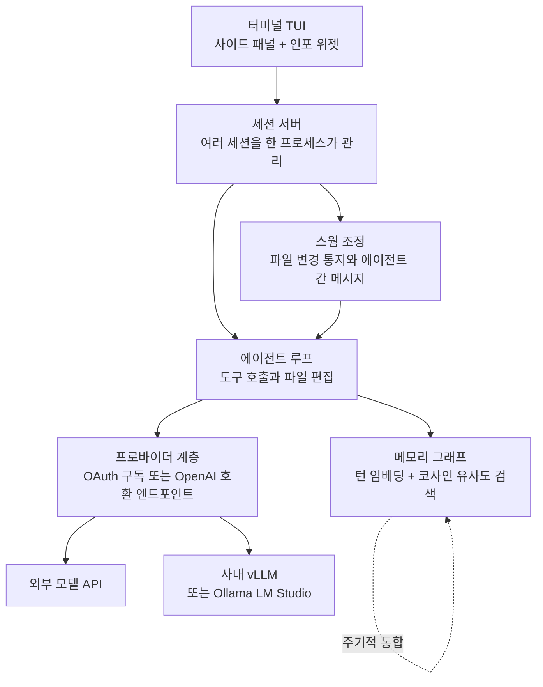

코딩 에이전트가 Claude Code보다 245배 빠르게 뜬다는 문장을 보면 두 가지 반응이 동시에 옵니다. 하나는 궁금함이고 다른 하나는 의심입니다. 그래서 저희는 공식 릴리스 바이너리를 내려받아 체크섬을 확인하고, 사내 맥북에서 직접 재봤습니다. 결론부터 말씀드리면 245배도 참이고, 저희가 잰 5.8배도 참입니다. 두 숫자는 서로 다른 것을 측정했기 때문입니다.


## 왜 읽어야 하나

이 글은 사내에 코딩 에이전트를 여러 개 띄워 쓰거나, 에이전트 하네스를 직접 설계하고 계신 플랫폼 엔지니어를 위한 글입니다. 어떤 CLI를 쓸지 고르는 단계에 계신 분보다는, 하네스의 자원 특성이 동시 실행 가능한 세션 수를 어떻게 결정하는지 알고 싶은 분에게 쓸모가 큽니다. 핵심 결론은 이렇습니다. jcode에서 배울 점은 245배라는 속도 자체가 아니라, 세션 하나를 추가하는 한계 비용을 10MB 수준으로 눌러 놓은 설계입니다. 이 값이 작아야 에이전트를 여러 개 굴리는 방식이 실무에서 성립합니다.

## 개요

jcode는 Rust로 작성된 오픈소스 코딩 에이전트 하네스입니다. GitHub API로 확인한 시점 기준으로 저장소는 2026년 1월 5일에 만들어졌고, 별 12,097개와 포크 1,334개를 기록하고 있습니다. 라이선스는 MIT이고 주 언어는 Rust이며, 마지막 푸시는 2026년 7월 27일이었습니다. 미해결 이슈는 136건입니다.

릴리스 속도가 눈에 띕니다. 7월 24일 v0.56.0을 시작으로 v0.57.0, v0.58.0, v0.60.0을 거쳐 7월 27일 v0.61.0까지, 나흘 사이에 다섯 번 배포가 나갔습니다. 저장소 설명은 "The most RAM efficient harness"라는 한 줄이 전부입니다. 프로젝트가 무엇을 최적화 목표로 삼았는지는 그 한 줄에 다 들어 있습니다.

저희가 이 프로젝트를 살펴본 이유는 벤치마크 자체보다 그 아래에 깔린 질문 때문입니다. 에이전트를 하나 띄우는 비용은 이제 충분히 싸졌지만, 열 개를 동시에 띄우는 비용은 여전히 비쌉니다. 세션당 200MB를 넘게 먹는 하네스로 열 개를 굴리면 노트북 한 대가 그것만으로 꽉 찹니다. 이 병목을 정면으로 공략한 구현이 실제로 어떤 수치를 내는지 확인하고 싶었습니다.

## 이 도구는 무엇인가

jcode는 모델을 만들지 않습니다. 모델 앞에 붙어서 도구 호출과 파일 편집과 세션 관리를 담당하는 실행 껍데기, 즉 하네스입니다. 사용자가 이미 구독 중인 모델을 그대로 쓰되 그 주변 살림살이를 Rust로 다시 짠 쪽에 가깝습니다.


구조를 단순화하면 이렇습니다.



특징적인 부분은 세 곳입니다.

첫째는 메모리입니다. jcode는 매 턴과 응답을 벡터로 임베딩해 그래프에 쌓고, 다음 턴마다 코사인 유사도로 관련 기억을 찾아 대화에 끼워 넣습니다. 에이전트가 메모리 도구를 명시적으로 호출하지 않아도 관련 맥락이 따라 들어오는 구조입니다. 기억 추출은 의미적 표류가 감지되거나 일정 턴이 지나거나 세션이 끝날 때 별도 사이드에이전트가 수행하고, 쌓인 기억은 주기적으로 재정리되면서 오래되거나 충돌하는 항목이 정리됩니다. 물론 명시적인 메모리 검색과 저장 도구도 함께 제공합니다.

둘째는 스웜입니다. 같은 저장소에서 에이전트를 둘 이상 띄우면 서버가 이들을 함께 관리합니다. 에이전트 A가 편집한 파일을 에이전트 B가 이미 읽어 둔 상태라면 서버가 B에게 변경 사실을 알립니다. B는 관련이 없다고 판단하면 무시하고, 필요하면 차이를 확인해 충돌을 피합니다. 에이전트끼리 특정 상대에게만 보내는 메시지와 전체 방송이 모두 가능하고, 에이전트가 스스로 동료를 스폰해 작업을 나눌 수도 있습니다. 이때 원래 에이전트는 조정자가 되고 스폰된 쪽이 작업자가 됩니다.

셋째는 렌더링입니다. 사이드 패널에 파일을 실시간으로 띄우거나 차이 뷰어로 쓸 수 있고, 채팅과 패널 모두 mermaid 다이어그램을 인라인으로 그립니다. 이를 위해 저자는 브라우저나 타입스크립트 의존성 없이 동작하는 별도의 mermaid 렌더링 라이브러리를 따로 만들었습니다. 화면 공간을 뺏지 않도록 남는 자리에만 정보를 표시하는 인포 위젯도 같은 결의 설계입니다.

이 세 가지 외에 눈에 띄는 점은 저자가 필요한 부품을 직접 만들어 붙였다는 사실입니다. mermaid 렌더러가 그랬고, 터미널도 마찬가지입니다. 사용자 정의 스크롤백을 구현하면 부분 줄 단위의 부드러운 스크롤이 터미널 차원에서 막히는데, 저자는 이를 해결하려고 네이티브 스크롤 API를 가진 터미널을 별도로 만들고 있습니다. 아직 진행 중인 작업이라 일반 터미널에서도 스크롤은 정상 동작합니다. 이런 선택은 의존성을 줄여 기동 비용을 낮추는 방향과 일관되지만, 유지보수 표면이 한 사람에게 몰린다는 신호이기도 합니다.

프로바이더 지원은 넓은 편입니다. Claude, OpenAI, Gemini, GitHub Copilot, Azure, 알리바바 코딩 플랜 같은 구독 기반 OAuth 로그인이 내장되어 있고, OpenRouter나 DeepSeek, Moonshot 계열은 이름만 지정하면 되는 프로필로 준비되어 있습니다. 로컬 런타임인 Ollama와 LM Studio도 마찬가지입니다. 헤드리스 환경이나 SSH 세션을 위해 브라우저를 띄우지 않고 인증 URL을 출력한 뒤 나중에 콜백이나 코드로 완료하는 두 단계 흐름도 준비되어 있습니다. 자동화 스크립트에서 로그인을 처리해야 하는 경우에 유용한 부분입니다.

MCP 설정은 별도 파일로 관리하되 Claude Code의 설정 파일을 그대로 읽어 들이는 호환 경로가 있습니다. 처음 실행할 때 기존 설정을 자동으로 가져오기 때문에 이관 비용이 낮습니다. 다만 현재는 stdio 방식 MCP 서버만 지원하고, HTTP나 SSE 항목은 인식한 뒤 로그를 남기고 건너뜁니다. 원격 MCP 서버에 의존하는 구성이라면 이 제약을 먼저 확인하셔야 합니다.

## 설치 및 통합

공식 설치 경로는 설치 스크립트입니다.

```bash
# macOS, Linux
curl -fsSL https://jcode.sh/install | bash

# Windows 11 (PowerShell 5.1 이상)
irm https://jcode.sh/install.ps1 | iex
```

저희는 재현 가능한 측정을 위해 스크립트 대신 릴리스 바이너리를 직접 내려받고 공개된 체크섬과 대조했습니다.

```bash
BASE=https://github.com/1jehuang/jcode/releases/download/v0.61.0
curl -fsSLO $BASE/jcode-macos-aarch64.tar.gz
curl -fsSLO $BASE/SHA256SUMS
shasum -a 256 jcode-macos-aarch64.tar.gz
# b0c87b6aad07c27d40cadcc426665e3ed07fb924e3e632fb961568443029491b
tar xzf jcode-macos-aarch64.tar.gz
./jcode-macos-aarch64 --version
# jcode v0.61.0 (c5009da0)
```

macOS arm64 타르볼은 44,980,570바이트였고, 공개된 SHA256 값과 저희가 계산한 값이 일치했습니다.

사내 모델 서버에 붙이는 경로도 확인해 둘 만합니다. jcode는 OpenAI 호환 엔드포인트를 하나의 프로바이더로 취급하기 때문에, 저희처럼 vLLM으로 모델을 서빙하는 환경이면 프로필 하나만 등록하면 됩니다.

```bash
jcode provider add local-vllm \
  --base-url http://localhost:8000/v1 \
  --model Qwen/Qwen3-Coder-30B-A3B-Instruct \
  --no-api-key \
  --set-default
```

키가 필요한 사내 게이트웨이라면 표준 입력으로 키를 넘겨 셸 기록에 남지 않게 할 수 있습니다.

```bash
printf '%s' "$MY_API_KEY" | jcode provider add my-api \
  --base-url https://llm.example.com/v1 \
  --model my-model-id \
  --api-key-stdin \
  --set-default --json

jcode --provider-profile my-api auth-test --prompt 'Reply exactly JCODE_PROVIDER_SETUP_OK'
```

설정은 `~/.jcode/config.toml`에 쌓이고, 엔드포인트가 모델 목록을 제대로 돌려주지 않는 경우에는 프로필에 컨텍스트 창 크기를 직접 적어 줄 수 있습니다. 이 값을 비워 두면 하네스가 일반적인 기본값으로 넘어가기 때문에, 사내 모델의 실제 한계와 어긋날 여지가 생깁니다.

## 실제 실험 결과

측정 환경은 Darwin 25.5.0, arm64, 12코어 맥북입니다. 격리된 작업 트리에서 바이너리를 받아 검증한 뒤, 프로세스 시작부터 `--version` 출력까지의 시간을 12회 반복하고 초기 2회를 디스크 캐시 예열분으로 버렸습니다. 최대 상주 메모리는 `/usr/bin/time -l`로 프로세스마다 따로 3회씩 별도 측정했습니다.


| 항목 | jcode v0.61.0 | Claude Code CLI | 배수 |
|---|---:|---:|---:|
| 기동 시간 중앙값 (웜) | 7.1 ms | 41.5 ms | 5.8배 |
| 기동 시간 최소~최대 | 6.4~11.3 ms | 40.0~42.3 ms | |
| 첫 실행 (콜드) | 25.4 ms | 41.3 ms | 1.6배 |
| 최대 상주 메모리 | 16.9 MB | 217.0 MB | 12.8배 |

여기서 245배는 나오지 않았습니다. 그렇다고 프로젝트가 숫자를 부풀린 것도 아닙니다. 저장소가 공개한 245.5배는 리눅스 머신에서 의사 터미널을 10회 띄워 TUI 첫 프레임이 그려지기까지의 시간을 잰 값이고, 그 표에서 jcode는 14.0ms, Claude Code는 3,436.9ms였습니다. 저희가 잰 것은 같은 도구의 `--version` 경로, 즉 TUI를 올리지 않고 문자열 하나를 찍고 끝나는 최단 경로입니다. 운영체제도 다르고 측정 지점도 다릅니다.

이 차이를 이해하면 두 숫자가 모순이 아니라는 점이 분명해집니다. TUI 첫 프레임에는 터미널 초기화와 화면 구성과 초기 상태 로딩이 모두 들어가고, 바로 그 구간이 하네스마다 크게 벌어집니다. 반면 `--version`은 런타임 부팅 비용만 드러냅니다. Claude Code의 `--version`이 40ms대에서 매우 안정적이었던 것도 같은 이유로 읽힙니다. 저장소 표에서 Claude Code의 첫 프레임 시간이 2,032.7ms에서 8,927.2ms까지 크게 흔들린 것과 대비됩니다.

메모리 쪽은 저장소 주장과 저희 측정이 같은 방향을 가리켰습니다. 저희가 잰 16.9MB는 저장소가 로컬 임베딩을 끈 상태로 보고한 27.8MB보다 오히려 작습니다. 다만 저희 측정은 `--version` 한 번의 최대치라서, 실제 세션을 열고 임베딩 모델까지 올린 상태와는 다릅니다. 저장소 표에 따르면 임베딩을 켠 단일 세션은 167.1MB이고, 여기서 세션을 하나 늘릴 때마다 약 10.4MB가 더 듭니다. 같은 표에서 Claude Code는 세션당 약 212.7MB가 추가로 붙습니다.

실무에서 중요한 숫자는 사실 이 마지막 값입니다. 세션 열 개를 굴린다고 할 때 세션당 한계 비용이 10MB면 100MB 남짓이고, 210MB면 2GB를 넘어갑니다. 노트북 한 대에서 병렬 에이전트를 몇 개까지 띄울 수 있느냐는 결국 이 기울기가 정합니다.


저장소가 공개한 다중 세션 표를 옮기면 차이가 더 분명해집니다. 세션 하나일 때 상주 메모리는 jcode가 167.1MB, Claude Code가 386.6MB로 2.3배 차이입니다. 그런데 세션을 열 개로 늘리면 jcode가 260.8MB, Claude Code가 2,300.6MB가 되어 격차가 8.8배로 벌어집니다. 로컬 임베딩을 끈 구성은 열 세션에서도 117.0MB에 머뭅니다. 시작점의 차이보다 증가 기울기의 차이가 훨씬 크다는 뜻이고, 이것이 이 프로젝트가 실제로 최적화한 지점입니다.

저희가 재지 않은 것도 분명히 적어 두겠습니다. 첫 프레임 이후의 입력 응답성, 대용량 저장소에서의 파일 탐색 속도, 임베딩 모델을 올린 상태의 정상 동작 시 메모리, 그리고 실제 코딩 작업의 품질은 이번 측정 범위 밖입니다. 특히 마지막 항목은 하네스가 아니라 붙이는 모델이 좌우하는 부분이라 하네스 비교로는 답이 나오지 않습니다. 저희가 확인하려던 것은 하나였습니다. 이 프로젝트가 내세우는 자원 효율이 마케팅 문구인지 실제 구현 특성인지, 그리고 그 답은 실제 구현 특성 쪽이었습니다.

## ThakiCloud 제품 적용 시사점

저희는 이 결과를 두 제품의 렌즈로 함께 읽었습니다.

먼저 Paxis 관점입니다. Paxis는 ThakiCloud의 Agent-Native Cloud로, 스킬과 도구와 정책과 감사 로그를 일급 리소스로 다룹니다. 960개가 넘는 스킬을 BM25로 선택해 격리된 샌드박스에서 실행하고, 모든 행동을 정책 게이트와 감사 로그에 통과시킵니다. jcode가 보여 준 두 가지가 이 설계와 직접 맞닿습니다. 하나는 세션당 한계 비용을 낮게 유지하는 원칙입니다. 에이전트를 여러 개 병렬로 돌리는 아키텍처에서는 세션 하나의 절대 비용보다 추가 비용의 기울기가 동시 실행 상한을 결정합니다. 다른 하나는 스웜의 파일 변경 통지 방식입니다. 같은 저장소에서 여러 에이전트가 동시에 작업할 때 충돌을 사후에 병합하는 대신, 읽어 둔 파일이 바뀌었다는 사실을 그 자리에서 알려 주는 편이 훨씬 저렴합니다. 저희 DAG 기반 멀티에이전트 실행에서도 같은 신호를 다룰 여지가 있습니다.

스웜에서 하나 더 눈여겨본 것은 조정자와 작업자의 역할이 미리 정해져 있지 않다는 점입니다. 에이전트가 필요하다고 판단하면 스스로 동료를 스폰하고 그 순간 자신이 조정자가 됩니다. 저희가 DAG로 실행 계획을 먼저 세우는 방식과는 반대 방향인데, 두 방식은 상황에 따라 장단이 갈립니다. 작업 분해가 사전에 명확하면 DAG가 안전하고 감사 로그도 깔끔합니다. 반대로 탐색 단계에서는 실행 중에 갈래를 늘리는 편이 빠릅니다. 정책 게이트를 통과시켜야 하는 저희 환경에서는 동적 스폰을 허용하더라도 스폰 자체를 감사 대상 행동으로 다뤄야 한다는 결론이 나옵니다.

메모리 설계도 참고할 대목이 있습니다. jcode는 관련 기억을 사이드에이전트가 한 번 검증한 뒤 대화에 넣는 선택지를 둡니다. 검색된 항목을 그대로 밀어 넣지 않고 관련성을 한 번 거르는 구조인데, 저희가 핫 메모리 계층을 문자 수 상한으로 강하게 조이는 이유와 동기가 같습니다. 맥락은 공짜가 아니고, 관련 없는 기억은 토큰만 축내면서 판단을 흐립니다.

다음은 ai-platform 관점입니다. jcode의 OpenAI 호환 프로바이더 경로는 사내 vLLM 서빙과 곧바로 맞물립니다. ThakiCloud의 ai-platform은 Kubernetes와 Kueue 위에서 GPU를 배분하고 vLLM으로 모델을 서빙하는데, 클라이언트 쪽이 이렇게 가벼우면 같은 GPU 예산으로 더 많은 개발자 세션을 받을 수 있습니다. 온프레미스나 소버린 요구가 있는 고객에게는 이 조합이 특히 잘 맞습니다. 모델 가중치도 추론 엔드포인트도 고객 경계 안에 두면서, 개발자 단말에는 수십 MB짜리 단일 바이너리만 놓으면 되기 때문입니다. 사내 게이트웨이를 프로필 하나로 등록하고 기본값으로 지정하는 절차가 짧다는 점도 배포 관점에서 유리합니다.

## 한계 및 반론

이 프로젝트를 그대로 도입하라고 권하기에는 걸리는 지점이 몇 가지 있습니다.


버전이 아직 0점대입니다. 나흘에 다섯 번 배포가 나가는 속도는 활력의 증거이면서 동시에 표면이 계속 움직인다는 뜻이기도 합니다. 미해결 이슈 136건도 이 단계 프로젝트로는 자연스럽지만, 사내 표준 도구로 고정하기에는 이릅니다.

기여 경로도 확인이 필요합니다. 저장소 설정상 풀 리퀘스트 생성은 협업자로 제한되어 있습니다. MIT 라이선스라 포크와 수정은 자유롭지만, 외부에서 고친 내용을 상류에 바로 올리는 통상적인 경로는 열려 있지 않습니다. 사내에서 패치를 유지해야 하는 상황을 미리 감안하시는 편이 좋습니다.

기본 원격 측정도 짚어야 합니다. `--version`만 실행해도 익명 사용 통계를 수집한다는 안내가 출력됩니다. 설치 수와 버전, 운영체제, 세션 활동, 도구 호출 수, 종료 사유가 대상이며 코드나 파일명이나 프롬프트는 포함하지 않는다고 밝히고 있습니다. 그럼에도 폐쇄망이나 규제 환경에서는 도입 전에 이 동작을 반드시 검토하셔야 합니다.

측정 자체의 한계도 남습니다. 저희가 잰 값은 CLI 기동 경로이고, 실제 개발 경험을 좌우하는 것은 첫 프레임 이후의 응답성과 모델 지연입니다. 하네스가 아무리 빨라도 토큰 생성 시간이 지배적인 작업에서는 체감 차이가 크지 않습니다. 기동 속도가 실제로 이득이 되는 구간은 에이전트를 자주 껐다 켜거나 스크립트에서 반복 호출하는 방식, 그리고 여러 세션을 동시에 유지하는 방식입니다. 벤치마크 표에 등장하는 도구들의 버전이 저희 측정 시점과 다르다는 점도 함께 감안해야 합니다.

## 정리

245배와 5.8배는 둘 다 맞는 숫자입니다. 전자는 리눅스에서 TUI 첫 프레임을 잰 값이고, 후자는 맥북에서 CLI 기동을 잰 값입니다. 벤치마크를 인용하실 때 배수보다 먼저 확인해야 할 것은 그 숫자가 무엇의 시작과 무엇의 끝을 쟀는가입니다.

그리고 이 글에서 하나만 가져가신다면 배수가 아니라 기울기를 보시길 권합니다. 세션을 하나 더 띄울 때 드는 비용이 10MB인지 210MB인지가, 에이전트를 병렬로 굴리는 방식이 노트북 위에서 성립하는지 아닌지를 결정합니다. 사내 하네스를 설계하고 계신다면 다음 스프린트에 절대 메모리 대신 세션당 한계 비용을 지표로 걸어 보시기 바랍니다. 저희가 Paxis의 병렬 실행 상한을 잡을 때 쓰는 기준도 같습니다.

## 출처

- jcode 저장소: <https://github.com/1jehuang/jcode>
- jcode v0.61.0 릴리스: <https://github.com/1jehuang/jcode/releases/tag/v0.61.0>
- jcode 공식 사이트와 벤치마크: <https://jcode.sh>
- 저장소 메타데이터는 GitHub REST API로 2026년 7월 28일에 조회했습니다.
- 기동 시간과 메모리 수치는 본문에 적은 환경에서 저희가 직접 측정한 값입니다.
