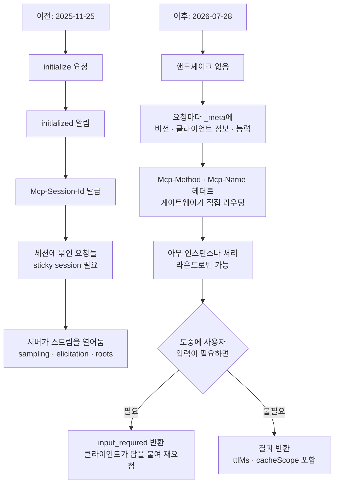

MCP 명세 2026-07-28판이 공개되었습니다. 발표문은 출시 이후 가장 큰 변경이라고 소개하고, 핵심은 프로토콜이 무상태가 되었다는 것입니다. 저희는 이 문장을 그대로 받아 적는 대신 공식 저장소에서 `schema.json` 두 판본을 내려받아 직접 비교했습니다. RPC 메서드는 27개에서 20개로 줄었고, 스키마 정의는 32개가 사라지고 42개가 새로 들어왔습니다. `InitializeRequest`는 이전 판에 네 번 등장했다가 이번 판에서 한 번도 나오지 않습니다.


## 왜 읽어야 하나

이 글은 이미 MCP 서버를 운영 중이거나 곧 배포할 예정인 플랫폼 엔지니어와, 사내 에이전트가 붙는 도구 계층을 설계하는 분을 위해 썼습니다. MCP를 처음 접하는 분보다는 마이그레이션 비용을 가늠해야 하는 분에게 쓸모가 큽니다. 결론부터 말씀드리면, 이번 개정은 기능 추가가 아니라 **배포 모델의 교체**입니다. 세션이 사라졌으므로 MCP 서버는 이제 평범한 HTTP 서비스처럼 로드밸런서 뒤에 여러 개 띄울 수 있게 되었고, 그 대가로 지금까지 세션에 기대어 짜둔 코드는 다시 써야 합니다. 얻는 것과 잃는 것이 모두 명확한 변경이라 미루기보다 계획을 세우는 편이 낫습니다.

## 개요

MCP는 지난 1년 반 동안 에이전트가 외부 데이터와 도구에 닿는 표준 통로 자리를 차지했습니다. 발표문에 따르면 Tier 1 SDK 기준으로 월 다운로드가 5억 건에 가깝고, TypeScript와 Python SDK는 누적 10억 건을 넘었습니다.

그만큼 널리 쓰이다 보니 운영에서 같은 불만이 반복해서 올라왔습니다. MCP는 원래 양방향 상태 유지 프로토콜이었습니다. 클라이언트가 `initialize`를 보내고 서버가 응답하면 세션이 열리고, 그 세션 식별자가 `Mcp-Session-Id` 헤더로 이후 요청에 따라다녔습니다. 로컬에서 프로세스 하나를 띄워 쓰는 데는 문제가 없는 설계입니다. 그런데 원격 서버를 여러 대 띄우는 순간 이야기가 달라집니다. 같은 세션의 요청은 같은 인스턴스로 가야 하니 sticky session이 필요하고, 인스턴스가 죽으면 세션이 통째로 날아가고, 서버리스 환경에는 아예 올릴 수가 없었습니다.

2026-07-28판은 이 문제를 프로토콜 층에서 해결합니다. 모든 요청이 자기 자신을 설명하도록 바뀌었습니다. 프로토콜 버전과 클라이언트 신원과 클라이언트 능력이 요청마다 `_meta`에 실려 갑니다. 그 결과 어떤 요청이든 라운드로빈 로드밸런서 뒤의 아무 인스턴스에나 도착해도 됩니다.

## 이 개정은 무엇을 바꾸는가

전체 흐름을 먼저 그리면 이렇습니다.




주요 변경을 항목별로 보겠습니다.

**핸드셰이크와 세션 제거.** `initialize`와 `initialized` 교환이 공식적으로 폐기되었고 `Mcp-Session-Id` 헤더도 함께 사라졌습니다. 서버 능력을 미리 알고 싶은 클라이언트를 위해 `server/discover`라는 새 RPC가 생겼지만 필수는 아닙니다. 발표문은 애플리케이션까지 무상태가 되어야 한다는 뜻은 아니라고 덧붙입니다. 상태가 필요하면 도구가 명시적인 핸들을 발급하고 모델이 그 핸들을 인자로 다시 넘기게 하라는 것인데, 전송 계층에 상태를 숨기는 것보다 모델이 핸들을 보고 도구 사이로 전달하는 편이 낫더라는 설명입니다.

**Multi Round-Trip Requests.** 예전에는 도구 실행 중간에 사용자 확인이 필요하면 서버가 클라이언트로 요청을 보냈고, 그러려면 스트림이 계속 열려 있어야 했습니다. 이제는 서버가 `resultType: "input_required"`와 함께 필요한 질문을 돌려주고, 클라이언트가 답을 `inputResponses`에 담아 원래 호출을 다시 보냅니다. 방향이 뒤집힌 것이 아니라 왕복 횟수로 풀어낸 것입니다.

**헤더 기반 라우팅.** Streamable HTTP 요청은 이제 `Mcp-Method`와 `Mcp-Name` 헤더를 반드시 포함해야 합니다. 게이트웨이나 레이트 리미터나 WAF가 JSON 본문을 파싱하지 않고 헤더만 보고 라우팅과 계량을 할 수 있습니다.

```http
POST /mcp HTTP/1.1
MCP-Protocol-Version: 2026-07-28
Mcp-Method: tools/call
Mcp-Name: search

{"jsonrpc":"2.0","id":1,"method":"tools/call",
 "params":{"name":"search","arguments":{"q":"otters"},
 "_meta":{"io.modelcontextprotocol/clientInfo":{"name":"my-app","version":"1.0"}}}}
```

**목록 응답 캐싱.** `tools/list`와 `prompts/list`와 `resources/list`와 `resources/read` 응답이 `ttlMs`와 `cacheScope`를 함께 실어 보냅니다. 순서도 결정적으로 고정됩니다. 클라이언트가 도구 카탈로그를 캐시할 수 있고, 재연결할 때마다 상위 프롬프트 캐시가 깨지는 일도 줄어듭니다.

**인가 강화.** 인가 서버가 RFC 9207에 따라 `iss` 파라미터를 돌려주고 클라이언트는 코드를 교환하기 전에 이를 검증해야 합니다. 인가 서버 혼동 공격을 막는 조치입니다. 클라이언트 자격 증명은 발급한 발행자에 묶여 다른 인가 서버에서 재사용할 수 없습니다. 동적 클라이언트 등록은 공식 폐기되고 Client ID Metadata Documents가 표준이 됩니다. 다만 기존 방식도 당분간 동작합니다.

**폐기 목록.** Roots와 Sampling과 Logging이 폐기되었습니다. 레거시 HTTP+SSE 전송도 마찬가지입니다. 모두 최소 12개월은 동작하지만 새로 만드는 구현에서는 쓰지 않는 편이 좋습니다. 이번 개정에서 함께 도입된 공식 폐기 정책이 12개월 최소 유예를 보장하므로, 반응하는 대신 계획할 수 있게 되었습니다.

## 실제 실험 결과

발표문이 요약한 내용이 스키마 파일에 실제로 어떻게 반영되었는지 확인했습니다. `modelcontextprotocol/modelcontextprotocol` 저장소에서 두 판본의 `schema.json`을 받아 RPC 메서드 상수와 타입 정의를 집계해 비교하는 스크립트를 작성했고, `scripts/experiments/mcp-2026-07-28/schema_diff.py`에 두었습니다.

먼저 솔직하게 밝히면, 새 SDK를 설치해 서버를 띄워 보는 검증은 하지 못했습니다. 이 환경에서 패키지 설치에 별도 승인이 필요했기 때문입니다. PyPI 조회로 Python SDK `mcp` 2.0.0이 정식 배포되어 있다는 사실까지는 확인했고, 그 아래 검증은 스키마 수준에서 진행했습니다.

결과입니다.

```
schema bytes: 2025-11-25=101,793  2026-07-28=112,729
RPC methods: 27 -> 20 (-10 / +3)
schema definitions: 145 -> 155 (-32 / +42)
```

사라진 메서드 열 개는 `notifications/initialized`, `logging/setLevel`, `resources/subscribe`, `resources/unsubscribe`, `notifications/elicitation/complete`, 그리고 `tasks/` 계열 네 개입니다. 새로 들어온 셋은 `server/discover`와 `subscriptions/listen`과 `notifications/subscriptions/acknowledged`입니다.


타입 정의 쪽이 더 많은 이야기를 합니다. 사라진 32개 중에는 `InitializeRequest`와 `InitializeRequestParams`와 `InitializeResult`와 `InitializedNotification`이 나란히 들어 있습니다. 핸드셰이크가 명세에서 통째로 빠졌다는 뜻입니다. `ServerRequest`가 사라진 것도 같은 맥락인데, 서버가 클라이언트에게 요청을 보내는 개념 자체가 없어졌기 때문입니다. `SubscribeRequest`와 `UnsubscribeRequest`, `SetLevelRequest`, `RootsListChangedNotification`도 함께 정리되었습니다. `PingRequest`까지 빠진 것을 보면 연결이 살아 있는지 확인할 대상이 애초에 없어졌음을 알 수 있습니다.

`Task`로 시작하는 정의 여덟 개가 한꺼번에 빠진 것은 폐기가 아니라 이사입니다. Tasks는 실험적 코어에서 `io.modelcontextprotocol/tasks` 확장으로 옮겨 갔습니다.

새로 들어온 42개는 성격이 뚜렷하게 나뉩니다. `InputRequest`와 `InputRequests`와 `InputRequiredResult`와 `InputResponse`와 `InputResponses`는 MRTR을 구성하는 타입들입니다. `CacheableResult`와 `ListToolsResultResponse` 계열은 캐시 힌트를 담기 위한 응답 래퍼입니다. 그리고 `HeaderMismatchError`와 `UnsupportedProtocolVersionError`와 `MissingRequiredClientCapabilityError`는 이전 판에 없던 오류 타입인데, 세 이름이 곧 새 실패 모드를 알려줍니다. 헤더가 본문과 어긋나거나, 지원하지 않는 프로토콜 버전이 오거나, 요청이 필요로 하는 클라이언트 능력이 선언되지 않은 경우입니다. 세션이 없으니 이런 검증이 요청마다 일어납니다.

문자열 등장 횟수도 세어 봤습니다.

| 문자열 | 2025-11-25 | 2026-07-28 |
|---|---|---|
| `InitializeRequest` | 4 | 0 |
| `initialized` | 1 | 0 |
| `clientInfo` | 2 | 1 |
| `inputResponses` | 0 | 4 |
| `ttlMs` | 0 | 14 |
| `cacheScope` | 0 | 14 |

`ttlMs`와 `cacheScope`가 각각 14번 나온다는 것은 캐시 힌트가 특정 응답 하나가 아니라 목록성 응답 전반에 일관되게 붙었다는 뜻입니다.

한 가지 덧붙이면 `Mcp-Session-Id`와 `Mcp-Method`와 `Mcp-Name`은 두 판본 모두에서 검색되지 않습니다. 이들은 HTTP 헤더라 JSON 스키마가 아니라 전송 명세 문서에 규정되기 때문입니다. 스키마만 봐서는 놓치는 부분이 있다는 점도 함께 확인한 셈입니다.

## ThakiCloud 제품 적용 시사점

**Paxis 관점**입니다. Paxis는 ThakiCloud의 Agent-Native Cloud 제어 평면으로, Skills와 Tools와 Policies와 Audit Logs를 일급 리소스로 다룹니다. MCP 커넥터는 이 구조에서 외부 도구가 들어오는 정문에 해당합니다. 이번 개정이 Paxis에 주는 의미는 세 가지입니다.

첫째, 헤더 기반 라우팅이 정책 게이트와 잘 맞습니다. `Mcp-Method`와 `Mcp-Name`이 헤더에 실리므로 어떤 도구를 어떤 메서드로 부르는지를 본문 파싱 없이 알 수 있습니다. 지금까지 정책 판정을 위해 JSON을 풀어야 했던 자리를 헤더 검사로 대체할 수 있고, 감사 로그에도 같은 값을 바로 남길 수 있습니다.

둘째, 목록 캐싱이 스킬 선택 비용을 낮춥니다. Paxis는 960개가 넘는 스킬을 BM25로 골라 격리 샌드박스에서 실행하는데, 외부 MCP 서버가 제공하는 도구 카탈로그도 이 선택 대상에 들어옵니다. `ttlMs`와 `cacheScope`가 붙으면 카탈로그를 매번 다시 받지 않아도 되고, 결정적 순서가 보장되므로 상위 프롬프트 캐시가 재연결마다 깨지던 문제도 줄어듭니다.

셋째, Sampling 폐기는 방향이 맞습니다. 서버가 클라이언트에게 모델 호출을 요청하는 구조는 편리하지만, 정책 게이트 입장에서는 통제선 바깥에서 추론이 일어나는 셈이라 다루기 까다로웠습니다. 이제 LLM 제공자 API를 직접 연동하는 쪽으로 정리되었으니 호출 경로가 하나로 모입니다.

**ai-platform 관점**입니다. 무상태화의 실질적 수혜는 배포 쪽에서 나옵니다. ThakiCloud의 ai-platform은 Kubernetes 기반이라 MCP 서버도 결국 파드로 뜹니다. 지금까지는 세션 친화성 때문에 인그레스에 sticky session을 걸어야 했고, 파드가 재시작하면 진행 중이던 대화가 끊겼으며, HPA로 스케일 아웃해도 새 파드가 기존 세션을 이어받지 못했습니다. 세션이 사라지면 이 제약이 모두 없어집니다. MCP 서버가 평범한 무상태 워크로드가 되므로 롤링 업데이트도, 오토스케일링도, 다중 영역 배치도 다른 서비스와 같은 방식으로 다룰 수 있습니다. 온프레미스나 망 분리 환경에서 MCP 게이트웨이를 운영하는 고객에게는 운영 난이도가 눈에 띄게 내려가는 변경입니다.


## 한계 및 반론

가장 큰 비용은 이번 개정이 파괴적 변경이라는 사실입니다. 세션 식별자에 의존하던 코드는 다시 써야 합니다. 상태를 유지해야 하는 도구라면 명시적 핸들을 발급하는 방식으로 재설계해야 하는데, 이는 전송 계층 한 줄을 고치는 일이 아니라 도구 인터페이스 자체를 바꾸는 일입니다. Sampling을 쓰던 서버라면 LLM 호출 경로를 새로 붙여야 하고, 이때 비용과 키 관리 책임이 서버 쪽으로 넘어옵니다.

두 번째로, 무상태가 공짜는 아닙니다. 모든 요청이 프로토콜 버전과 클라이언트 정보와 능력을 싣고 다니므로 요청당 오버헤드가 늘어납니다. MRTR도 마찬가지입니다. 예전에 열린 스트림 위에서 한 번 오가던 확인 절차가 이제 왕복 요청 두 번이 됩니다. 사용자 확인이 잦은 워크플로라면 지연이 늘어날 수 있습니다. 상태를 없앤 것이 아니라 상태를 지고 다니는 쪽으로 옮긴 것에 가깝습니다.


세 번째로, 이 글의 분석은 스키마 파일 수준입니다. 앞서 확인한 대로 HTTP 헤더 규정은 스키마에 없고, SDK가 실제로 어떻게 동작하는지도 코드를 돌려 봐야 알 수 있습니다. 마이그레이션 규모를 정확히 산정하시려면 각 언어 SDK의 마이그레이션 노트를 함께 보셔야 합니다.

반대 방향의 주장도 짚겠습니다. 로컬에서 stdio로 MCP 서버 하나만 쓰는 사용자에게 이번 개정의 이득은 사실상 없습니다. 얻는 것은 원격 배포와 수평 확장인데, 그 시나리오가 아니라면 순수한 마이그레이션 비용만 남습니다. 12개월 유예가 있으니 로컬 위주 구성이라면 서두를 이유가 크지 않습니다.

## 정리

스키마를 열어 확인한 결론은 발표문과 일치하되 더 구체적입니다. `InitializeRequest` 계열 정의 네 개와 `ServerRequest`와 `PingRequest`가 함께 사라진 것은 연결이라는 개념 자체가 명세에서 빠졌다는 뜻이고, 그 자리를 `InputResponses` 계열과 `ttlMs`와 `cacheScope`가 채웠습니다. 서두에서 말씀드린 대로 이번 개정은 기능 추가가 아니라 배포 모델의 교체이고, 스키마의 삭제 32건과 추가 42건이 그 교체를 그대로 보여줍니다.

그래서 지금 하실 일은 두 가지입니다. 운영 중인 MCP 서버가 있다면 세션 식별자와 Sampling과 Roots를 코드에서 검색해 보시기 바랍니다. 검색 결과가 마이그레이션 작업량의 1차 추정치입니다. 그리고 인그레스에 걸어둔 sticky session 설정을 확인하시기 바랍니다. 새 명세로 옮기고 나면 그 설정은 더 이상 필요하지 않으며, 그것을 걷어내는 순간부터 MCP 서버는 다른 무상태 서비스와 똑같이 다루실 수 있습니다.

## 출처

- [The 2026-07-28 Specification (MCP 공식 블로그)](https://blog.modelcontextprotocol.io/posts/2026-07-28/)
- [Beta SDKs for the 2026-07-28 MCP Spec Release Candidate](https://blog.modelcontextprotocol.io/posts/sdk-betas-2026-07-28/)
- [modelcontextprotocol/modelcontextprotocol 스키마 저장소](https://github.com/modelcontextprotocol/modelcontextprotocol/tree/main/schema)
